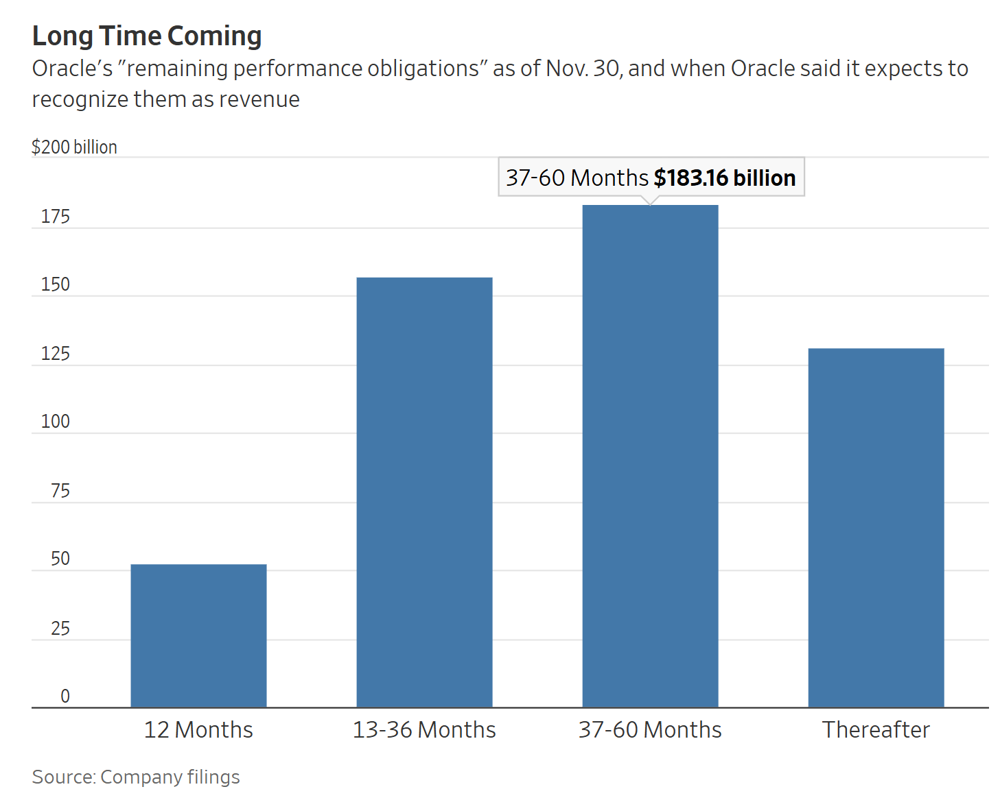

https://www.wsj.com/finance/stocks/the-squishy-number-behind-the-rise-and-fall-of-oracles-stock-45461595?mod=finance_lead_pos5

這是一份針對 **甲骨文 (Oracle, ORCL)** 股價近期劇烈波動背後的**會計風險與 AI 融資循環**的**投資銀行級情報簡報 (Investment Banking Grade Intelligence Briefing)**。

這篇報導揭示了華爾街目前最擔憂的**「AI 融資卡牌屋 (House of Cards)」**風險。投資人過去只看合約金額（RPO），現在開始質疑**客戶（OpenAI）的償付能力**。

---

### **新聞情報分析：5230億美元的 RPO 幻象——甲骨文的「信任危機」**

#### **1. 新聞履歷 (Metadata)**

- **標題：** 甲骨文股票漲跌背後的微妙數字：RPO 的脆弱性 (The Subtle Number Behind Oracle's Swing: The Fragility of RPO)
    
- **來源/作者：** WSJ / Jonathan Weil
    
- **發布時間：** 2025年12月17日 05:30 ET
    
- **關鍵詞：** 剩餘履約義務 (RPO), 循環性 (Circularity), 償付機率 (Probability of Collection), Nvidia (NVDA), OpenAI
    

#### **2. 核心摘要 (Executive Summary)**

儘管甲骨文的 **RPO (剩餘履約義務)** 攀升至驚人的 **5,230 億美元**（相當於其過去四季營收的 9 倍），其股價卻較 9 月高點**暴跌 43%**。

- **核心矛盾：** 市場不再相信 RPO 的數字質量。其中約 **3,000 億美元** 的增量來自與 **OpenAI** 簽訂的 5 年期合約。
    
- **信用風險：** OpenAI 年化收入僅約 **200 億美元**，但背負著未來 8 年 **1.4 兆美元** 的投資承諾。它能否支付甲骨文的帳單，完全取決於外部融資（如 SoftBank 和 Nvidia）。
    
- **連鎖反應：** Nvidia 原定對 OpenAI 的 **1,000 億美元** 投資案（9月簽署意向書）至今**遲遲未定案**。若這筆資金不到位，OpenAI 就沒錢付給甲骨文，甲骨文的 RPO 就會變成空氣。
    

#### **3. 關鍵人物發言與立場矩陣 (Key Voice Matrix)**

|**人物/機構**|**身分**|**關鍵發言/觀點**|**情報解讀**|
|---|---|---|---|
|**Gil Luria**|DA Davidson 分析師|「與其假裝擁有 5,230 億美元的 RPO，不如主動重組該合約。」|**做空/看空觀點。** 直指 OpenAI 無法履約，建議甲骨文面對現實，減少資本支出浪費。|
|**Erica Spear**|JPMorgan 信貸分析師|「如果你開發了它，他們會付錢嗎？」(If you build it, will they pay?)|**現金流質疑。** 甲骨文正在為這個「可能付不出錢」的客戶興建昂貴的資料中心。|
|**Nvidia**|GPU 巨頭 (財報聲明)|「無法保證任何投資都能按預期條款完成，甚至根本無法完成。」|**風險警示。** Nvidia 正在猶豫是否要注資 OpenAI。這是整個融資鏈條斷裂的**前兆**。|
|**Jonathan Weil**|WSJ 作者|會計準則要求收款必須「可能」(Probable, 通常 >70%)。|**會計風險。** 如果 OpenAI 融資失敗，甲骨文將被迫註銷這筆巨額 RPO，引發財報災難。|

#### **4. 深度架構分析 (Structural Analysis)**

A. AI 產業的「循環融資」陷阱 (The Circularity Trap)

這是本篇報導最核心的結構性風險。目前的 AI 繁榮建立在一個封閉的資金循環上：

1. **Nvidia** 投資 **OpenAI** (現金注入)。
    
2. **OpenAI** 購買 **Nvidia** 的晶片 (現金流回 Nvidia，推高營收)。
    
3. **OpenAI** 簽約 **甲骨文** 租用算力 (RPO 生成)。
    
4. **甲骨文** 花錢買 **Nvidia** 晶片來蓋資料中心 (現金流回 Nvidia)。
    

**風險點：** 這個循環的源頭是**「外部融資」**。一旦 Nvidia 或 SoftBank 停止注資，OpenAI 就會違約，甲骨文就會留下滿手的閒置 GPU 和巨額債務。這解釋了為什麼 Nvidia 遲遲不簽署最終投資協議——他們也看出了風險。

**B. 會計準則的灰色地帶：RPO 的定義**

- **定義：** RPO = 已簽約但未開發票的金額。
    
- **條件：** 根據 ASC 606 (營收認列準則)，必須認定客戶有能力付款 (Collectibility is probable)。
    
- **現狀：** 華爾街認為 OpenAI 目前的財務狀況（營收 200億 vs 承諾 1.4兆）可能已經**不符合「極可能付款」的會計標準**。甲骨文堅持認列這 3,000 億美元，是在賭 OpenAI 未來能融到資。這是一種**「激進會計 (Aggressive Accounting)」**。
    

**C. 資本支出 (Capex) 的錯配**

- 甲骨文為了這張合約，正在全美興建巨型資料中心。
    
- 如果合約違約，這些 Capex 就變成了**沈沒成本 (Sunk Cost)**。不同於軟體，硬體（H100/B200）折舊極快。甲骨文面臨的是資產負債表的重創。
    

#### **5. 投資專家的行動建議 (Actionable Insights)**

1. **對甲骨文 (ORCL) 保持「迴避」或「做空」態度：**
    
    - **理由：** 股價雖已下跌 43%，但如果 Nvidia 宣布**放棄或縮減**對 OpenAI 的投資，甲骨文將被迫下修 RPO 指引，股價還有下跌空間。
        
    - **催化劑：** 密切關注 Nvidia 與 OpenAI 的談判進展。沒有消息就是壞消息。
        
2. **關注「AI 基礎設施」的板塊輪動：**
    
    - **策略：** 從「單一客戶依賴型」轉向「多元客戶型」。
        
    - **標的：** **Microsoft (MSFT)** 或 **Amazon (AWS)**。
        
    - **邏輯：** 它們的 AI 資本支出是為了滿足內部需求（Office 365, E-commerce）和數萬家企業客戶，而不僅僅是押注在一家初創公司 (OpenAI) 身上。它們的資產負債表能承受 OpenAI 違約，但甲骨文不能。
        
3. **信用違約掉期 (CDS) 視角：**
    
    - 這篇報導實際上是在討論 OpenAI 的**信用風險**。這暗示了私營市場對 AI 初創公司的債權估值正在惡化。注意觀察 **CoreWeave** 或 **Lambda Labs** 等類似公司的融資動態，如果它們也融不到錢，說明 AI 硬體租賃市場的泡沫正在破裂。
        

總結：

甲骨文的 5,230 億美元 RPO 就像是 2008 年前的次級房貸——帳面上看著很美，但底層資產（客戶還款能力）極度脆弱。現在的市場正在進行**「重新定價 (Repricing)」**，將甲骨文從「AI 成長股」降級為「高風險信貸股」。

---

下一步：

既然提到了 RPO (剩餘履約義務) 是衡量 SaaS 和雲端公司未來營收的關鍵，但容易被操縱。您是否希望我簡單說明如何透過財報中的 RPO 與 Deferred Revenue (遞延營收) 的落差，來識別一家軟體公司是否在進行激進的會計灌水？