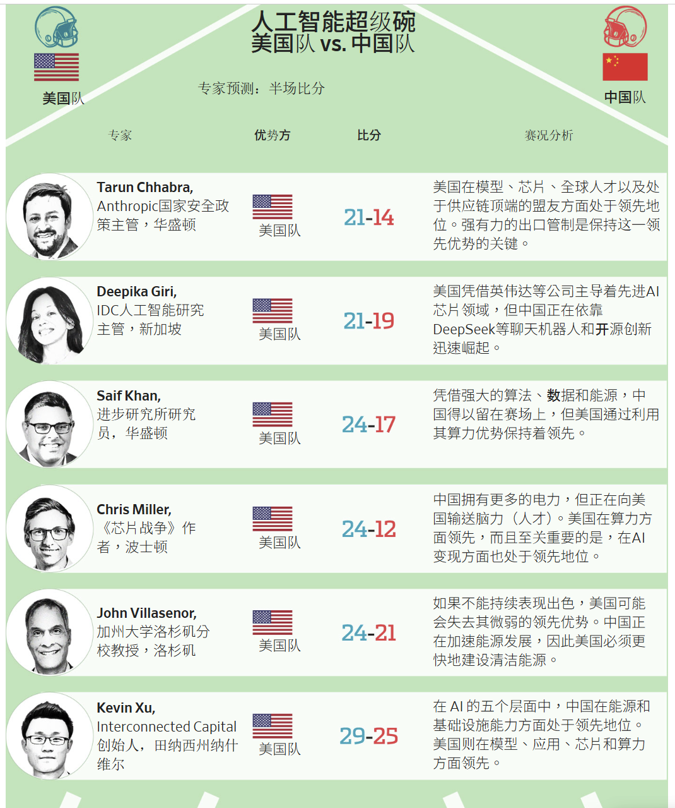
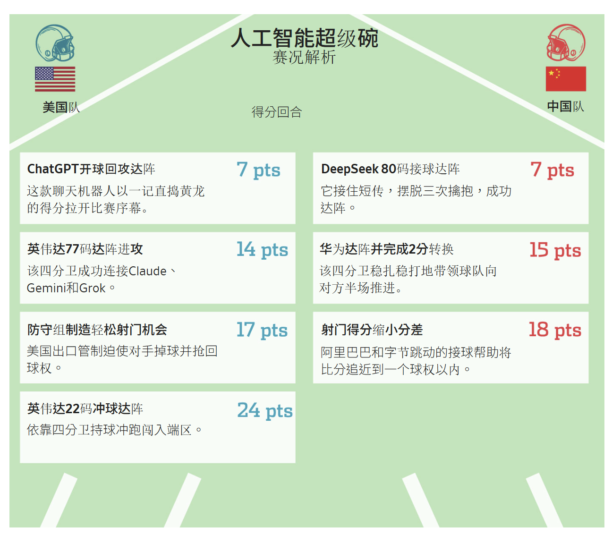

 **如果用橄欖球裡的達陣和射門得分來解讀美中AI競賽，那麼在中場休息之際美國隊處於領先地位，比分為24-18。但後半場會發生怎樣的變化呢？**

[Stu Woo](https://www.wsj.com/news/author/stu-woo)  / [Ming Li](https://www.wsj.com/news/author/ming-li)

2025年12月30日 12:32 CST

圖片來源：Rachel Mendelson/WSJ; iStock

如果把美中人工智慧(AI)競賽比作一場橄欖球賽，那麼在中場休息之際美國隊處於領先地位——但美國剛剛做了一個有風險的決定。

美國總統川普(Trump)本月表示，他將[允許輝達(Nvidia)向中國出售一款較舊但性能仍然強大的晶片](https://cn.wsj.com/articles/WP-WSJT-0003169405)，放寬了先前阻止美國頂尖技術流向北京方面的限制。

兩黨政界人士表示，川普把一名明星球員送給了競爭對手。支持者則稱之為一項著眼長遠的戰略布局。

但現在的比分是多少？這一舉動又將如何改變比賽態勢？

需要說明的是，這並非一場真正的比賽。沒有第四節計時器，而且雙方都可以宣稱獲勝。雙方爭奪的是[經濟和軍事霸權](https://cn.wsj.com/articles/WP-WSJT-0003099835)，而不是一座獎盃。但為了讓這場角逐更容易理解，我們請專家們用橄欖球裡的達陣和射門得分來解讀這場AI競賽。

中場休息時的共識是：美國24分，中國18分。

美国在模型、芯片、全球人才以及处于供应链顶端的盟友方面处于领先地位。强有力的出口管制是保持这一领先优势的关键。

美国队

Deepika Giri,

IDC人工智能研究主管，新加坡

美国凭借英伟达等公司主导着先进AI芯片领域，但中国正在依靠DeepSeek等聊天机器人和开源创新迅速崛起。

美国队

Saif Khan,

进步研究所研究员，华盛顿

凭借强大的算法、数据和能源，中国得以留在赛场上，但美国通过利用其算力优势保持着领先。

美国队

中国拥有更多的电力，但正在向美国输送脑力（人才）。美国在算力方面领先，而且至关重要的是，在AI变现方面也处于领先地位。

Chris Miller,

《芯片战争》作者，波士顿

美国队

如果不能持续表现出色，美国可能会失去其微弱的领先优势。中国正在加速能源发展，因此美国必须更快地建设清洁能源。

John Villasenor,

加州大学洛杉矶分校教授，洛杉矶

美国队

在 AI 的五个层面中，中国在能源和基础设施能力方面处于领先地位。美国则在模型、应用、芯片和算力方面领先。

Kevin Xu,

Interconnected Capital创始人，田纳西州纳什维尔

美国队

我們的專家們對於比分有多接近看法不一。《晶片戰爭》(Chip War)一書的作者克里斯·米勒(Chris Miller)認為比分是24-12，美國大幅領先，他說只有美國公司在把AI變現。

其他人則認為這是一場勝負難分的比賽。國際數據公司(IDC)新加坡AI研究主管迪皮卡·吉裡(Deepika Giri)給出的比分是21-19。她說，美國在晶片領域佔主導地位，但中國在聊天機器人方面正在崛起。

專家們在打分時權衡了從電網到軟體的方方面面。下面，我們重點關注兩個關鍵因素：晶片和聊天機器人。

進入下半場，美國保持領先。但處於劣勢的一方勢頭正盛——而且在川普做出上述決定後，還有了一位新四分衛。

### 晶片：四分衛

要想理解川普在晶片出口上的押注，可以看看1993年的舊金山49人隊。

該隊當時擁有比賽中最出色的四分衛史蒂夫·楊(Steve Young)，以及被楊取代的傳奇人物喬·蒙塔納(Joe Montana)。49人隊認為蒙塔納坐在替補席上價值不大，於是將他交易至堪薩斯城酋長隊，換來一個可以輔助楊的選秀權。

這位年紀偏大的資深球員相當於輝達的H200晶片，川普最近[批准了該晶片的出口](https://cn.wsj.com/articles/WP-WSJT-0003166656)。H200於2024年中發布，比該公司的尖端Blackwell晶片落後一代。

我們的專家之一、來自智庫進步研究院(Institute for Progress)的賽義夫·汗(Saif Khan)的一份報告發現，H200的成本效益比中國晶片領軍企業華為(Huawei)最好的型號高16%，性能強32%。

他的團隊表示，差距可能更大，因為受制於製造瓶頸，華為的晶片穩定性不足且供應有限。

與此同時，美國擁有能夠大量生產優質晶片的供應鏈。汗的團隊估計，明年美國可以生產出總算力相當於690萬個頂級Blackwells晶片的半導體——是中國的40多倍。

但該團隊表示，如果允許向中國銷售H200，美國的算力領先優勢將縮小，不到中國的七倍。

國家安全鷹派人士警告說，一個年紀偏大的蒙塔納仍然比中國培養出的任何四分衛都強。

輝達的高管們則有不同的看法。該公司支持批准H200的銷售，其發言人表示，美國客戶將繼續獲得比其他任何人都多得多的算力和AI能力。

企業領導人擔心，阻止銷售會迫使中國圍繞華為進行建設，從而創建一個美國無法控制的並行AI生態系統。他們認為，最好讓中國繼續使用輝達，這樣一來，如果像DeepSeek這樣的中國初創公司取得突破，其所依賴的技術也是美國公司可以輕鬆複製的。

他們還認為H200已幾近過時，根據一些指標，其性能僅為Blackwell的四分之一。為什麼不賣掉它來為下一次顛覆性的飛躍提供動力呢？

對於49人隊，這場賭博成功了。蒙塔納在堪薩斯城酋長隊度過了兩個不錯的賽季。楊則贏得了一屆超級碗(Super Bowl)。

### 聊天機器人：接球手

如果說晶片是四分衛，那麼聊天機器人就是接球手，能將一記精心投出的螺旋球轉化為達陣接球。

聊天機器人已經在做實際工作，而兩國的雄心不止於此。美國開發者表示，最終目標是通用人工智慧，即最終可能通過獨立思考實現智勝人類的系統。一個國家擁有的頂級聊天機器人越多，率先實現這一目標的幾率就越大。

全球聊天機器人排行榜LMArena leaderboard顯示，美國正在不斷得分。本月，僅Google(Google)、xAI、Anthropic和OpenAI這四家美國公司的各種模型就一度包攬了前20名。

但前30名的其餘位置則擠滿了中國重量級選手，包括阿里巴巴(Alibaba)、百度(Baidu)和新秀黑馬DeepSeek。

今年早些時候，DeepSeek通過在二流的輝達晶片上構建出世界級的聊天機器人，引發了規模達1兆美元的市場拋售。這就像一個接球手接住替補四分衛搖搖晃晃的傳球，擺脫三次擒抱，衝刺80碼完成達陣。

曾在輝達工作、現為舊金山AI企業家的巴雷特·伍德賽德(Barrett Woodside)說，雖然美國的實驗室行事機密，但中國公司會公布研究成果，以證明儘管硬件較差，他們仍有能力競爭。

他說：「問題是，當中國公司獲得更多、更好的硬件時，他們會甩開美國嗎？」

換句話說，中國的接球手一直在更刻苦地訓練，以應對四分衛的不足。如果得到37歲的喬·蒙塔納，他們能取得什麼戰績呢？