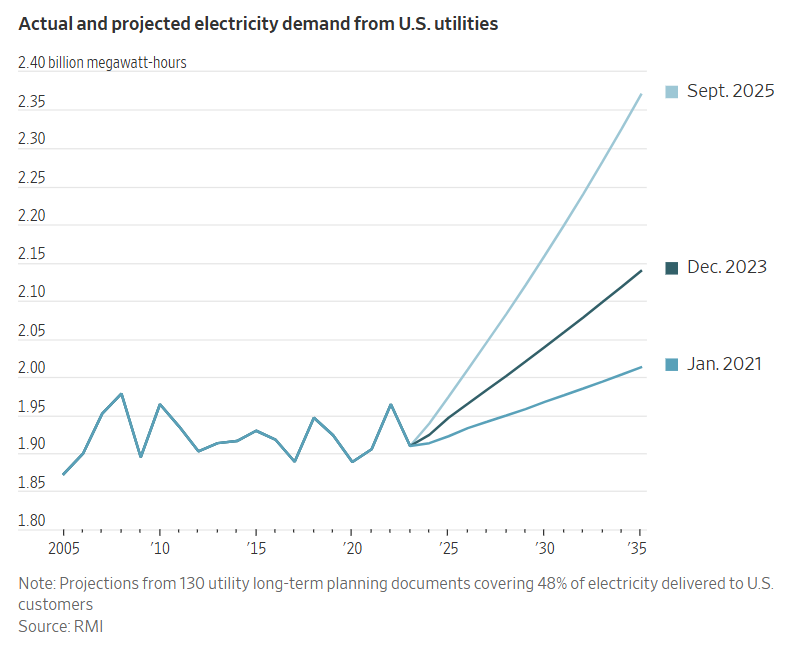
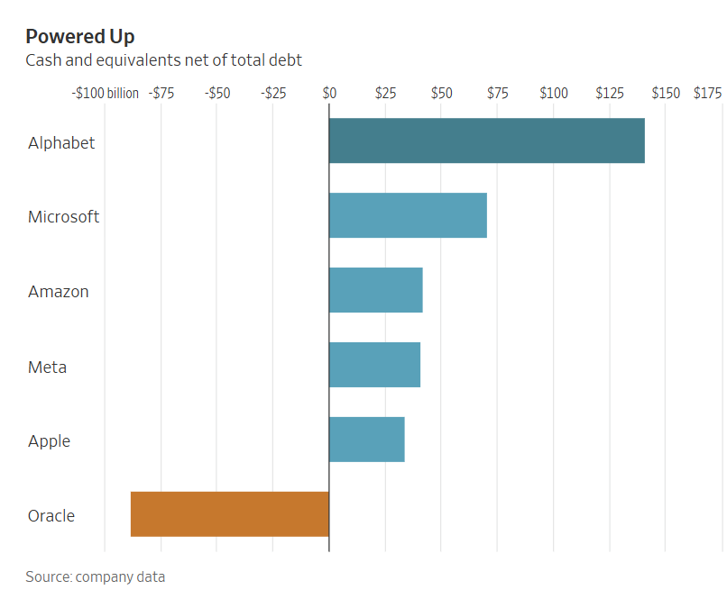

## 超大規模資料中心營運商正在參與電力開發的早期階段。

[李真珠](https://www.wsj.com/news/author/jinjoo-lee)

[丹·加拉格爾](https://www.wsj.com/news/author/dan-gallagher)

2026年1月16日 上午5:30 ET

德克薩斯州州長格雷格·阿博特和谷歌首席執行官桑達爾·皮查伊在德克薩斯州的一個數據中心主持了一個小組討論。 圖片來源：Ron Jenkins／Getty Images

科技巨頭們已經厭倦了等待電力供應。但鎖定未來的電力意味著要承擔更大的前期風險。 

人工智慧資料中心所建造的競賽給現有電網帶來了巨大壓力，同時也阻礙了全球最大科技公司[雄心勃勃的計畫](https://www.wsj.com/tech/ai/after-a-year-of-blistering-growth-ai-chip-makers-get-ready-for-bigger-2026-d9f62dbd?mod=article_inline)。人工智慧系統比普通伺服器和其他運算設備消耗的能源多得多，但新建能源設施並非一朝一夕就能建成。因此，那些以提升廣告點擊量和社群網路讚量而聞名的公司，如今也開始涉足電力產業。 

在一項具有里程碑意義的交易中，Google母公司[Alphabet](https://www.wsj.com/market-data/quotes/GOOGL) [（GOOGL） -0.91 %減少；紅色向下三角形](https://www.wsj.com/market-data/quotes/GOOGL)上個月，該公司[同意以47.5億美元收購](https://www.wsj.com/tech/ai/alphabet-to-buy-intersect-for-4-75-billion-in-cash-b67ff7b9?mod=article_inline)再生能源開發商Intersect Power，並承擔債務。這是科技公司首次將能源開發商納入麾下。這筆交易令能源產業感到意外：「市場一直認為（科技公司）會將開發工作外包，因為開發工作過於繁瑣，有點像房地產行業，」伍德麥肯茲電力和可再生能源諮詢總監 普拉尚特·科拉納(Prashant Khorana) 表示。

其他超大規模企業雖然沒有走得那麼遠，但也越來越多地參與能源專案。[亞馬遜](https://www.wsj.com/market-data/quotes/AMZN) [(AMZN) 0.65 %增加；綠色向上指向三角形](https://www.wsj.com/market-data/quotes/AMZN)亞馬遜近期在破產拍賣中勝出，準備收購位於俄勒岡州的一個1.2吉瓦的在建太陽能項目，該項目還配備電池儲能設施。 2024年，亞馬遜同意為小型模組化反應器公司X-Energy開發的一個專案提供早期開發資金，亞馬遜也持有該公司的部分[股權](https://www.wsj.com/market-data/quotes/META) [。 0.86 %增加；綠色向上指向三角形](https://www.wsj.com/market-data/quotes/META)上週宣布將資助[Oklo](https://www.wsj.com/market-data/quotes/OKLO)和 TerraPower[開發](https://www.wsj.com/tech/ai/meta-unveils-sweeping-nuclear-power-plan-to-fuel-its-ai-ambitions-65c56aac?mod=article_inline)小型模組化反應器。

這與科技公司過去在能源專案中扮演的較被動的角色截然不同。在傳統模式下，開發商和外部投資者（通常是基礎設施基金和銀行）承擔專案開發和建設的風險，而融資則由信譽良好的科技公司簽署的購電協議提供擔保。幾年前，當科技公司偶爾尋求購電協議是為了獲得綠色環保認證，而非滿足眼前的電力需求時，這種模式運作良好。 

如今，電力已成為超大規模企業建構人工智慧系統的主要障礙之一。就Google母公司而言，其最新舉措意味著能源將成為一項資本支出，而不僅僅是營運成本。 

能源專案的資本支出絕非小數目：如果該公司計劃將Intersect Power公司正在籌建的數吉瓦能源專案全部投入運營，那麼其投資額可能遠超收購價格，達到數十億美元。此外，Alphabet及其同行[也已投入創紀錄的資本](https://www.wsj.com/tech/ai/big-tech-is-spending-more-than-ever-on-ai-and-its-still-not-enough-f2398cfe?mod=article_inline)支出用於人工智慧領域的建設。根據Visible Alpha估計，Alphabet在2025年的資本支出約為910億美元，幾乎是過去五年年均支出的三倍。  

Meta和亞馬遜尚未披露它們在小型模組化反應器（SMR）項目開發中承擔的具體成本，但這些項目風險高、投入巨大。專注於清潔能源的投資銀行Marathon Capital執行長Ted Brandt表示，早期開發資金，也就是用於驗證SMR專案可行性的資金，可能需要5億至6億美元。這些成本包括地方和聯邦層級的許可審批、為獲得美國核管會（NRC）的許可而進行的測試和工程設計，以及場地準備工作。

科技公司的一大天然優勢在於其龐大的現金儲備和高信用評級。傑富瑞分析師在一份討論Google Intersect Power交易的報告中指出，該交易「凸顯了專案開發商所需的巨額資金，以及透過超大規模資料中心而非基礎設施基金或公開市場籌集資金的吸引力」。一位業內銀行家表示，超大規模資料中心的資金成本低於需要籌集外部股權和債務的普通開發商。 

在財力雄厚的同行中，谷歌的資金[最為雄厚](https://www.wsj.com/finance/stocks/google-alphabet-stock-ai-36724d9f?mod=article_inline)——這使得該公司在嘗試這種新方法方面處於最佳地位。該公司淨現金（扣除債務後）約為1,410億美元，遠高於其他任何一家大型科技競爭對手。根據標普全球市場情報公司的數據，Google目前的年度營運現金流也高達1,510億美元，在所有上市公司中位居榜首。 

透過專注於新能源項目，科技公司也能避免與現有發電廠達成交易時常見的[棘手成本問題](https://www.wsj.com/business/energy-oil/ai-is-about-to-boost-power-billswholl-take-heat-for-that-c527f27b?mod=article_inline)。週一，川普總統在Truth Social上發文稱，政府正與科技公司合作，「確保美國民眾不必為自己的電力消耗買單」。值得注意的是，Alphabet在公告中明確表示，其收購的是Intersect Power的新開發項目，而非其營運資產，後者將轉讓給另一批投資者。 

另一方面，如果人工智慧產業停滯不前，科技公司可能不僅會面臨資料中心閒置資產的困境。但更令他們夜不能寐的，卻是另一種可能──在人工智慧競賽中落敗。