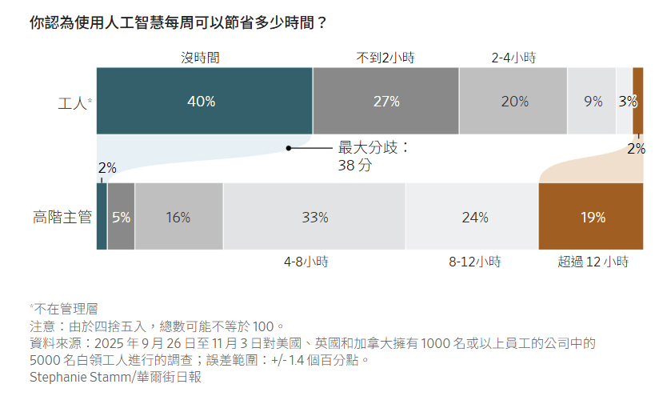
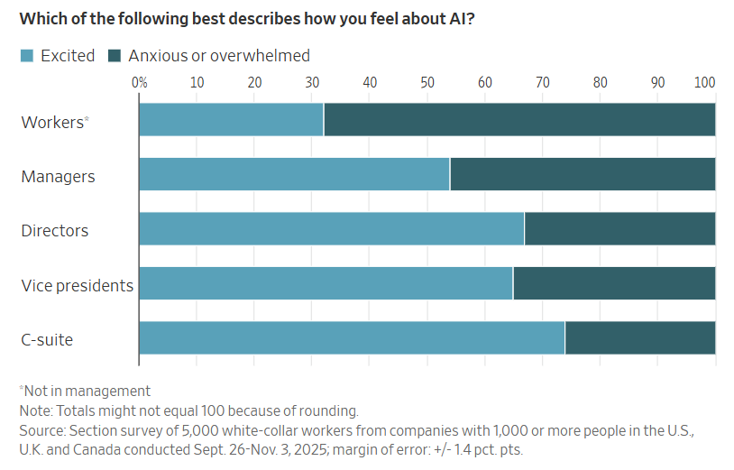

## 員工認為這項技術為他們節省了多少工作時間，與高階主管的說法大相逕庭。

[林賽·埃利斯](https://www.wsj.com/news/author/lindsay-ellis)

2026年1月21日 上午5:00 ET

資料來源：2025 年 9 月 26 日至 11 月 3 日對美國、英國和加拿大擁有 1000 名或以上員工的公司中的 5000 名白領工人進行的調查；誤差範圍：+/- 1.4 個百分點。

Stephanie Stamm/華爾街日報

[企業領導者對人工智慧提升生產力的能力](https://www.wsj.com/tech/ai/our-ai-future-is-already-here-its-just-not-evenly-distributed-cf7a6f35?mod=article_inline)充滿信心，但這種信心正受到現實的檢驗——來自他們自己的員工。

員工表示，到目前為止，人工智慧並沒有為他們節省太多日常工作時間，許多人也表示，他們不知道如何將人工智慧融入工作中。同時，各大公司卻[在人工智慧上投入巨資](https://www.wsj.com/articles/openai-and-servicenow-strike-deal-to-put-ai-agents-in-business-software-57d1da5c?mod=article_inline)，押注這項技術能夠加速從銷售到後台營運等各個環節，從而開啟效率和利潤成長的新時代。

根據人工智慧顧問公司 Section 對 5000 名白領員工進行的一項新調查，高階主管和普通員工在生成式人工智慧方面的實際經驗存在巨大差距。

三分之二的非管理人員表示，人工智慧每週為他們節省的時間不到兩小時，甚至根本沒有節省時間。相較之下，超過40%的高階主管表示，這項技術每週為他們節省了超過八小時的工作時間。

北卡羅來納州羅利市的使用者體驗設計師史蒂夫·麥加維表示，高層「理所當然地認為人工智慧會是救世主」。他指的是大型語言模型，並說：“我數不清有多少次，我尋求某個問題的解決方案，向大型語言模型尋求幫助，結果它給出的無障礙問題解決方案卻完全錯誤。”

53歲的麥加維表示，人工智慧的一些特定應用場景——例如使用Perplexity作為研究助理——為他節省了大量時間。但他工作的一部分是確保視障網站使用者能夠訪問網站。他說，他曾多次向人工智慧機器人解釋為什麼某個解決方案行不通。

他說：“除非你對你所處的領域有一定的判斷力或辨別力，否則僅僅因為假設法學碩士所說的一切都是事實，就可能對消費者群體造成傷害，或者對團隊造成傷害。”

在Section的調查中，員工對人工智慧的焦慮或不知所措程度遠高於興奮程度——高階主管的情況則恰恰相反——40%的受訪者表示，他們完全可以接受日後不再使用人工智慧。大多數人表示，他們使用人工智慧工具最常見的方式是處理一些基本任務，例如替代谷歌搜尋或產生草稿。而使用人工智慧工具進行數據分析或程式碼產生等更複雜任務的人則少得多。

企業軟體公司Workday發布的一份新報告甚至將人們對人工智慧技術的不滿稱為生產力上的「人工智慧稅」。儘管在其調查的約1,600名員工中，85%的人表示使用人工智慧每周可以節省1到7個小時，但大部分節省的時間卻被糾正錯誤和修改人工智慧產生的內容所抵消了。

西雅圖一位44歲的使用者體驗工程師丹海斯特表示，部分挑戰在於人工智慧的優劣難以捉摸。今年夏天，海斯特嘗試用大型語言模型修復一些程式碼，他原本以為不到半小時就能搞定，結果卻花了一整個下午。同時，另一項過去需要海斯特花費數天才能完成的任務，如今借助生成式人工智慧，他只花了20分鐘就完成了。 

「它徹底顛覆了我對如何估算完成某件事所需時間的理解，」海斯特說。

無論人工智慧為企業營運和就業帶來了怎樣的變革，執行長們都表示，這些變革尚未轉化為實際的[獲利成長](https://www.wsj.com/lifestyle/careers/ai-work-free-time-51c8c92a?mod=article_inline)。普華永道本週在瑞士達沃斯舉行的世界經濟論壇年會上發布的一項針對執行長的調查顯示，僅有12%的受訪者表示人工智慧帶來了成本和收入方面的雙重效益。在接受調查的近4500名全球執行長中，超過一半表示他們迄今尚未看到任何顯著的財務收益。

一些公司已經公佈了雄心勃勃的人工智慧項目，但後來又需要人工協助。支付服務供應商 Klarna曾在 2024 年[依靠人工智慧](https://www.wsj.com/articles/why-klarnas-formerly-flashy-marketing-might-seem-more-boring-43b71f0a?mod=article_inline)取代數百名外包客服人員的工作。之後，該公司再次調整策略，僱用了約十幾名零工人員來解答更具挑戰性的諮詢。

支付服務商Klarna用人工智慧取代了客服人員，但最後還是聘請了一些人工客服。 Stefani Reynolds/彭博新聞社

語言學習應用 Duolingo 的執行長Luis [von](https://www.wsj.com/market-data/quotes/DUOL) Ahn去年[在一份備忘錄中](https://www.wsj.com/economy/jobs/us-companies-hiring-trends-tariffs-1e94f9b2?mod=article_inline)告訴員工，該公司將「逐步停止使用承包商來做人工智慧可以處理的工作」。

他後來表示，他預計會繼續招聘，但人工智慧將「加快我們的工作速度，並維持或提高品質水準」。馮安在領英上寫道，公司最終的員工人數比去年同期增加了14%。

去年夏天，《華爾街日報》和NORC公共事務研究中心聯合進行的一項民意調查顯示，10名受訪者中有6人認為人工智慧和其他新技術對美國經濟構成威脅，因為它們有可能取代高薪工人。其餘受訪者則認為這些技術將帶來新產品和更高的生產力。

「人們對此持懷疑態度，」亞利桑那州民主黨參議員馬克凱利在近期於華盛頓特區舉行的一場旨在幫助美國勞動力為人工智慧做好準備的活動上表示。他指出，廣泛支持勞工接受人工智慧培訓將有助於提高他們學習和使用這項技術的意願。

凱利表示：“如果行業能夠贏得員工對人工智慧的信任，人工智慧的普及率就會提高，企業也將從生產力的提升中受益。”