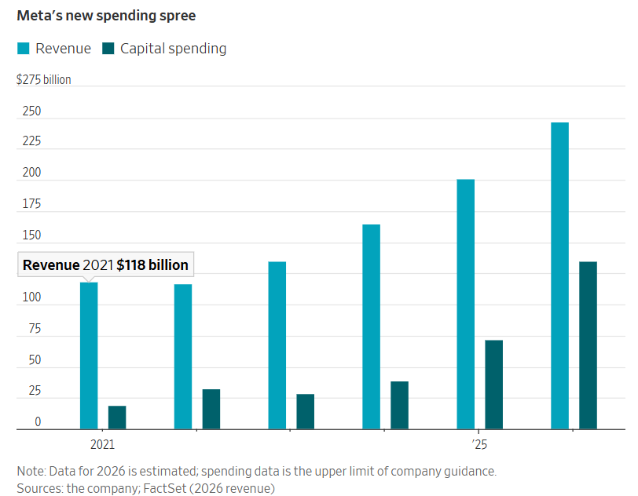

## 計畫中的資本支出高達1,350億美元，這是一個顯著的加速成長，但公司的廣告業務也緊隨其後。

[梅根·博布羅夫斯基](https://www.wsj.com/news/author/meghan-bobrowsky)

2026年1月30日上午8:00 ET

[98](https://www.wsj.com/tech/ai/meta-has-been-spending-like-crazy-on-ai-its-actually-paying-off-12506ca7?mod=tech_lead_pos5#comments_sector)

Meta公司的馬克·祖克柏在9月於加州舉行的一次會議上戴了人工智慧智慧眼鏡。 （圖片來源：Nic Coury/AP）

### 

快速概要

- Meta公司今年的資本支出預計將達到驚人的1,350億美元。
    
- Meta 預計 2025 年營收將年增 22%，達到 2,010 億美元，該公司預計本季將實現更大幅度的成長。
    
- 執行長馬克祖克柏表示，Meta 僅僅展現了人工智慧潛力的冰山一角。
[元平台](https://www.wsj.com/market-data/quotes/META) [META -2.95 %減少；紅色向下三角形](https://www.wsj.com/market-data/quotes/META)該公司不銷售人工智慧服務或資料中心容量，但它可能正在從迄今為止的人工智慧熱潮中獲得最豐厚的利益。

該公司[資本支出](https://www.wsj.com/business/earnings/meta-meta-q4-earnings-report-2025-46b59d90?mod=article_inline)幾乎翻了一番，從2024年的390億美元增加到2025年的720億美元。預計今年的支出將高達1,350億美元——這總額將超過許多小國的國內生產毛額。

去年10月，執行長[馬克·祖克柏](https://www.wsj.com/topics/person/mark-zuckerberg)暗示公司將大力投資[新建資料中心](https://www.wsj.com/tech/metaplatforms-meta-q3-earnings-report-2025-e0666e9c?mod=article_inline)，此舉引發投資人拋售股票，導致盤後交易中股價下跌約7%。但自Meta週三發布第四季財報並公佈最新資本支出預期以來，投資人開始回溫Meta股價，週四股價上漲10%。

為什麼？因為 Meta 也提供了證據，證明人工智慧正在幫助其廣告業務以前所未有的速度蓬勃發展。

德意志銀行互聯網分析師本傑明·布萊克表示：“我認為我們看到的是一種可持續的趨勢，這很大程度上源於他們在人工智慧領域的一些投資。”

Meta 預計 2025 年的營收將年增 22%，達到 2,010 億美元，該公司預計本季將實現更大的成長，可能高達 34%。

對於一家在過去三個月營收近600億美元的公司來說，這無疑是巨大的成長。祖克柏也表示，Meta僅僅展現了人工智慧潛力的冰山一角。

「我們世界一流的推薦系統已經推動了我們應用和廣告業務的顯著增長。但我們認為，與即將實現的系統相比，目前的系統還很原始，」他在與投資者和分析師的電話會議上表示。

Meta 的收入幾乎全部來自廣告業務。截至去年 12 月，這一比例高達 97%。該公司表示，目前仍面臨產能瓶頸，這意味著它現有的資源和基礎設施不足以支撐其在人工智慧領域的所有發展——因此才需要擴大資料中心。

Meta公司的資料中心位於亞特蘭大東部。圖片來源： Mike Stewart/AP

Meta財務長Susan Li表示：「公司對運算資源的需求成長速度甚至超過了我們的供應速度。我們預計，隨著雲端服務的拓展，2026年全年的運算能力將顯著提升。但直到今年稍後我們自有設施的新增容量投入使用之前，2026年的大部分時間裡，我們的運算能力可能仍將受到限制。」

李表示，該公司在第四季度將其用於訓練廣告排名模型的圖形處理單元數量增加了一倍，並採用了新的學習架構。

她表示，這些措施使用戶在Facebook上的廣告點擊率提高了3.5%，並在Instagram上實現了超過1%的轉換率提升，轉換率指的是購買、訂閱或潛在客戶數量。其他與人工智慧相關的改進也使其旗下所有應用程式的轉換率提高了3%。

在廣告購買方面，Meta 也一直在努力利用人工智慧技術，為希望在 Facebook 和 Instagram 上推廣產品或服務的企業[實現廣告自動化創建](https://www.wsj.com/tech/ai/meta-aims-to-fully-automate-ad-creation-using-ai-7d82e249?mod=article_inline)。李在電話會議上表示，第四季視訊產生工具的總收入達到了 100 億美元。

「廣告平台獲得的運算資源越多，其表現就越好，這是Meta真正的結構性優勢，」網路分析師布萊克說。 “如果你看到昨天的支出推動了本月的增長，那麼作為一個精明的商人，你就會繼續投入資源，讓這頭猛獸繼續咆哮。”