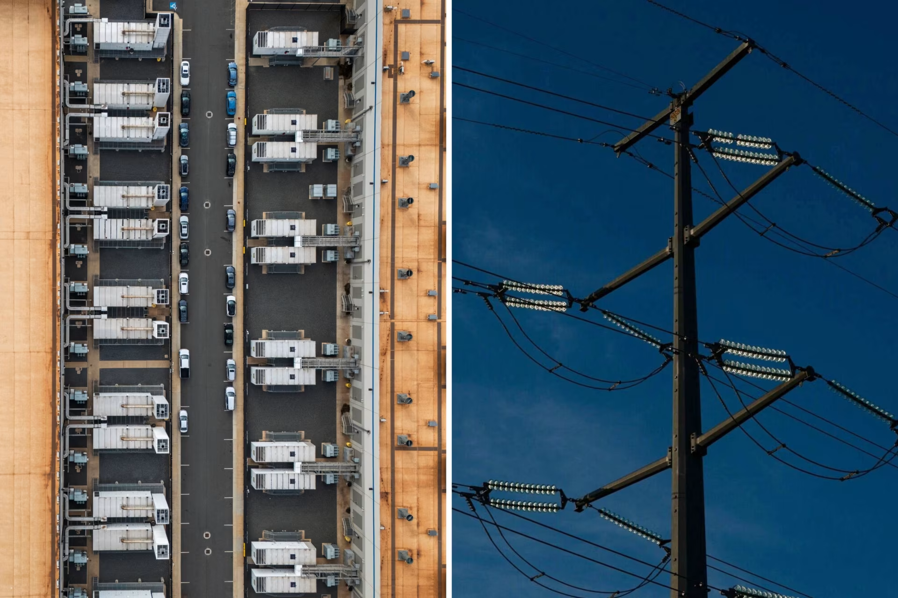

https://www.wsj.com/business/energy-oil/power-grid-ai-data-centers-1235f296?mod=hp_lead_pos7

這篇華爾街日報（WSJ）的報導標題為《The Grid Is Under Pressure. Data Centers Are Coming to the Rescue—for a Price》（電網面臨壓力，資料中心前來救援——但代價不菲）。

這篇文章的核心在於揭露了一個弔詭的現象：**造成電網壓力的「元兇」（AI 資料中心），正在透過「需量反應（Demand Response）」機制轉身成為電網的「救星」，並從中獲取巨額利潤。**

這是從空中俯瞰位於維吉尼亞州馬納薩斯的亞馬遜網路服務資料中心以及附近的輸電線路。圖片來源： JIM LO SCALZO/EPA/Shutterstock；Nathan Howard/彭博新聞社

以下為您整理該報導的**5大重點分析**以及**關鍵事實（Key Facts）**：

### 1. 核心重點：從「負載」變身為「虛擬電廠」的商業模式

- **重點**：資料中心不再只是單純的電力消費者。透過安裝大型電池（BESS）和備用發電機，它們具備了在電網緊急時刻「切斷市電、自給自足」的能力。
    
- **爭議**：電網運營商（如 PJM, ERCOT）因為太害怕停電，開始支付高額的「輔助服務費」給這些科技巨頭，請求他們在尖峰時刻「斷網（離網）」。這變成了一種新的獲利模式。
    

### 2. 報導中提到的重要事實與數據 (Key Facts)

- **事實 A：暴利的「需量反應」收入**
    
    - 報導指出，在某些電力市場（如德州 ERCOT 或 PJM），資料中心如果同意在電網緊急狀態下切斷電源（轉用自身備用電力），每兆瓦（MW）獲得的補償金可能是正常電價的**數十倍**。
        
    - **數據**：有些加密貨幣礦場或資料中心，透過「不亦用電」賺到的錢，甚至比它們實際運營業務賺得還多（例如 Riot Platforms 在一個月內獲得數千萬美元的能源信用額度）。
        
- **事實 B：科技巨頭的「雙重套利」 (Double Dipping)**
    
    - Google 和 Microsoft 等公司正在利用這種機制。他們一方面簽署長期的低價購電協議（PPA），另一方面安裝電池（如 Tesla Megapack）。
        
    - **操作模式**：平時用便宜的電網電力充電；當電價飆升或電網告急時，他們切換到電池供電，並領取電網發放的「救援獎金」。這大幅縮短了昂貴電池系統的**投資回收期（ROI）**。
        
- **事實 C：備用發電機的環境代價**
    
    - **事實**：許多資料中心的「斷電救援」其實是切換到**柴油發電機**。
        
    - **案例**：在維吉尼亞州（全球最大的資料中心聚集地），監管機構曾多次被迫暫時放寬空氣污染標準，允許資料中心在電網不穩時燃燒柴油發電，以避免區域大停電。這引發了當地社區對空氣品質的強烈抗議。
        
- **事實 D：AI 訓練的「不可中斷性」推動了電池需求**
    
    - 文章引用專家指出，AI 訓練與傳統網頁服務不同，不能隨意「降速」或「暫停」。
        
    - **結論**：因為不能真的停機，所以科技公司被迫大規模採購**電池儲能系統（BESS）**或**燃料電池（如 Bloom Energy）**。只有這樣，他們才能在賺取電網補貼的同時，保證 AI 模型訓練不中斷。
        

### 3. 深層隱憂：社會成本的轉移 (Socializing the Cost)

- **重點**：文章提出了一個尖銳的問題——**誰在買單？**
    
    - 電網為了留住這些資料中心，必須升級輸電線路並支付高額的需量反應費用。這些成本最終會轉嫁到**一般家庭和小型企業的電費帳單**上。
        
    - 批評者認為，這相當於一般民眾在補貼科技巨頭的基礎建設成本，這在政治上極具爆炸性（Political Dynamite）。
        

### 4. 對您研究的價值（Connecting to Your Research）

這篇報導提供了三個支撐您 **2026 年預測** 的關鍵論點：

1. **BESS 的必然性**：電池不僅是為了解決物理上的「毫秒級波動」，更是為了在商業上賺取「電網輔助服務費」。沒有電池，資料中心就只能付錢，不能賺錢。
    
2. **法規風險**：公眾對「補貼科技巨頭」的憤怒正在累積。未來可能會修法，強制資料中心**「自帶電源（Bring Your Own Power）」**且**「不給予補貼」**。這會讓 Bridge-to-Grid 的成本變高，但也讓擁有獨立供電能力的廠商（如 Bloom Energy, Tesla）更具戰略價值。
    
3. **Bridge-to-Grid 的經濟模型驗證**：這證明了「不依賴電網」不僅是技術需求，更是一種可以套利的商業模式。

## Gemini
這篇來自《華爾街日報》的文章（標題：_The Grid Is Under Pressure. Data Centers Are Coming to the Rescue—for a Price_ 或類似主題）深入探討了我們剛才討論的**「需量反應」（Demand Response）**在 AI 時代的演變與爭議。

這篇文章的核心論點直接驗證了我們之前的分析：**電力公司與科技巨頭正在進行一場新的談判，而「電池」與「自建發電」成為了談判桌上最重要的籌碼。**

以下是這篇報導的深度分析，以及它如何印證我們對 2026 年電力局勢的判斷：

### 1. 核心矛盾：從「寄生」到「共生」的代價

文章指出，隨著 AI 資料中心對電力的需求激增，電網運營商（如 PJM, ERCOT）已經無法單方面保證供電。現在的局勢反轉了：

- **過去**：資料中心是單純的電力消費者（Consumer）。
    
- **現在**：電網要求資料中心成為**「電網穩定器」（Grid Stabilizer）**。
    

新聞重點：

電網運營商正在向 Google、Microsoft 等公司提出條件：「我們可以讓你接電，但你必須同意在電網緊急時刻（如熱浪、寒流）切斷部分負載或向電網反向供電。」

- **代價**：作為交換，電網會支付給資料中心高額的**「輔助服務費」**。報導提到，某些能夠快速配合斷電的資料中心，每年可獲得數百萬甚至上千萬美元的補貼。
    

### 2. AI 訓練的「不可中斷性」與現實的碰撞

這點直接呼應了您之前的疑問（關於分階段上線）。

- **報導揭露**：雖然 Google 和 Microsoft 都在實驗「負載轉移」，但文章引用業內人士指出，**大部分頂級 AI 訓練任務仍無法接受「隨時斷電」**。
    
- **解決方案**：這正是 **BESS（大型電池儲能）** 進場的關鍵理由。
    
    - 科技巨頭不是真的「停機」，而是**「切換」**。當電網要求卸載時，他們瞬間切換到內部的電池或備用發電機供電。
        
    - **雙重獲利**：他們既拿到了電網給的「斷電補貼」（因為對電網來說他們消失了），又保持了 AI 訓練的 24/7 運轉。這被稱為**「雙重套利」（Double Dipping）**，也是目前 BESS 投資回報率最高的商業模式。
        

### 3. 「虛擬電廠」（VPP）的概念成真

文章提到一個重要趨勢：資料中心正在變成巨大的**虛擬電廠**。

- 透過安裝大規模的電池（如 Tesla Megapack）和燃料電池（Bloom Energy），資料中心不僅自給自足，還能在電價飆漲時（例如 $3,000/MWh）把電**賣回給電網**。
    
- **戰略意義**：這解釋了為什麼我們之前分析的「Bridge-to-Grid」策略中，電池的佔比越來越高。電池不再只是為了「平滑濾波」，更是為了**「參與電力市場交易」**來補貼昂貴的硬體成本。
    

### 4. 監管層面的隱憂（The Controversy）

文章也觸及了我們討論過的「社會觀感」問題：

- 一般消費者和監管機構開始質疑：為什麼我們要花納稅人的錢（或提高電費）來付錢給這些富可敵國的科技公司，只為了讓他們「不導致停電」？
    
- 這種輿論壓力可能會導致未來法規收緊，例如**強制要求資料中心「自帶電源」（Bring Your Own Power）而不給予補貼**。這將進一步推高資料中心的建設門檻。
    

### 總結與對您的啟示

這篇 WSJ 的報導證實了：

1. **電網已經投降**：他們承認無法滿足 AI 的峰值需求，轉而尋求「以價制量」或「需量反應」。
    
2. **BESS 是戰略資產**：電池不僅是物理上的「避震器」（解決毫秒波動），更是商業上的「印鈔機」（賺取電網輔助服務費）。
    
3. **Bridge-to-Grid 是唯一解**：與其被動等待電網調度或面臨斷電風險，科技巨頭傾向於建立獨立的微電網系統，這樣既能拿補貼，又能確保 AI 訓練不受干擾。
    

這篇文章為您的研究提供了強有力的**商業論證**：投資昂貴的電池和發電設備，不僅是為了技術上的可行性（物理極限），更是為了在未來的電力市場中掌握主動權。
## 既然資料中心大部分時間都在穩定買電（貢獻巨額營收），為什麼電力公司不能「忍受」一下那短暫的峰值？

答案在於電力系統的一個殘酷物理現實：**電網的建設成本是為了「應付最壞的那一秒」，而不是「服務平均的那一年」。**

以下為您深入拆解為什麼電力公司（Utilities）即使看到巨額營收，也不敢（或不能）隨意接入這些具有巨大峰值需求的 AI 資料中心：

### 1. 物理定律的「木桶效應」：容量是硬上限

電網不像網路寬頻，頻寬滿了只是網速變慢。**電網如果過載，是會爆炸或燒毀的。**

- **「短暫」也能致命**：即使峰值需求只持續幾分鐘甚至幾秒鐘，如果這個瞬間電流超過了輸電線的**「熱極限（Thermal Limit）」**或變壓器的額定容量，保護機制（斷路器）會立刻跳脫以防止設備燒毀。一旦跳脫，就是區域性大停電。
    
- **橋樑類比**：想像一座承重 50 噸的橋。即使一輛 100 噸的卡車「只是快速通過 1 秒鐘」，橋還是會垮。電力公司不能因為卡車大部分時間只有 10 噸，就允許那 100 噸的時刻發生。
    

因此，電力公司**必須**按照客戶的「最高峰值（Peak Demand）」來規劃硬體設施，而不是平均用量。

### 2. 「容量費」與「流動費」的經濟帳

電力公司的成本結構分為兩部分，這解釋了為何他們對峰值如此敏感：

- **能量（Energy, kWh）**：這是您說的「營收」。資料中心 24 小時運轉，確實買了很多「能量」。
    
- **容量（Capacity, kW/MW）**：這是為了輸送電力而必須建設的硬體（電塔、變電站）。
    

**問題在於：** 為了滿足 AI 資料中心那「短暫的峰值」，電力公司可能需要花費數億美元升級變電站和擴建輸電線。

- 如果這個峰值一年只出現幾次，那麼這數億美元的設備在 99% 的時間裡都是**「閒置」**的。
    
- 這導致**資產利用率（Asset Utilization）**極低。依照法規，電力公司不能隨意讓一般居民（Ratepayers）去分攤這些為了服務單一客戶峰值而產生的閒置資產成本。
    

### 3. AI 負載的特殊性：不是「高峰」，而是「刺」

如果峰值是規律的（例如每天下午 2 點開冷氣），電網還好處理。但 AI 訓練負載的峰值往往是：

- **不可預測**：模型訓練的檢查點（Checkpointing）或重啟可能隨時發生。
    
- **變化率極快（High Slew Rate）**：如我們之前討論的，毫秒級的 0% 到 100% 跳動。
    

這種特性對電網來說不是「大生意」，而是「大麻煩」。它會造成電網頻率波動，甚至影響到同一條線路上的其他工廠或醫院。為了賺資料中心的電費而犧牲電網穩定性，對電力公司來說是**法律上的失職**。

### 4. 解決方案：這正是「削峰填谷」存在的理由

回到您的問題：_「難道就不接這筆生意了嗎？」_

當然要接。但電力公司的條件是：**「請您把峰值留給自己，把平均值留給我。」**

這就是為什麼雙方會達成一種妥協：

1. **限制契約容量**：電力公司規定：「我這條線只能給你 50MW。你可以用，但任何瞬間都不能超過 50MW。」
    
2. **資料中心自救**：但是 AI 叢集全速跑需要 80MW 怎麼辦？這時資料中心就**必須**安裝電池（BESS）。
    
    - 平時：從電網抽 50MW。
        
    - 峰值（80MW）：電網給 50MW，電池補 30MW。
        
    - 谷值（20MW）：電網給 50MW，多出的 30MW 存回電池。
        

結論：

您說的「大部分時間耗用大量電力貢獻營收」是電力公司最喜歡的部分（Base Load）。但為了吃到這塊肉，資料中心必須自己負責把那根「會刺破電網的魚刺（峰值）」給拔掉。

這也是為什麼我們之前一直強調 **BESS（電池）** 在 2026 年之後不僅是備用電源，而是**「接入許可證（License to Operate）」**的關鍵原因。沒有電池來修整峰值，電力公司就算想賺這筆錢，物理上和法規上也不敢接單。