https://news.futunn.com/hk/post/66137415/deutsche-bank-in-depth-report-genuine-or-speculative-ai-bubble?futusource=news_stock_stockpagenews&ns_stock_id=202597&report_id=60649607&report_type=stock&src=0&stock_news_tab=news&client_hour_clock=24&hk_cid=232247019&main_broker=WwoJMTAwOApdCg==&sg_cid=232247019&skintype=3&us_cid=232247019&level=3&global_content={%22promote_content%22:%22nn:post:66137415%22,%22invite%22:232247019}&data_ticket=37e6f130c482914332bc1938d91d811e&

這是一份基於德意志銀行（Deutsche Bank）深度報告的分析摘要。該報告站在 **2025年12月** 的視角，對 AI 產業進行了「驗屍級」的拆解。德銀的核心觀點是：**AI 熱潮並非單一泡沫，而是由估值、投資、技術三種不同性質的泡沫交織而成，且風險與機會並存。**

以下是該報告的詳細結構化分析：

### 1. 核心結論：誰在裸泳？

德銀認為公開市場的科技巨頭（如 Nvidia, Microsoft）並未裸泳，其高估值有強勁的盈利支撐；真正的「裸泳者」是**估值過高的私營初創公司**，以及依賴**循環融資結構**的脆弱環節 1。

---

### 2. 三重泡沫的詳細拆解

為了更直觀地理解這三種泡沫的差異，我們可以透過以下對比來看：

#### **A. 估值泡沫 (Valuation Bubble)：公私分化嚴重**

- **公開市場 (Rational):** 雖然希勒週期調整市盈率（Shiller CAPE）超過 40，接近 2000 年互聯網泡沫頂峰，但大型科技股的溢價是由 **20% 以上的真實盈利增長** 支撐的 2。
    
- **私營市場 (Irrational):** 私營公司的估值已經脫離地心引力。
    
    - **OpenAI:** 市銷率 (P/S Ratio) 達 **38倍** 3。
        
    - **Anthropic:** 市銷率高達 **44倍** 4。
        
    - **對比:** 英偉達 (22倍)、微軟 (12倍)、亞馬遜 (3.5倍) 5。
        

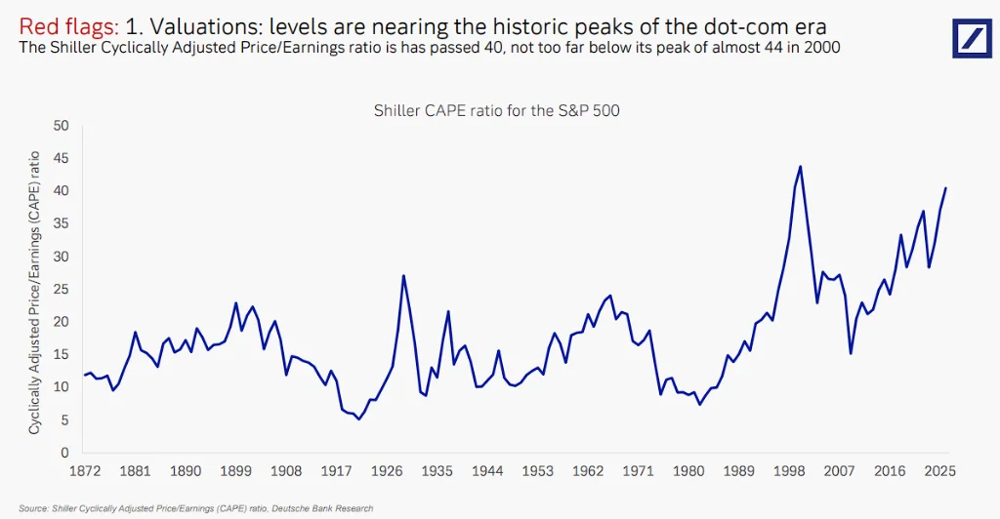
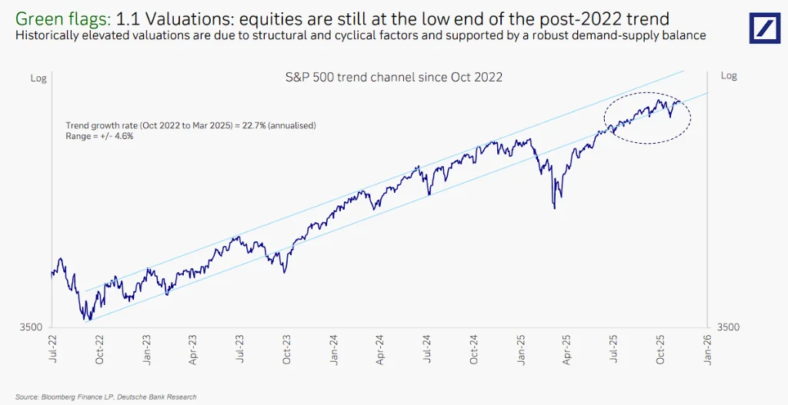
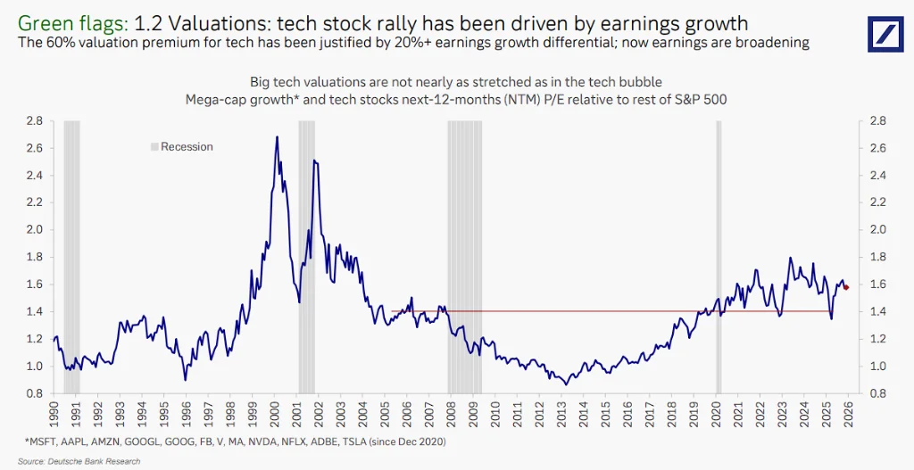
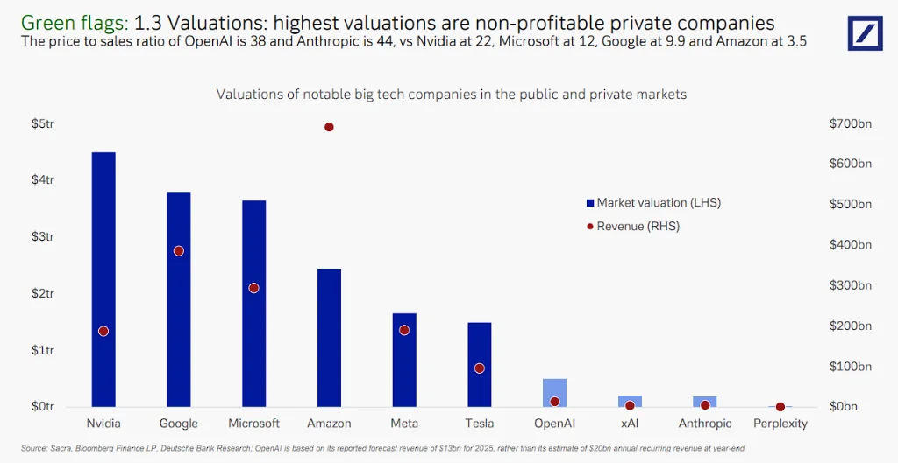

#### **B. 投資泡沫 (Investment Bubble)：現金為王**

- **規模:** 預計到 2030 年累計資本支出將達 **4 萬億美元** 6。
    
- **健康度:** 與 2000 年互聯網泡沫由「債務驅動」不同，當前的 AI 投資主要由巨頭的 **自由現金流 (Free Cash Flow)** 驅動 7。
    
    - 例如：谷歌單季運營現金流達 480 億美元，足以覆蓋其資本支出 8。
        
- **回報:** 投資回報率 (ROI) 正在上升，來自雲需求和效率提升 9。
    
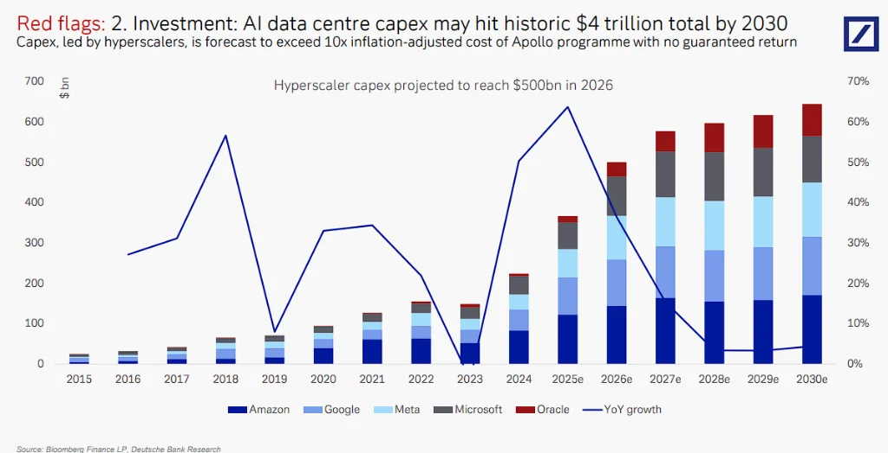

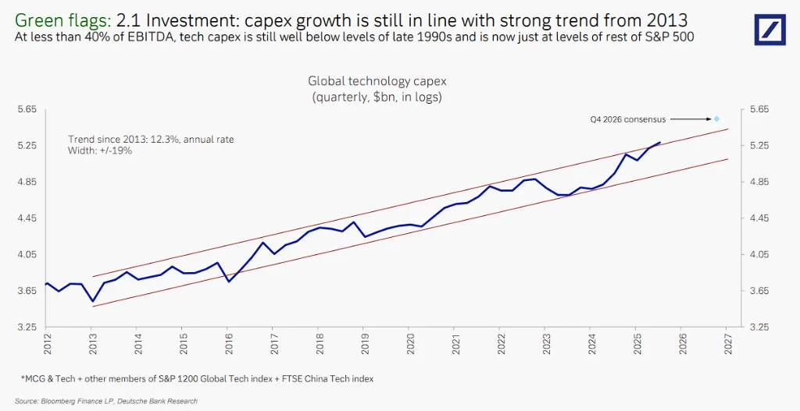
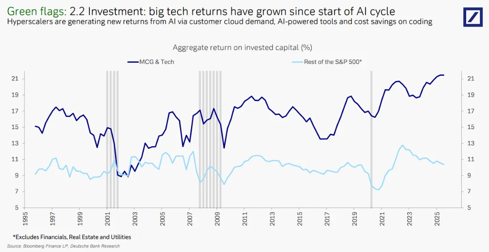

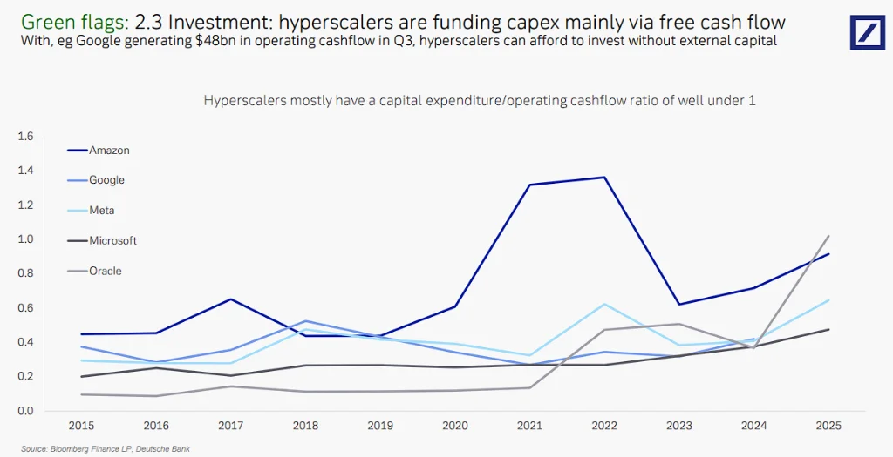
#### **C. 技術泡沫 (Technology Bubble)：進步與瓶頸並存**

- **進步:** 報告提及 2025 年 11 月發布的 **Gemini 3**，在多模態和推理能力上大幅超越前代，證明 AI 擴展定律 (Scaling Laws) 尚未失效 10。
    
- **需求:** 成本下降（傑文斯悖論）推動了巨大的使用需求，確保芯片沒有閒置 11。
    
- **隱憂:** 物理瓶頸（如芯片間數據傳輸速度）可能成為未來的天花板 12。
    
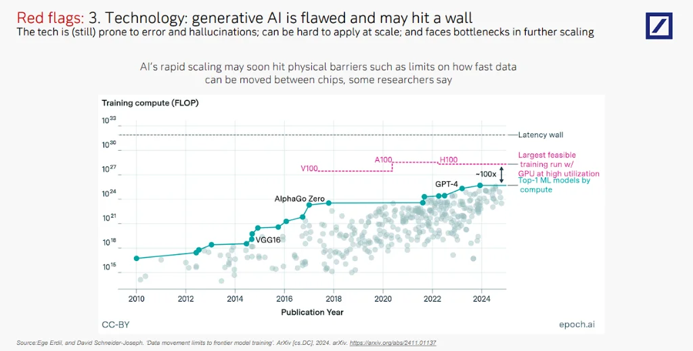
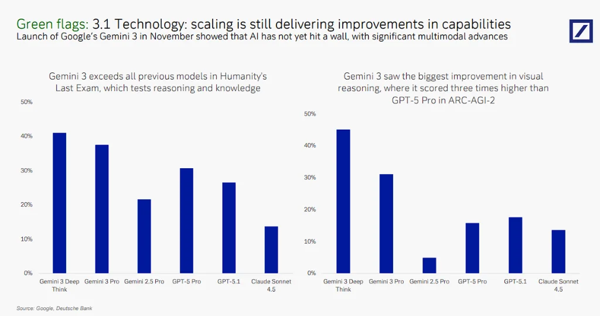
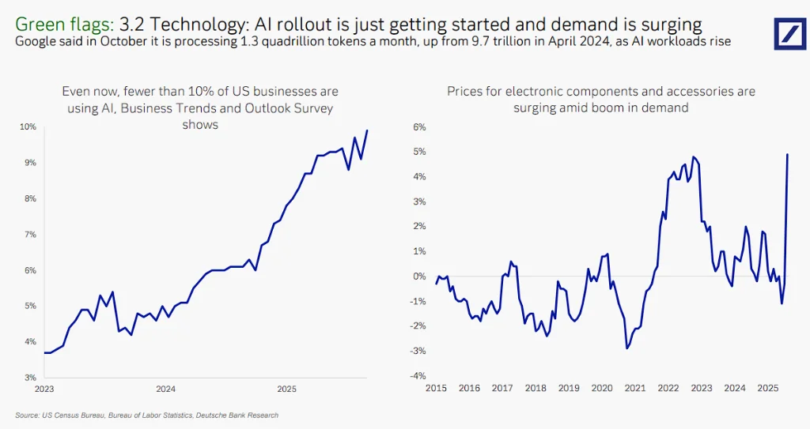
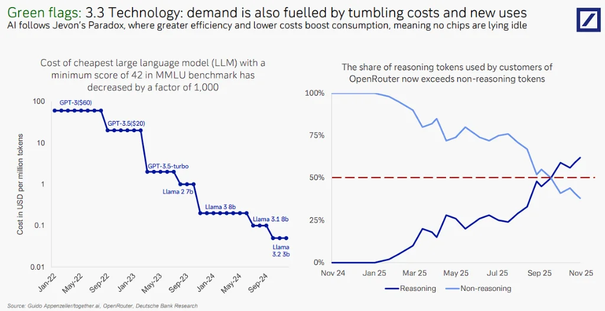

### 3. 五大潛在崩盤風險 (The Burst Triggers)

儘管基本面看似強勁，德銀指出了可能刺破泡沫的五根「針」：

1. **循環融資的系統性風險 (Circular Financing):**
    
    - 巨頭（如微軟、英偉達）投資初創公司（如 OpenAI），初創公司再用這些錢買巨頭的雲服務和芯片。這種「左手倒右手」的結構導致估值不透明，一旦環節斷裂將引發連鎖反應 13。
        
2. **債務激增 (Debt Surge):**
    
    - 隨著成本螺旋上升，即使是現金充裕的巨頭也開始增加債務發行（2025 年已發行 350 億美元債券）14。
        
3. **邊際效應遞減 (Diminishing Returns):**
    
    - 訓練成本呈指數級增長（從 1000 萬美元飆升至 10 億美元），但開發出通用人工智能 (AGI) 的概率預測卻在下降 15。
        
4. **能源與供應瓶頸 (Supply Bottlenecks):**
    
    - **電力危機:** 2030 年電力需求預計是 2020 年的四倍。電力基礎設施建設緩慢，可能成為最大制約 16。
        
5. **社會政治反彈 (Socio-political Backlash):**
    
    - 發達國家民眾對 AI 搶奪工作的擔憂加劇（超過 20% 的受訪者表示擔憂），可能引發監管限制 17。
        
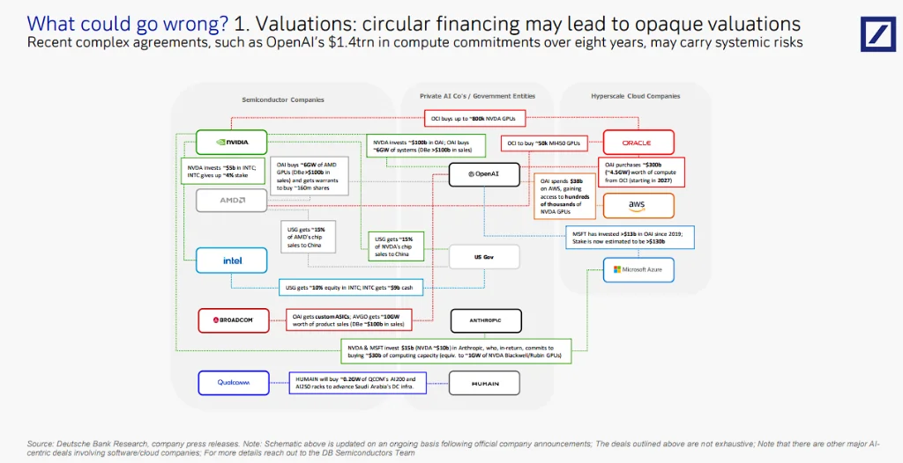
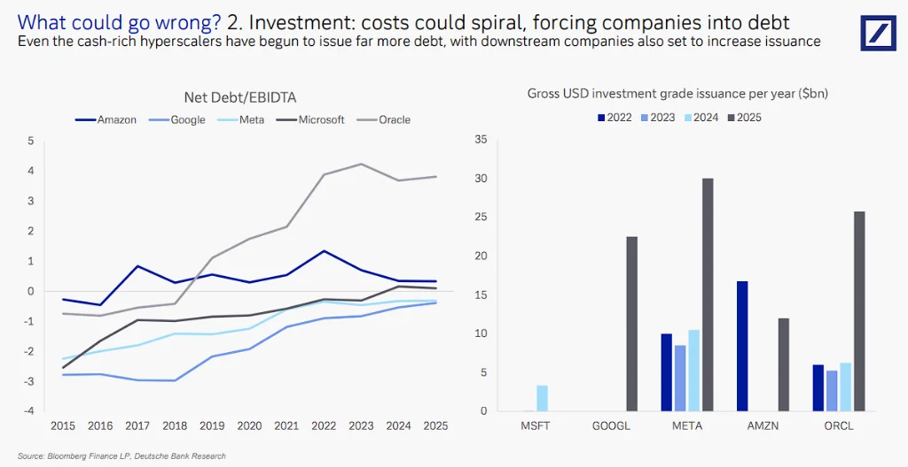
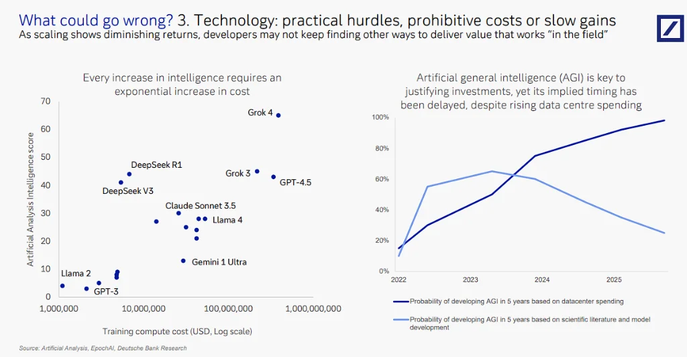
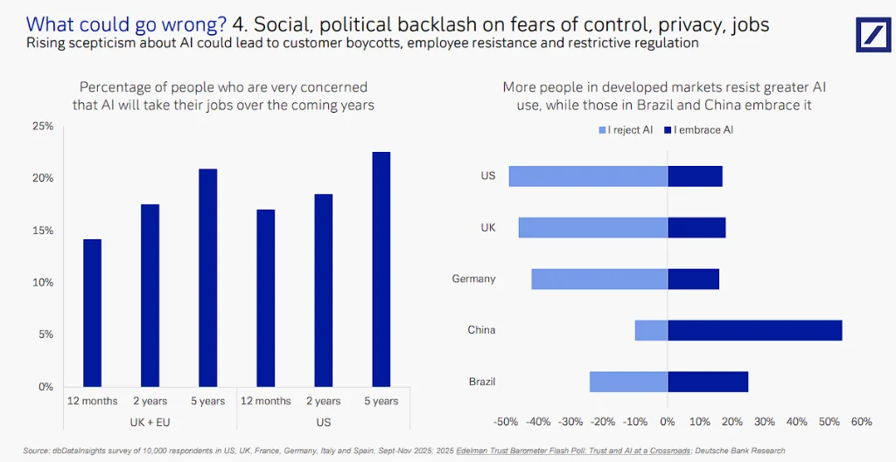
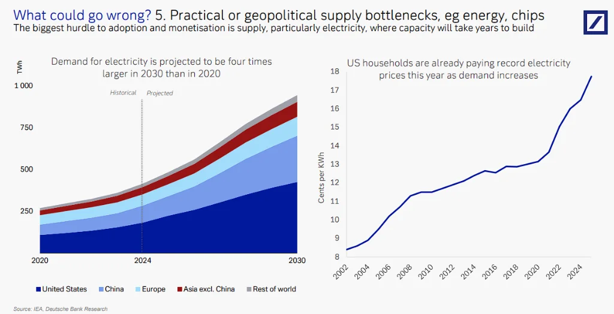
### 4. 總結

德銀的報告揭示了一個分裂的市場：**公開市場的 AI 巨頭是在「穿著泳衣游泳」（有業績支撐），而私營市場的獨角獸們則在「裸泳」（高估值依賴循環融資）。** 投資者應警惕私營市場的估值修正，並密切關注能源供應和融資結構的穩定性。