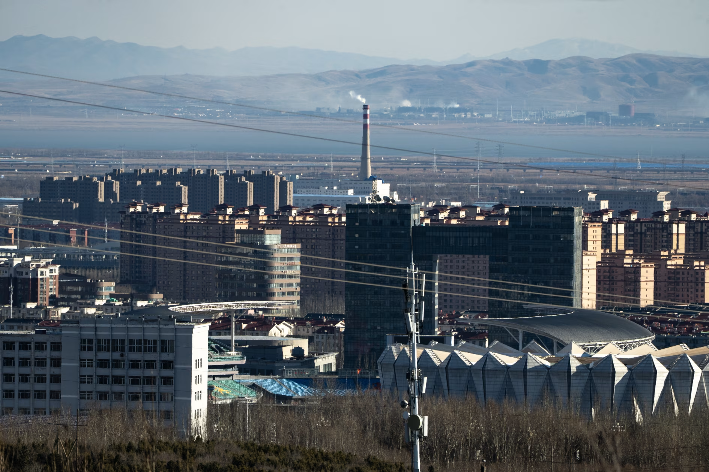
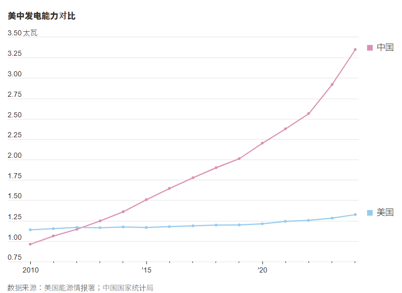
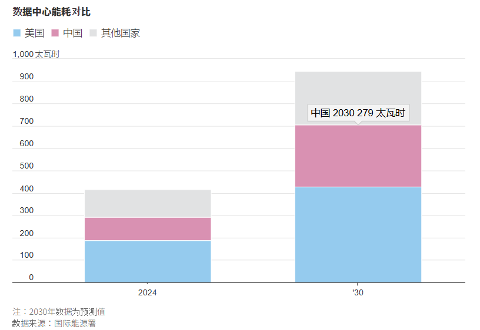
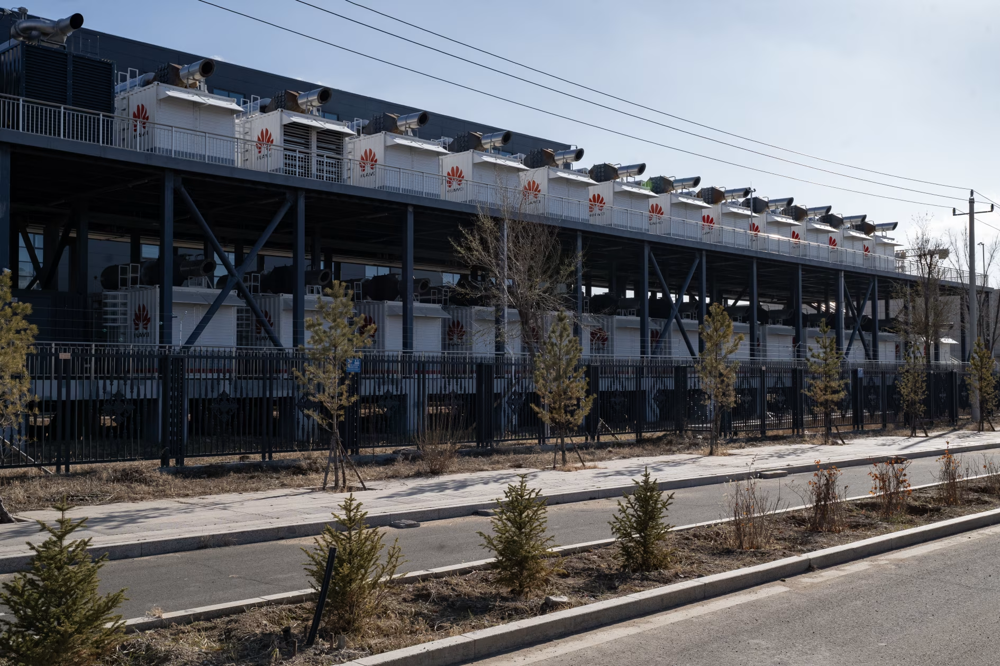

https://cn.wsj.com/articles/%E5%9C%A8%E5%85%A7%E8%92%99%E5%8F%A4%E7%9B%AE%E7%9D%B9%E4%B8%AD%E5%9C%8B%E7%AB%B6%E9%80%90ai%E8%B3%BD%E9%81%93%E7%9A%84%E5%8F%A6%E4%B8%80%E5%BC%B5%E7%8E%8B%E7%89%8C-%E5%85%A8%E7%90%83%E6%9C%80%E5%A4%A7%E9%9B%BB%E7%B6%B2-9aeb447b?mod=ct_hp_mediumtopper_pos_1

這是一份針對 **中國「電力優勢」與「AI 算力戰略」** 的 **投資銀行級情報簡報 (Investment Banking Grade Intelligence Briefing)**。

這篇報導揭示了美中 AI 競賽中一個常被忽視但至關重要的維度：「電力套利 (Energy Arbitrage)」。

中國正在用 「無限的廉價電力」 來彌補 「晶片效能的不足」。這是一種典型的 「暴力美學 (Brute Force)」 戰略。

---

    

### **投資銀行級情報簡報：美中 AI 競賽的「數據決戰」 (The Data-Driven War Room)**

#### **1. 情報履歷 (Metadata)**

- **標題：** 能源霸權對決算力封鎖：中國以「4 倍功耗」換取 AI 生存空間
    
- **來源/作者：** The Wall Street Journal / Raffaele Huang & Brian Spegele
    
- **發布時間：** 2025年12月11日 (CST)
    
- **關鍵詞：** 電力鴻溝 (Power Gap), 昇騰晶片 (Ascend), 暴力計算 (Brute Force), 債務牆 (Debt Wall), $0.03 電費
    

#### **2. 核心摘要 (Executive Summary)**

美國在 AI 晶片效能上擁有絕對優勢，但中國正在利用其**「能源霸權」進行戰略對沖。

美國在 AI 軟體（模型）和硬體（晶片）上領先，但中國握有 **「能源王牌」**。

- **電力鴻溝 (Power Gap)：** 中國發電量是美國的兩倍，且數據中心電費低至 **$0.03/kWh**（美國為 $0.07-$0.09）。高盛預測 2030 年中國將有 **400 GW 的富餘電力**，而美國面臨 **44 GW 的缺口**。
    
- **戰略抵銷 (Strategic Offset)：** 中國因為買不到最先進的 NVIDIA 晶片，改用 **「晶片堆疊 (Chip Stacking)」** 戰術。例如華為將 384 顆昇騰晶片綁在一起，算力超過 NVIDIA GB200 NVL72，但 **功耗是後者的 4 倍**。這種戰術只有在電力極度廉價且充沛的環境下才可行。
    
- **內蒙古樞紐：** 烏蘭察布（Ulanqab）已成為中國的「草原雲谷」，利用風光綠電和低溫氣候（省空調費），吸引了 Apple、Huawei、Alibaba 等巨頭進駐。

根據高盛與摩根士丹利的預測，美中之間即將出現巨大的「電力剪刀差」**：

- **供給面：** 中國預計 2030 年將擁有 **400 GW (吉瓦)** 的富餘電力（約為全球數據中心需求的 3 倍）；反觀美國未來三年面臨 **44 GW** 的電力缺口（相當於整個紐約州的夏季產能）。
    
- **成本面：** 中國數據中心的電力成本低至 **$0.03/kWh**，僅為美國（北維吉尼亞州 $0.07-$0.09/kWh）的 **1/3**。
    
- **戰略後果：** 這種極致的能源優勢，讓中國得以採用**「暴力堆疊」**戰術——即使用 **4 倍的功耗** 來驅動落後的國產晶片，以在效能上逼近 NVIDIA，從而規避美國的晶片制裁。
    

#### **3. 深度架構分析 (Structural Analysis)**

A. 宏觀不對稱性：3.75 TW 的能源護城河

中國政府將「電力」視為 AI 競賽的非對稱武器，其投入規模是國家級的。

- **裝機容量：** 中國總發電量已達 **3.75 TW (太瓦)**，是美國（約 1.2 TW）的 **2 倍以上**。
    
- **電網支出：** 預計 2025-2030 年，中國電網支出將達 **5,600 億美元**（增長 45%），重點建設特高壓輸電網路，將西部的風光綠電輸送到「東數西算」的樞紐。
    
- **結論：** 當美國科技巨頭還在為「自建核反應堆」煩惱時，中國已經為 AI 準備好了近乎無限的電力池。
    

B. 技術路線圖：以「瓦特」換「比特」 (Watts for Bits)

這是本報告最核心的技術發現。WSJ 引用數據揭示了華為如何利用廉價電力來彌補晶片代差。

- **對標測試：** 華為 **CloudMatrix 384** vs. NVIDIA **GB200 NVL72**
    
    - **晶片數量：** 華為使用 **384 顆** 昇騰 (Ascend) 晶片，對比 NVIDIA 的 **72 顆** Blackwell。
        
    - **算力產出：** 華為系統的理論算力比 NVIDIA 高出 **66%**。
        
    - **致命代價：** 華為系統的功耗是 NVIDIA 的 **4 倍**。
        
- **商業邏輯：** 在美國，使用功耗高 4 倍的設備會導致資料中心 TCO (總擁有成本) 破產。但在中國 **$0.03/kWh** 的電費環境下，這個公式是成立的。
    
- **戰略意義：** 中國不僅在「造晶片」，更是在「造電」。**廉價電力成為了國產落後晶片的「生命維持系統」。**
    

C. 區域經濟學：烏蘭察布的「資本密集」增長

內蒙古烏蘭察布（Ulanqab）作為「草原雲谷」，展示了這種模式的極限。

- **增長數據：** 過去 5 年 GDP 增長 **50%**，數據中心耗電量增長 **7 倍**，吸引投資 **350 億美元**。
    
- **就業數據：** 人口不增反減，流失了 **25% (降至 160 萬)**。
    
- **結論：** 這是典型的**「無就業增長 (Jobless Growth)」**。AI 基礎設施建設利好電力公司和硬體商，但對普通勞工的紅利極低。
    

D. 隱藏的金融風險：4,500 億美元的債務牆

中國的電力優勢並非沒有代價，它是建立在國有企業的槓桿之上。

- **債務規模：** 中國國家電網 (State Grid) 的負債從 2019 年至今增長了 **40%**，總額達到驚人的 **4,500 億美元**。
    
- **風險點：** 這種不計成本的基建投入，如果最終 AI 應用無法變現（Monetization），將轉化為巨大的金融系統性風險。
    

#### **4. 投資專家的行動建議 (Actionable Insights)**

基於上述完整數據，我們對投資組合的建議更加精確：

1. **做多「美國電力缺口」概念股 (Long US Power Deficit)：**
    
    - **邏輯：** 數據確認美國面臨 **44 GW 缺口**。這意味著在美國，**「擁電者為王」**。
        
    - **標的：** **Bloom Energy (BE)**, **Vistra (VST)**, **Talen Energy (TLN)**。這些能提供獨立電力的公司，擁有比中國同業高得多的定價權（因為美國缺電）。
        
2. **確認 NVIDIA 的長期護城河 (NVIDIA's Moat is Safe)：**
    
    - **邏輯：** 華為的「4 倍功耗」模式只能在電費 $0.03 的中國生存。在電費昂貴的歐洲 ($0.15+) 或日本，**這種高能耗方案毫無競爭力**。
        
    - **結論：** 中國的 AI 解決方案無法大規模出口。NVIDIA 的高能效 (Energy Efficiency) 晶片在全球市場依然沒有對手。
        
3. **地緣政治避險 (Geopolitical Hedge)：**
    
    - 川普放寬 H200 出口，是為了打擊華為的「堆疊戰術」。如果 H200 這種「中等算力、中等功耗」的晶片大量進入中國，可能會削弱中國企業使用「高功耗國產晶片」的意願。這對 **NVIDIA 的中國區營收 (China Revenue)** 是短期利多。
        

分析師結語：

這場 AI 戰爭已經演變為兩個平行宇宙：

- **美國宇宙：** 缺電、電貴，因此追求極致的晶片效能 (3nm, Blackwell)。
    
- **中國宇宙：** 電多、電便宜，因此容忍落後的晶片效能，用能源換算力。
    

投資人應意識到，這兩種模式將長期共存，並分別在其勢力範圍內創造不同的供應鏈機會。

以下是**補強後**的關鍵分析板塊，請將其視為上一份報告中「投資行動建議」的**第四大支柱**，這才是完整的架構：

### **補強板塊：中國特高壓 (UHV) —— 5,600 億美元的「確定性」盛宴**

#### **1. 債務與支出的悖論 (The Debt-Capex Paradox)**

- **數據衝突：**
    
    - **風險端：** 國家電網負債 4,500 億美元（WSJ 數據）。
        
    - **機會端：** 未來五年電網資本支出 (Capex) 高達 **5,600 億美元**（摩根士丹利預測）。
        
- **分析師判斷：** 在中國的體制下，**「政治任務 > 財務健康」**。
    
    - 既然「東數西算」和 AI 霸權是國家戰略，中央政府會通過國有銀行放貸或發行特別國債來支撐這 5,600 億的支出。
        
    - 這意味著：**國家電網的資產負債表可能會爛掉，但 UHV 供應鏈廠商的訂單會接不完。** 這是一個完美的「政府買單 (G-to-B)」套利機會。
        

#### **2. 特高壓 (UHV) 的技術護城河**

中國在 UHV 技術上處於全球壟斷地位。這不是普通的電線，這是**「電力的高鐵」**。

- **核心技術：** ±800kV 直流輸電 (UHVDC) 和 1000kV 交流輸電 (UHVAC)。
    
- **關鍵組件：** 換流閥 (Converter Valves)、氣體絕緣開關 (GIS)、變壓器。這些設備技術門檻極高，利潤率遠高於普通電網設備。
    

#### **3. 修正後的投資標的 (Reinstated Actionable Insights)**

基於 5,600 億美元的支出，以下是您應關注的具體受益者：

- **核心設備商 (The Prime Contractors)：**
    
    - **ABB Ltd (ABBN) / Hitachi Energy：** 雖然特高壓核心技術在中國，但 ABB 與 Hitachi 是全球極少數能提供 UHVDC 關鍵控制系統與變壓器的外資巨頭，且他們也能吃到歐洲電網升級的紅利。
        
    - **Siemens Energy (ENR)：** 同樣是高壓輸電設備的全球龍頭。
        
- **原物料對沖 (The Commodity Play)：**
    
    - **銅 (Copper) & 鋁 (Aluminum)：** 特高壓輸電線路需要天文數字的導電金屬。
        
    - **標的：** **Freeport-McMoRan (FCX)** 或 **Southern Copper (SCCO)**。
        
    - **邏輯：** 中國這 5,600 億美元的電網投資，本質上是在**「囤積銅」**。做多銅礦股，就是間接做多中國的電網建設，且沒有單一公司的經營風險。
        
- **中國本土龍頭 (若是可投資 A/H 股)：**
    
    - _(註：若您的資金池允許配置中國資產)_
        
    - **國電南瑞 (NARI Technology)：** 這是中國國家電網旗下的核心技術公司，壟斷了調度系統和換流閥技術。它是 5,600 億支出最直接的流入對象。
        
    - **特變電工 (TBEA)：** 全球最大的變壓器製造商之一。
        

