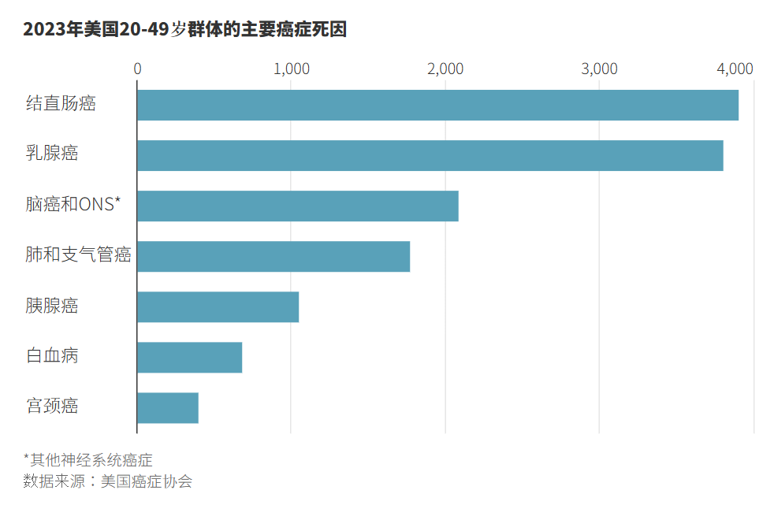

## 癌症一直被視為一種「老年病」。但部分癌症在年輕群體中發病率的攀升顛覆了這一刻板印象。

[Betsy McKay](https://www.wsj.com/news/author/betsy-mckay)

2026年1月23日 09:57 CST

去年，為提高公眾對結直腸癌認知的旗幟被插設在美國國會大廈前的國家廣場上。圖片來源：Gent Shkullaku/Zuma Press

結直腸癌在年輕人中呈上升趨勢。一項新的分析顯示，目前結直腸癌是美國50歲以下人群癌症死亡的首要原因。

美國癌症協會(American Cancer Society)的研究人員周四報告稱，從1990年至2023年底，美國有超過120萬50歲以下的人死於癌症。

根據美國癌症協會的統計數據，2023年，年齡在20至49歲的人群中，約有3,905人死於結直腸癌，相比之下，死於乳腺癌的有3,809人，死於腦癌和其他神經系統癌症的有2,086人。

「這絕對令人不安，」菲尼克斯班納安德森癌症中心(Banner MD Anderson Cancer Center)癌症醫學部主任馬達帕·昆德蘭達(Madappa Kundranda)博士說。他沒有參與這項研究。

長期以來，癌症一直被認為是一種老年病。然而，一些癌症在年輕人中的發病率不斷上升，顛覆了這一長期存在的刻板印象，令衛生部門和醫生感到擔憂，並促使人們研究可能的原因和解決方案。

隨著年輕人患結直腸癌的威脅日益增大，醫療團體已經降低了結腸鏡檢查的建議年齡，以便在有很大機會獲得有效治療時發現該疾病。

但醫生們表示，50歲以下接受篩查的人還不夠多，這促使人們呼籲加倍努力，向醫生和護士宣傳與患者溝通的必要性。

美國癌症協會負責監測、預防和健康服務研究的高級副總裁艾哈邁丁·傑馬爾(Ahmedin Jemal)博士說，多年來，年輕成年人中結直腸癌的診斷率一直在上升，該疾病已經是男性癌症死亡的頭號原因。現在，它在男性和女性合計的死因中高居榜首。

這一增長給不斷改善的抗癌前景蒙上了一層陰影。根據美國癌症協會的另一項分析，在2015年至2021年期間，約70%的癌症患者在確診後至少存活了五年。

美國癌症協會稱，這些進展得益於更好的藥物和更完善的檢測手段。該分析報告發表在《美國醫學會雜誌》(Journal of the American Medical Association)上，其資深作者傑馬爾說：「我們正在取得進展，但還有很長的路要走。」

在美國，50歲以下人群的總體癌症死亡率在1990年至2023年期間下降了44%。肺癌、乳腺癌和其他主要癌症的死亡人數有所下降。然而，一些癌症在年輕人中的發病率正在上升。

在美國總人口中，結直腸癌死亡人數有所下降，這主要歸功於老年人篩查率的提高。1990年，結直腸癌是50歲以下人群中第五大癌症死因。自2005年以來，該年齡組因該疾病死亡的人數每年上升1.1%。

波士頓丹娜法伯癌症研究院(Dana-Farber Cancer Institute)結腸和直腸癌中心聯合主任傑弗裡·邁耶哈特(Jeffrey Meyerhardt)博士說，結直腸癌如今成為更年輕群體的頭號癌症殺手，這意味著他們確診時已是晚期。邁耶哈特沒有參與這項研究。他說：「如果他們就診時已是晚期，就更難讓他們擺脫疾病。」

根據這項新的分析，50歲以下的結直腸癌患者中有四分之三在確診時已是晚期。

研究人員已將肥胖、缺乏運動和大量食用超加工食品等幾個風險因素與結直腸癌病例的增加聯繫起來。

一些研究人員在尋找胃腸道癌症發病率上升的原因時正將重點放在腸道上。他們還在研究飲酒、食用加工肉類以及果蔬攝入不足與這些癌症的聯繫。

美國預防服務工作組(U.S. Preventive Services Task Force)在2021年將開始篩查的建議年齡降至45歲。此後篩查情況有所改善。但傑馬爾說，45至49歲的人群中只有37%的人按時接受了篩查。有些人的發病年齡更小；腫瘤科醫生報告說，他們接診的二三十歲患者日益增多。

醫療團體還建議，有結直腸癌家族史的人應從40歲開始接受篩查，或者比家族成員確診年齡提早10年。

昆德蘭達說，醫生、護士和醫生助理需要更好地了解不斷上升的發病率和相關症狀。症狀包括便血和腹痛，但並非所有人都有症狀。

他說，結直腸癌在年輕人身上可能發展得更快。