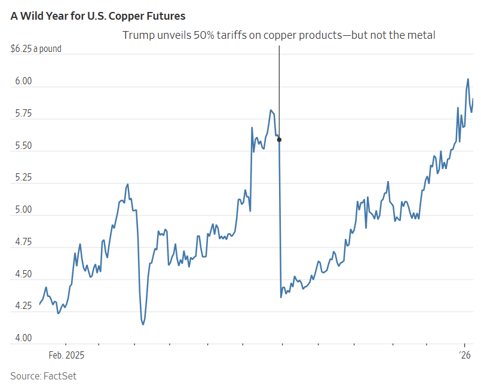
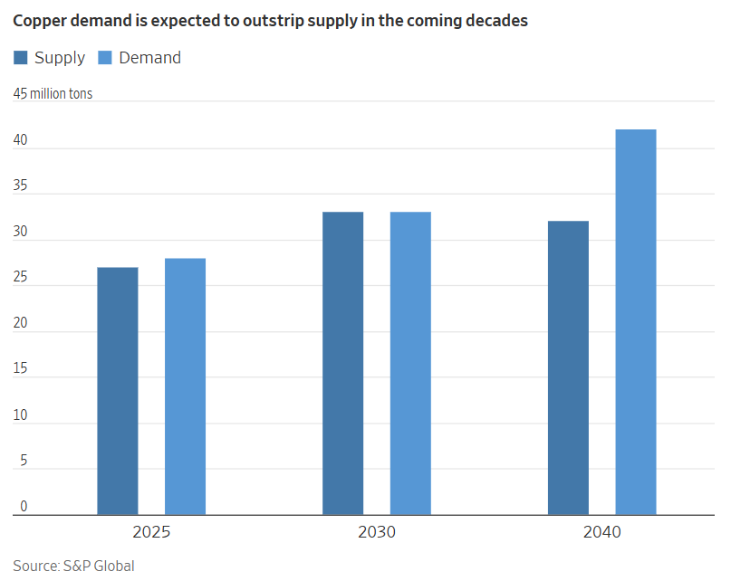

## 力拓與嘉能可的合併談判凸顯了銅需求的成長，而人工智慧在某種程度上推動了這一成長。

[阿利斯泰爾·麥克唐納](https://www.wsj.com/news/author/alistair-macdonald)

[艾德·巴拉德](https://www.wsj.com/news/author/ed-ballard)

2026年1月10日 上午7:00 ET

預計銅的需求將超過供應。 Dhiraj Singh/彭博新聞社

銅的需求激增，推動了一系列礦業巨頭的收購交易，各方爭相獲取這種對人工智慧至關重要的金屬。

力拓和[嘉能可](https://www.wsj.com/market-data/quotes/UK/XLON/GLEN) [GLEN -2.33 %減少；紅色向下三角形](https://www.wsj.com/market-data/quotes/UK/XLON/GLEN)週四晚些時候，他們表示正在洽談[創建全球最大的礦業公司](https://www.wsj.com/business/glencore-rio-tinto-restart-merger-talks-64a763ef?mod=article_inline)，市值超過 2,000 億美元。

推動這些談判以及近期一系列實際發生的和未遂的併購案的，是銅價。由於擔心對這種「紅色金屬」的需求將超過供應，以及對關稅的持續擔憂，美國銅價[週一創下歷史新高。](https://www.wsj.com/finance/commodities-futures/u-s-copper-prices-set-first-record-since-summer-tariff-surge-7ccf2e82?mod=article_inline)

銅的用途十分廣泛，包括管道、電路板和電線。它作為導電材料的特性使其成為人工智慧革命的關鍵動力來源。電動車和太陽能等再生能源的日益普及，以及國防開支中銅含量高的彈藥和其他武器裝備的增加，都推動了銅的需求成長。

展望未來，預計新增供應量將無法跟上激增的需求。

[根據標普全球](https://www.wsj.com/market-data/quotes/SPGI)的預測，除非礦商增加產量，否則 到 2040 年，需求將比供應高出 25%，即 1,000 萬噸。

標普全球副董事長丹尼爾·耶金本週在一份報告中表示：“關鍵在於銅是繼續成為進步的推動者，還是成為成長和創新的瓶頸。”

11 月，美國地質調查局將銅列入對國家安全和經濟至關重要的關鍵礦產清單，這項認定可能為聯邦政府提供援助以鼓勵生產打開大門。

美國銅價去年上漲了 41%，2026 年繼續上漲，週一在紐約收於每磅 5.9245 美元的歷史新高。

達成交易可以幫助礦商更快提高產量，比新建銅礦更快，因為新建銅礦可能需要數十年才能建成。現有礦山也面臨許多[挑戰，可能中斷生產](https://www.wsj.com/finance/commodities-futures/copper-surges-as-freeport-mine-accident-clouds-global-supply-outlook-df83dce2?mod=article_inline)。 

力拓與嘉能可重啟談判，是近期一系列以銅礦為主題的礦業[整合嘗試中的最新一起。去年，](https://www.wsj.com/finance/commodities-futures/mining-megadeal-shows-the-world-is-crazy-for-copper-3829316f?mod=article_inline)[英美資源集團](https://www.wsj.com/market-data/quotes/UK/XLON/AAL)同意與加拿大[泰克資源](https://www.wsj.com/market-data/quotes/CA/XTSE/TECK.B)公司合併，而業界領頭羊必和必拓曾試圖從中作梗。

「礦業巨頭併購案又回來了……在大多數情況下，擬議合併的關鍵在於銅，」傑富瑞分析師在給客戶的報告中寫道。

收購或合併其他擁有銅資產的公司會增加礦業公司對這種需求旺盛的金屬的曝險。他們也可能希望透過提高效率和增強財力來增加產量。但這些交易並不一定會促成對新礦的投資。

據經紀公司 Panmure Liberum 的分析師 Duncan Hay 稱，力拓和嘉能可的合併可能為後者開發資產提供更多資金，從而將更多銅推向市場。

嘉能可持有智利一座大型銅礦的股份，並在世界各地擁有其他銅礦資產。上個月，該公司[公佈了提高產量的計劃](https://www.wsj.com/business/glencore-targets-annual-copper-production-of-1-6-million-tonnes-by-2035-078b8c2d?mod=article_inline)，其中包括重啟阿根廷的一座銅礦。

力拓的銅業務包括猶他州的肯尼科特銅礦和亞利桑那州一個長期延誤的項目，該項目投產後可滿足美國四分之一的工業金屬需求。

據傑富瑞稱，合併後，銅的收益將占公司總收益的 36%，使其成為該公司最大的業務，並超過了鐵礦石業務，而鐵礦石業務曾使力拓成為世界兩大礦業公司之一。

標普全球預測，到 2040 年，銅的需求量將增加至 4,200 萬噸，比目前水準增加 50%。

人工智慧的興起正在推動金屬需求激增。耗電量龐大的伺服器機房需要大量的導電金屬。根據彭博新能源財經（BloombergNEF）的研究顯示，未來十年，資料中心將需要超過430萬噸金屬。這相當於全球最大金屬供應國智利一年的供應量。

脫碳和國防需求也在支撐價格。基準礦業情報公司估計，光是電動車的需求就將從2025年的130萬噸增加到2030年的230萬噸。 

分析師表示，創紀錄的國防開支和彈藥儲備的補充也可能推高需求。白宮稱，銅是國防部第二大常用材料，它被用作彈藥彈殼及其他用途的合金。

同時，川普總統可能加徵關稅的前景加劇了銅市場的波動。由於美國進口商大量囤積銅礦以應對白宮暗示可能出台的新關稅，銅價因此上漲。然而，高盛分析師本週表示，他們預計關稅政策的明朗化將減少庫存，並對銅價構成壓力。

另一個可能影響需求的因素是中國經濟的任何疲軟，中國經濟約佔全球消費的一半。

Panmure Liberum 的 Hay 表示：“過去 10 年左右的主要需求驅動力來自中國——而這種成長勢頭已經放緩。”