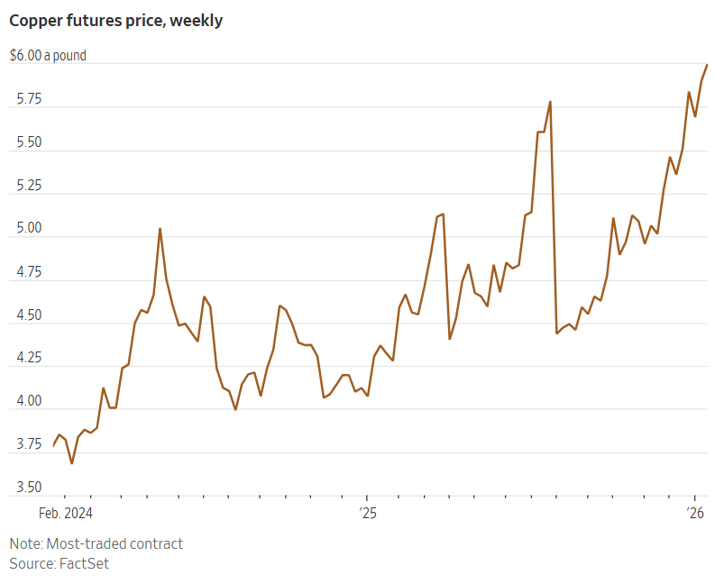

## 這種銅由力拓集團在亞利桑那州利用細菌和酸生產，將用於資料中心建設。

[瑞安·德澤姆伯](https://www.wsj.com/news/author/ryan-dezember)

/ 攝影：Mark Lipczynski，刊登於《華爾街日報》

2026年1月15日 上午5:45 ET

卡車將岩石運送到亞利桑那州 Gunnison Copper 公司的 Johnson Camp 礦場進行破碎和浸出，以便從中提取銅。

### 

快速概要

- 亞馬遜網路服務與力拓旗下的 Nuton 合資企業達成了為期兩年的銅供應協議，銅源來自亞利桑那州的一座礦山，用於支援人工智慧資料中心。
    
- Nuton 計畫利用細菌和酸從低品位礦石中提取銅，從而在減少能源和水資源消耗的同時，為國內市場提供銅供應。
    
- 預計到 2040 年，人工智慧對銅的需求將成長 50%，這可能導致 25% 的供應缺口和系統性經濟風險。

[亞馬遜網站](https://www.wsj.com/market-data/quotes/AMZN) [AMZN 0.65 %增加；綠色向上指向三角形](https://www.wsj.com/market-data/quotes/AMZN)為了滿足其資料中心對這種工業金屬的巨大需求，該公司正轉向亞利桑那州的一座礦山，該礦山去年成為十多年來美國第一個新的銅礦來源。

[該礦重新開採，作為力拓集團旗下](https://www.wsj.com/market-data/quotes/RIO)[RIO公司](https://www.wsj.com/market-data/quotes/RIO)的試驗場。  [0.55 %增加；綠色向上指向三角形](https://www.wsj.com/market-data/quotes/RIO)一種開採低品位銅礦的新方法。力拓集團與亞馬遜網路服務公司簽署了為期兩年的供應協議，這無疑是對其旗下Nuton合資企業的信心證明。 Nuton利用細菌和酸從先前加工成本過高的礦石中提取銅。

亞馬遜的這項舉動是科技公司爭相取得建造和營運人工智慧資料中心所需的 [電力](https://www.wsj.com/business/energy-oil/ai-data-centers-desperate-for-electricity-are-building-their-own-power-plants-291f5c81?mod=article_inline)和關鍵材料的最新例證。

Nuton 銅材只能滿足亞馬遜的一小部分需求。 

每個最大的資料中心都需要數萬噸銅，用於其中所有的電線、母線、電路板、變壓器和其他電氣元件。

力拓預計亞利桑那州努頓計畫將在四年內產出 14,000 公噸陰極銅，但這還不足以滿足其中一家工廠的需求。

在約翰遜營礦場，一排排起始片從化學溶液中收集純銅。

[力拓集團最近在圖森東部一座礦山](https://www.wsj.com/finance/commodities-futures/can-arizona-miners-unleash-an-american-copper-boom-982638ff?mod=article_inline)的重啟項目中應用了其生物浸出工藝，並已與合作夥伴計劃將該技術推廣至美洲其他幾座礦山。此舉旨在開採老礦山遺留的低品位礦石，對於力拓集團在當前新礦山投產難度空前高漲、銅需求卻激增的情況下提升產量至關重要。

資料中心建設、電網升級、電動車和再生能源設施建設對銅的需求不斷增長，已經彌補了週期性製造業和建築業（銅用於管道和電線）需求放緩的影響。 

本月，倫敦和紐約的銅價都[創下歷史新高](https://www.wsj.com/finance/commodities-futures/u-s-copper-prices-set-first-record-since-summer-tariff-surge-7ccf2e82?mod=article_inline)，銅期貨去年上漲了 41%，最近幾天更是首次突破每磅 6 美元大關。 

美國物價可能還會進一步攀升。白宮表示，正在考慮在川普總統夏季對銅製品（例如電線和管道）徵收的[50%進口稅的基礎上，加徵其他關稅。](https://www.wsj.com/finance/commodities-futures/trump-just-crashed-the-copper-market-43ffff25?mod=article_inline)

礦業高層、分析師和經濟預測人士警告稱，銅短缺可能會破壞人工智慧的繁榮，而人工智慧的繁榮推動了股市上漲，並成為美國經濟成長的[主要驅動力](https://www.wsj.com/tech/ai/how-the-u-s-economy-became-hooked-on-ai-spending-4b6bc7ff?mod=article_inline)。 

平均而言，一座新礦從發現到投產需要二十多年時間。儘管價格上漲可能會促進[銅的回收利用](https://www.wsj.com/finance/commodities-futures/your-junk-is-needed-for-the-new-electric-era-504a7e8f?mod=article_inline)，並促使工程師減少各種應用所需的銅用量，但巨大的供應缺口即將到來。

標普全球上週發布的一項研究估計，到 2040 年，人工智慧將幫助銅需求比目前水準提高 50%，而採礦產量將減少，導致 25% 的缺口。

廣告

該研究的作者寫道：“這種新出現的差距對全球產業、技術進步和經濟成長構成系統性風險。” 

力拓集團的高層對新礦審批耗時過長感到沮喪，因為他們決定嘗試將公司科學家在實驗室中經過數十年不斷改進的 Nuton 技術商業化。 

這家英澳礦業公司在亞利桑那州東南部找到了一個隨時可以開工的地點。此前，由於前任所有者在 2010 年停止了露天礦的挖掘工作，  [Gunnison Copper 的Johnson Camp 礦一直由少量工作人員維持運營，以確保其符合許可證要求。](https://www.wsj.com/market-data/quotes/CA/XTSE/GCU)

前任礦主開採到的低品位礦層，被他們認為不值得開採，而力拓希望透過 Nuton 公司開採的正是這種原生硫化物礦石。 

礦石在團聚機中被細菌和酸包裹，然後堆放在浸出墊上，銅溶液從浸出墊中滴出。

該公司估計，全球 70% 的銅儲量都蘊藏在這類礦石中，但其濃度往往不值得花費成本將其磨成粉末並運往海外進行冶煉和精煉。

在約翰遜礦場，礦石經過細菌和酸的浸漬後堆放成堆，銅從堆中滴落到加工廠，在那裡被電鍍到可直接使用的陰極上。第一批紐頓陰極[於12月生產](https://www.wsj.com/livecoverage/stock-market-today-dow-sp-500-nasdaq-12-04-2025/card/rio-tinto-s-bacterial-nuton-venture-produces-its-first-copper-8GRjJ3Ns24WXw5xdWj8M?mod=article_inline)。 

力拓銅業首席執行官凱蒂·傑克遜表示：“我們不僅加工了那些原本不具備經濟效益的礦石，而且還以更低的碳排放和更低的用水量完成了加工。很高興看到有客戶將這一點視為我們價值主張的一部分。”

#### 分享你的想法

_你認為力拓及其在亞利桑那州的礦商能夠掀起美國銅礦熱潮嗎？歡迎在下方參與討論。_

儘管川普一直在推翻其前任為促進再生能源生產和減少溫室氣體排放所做的努力，但包括亞馬遜在內的大公司仍在繼續追求更清潔的能源並減少碳排放。

亞馬遜全球碳排放總監克里斯·羅伊表示：“我們從商品層面著手，尋找低碳解決方案來推動業務增長。這意味著鋼鐵、混凝土，以及數據中心絕對離不開的銅。”

羅伊表示，這些銅將被輸送給為亞馬遜資料中心生產組件的公司。 

作為協議的一部分，亞馬遜將向力拓提供雲端運算和數據分析，以優化 Nuton 的礦石回收率，並幫助這家礦業公司擴大生產。