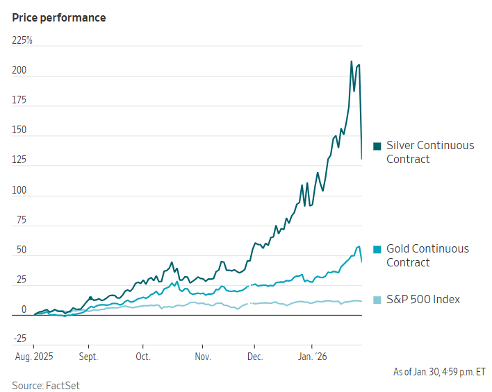

## 華爾街認為川普提名的聯準會主席候選人對通膨和美元持鷹派立場。

[大衛烏貝蒂](https://www.wsj.com/news/author/david-uberti)

2026年1月30日 下午5:03 ET

白銀價格暴跌31%。 阿科斯·斯蒂勒/彭博新聞社

### 

快速概要

-  白銀價格暴跌 31%，創下自 1980 年 3 月以來的最大跌幅，2 月期貨結算價為每盎司 78.29 美元。
    
- 近月黃金期貨暴跌 11%，至每盎司 4,713.90 美元，創下自 1980 年 1 月以來最大單日跌幅。
    
- 先前有報導稱，川普總統提名以鷹派立場著稱的凱文沃許擔任聯準會主席，隨後股市下跌。

週五的劇烈拋售導致白銀價格暴跌，黃金期貨價格創下有史以來最大的單日美元跌幅，這是貴金屬價格像網路迷因股票一樣劇烈波動的最新一輪瘋狂交易。 

數月來，一股反常的上漲行情將黃金和白銀價格推至歷史新高，吸引了眾多投機者，也引發了全球投資者對美元等傳統貨幣失去信心的擔憂。從週四晚間開始，這股上漲動能終於消退。 

股價下跌始於有報稱川普總統將提名聯準會前理事凱文沃許接替傑羅姆鮑威爾擔任聯準會主席前後。沃什歷來更關注高通膨而非低成長，這緩解了華爾街對聯準會屈服於川普降息壓力的擔憂。 

近幾個月來，投資人擔心美元在高通膨時代的未來，紛紛湧入貴金屬市場，推動了[華爾街所謂的「貶值交易」](https://www.wsj.com/finance/commodities-futures/a-new-wall-street-trade-is-powering-gold-and-hitting-currencies-62a61fdb?mod=article_inline)。 

週五上午，川普確認沃什的提名後，美元兌其他貴金屬走強，創下數月來最高單日漲幅。隨後，從各國央行到地下金庫再到華爾街交易台，貴金屬市場迅速下跌，令投資人措手不及。 

SLC Management董事總經理德克·穆拉基表示：“沃什的立場偏鷹派，這降低了貨幣貶值的風險，也讓貨幣政策回歸有序。” 

[白銀價格暴跌31%，創下1980年3月亨特兄弟](https://www.wsj.com/finance/commodities-futures/herbert-hunt-billionaire-silver-market-dies-at-95-4d73913a?mod=article_inline)操縱市場企圖失敗以來的最大跌幅。 2月期貨合約週四收在每盎司114美元以上，隨後結算價跌至每盎司78.29美元。此次下跌幅度——35.747美元——與今年6月的白銀價格大致相當。 

近月黃金期貨暴跌 11%，至每盎司 4,713.90 美元，創下自 1980 年 1 月以來最大單日跌幅。 

這些舉措重創礦業股，拖累標普500指數下跌0.4%。道瓊工業指數也下跌0.4%，即179點，那斯達克指數下跌0.9%。

一些分析師認為，週五的回調是黃金和白銀在經歷了一輪令人眼花繚亂的上漲後，對太陽能電池板製造商和汽車零件製造商等工業用戶而言急需的調整。儘管如此，這兩種金屬的價格在1月仍大幅上漲。

週五，分析師表示，月底獲利了結的短期交易員或為避免股市突然下跌的影響而採取的措施，也可能加劇了拋售潮。

BullionVault研究主管阿德里安·阿什表示：“簡而言之，我不知道。沒人知道。我入行20年了，從未見過像現在這樣的市場。”

BullionVault是一家貴金屬交易平台，其約125,000名客戶在倫敦和紐約等金融中心的金庫網路中持有超過100億美元的資產。 Ash表示，1月份是該公司新客戶數量最多的一個月，甚至超過了雷曼兄弟倒閉或新冠疫情等危機時期。 

不過，阿什否認了中國及其他地區個人投資者週五突然撤資的可能性。他反而指出，銅等基本金屬也出現了類似的異常波動。銅是電纜、管道等行業的重要原料，其期貨價格週五下跌了4.5%。

阿什說：“人們很容易只關注黃金和白銀，就說這是零售業的狂熱。但基本金屬市場並沒有零售參與。” 

市場規模相對較小，這意味著大投資者的任何推動或拉動都可能引發價格的劇烈波動，從而增加了任何特定走勢的神秘性。 

「金屬——說實話，我完全不知道，」匯豐銀行首席多元資產策略師馬克斯·凱特納表示。

他指出，近幾個月來黃金價格呈拋物線式上漲，最近一度突破每盎司5600美元，並補充道：“流動性不足。金價上漲了。憑什麼上漲？”