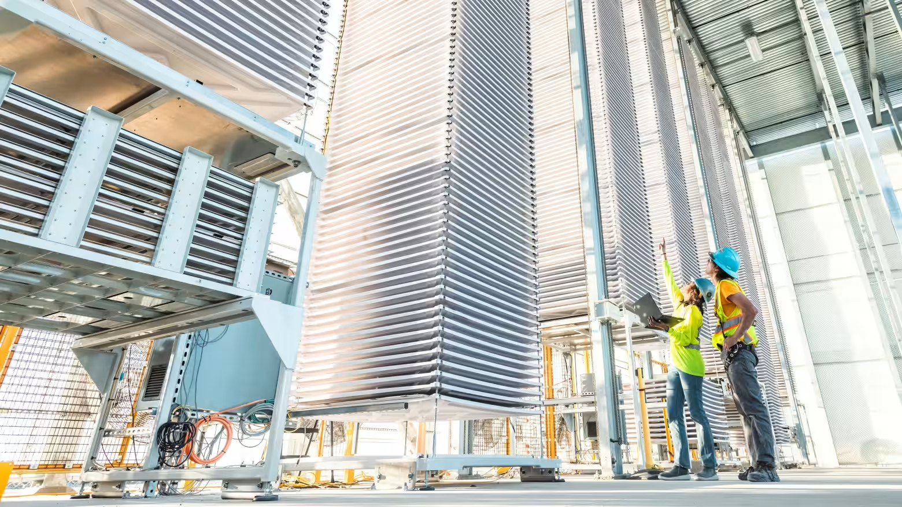
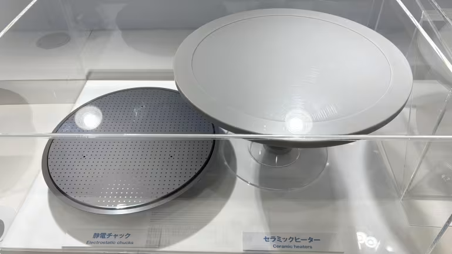
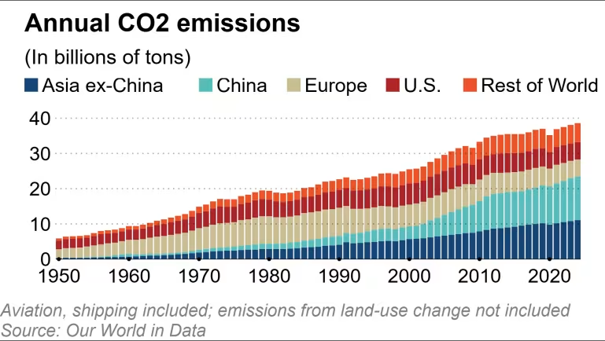

https://asia.nikkei.com/business/technology/japan-s-exhaust-filter-expertise-attracts-carbon-capture-attention

這是一篇充滿前瞻性且與日本產業轉型息息相關的深度報導。它揭示了**「直接空氣捕獲 (DAC)」**如何從一個昂貴的氣候概念，轉變為日本製造業（特別是汽車供應鏈）的下一根救命稻草。

以下是針對這篇 Nikkei Asia 報導的新聞分析：

### 新聞分析：日本廢氣過濾技術成碳捕獲 (DAC) 關鍵，Heirloom 尋求日本供應鏈支持

#### 1. 新聞履歷 (Metadata)
* **標題：** 日本的廢氣過濾技術吸引碳捕獲領域的關注 (Japan's exhaust filter tech draws carbon capture interest)
* **來源/作者：** Nikkei Asia / Mitsuru Obe (名古屋)
* **發布時間：** 2025年12月9日 14:41 JST
* **關鍵詞：** Heirloom Carbon Technologies、NGK Insulators (日本礙子)、直接空氣捕獲 (DAC)、石灰石 (Limestone)、三菱重工 (MHI)、100美元/噸目標

---

#### 2. 核心摘要 (Executive Summary)
本報導探討了美國頂尖碳捕獲新創公司 **Heirloom Carbon Technologies** 如何將目光轉向日本，尋求利用日本精湛的製造工藝來降低 DAC 的成本。

* **Heirloom 的日本戰略：**
    Heirloom 正在美國建設能去除 100 萬噸 CO2 的商業工廠，執行長 Shashank Samala 認為日本企業擅長「持續改進 (Kaizen)」和「成本優化」，這正是 DAC 行業目前最需要的。他將 DAC 視為日本繼汽車之後的下一個出口支柱產業。目前已有 6 家日本公司投資 Heirloom。

* **NGK 的轉型機遇：**
    全球最大的汽車廢氣過濾器製造商 **NGK Insulators** 正面臨電動車普及帶來的生存危機（其 60% 營收來自燃油車過濾器）。NGK 發現其**陶瓷蜂窩結構技術**能完美應用於 DAC 過濾器。NGK 已向 30 家 DAC 公司提供樣品，目標在 2030 年量產 DAC 過濾器，以此抵銷汽車業務的衰退。

* **供應鏈整合：**
    Heirloom 正在構建一個豪華的日本供應鏈聯盟：
    * **過濾器/隔熱：** NGK Insulators。
    * **壓縮機/電氣：** 日立 (Hitachi)。
    * **傳感器：** 大金 (Daikin)。
    * **工程服務：** 千代田化工 (Chiyoda)。
    * **融資/承購：** 三菱商事、三井物產。

* **成本挑戰與目標：**
    目前 DAC 成本高達「數百美元/噸」，Heirloom 的長期目標是降至 **100 美元/噸**。這需要通過規模化和技術優化來實現。相比之下，專注於點源捕獲（Point Source Capture）的**三菱重工 (MHI)** 因成本考量對 DAC 持保留態度，這反映了行業內對 DAC 商業可行性的分歧。

#### 3. 深度架構分析：技術轉移解碼 (Structural Analysis: Technology Transfer Decoding)
這篇文章揭示了一個經典的**「技術溢出 (Technology Spillover)」**案例——從夕陽產業（燃油車）流向朝陽產業（氣候科技）。

**A. 陶瓷蜂窩體 (Ceramic Honeycomb) 的降維打擊**
* **原理解析：** 汽車觸媒轉化器中的陶瓷載體，具有極高的表面積（蜂窩狀）和耐熱性（承受引擎廢氣）。
* **DAC 應用：** Heirloom 的技術需要將石灰石加熱到 900°C 以釋放 CO2（再生過程）。NGK 的陶瓷技術正好能承受這種高溫，且其蜂窩結構能最大化空氣與吸附劑的接觸面積。
* **戰略意義：** NGK 不需要從頭研發，只需將現有的汽車產線進行「微調 (Retrofit)」。這極大降低了 DAC 關鍵組件的資本支出 (CAPEX)，是實現 100 美元/噸目標的關鍵拼圖。

**B. Heirloom 的「石灰循環」技術路徑**
* 
* **機制：**
    1.  **碳酸化 (Carbonation)：** 氫氧化鈣 (Ca(OH)2) + CO2 -> 碳酸鈣 (CaCO3) [在大氣中自然發生]。
    2.  **煅燒 (Calcination)：** 將碳酸鈣加熱至 900°C -> 氧化鈣 (CaO) + 純 CO2 [收集]。
    3.  **水合 (Hydration)：** 氧化鈣 + 水 -> 氫氧化鈣 [循環使用]。
* **優勢：** 原料（石灰石）極其便宜且豐富，不像 Climeworks 需要昂貴的胺類吸附劑。唯一的成本瓶頸是**加熱能源**和**設備折舊**。這也是為什麼它需要日本的工程能力來優化熱效率。

**C. 日本商社的「碳信用」佈局**
* 三菱商事和三井物產的介入並非單純投資，而是為了**「承購協議 (Offtake Agreements)」**。
* **邏輯：** 它們先出錢幫 Heirloom 蓋廠，換取未來的「碳移除信用 (Carbon Removal Credits)」。然後將這些高質量的信用轉賣給需要淨零排放的日本鋼鐵、航空企業。這是在建立未來的碳交易貨幣儲備。

---

#### 4. 潛在調查方向 (Areas for Further Investigation)

1.  **NGK 的產能轉換率：**
    * NGK 宣稱產線可快速改造。調查其位於名古屋或波蘭的工廠，是否有實際的 DAC 試產線正在運行？良率如何？這決定了 2030 年量產目標的可信度。

2.  **Heirloom 的能源來源：**
    * 加熱到 900°C 需要大量能源。Heirloom 在墨西哥灣的工廠是使用天然氣（需搭配 CCS）還是再生能源？如果是前者，其「淨移除率」會打折；如果是後者，成本會更高。

3.  **三菱重工 (MHI) 的態度轉變：**
    * MHI 是全球碳捕獲霸主（市佔率 70%），但專注於煙囪捕獲。如果 DAC 成本真的降到 100 美元，MHI 是否會被迫併購相關新創（如 Heirloom）以防被顛覆？

4.  **政策補貼的依賴度：**
    * 美國《通膨削減法案 (IRA)》為 DAC 提供高達 **180 美元/噸** 的稅收抵免 (45Q)。如果川普政府廢除或縮減 IRA，Heirloom 的商業模型是否會瞬間崩塌？這是最大的政治風險。