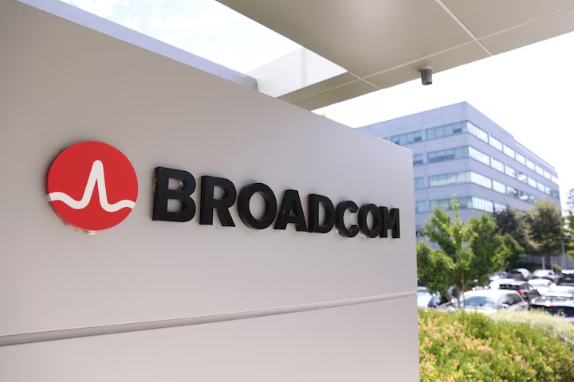

https://www.cispe.cloud/cispe-challenges-eu-commissions-defence-of-broadcom-vmware-merger/

這份來自 **CISPE (歐洲雲基礎設施服務供應商協會)** 的新聞稿，比起一般的情緒性控訴，更像是提供了一份**「財務與商業邏輯的起訴書」**。對於投資人而言，這份文件最有價值的地方在於它揭露了 Broadcom 併購案背後的**財務槓桿**與**獲利承諾**，這直接解釋了為何 Broadcom 會採取如此激進的定價策略。

以下是這份新聞稿中值得注意的關鍵點分析：

### **1. 揭露了 Broadcom 的「獲利魔術」：EBITDA 目標與市場成長的脫節**

CISPE 抓住了一個核心矛盾點，這也是 Broadcom 商業邏輯中最赤裸的部分：

- **CEO 的公開承諾：** Broadcom 承諾在併購後三年內，將 VMware 的 EBITDA（稅息折舊及攤銷前利潤）從 **47~50 億美元** 提升至 **85 億美元**。
    
- **市場現實：** 該市場的年自然成長率僅為 **5~8%**。
    
- **推論：** 要在一個低成長市場中實現 **60~80%** 的獲利跳升，靠「自然成長」或「效率提升」是不可能的。CISPE 認為這證明了 Broadcom 從一開始就打算透過**大幅漲價**和**強制綑綁銷售**來收割 VMware 的鎖定客戶（Locked-in customers）。
    

### **2. 財務結構的「逼債」壓力 (Financial Leverage)**

新聞稿點出了這筆交易的融資結構，這為 Broadcom 的激進策略提供了「動機」：

- **鉅額債務：** 為了這筆 610 億美元的交易，Broadcom 舉借了約 **284 億美元** 的新債，並承擔了 VMware 原有的 **80 億美元** 債務。
    
- **現金流壓力：** 這種高槓桿結構創造了強大的財務動機，迫使 Broadcom 必須**快速從 VMware 的客戶群中榨取現金**來償還債務並維持股價。這解釋了為什麼他們沒有時間進行溫和的過渡，而是選擇「休克療法」。
    

### **3. 監管機構的「失職」指控**

CISPE 的法律論點在於歐盟執委會（European Commission）犯了程序與判斷上的錯誤：

- **無視公開風險：** 儘管 Broadcom 管理層已經公開表明了上述的 EBITDA 目標（暗示了漲價），且客戶與產業協會已發出警告，但監管機構在審查時竟然**完全未提及** Broadcom 利用市場支配地位漲價的風險，也未設立任何保護措施（Safeguards）。
    
- **「空白支票」：** CISPE 秘書長形容歐盟的批准就像是給了 Broadcom 一張「空白支票」，讓他們可以肆無忌憚地勒索客戶。
    

### **4. 潛在的「核彈級」後果 (The Nuclear Option)**

如果 CISPE 在歐洲普通法院（General Court）勝訴，後果將非常嚴重：

- **撤銷批准 (Annulment)：** 法院若撤銷批准，歐盟執委會必須**根據「當前」的市場條件重新審查**這筆交易。
    
- **法律泥沼：** 這將重新打開關於 VMware 業務價值、結構和整合的監管風險。對於 Broadcom 的股東、債權人和供應商來說，這將創造巨大的**法律不確定性**，甚至可能面臨拆分或鉅額罰款的風險。
    

---

### **投資專家解讀：對您的投資有何啟示？**

這份文件驗證了我們之前的分析，但提供了更具體的數據支撐：

1. **Broadcom 的漲價是「不得不為」：** 看到那 360 多億美元的債務和翻倍的 EBITDA 承諾，您就能理解為什麼 Broadcom 對客戶如此強硬。這不是單純的傲慢，而是**財務模型運作的必然結果**。
    
2. **法律風險的「尾部風險 (Tail Risk)」：** 雖然併購案被推翻的機率極低，但這份訴訟邏輯嚴密（抓住了獲利承諾與市場成長的矛盾）。如果法院真的受理並判決重審，這將是 Broadcom 股價的**極大黑天鵝**。
    
3. **觀察指標：** 投資人應關注 Broadcom 是否能如期達成那 **85 億美元的 EBITDA 目標**。如果達成了，代表收割策略成功，股價將有支撐；如果因為客戶流失（如 CISPE 成員的出走）而未達標，那麼高槓桿的副作用就會開始反噬股價。

		https://www.reuters.com/legal/litigation/eu-antitrust-regulators-erred-clearing-broadcoms-vmware-deal-cloud-industry-2025-12-11/ 

這則新聞反映了 **Broadcom (博通, AVGO)** 在收購 **VMware** 後，其激進的商業策略正在引發行業內的強烈反彈。作為投資專家，我們需要透過「法律訴訟」的表象，看到背後的「商業博弈」與「投資邏輯」。

以下是針對這則新聞的深度分析與投資解讀：

### **1. 為什麼會有這場訴訟？（商業動機解讀）**

這起訴訟表面上是 CISPE（歐洲雲基礎設施服務供應商協會）控告歐盟執委會「審查不周」，但實際上是**雲端業者對 Broadcom 漲價與授權模式改變的集體反撲**。

- **Broadcom 的劇本 (The Playbook)：** Broadcom 收購軟體公司（如之前的 CA, Symantec）後的一貫手法是：
    
    1. **漲價：** 大幅提高授權費。
        
    2. **轉訂閱制：** 強制從「買斷制 (Perpetual)」轉為「訂閱制 (Subscription)」。
        
    3. **綑綁銷售：** 將 VMware 的各項產品打包，迫使客戶全套買單。
        
- **CISPE 的痛點：** CISPE 成員（包含 AWS, Microsoft 等）是 VMware 的大客戶或合作夥伴。Broadcom 的新政策直接壓縮了雲端供應商的利潤空間，甚至讓他們難以轉嫁成本給終端用戶。這場訴訟是他們試圖透過監管力量來**增加談判籌碼**。
    

### **2. 對 Broadcom (AVGO) 的影響分析**

#### **A. 法律風險：極低 (Low Risk)**

- **交易已完成：** 這筆 690 億美元的交易早在 2023 年底就已完成交割。在反壟斷法實務中，要法院判定「拆分」一家已經合併兩年的公司（新聞時間點為 2025 年 12 月）難度極高，這通常被稱為「把蛋黃從煎蛋中分離出來 (Unscrambling the eggs)」。
    
- **時間成本：** 歐盟法院的判決通常耗時數年。屆時 Broadcom 早已完成對 VMware 的組織重整與客戶合約轉換。
    

#### **B. 財務影響：短多長空？**

- **短期（利多）：** Broadcom 的強硬作風雖然惹惱了客戶，但對股東來說，這代表**極強的定價權 (Pricing Power)** 和**現金流轉化能力**。只要客戶無法在短期內更換 VMware（因為虛擬化技術的轉換成本極高），Broadcom 就能持續榨出超額利潤。這也是為什麼 AVGO 股價在過去幾年表現強勢的原因之一。
    
- **長期（潛在隱憂）：** 如果 Broadcom 吃相太難看，會加速客戶（尤其是 AWS, Azure 這種有技術能力的巨頭）開發替代方案（如基於 KVM 的虛擬化技術）來「去 VMware 化」。這場訴訟就是客戶正在尋求「非商業手段」來抵抗的訊號。
    

### **3. 投資專家的觀點與建議**

針對這則新聞，您可以採取以下看法：

1. 視為「噪音」而非「利空」：
    
    這場訴訟不太可能導致併購案被推翻。市場通常會忽略這種滯後的法律挑戰，除非法院發出禁制令（機率極低）。
    
2. 驗證了 Broadcom 的護城河：
    
    CISPE 越是大動作抗議，越證明 VMware 在雲端基礎設施中的不可替代性。如果很容易換掉，他們早就換了，不需要去告歐盟。這反向印證了 Broadcom 手握核心資產。
    
3. 關注「客戶流失率 (Churn Rate)」：
    
    與其擔心官司，不如關注 Broadcom 未來幾季的財報中，軟體部門的營收成長是否開始放緩。如果客戶真的因為漲價而大量流失，那才是基本面轉壞的開始。
    

總結：

這則新聞反映了 Broadcom 作為「利潤收割機」的本色。對投資人而言，只要 Broadcom 能繼續交出高毛利的財報，這類行業抱怨與訴訟只會被視為其強大議價能力的證明，而非賣出訊號。 但需留意長期是否會因「壓榨過度」而導致生態系崩解。

## 為何CISPE 在勝算不高的情況下仍要提起告訴呢?

這是一個非常精準的商業策略問題。作為投資專家，我們常說**「法律戰往往是商業談判的延伸」**。

雖然在法律層面上，要讓歐盟普通法院（General Court）推翻歐盟執委會（European Commission）的決策難度極高（門檻很高，且 Broadcom 併購已完成），但 CISPE 提起訴訟的動作背後，其實有著精算的**「商業與政治算計」**。

即便勝訴機率不高，CISPE 仍要提告的主要原因有以下四點：

### **1. 增加談判籌碼：以戰逼和 (Leverage for Settlement)**

這是最核心的動機。

- **現狀：** Broadcom 目前對客戶採取的是「不接受就拉倒（Take it or leave it）」的強硬態度，因為客戶被技術鎖定（Vendor Lock-in），沒有談判空間。
    
- **訴訟的作用：** 透過法律訴訟，CISPE 創造了一個**「尾部風險（Tail Risk）」**。雖然法院判決「拆分」或「無效」的機率很低，但這是一個**「發生機率低，但後果毀滅性（Nuclear）」**的事件。
    
- **目的：** 為了消除這個法律不確定性，Broadcom 可能會被迫在商業條款上讓步（例如：給予 CISPE 成員較長的緩衝期、較低的漲價幅度，或特定的授權豁免），以換取 CISPE 撤訴。這是一種「以小博大」的策略。
    

### **2. 對監管機構施壓：要求更嚴格的執法 (Regulatory Pressure)**

CISPE 的訴狀不僅是針對 Broadcom，更是直接打臉歐盟執委會（EC），指責其「評估錯誤」且給了「空白支票」。

- **政治目的：** 這會讓歐盟執委會在面子上掛不住。為了證明自己沒有失職，歐盟後續可能會對 Broadcom 的**「併購後行為（Post-merger conduct）」**進行更嚴格的監控。
    
- **實質效益：** 如果 Broadcom 未來有任何涉及壟斷的行為（如不公平定價、拒絕互通），歐盟監管機構在壓力下會更傾向於迅速介入調查或罰款。這變相為雲端業者設下了一道防線。
    

### **3. 拖延與幹擾：阻礙 Broadcom 的「收割」速度**

Broadcom 的財務模型建立在「快速漲價、快速償債」的基礎上（如前述新聞稿提到的高槓桿與 EBITDA 目標）。

- **干擾戰術：** 訴訟會帶來法律程序的負擔，並讓 Broadcom 的管理層分心。更重要的是，這會讓 Broadcom 的客戶群（CIO 們）產生觀望心態：「既然還有官司，我是不是可以先不簽長約？」
    
- **效果：** 只要能延緩客戶簽約的速度，就會打亂 Broadcom 的現金流預測，進而對其股價或償債計畫造成壓力。
    

### **4. 鞏固協會地位：向會員（AWS/Microsoft）交代**

CISPE 是由亞馬遜（AWS）和微軟（Microsoft）等巨頭支持的遊說團體。

- **代理人戰爭：** AWS 和微軟作為大公司，直接出面告歐盟可能會破壞它們與監管機構的關係（畢竟它們自己也有反壟斷問題）。
    
- **角色分工：** 透過 CISPE 這個「協會」出面，既能表達強烈不滿，又能保持巨頭自身的優雅。CISPE 必須採取激進動作，才能證明其對付費會員的價值。
    

---

### **投資專家總結**

CISPE 的訴訟不是為了「贏官司」，而是為了**「贏得生存空間」**。

對投資人來說，這個動作的訊號意義在於：**Broadcom 的「快速漲價」策略已經遇到了有組織的抵抗。** 雖然這不太可能翻轉併購案，但可能會迫使 Broadcom 在未來幾季稍微放慢收割的速度，或是釋出部分利益來安撫重點客戶，這可能會些微影響原本市場對其獲利成長速度的樂觀預期。

## CISPE 的背景

了解 **CISPE** 的背景，您就會明白為什麼這場官司會由它出面，以及這背後精妙的「代理人戰爭」佈局。

### **1. CISPE 是什麼樣的機構？**

- **全名：** Cloud Infrastructure Services Providers in Europe（歐洲雲端基礎設施服務供應商協會）。
    
- **性質：** 它是一個非營利性的產業貿易協會，總部位於比利時布魯塞爾（歐盟權力中心）。
    
- **成員結構：**
    
    - 它主要代表歐洲本土的中小型雲端供應商（如法國的 OVHcloud, 義大利的 Aruba 等）。
        
    - **關鍵細節：** **亞馬遜 (AWS)** 和 **微軟 (Microsoft)** 也是該協會的成員（通常以「準會員」或合作夥伴身份參與）。
        
- **使命：** 表面上是推動歐洲雲端市場的公平競爭、數據保護和服務可攜性；實際上，它經常扮演「反壟斷看門狗」的角色，專門針對那些利用軟體授權優勢（如以前針對微軟，現在針對博通）來限制雲端硬體供應商的巨頭。
    

### **2. 為什麼是透過 CISPE 來提告？（背後的戰略意圖）**

這是一種高明的商業與政治策略，主要有三個原因：

#### **A. 「白手套」策略 (The Proxy War)**

- 如果由 **AWS** 或 **微軟** 直接出面控告歐盟執委會（EC），會顯得非常尷尬且政治不正確。畢竟這兩家美國巨頭自己在歐洲也面臨反壟斷調查，直接挑戰監管機構可能會引火上身。
    
- 透過 CISPE 這個「代表歐洲中小企業」的協會出面，可以將這場戰爭包裝成**「保護歐洲本土弱小業者」**的正義之戰，而非「美國科技巨頭之間的互毆」。這在歐盟法院更容易獲得同情。
    

#### **B. 集合受害者的聲音 (Collective Impact)**

- Broadcom 的漲價和授權變更，受傷最重的是那些沒有談判籌碼的中小型雲端商（他們原本依賴 VMware 搭建公有雲）。
    
- 單一家小公司去告博通或歐盟，力量微不足道。CISPE 將這 40 多家受害者的案例彙整起來（例如漲價 10 倍的證據），能形成更具毀滅性的法律證據鏈。
    

#### **C. 聚焦「歐洲利益」**

- CISPE 的論述核心是：「歐盟執委會的誤判，傷害了歐洲的數位主權與雲端產業競爭力。」這種論述直接切中歐盟政策制定的痛點，比單純的商業合約糾紛更有影響力。
    

### **3. 這是一個真實的告訴嗎？**

**是的，這是一個千真萬確且具法律效力的訴訟。**

- **案件性質：** 這不是一般的商業訴訟（告對方違約），而是**行政訴訟**。
    
- **提告對象：** 被告其實是 **歐盟執委會 (European Commission)**，指控其行政部門在審查博通併購案時「瀆職」或「判斷錯誤」。博通 (Broadcom) 則是作為利害關係人介入。
    
- **管轄法院：** 案件已提交至 **歐盟普通法院 (General Court of the European Union)**，這是歐盟體系下僅次於歐洲法院的第二高階法院。
    
- **目前的進度：** 根據最新的新聞稿，CISPE 已經提交了正式的法律回應（Rejoinder），反駁歐盟執委會的辯護。這表示案件已經進入了實質審理的攻防階段。
    

### **總結**

CISPE 的出面，代表這場反抗行動已經從「私下的商業抱怨」升級為「檯面上的政治與法律對決」。

雖然 AWS 和微軟躲在幕後，但他們透過 CISPE 提供了強大的資源與數據支持。這場官司即使最後沒能推翻併購案，也足以讓博通在歐洲市場面臨持續的監管高壓，甚至被迫在授權條款上做出讓步。