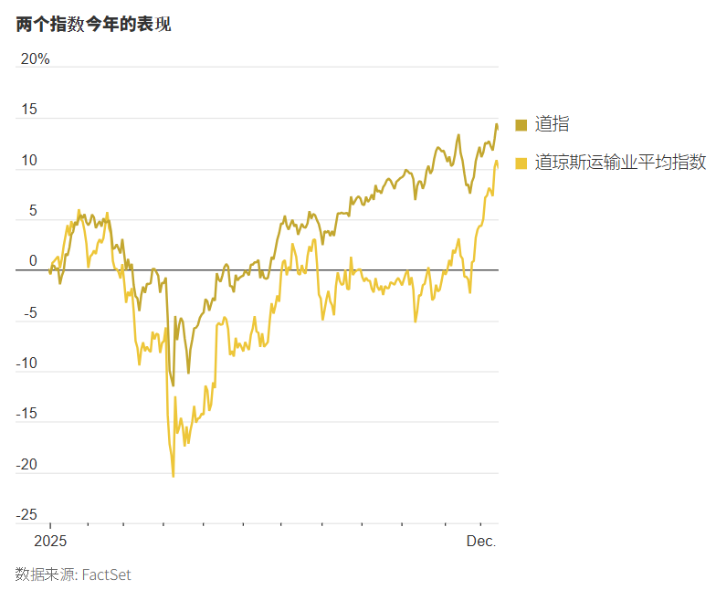
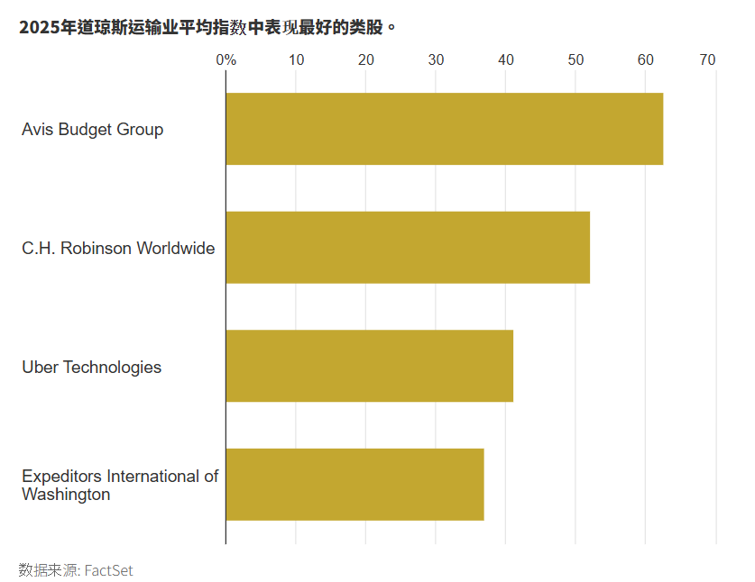

https://cn.wsj.com/articles/%E7%BE%8E%E5%9C%8B%E9%81%8B%E8%BC%B8%E8%82%A1%E9%AB%98%E6%AD%8C%E7%8C%9B%E9%80%B2%E7%82%BA%E4%BD%95%E5%B0%8D%E6%8A%95%E8%B3%87%E8%80%85%E6%98%AF%E5%80%8B%E5%A5%BD%E5%85%86%E9%A0%AD-0d3b9c96?mod=ct_markets

這是一份針對 **美國運輸類股 (Transports)** 強勁反彈現象的**投資銀行級情報簡報 (Investment Banking Grade Intelligence Briefing)**。

這篇報導提供了我們一直尋找的**「宏觀拼圖的最後一塊」**。雖然我們先前分析了製造業的疲軟（Trump Tariffs）和科技業的資本支出（Oracle/AI），但運輸股的全面爆發（Dow Theory 確認訊號）暗示著**實體經濟的韌性比預期更強**，或者說，**補庫存週期 (Restocking Cycle)** 已經悄然啟動。

---

### **新聞情報分析：道氏理論閃爍「買入訊號」——實體經濟拒絕衰退**

#### **1. 新聞履歷 (Metadata)**

- **標題：** 美國運輸股高歌猛進為何對投資者是個好兆頭 (U.S. Transport Stocks Rally is a Good Omen for Investors)
    
- **來源/作者：** WSJ / Krystal Hur
    
- **發布時間：** 2025年12月15日 12:02 CST
    
- **關鍵詞：** 道氏理論 (Dow Theory), 補庫存 (Restocking), C.H. Robinson, Delta Air Lines, 傑羅姆·鮑爾 (Jerome Powell), 就業數據修正 (Data Revision)
    

#### **2. 核心摘要 (Executive Summary)**

追蹤 20 家大型運輸公司的 **道瓊運輸業平均指數 (DJT)** 今年迄今上漲 10%，近期漲幅甚至超越那斯達克。這觸發了經典的 **「道氏理論 (Dow Theory)」** 牛市確認訊號。

- **市場訊號：** 道瓊工業指數 (DJIA) 創新高的同時，運輸指數 (DJT) 也逼近新高。這意味著**「製造出的商品（工業股）」正在被「運送出去（運輸股）」**，經濟增長是真實的，而非僅靠 AI 本夢比支撐。
    
- **領漲龍頭：** 漲幅驚人，顯示資金正在搶進週期性板塊。
    
    - **Avis Budget (租車)：** +63% (旅遊復甦 + 二手車價回穩)
        
    - **C.H. Robinson (物流)：** +52% (貨運量回升)
        
    - **Uber (叫車)：** +41% (服務業韌性)
        
- **潛在隱憂：** 雖然股價在漲，但 Fed 主席鮑爾警告**聯邦就業數據可能每月「高估」了 6 萬人**。這意味著運輸股押注的「軟著陸」基礎可能比想像中脆弱。

#### **3. 關鍵人物發言與立場矩陣 (Key Voice Matrix)**

| **人物/機構**         | **身分**            | **關鍵發言/觀點**                                   | **情報解讀**                                                                           |
| ----------------- | ----------------- | --------------------------------------------- | ---------------------------------------------------------------------------------- |
| **Ed Bastian**    | 達美航空 (Delta) CEO  | 「美國經濟基礎依然穩固，我們的客戶群財務狀況良好。」                    | **企業端確認。** 高端消費（航空旅行）依然強勁，尚未看到衰退跡象。                                                |
| **Jerome Powell** | 聯準會 (Fed) 主席      | 「聯邦數據可能每月高估就業增長多達 6 萬個...實際數字可能更接近每月減少 2 萬個。」 | **官方端預警（極重要）。** 這是一個巨大的**數據修正風險 (Data Revision Risk)**。如果就業其實是負增長，現在的消費股反彈就是「假突破」。 |
| **Matt Orton**    | Raymond James 策略師 | 「這真是一次相當強勁的反彈...經濟的堅挺程度遠超我們想像。」               | **華爾街共識。** 資金正在從「防禦性板塊」流向「週期性板塊」，這是牛市擴散的特徵。                                        |
| **FedEx**         | 物流巨頭              | 9月預測年收入將增長 4% 至 6%（夏季時曾不敢預測）。                 | **前瞻指引上修。** FedEx 是全球貿易晴雨表，其信心恢復意味著**B2B 補庫存活動**正在發生。                              |

#### **4. 深度架構分析 (Structural Analysis)**

**A. 道氏理論的現代驗證：庫存週期的反轉 (Inventory Cycle Turn)**

- **連結前文：** 我們在分析芝加哥聯儲古爾斯比 (Goolsbee) 反對降息時，提到了「中西部供應鏈異常」。
    
- **驗證：** **C.H. Robinson (+52%)** 的暴漲是關鍵證據。物流股通常在庫存週期從「去庫存 (Destocking)」轉向「補庫存 (Restocking)」時表現最好。
    
- **結論：** 儘管製造業 PMI 低於 50，但物流股的領先指標顯示，零售商為了應對潛在的關稅和 2026 年需求，正在**提前備貨**。
    

**B. Uber 的角色演變：運輸即服務 (Transportation as a Service)**

- **現象：** Uber 大漲 41%。
    
- **結構性意義：** 傳統道氏理論只看鐵路和卡車（運貨）。但在現代經濟中，**運人 (Uber/Delta)** 的權重越來越大。Uber 的訂單增長證明了「服務業通膨」雖然黏性高，但需求並未崩潰。這是支撐美國 GDP 不墜的另一隻腳。
    

**C. 鮑爾的「數據黑洞」風險 (The Data Black Hole)**

- **核心衝突：** 股市在漲（因為相信軟著陸），但鮑爾說數據可能造假（每月高估 6 萬人）。
    
- **情境推演：** 如果 2026 年初勞工部發布 **基準修正 (Benchmark Revision)**，確認 2025 年就業其實是負增長，那麼依賴「消費信心」的 **Avis (+63%)** 和 **Southwest (+22%)** 將面臨劇烈的估值回調。這是一個典型的**「Wile E. Coyote 時刻」**（跑到懸崖邊還沒掉下去）。
    

#### **5. 投資專家的行動建議 (Actionable Insights)**

1. **做多「物流 (Logistics)」優於「客運 (Passenger)」：**
    
    - **標的：** **C.H. Robinson (CHRW), FedEx (FDX)**, **Union Pacific (UNP)**。
        
    - **邏輯：** 根據庫存週期理論，補庫存是 B2B 行為，確定性較高。而客運（航空、租車）高度依賴消費者就業狀況。鑑於鮑爾對就業數據的警告，**物流股的風險回報比 (Risk/Reward) 優於航空股**。
        
2. **Avis (CAR) 的獲利了結機會：**
    
    - **觀察：** Avis 今年已上漲 63%。
        
    - **邏輯：** 租車股是高槓桿、高 Beta 的資產。如果 2026 年初經濟數據修正引發衰退恐慌，這類股票跌得最快。建議在歷史高點附近進行部分**獲利了結 (Take Profit)**，將資金轉移到防禦性更強的基礎設施股。
        
3. **關注「關稅搶運」的短期交易：**
    
    - **策略：** 在最高法院裁決川普關稅案之前，進口商會持續搶運貨物。這對 **海運貨代 (Freight Forwarders)** 是短期利多。
        

總結：

運輸股的大漲告訴我們：華爾街目前選擇「相信企業財報 (Delta/FedEx)」而「忽視宏觀數據的瑕疵 (鮑爾的警告)」。這是一個強大的牛市信號，但也埋下了未來數據修正時的震盪種子。

---

