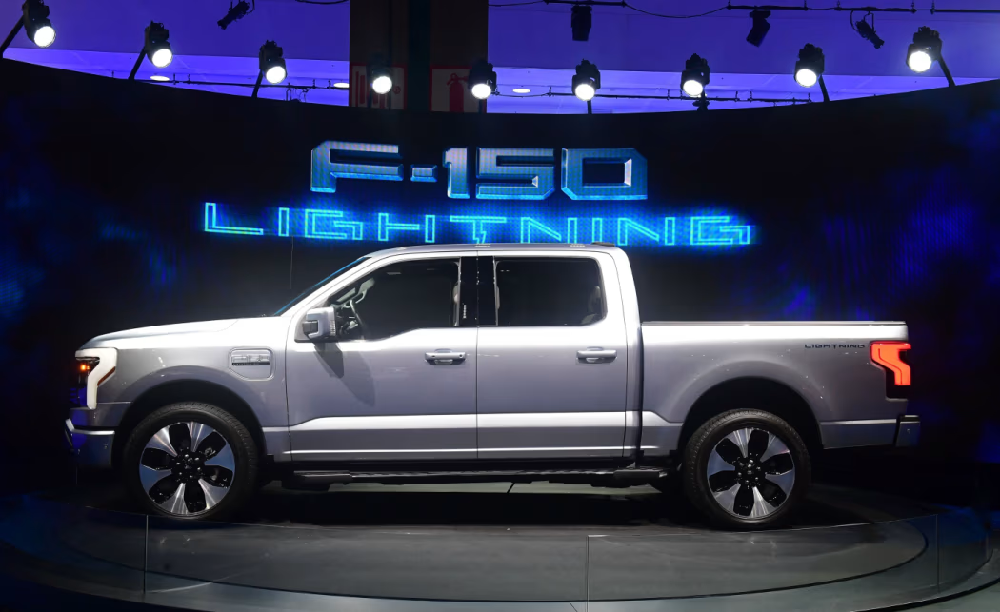

https://cn.wsj.com/articles/%E7%A6%8F%E7%89%B9%E8%A8%88%E6%8F%90195%E5%84%84%E7%BE%8E%E5%85%83%E6%B8%9B%E5%80%BC-%E9%9B%BB%E5%8B%95%E6%B1%BD%E8%BB%8A%E6%A5%AD%E5%8B%99%E9%81%AD%E9%81%87-%E6%BB%91%E9%90%B5%E7%9B%A7-2645dae4?mod=ct_hp_featst_pos5

這是一份針對 **Ford (F)** 2025年12月16日重大戰略轉向的**投資銀行級情報簡報 (Investment Banking Grade Intelligence Briefing)**。

這則新聞不僅是汽車產業的轉折點，更是我們之前討論的**「AI 基礎設施 (AI Infrastructure)」**與**「資本支出理性化 (CapEx Rationalization)」**主題的完美交匯。福特正在將原本要浪費在滯銷電動車上的電池產能，轉向此刻最飢渴的市場——**數據中心儲能**。

---

### **新聞情報分析：福特的「斷尾求生」—— 承認豐田是對的，並轉向 AI 能源戰場**

#### **1. 新聞履歷 (Metadata)**

- **標題：** 福特認賠 195 億美元，宣告第一代電動車戰略徹底失敗 (Ford takes $19.5B impairment, marks end of EV 1.0 era)
    
- **來源/作者：** WSJ / Sharon Terlep
    
- **發布時間：** 2025年12月16日 11:00 CST
    
- **關鍵詞：** 資產減值 (Impairment Charge), 增程式電動車 (EREV), SK Group, 固態電池存儲 (BESS), F-150 Lightning
    

福特在2021年11月的車展上展出的電動版F-150 Lightning皮卡。圖片來源：Frederic j. brown/Agence France-Presse/Getty Images
#### **2. 核心摘要 (Executive Summary)**

福特汽車宣布計提高達 **195 億美元** 的資產減值費用（主要針對 EV 業務），這是美國汽車史上最大的「認錯」行動之一。

- 戰略大轉彎： 1. 停產純電 F-150 Lightning： 承認大型純電皮卡因電池成本過高，「永遠不會賺錢」。
    
    2. 擁抱混動 (Hybrid) 與增程 (EREV)： 轉向豐田 (Toyota) 路線，與中國車企（如理想汽車）的增程技術路線靠攏。
    
    3. 終止 SK 合資項目： 認賠 60 億美元，停止與韓系電池廠 SK Group 的部分合作。
    
- **意外的亮點：** 位於肯塔基州的閒置電池工廠將轉型生產 **「固定式電池存儲 (Stationary Battery Storage)」**，專門供應給 **公用事業、風能開發商與 AI 數據中心**。
    
- **財務影響：** 雖然計提巨額虧損，但公司**上調**了全年調整後稅前利潤預測至 70 億美元（原為 60-65億），顯示止血後的盈利能力反而提升。
    

#### **3. 深度架構分析 (Structural Analysis)**

**A. 財務工程：教科書式的「洗大澡 (Big Bath)」**

- **操作邏輯：** CEO 吉姆·法利 (Jim Farley) 選擇在 2025 年底一次性認列所有爛帳 (Kitchen Sinking)。這 195 億美元是非現金支出 (Non-cash charge)，雖然難看，但能大幅降低未來的折舊攤提費用 (D&A)，美化 2026 年以後的財報數字。
    
- **估值重構：** 市場將不再把福特視為「虧損的 EV 成長股」，而是回歸到「高現金流的傳統車企 + 能源設備供應商」。這有助於其 P/E 估值修復。
    

**B. 產品路線：物理學的勝利 (The Physics Reality Check)**

- **F-150 Lightning 的失敗：** 證明了在現有電池能量密度下，拖著 3,000 磅重的電池跑長途皮卡是不符合物理經濟學的。
    
- **EREV (增程式) 的崛起：** 福特轉向 EREV（用小電池+汽油發電機），這實質上是**承認中國車企（如理想、華為問界）的路線更適合當前的美國市場**。這解決了續航焦慮，同時將電池成本降低了 2/3。
    

**C. 能源轉型：從「車輪上的電池」到「機房旁的電池」 (The AI Pivot)**

- **關鍵連接：** 這是本報導對投資人最具啟發性的一點。福特發現，與其把電池裝在賣不掉的車裡，不如賣給 **Microsoft、Oracle 或 CoreWeave**。
    
- **AI 基礎設施邏輯：** 我們之前分析過，數據中心正面臨電力短缺。**BESS (電池儲能系統)** 是穩定綠電、提供備用電源的關鍵。福特利用現有的 SK 合資工廠轉做儲能，是極其聰明的資產活化（雖然導致了裁員）。這讓福特搖身一變，成為了 **Tesla Megapack** 的競爭對手。
    

#### **4. 投資專家的行動建議 (Actionable Insights)**

1. **福特 (F) 股票：短空長多**
    
    - **邏輯：** 短期內股價會因巨額虧損而震盪，但「止損」本身是利多。上調獲利指引證明了「不做虧本生意」的決心。若股價因恐慌回調，是價值投資者的買點。
        
2. **做空/迴避「純 EV 電池供應商」：**
    
    - **標的：** **SK Innovation (SK On), LG Energy Solution**。
        
    - **邏輯：** 福特砍單、通用 (GM) 延後，韓系電池廠在美國的產能利用率將出現雪崩。SK 集團被福特「退貨」60 億美元的合資項目就是警訊。
        
3. **關注「儲能供應鏈」的機會：**
    
    - **邏輯：** 福特轉向儲能，驗證了 BESS 市場的需求比 EV 更強勁。
        
    - **受惠者：**
        
        - **Fluence Energy (FLNC)：** 儲能系統整合龍頭。
            
        - **Tesla (TSLA)：** 其能源部門 (Energy Generation and Storage) 估值應被上調，因為連傳統車企都想分這杯羹。
            
        - **Eaton (ETN) / Vertiv (VRT)：** 這些數據中心電源管理公司將受益於福特提供的電池產能，因為這解決了它們客戶（資料中心）的電力儲存瓶頸。
            
4. **宏觀啟示：**
    
    - 這標誌著 **「綠色通膨 (Greenflation)」的退潮**。車企不再盲目追求銷量，而是追求利潤。這對壓低長期的鋰、鎳價格是利空，但對車企本身的利潤率是利多。
        

總結：

福特這是在說：「我們不玩『燒錢換市佔』的矽谷遊戲了，我們回歸底特律的『賺錢』本質。」而將電池廠轉作 AI 數據中心供應鏈，是2025 年最神來一筆的跨界轉型。

---

