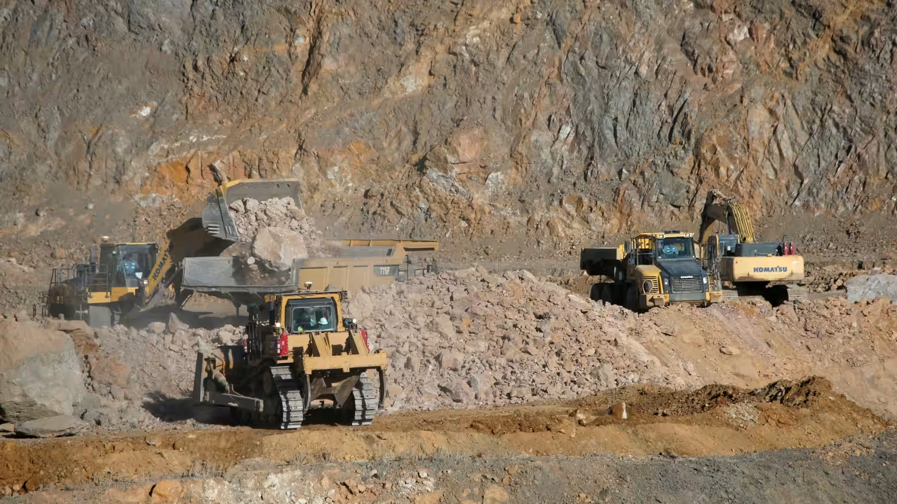

https://asia.nikkei.com/business/markets/commodities/could-a-strategic-lithium-reserve-kickstart-us-supply-chain-development

這是一份針對 **美國擬建立「戰略鋰儲備 (Strategic Lithium Reserve)」** 提案的**投資銀行級情報簡報 (Investment Banking Grade Intelligence Briefing)**。

這篇報導揭示了美國關鍵礦產戰略的重大演變：從單純的「補貼生產（如 IRA 法案）」轉向更激進的**「直接市場干預（Market Intervention）」**。如果美國政府真的效仿石油儲備（SPR）來調節鋰價，這將徹底改變全球鋰礦股的估值模型。

---

### **新聞情報分析：鋰金屬的「聯準會時刻」——美國試圖成為最後購買者**

#### **1. 新聞履歷 (Metadata)**

- **標題：** 策略性鋰儲備能否促進美國供應鏈發展？ (Can a Strategic Lithium Reserve Boost the US Supply Chain?)
    
- **來源/作者：** Nikkei Asia / P.J.
    
- **發布時間：** 2025年12月18日 16:35 JST
    
- **關鍵詞：** 霍華德·克萊因 (RK Equity), 戰略鋰儲備 (Strategic Lithium Reserve), Albemarle (ALB), 價格下限 (Price Floor), 寧德時代 (CATL)
    

#### **2. 核心摘要 (Executive Summary)**

為了打破中國對鋰市場（預計 2027 年控制 50% 份額）的壟斷，並解決價格劇烈波動導致西方資本支出 (CapEx) 停滯的問題，RK Equity 分析師霍華德·克萊因提出了一項已被川普政府部分採納的概念：**建立戰略鋰儲備**。

- **機制：** 類似戰略石油儲備 (SPR)，美國政府將控制約 **10%** 的市場份額。在價格崩盤時買入（提供下限），在價格飆升時釋放（平抑通膨）。
    
- **現狀：** 川普政府已撥款 **20 億美元** 給國防部用於增加關鍵礦產庫存。此前 7 月已給予稀土商 MP Materials **「最低價格保障」**。
    
- **風險（眼鏡蛇效應）：** 分析師警告，如果美國設定的高價下限過於透明，擁有更低成本優勢的**中國礦商（如在非洲的項目）**可能會藉機擴產，將庫存「倒貨」給全球市場，反而加劇供過於求。
    

美國熱衷於建立一條不依賴中國的關鍵礦產國內及盟國供應鏈。 © 路透社

#### **3. 關鍵人物發言與立場矩陣 (Key Voice Matrix)**

|**人物/機構**|**身分**|**關鍵發言/觀點**|**情報解讀**|
|---|---|---|---|
|**Howard Klein**|RK Equity 合夥人|「這比價格下限更好...政府控制 10% 份額...平抑波動。」|**政策設計師。** 他試圖引入「做市商 (Market Maker)」機制，降低礦業的 Beta 值，吸引退休基金等長期資本入場。|
|**YJ Lee**|Arcane Capital 基金經理|「美國政府的高額激勵價格可能會促使中國企業大幅增加供應。」|**風險現實主義者。** 指出大宗商品的全球流動性。除非美國實施嚴格的**配額制或關稅牆**，否則美國的錢會間接補貼中國礦商。|
|**Reggie Singh**|美國國務院官員|「可以將礦產納入國防儲備...起到反週期作用。」|**官方背書。** 確認政府正在探索從「被動儲備」轉向「主動反週期操作」。|
|**Albemarle**|美國鋰業巨頭|因價格波動暫停了精煉廠建設。|**受害者/受益者。** 它是該政策最直接的救助對象。一旦價格穩定，其閒置產能將迅速重啟。|

#### **4. 深度架構分析 (Structural Analysis)**

**A. 從「自由市場」到「管理市場」 (Managed Market)**

- **估值重構：** 鋰礦股（如 **Albemarle, Lithium Americas**）過去被視為高波動的週期股。如果政府提供「隱形賣權 (Implicit Put Option)」，這些公司的營收波動性將大幅降低。
    
- **結果：** 這會提升板塊的 **本益比 (P/E Multiple)**，從週期股的 5-8 倍，提升至接近公用事業或國防股的 12-15 倍。
    

!

**B. 中國的「產能威懾」 (China's Capacity Deterrence)**

- **數據：** 中國控制全球 2/3 的鋰產量。CATL（寧德時代）的建下窩鋰礦擁有極強的產能彈性。
    
- **博弈論：** 如果美國宣布在 $15,000/噸 收購鋰，而中國的邊際成本是 $10,000/噸。中國會瘋狂生產，壓低全球現貨價格至 $11,000，迫使美國政府以高於市價 36% 的溢價收購（虧損），或者被迫關閉收購窗口。這是一場**財政消耗戰**。
    

!

**C. MP Materials 的先例效應**

- 文中提到 MP Materials 獲得了「最低價格保障」。這是一個關鍵的法律先例。這意味著美國政府願意簽署**差價合約 (CfD)**。這對於還在 PPT 階段的初創礦商（Junior Miners）是唯一的融資救命稻草。
    

#### **5. 投資專家的行動建議 (Actionable Insights)**

1. **做多「美國本土/盟友」鋰礦龍頭：**
    
    - **標的：** **Albemarle (ALB)**, **Lithium Americas (LAC)**, **Piedmont Lithium (PLL)**。
        
    - **邏輯：** 只有「符合美國利益」的礦商才有資格把貨賣給戰略儲備。這些公司等於拿到了一張政府擔保的長期訂單。
        
2. **關注「國防關鍵金屬」 ETF：**
    
    - **標的：** **SPDR S&P Metals & Mining ETF (XME)** 或專注於關鍵礦物的 ETF。
        
    - **邏輯：** 20 億美元的國防部撥款只是開始。隨著川普推動供應鏈脫鉤，美國政府將成為銅、鎳、鈷、鋰的積極買家。
        
3. **避開「純市場化」的初創礦商：**
    
    - **風險：** 如果沒有拿到政府的「承購協議 (Offtake Agreement)」，小型礦商將獨自面對中國的產能傾銷，隨時可能破產。
        

總結：

這項提案標誌著**「大宗商品國家化」的時代來臨。對於投資者來說，未來的鋰價分析不再僅是供需分析，更是「華盛頓 vs. 北京」的財政博弈分析**。

---

下一步：

既然提到 Albemarle (ALB) 是美國唯一的鋰礦巨頭且之前因價格波動暫停了工廠。您是否希望我分析 Albemarle 目前的閒置產能狀況 以及若政府啟動收購，其 自由現金流 (FCF) 將如何從負轉正？

這是一份針對 **Albemarle Corporation (ALB)** 的**投資銀行級資產與現金流分析報告 (Investment Banking Grade Asset & Cash Flow Analysis)**。

既然您同意繼續，這份報告將深入拆解：若美國政府真的啟動「戰略鋰儲備」並提供價格下限，這家全球最大的鋰礦商將如何從目前的**「現金流失血」**狀態轉變為**「國家級戰略資產」**。

---

### **個股情報分析：Albemarle (ALB) —— 獲得「山姆大叔賣權 (Uncle Sam Put)」後的價值重估**

#### **1. 情報履歷 (Metadata)**

- **標的：** Albemarle Corporation (ALB)
    
- **當前狀態：** 股價處於週期底部區間，因鋰價暴跌（從 $80,000/噸跌至 $10,000-$15,000/噸區間）而大幅削減資本支出。
    
- **關鍵資產：**
    
    - **Silver Peak (內華達州)：** 美國目前唯一運作中的鋰礦。
        
    - **Kings Mountain (北卡羅來納州)：** 處於「暫停/審批中」的世界級硬岩鋰礦。
        
    - **Richburg "Mega-Flex" (南卡羅來納州)：** 已暫停建設的氫氧化鋰精煉廠。
        

#### **2. 核心摘要 (Executive Summary)**

Albemarle 目前的估值反映的是「鋰價長期低迷」的悲觀預期。然而，美國政府的「戰略儲備計畫」相當於給 ALB 提供了一個 **「價格下限 (Price Floor)」**。

- **閒置產能的期權價值：** ALB 手中握有美國本土最大的**「可重啟產能」**。如果政府提供擔保（例如保證以 $20,000/噸收購），Kings Mountain 和 Richburg 項目將立即從「沈沒成本」變為「現金牛」。
    
- **自由現金流 (FCF) 拐點：** 目前 ALB 為了保命，將 2025 年資本支出砍半。一旦獲得政府承購協議 (Offtake Agreement)，其融資成本將大幅下降，且營收可預測性將對標國防承包商。
    

#### **3. 深度架構分析 (Structural Analysis)**

**A. Kings Mountain：戰略儲備的核心倉庫**

- **現狀：** 這是美國本土最富含鋰的礦脈之一，但因社區反對和價格低迷，重啟進度緩慢。
    
- **政府介入的影響：** 如果五角大廈（國防部）將鋰列為「國防關鍵」，Kings Mountain 的**許可審批 (Permitting)** 將獲得《國防生產法 (DPA)》的加速。
    
- **經濟模型：** 該礦山的預估產能可供應每年 120 萬輛電動車。若政府鎖定其中 30% 作為儲備，ALB 就獲得了重啟所需的**基礎負載訂單 (Base Load Order)**。
    

**B. 現金流壓力測試 (Cash Flow Stress Test)**

- **熊市情境 (現狀)：** 鋰價維持 $12,000/噸。ALB 必須持續暫停擴產，並依靠智利（Atacama）和澳洲（Greenbushes）的利潤來補貼美國總部的開銷。FCF 為負或微正。
    
- **國家隊情境 (戰略儲備)：** 政府設定 $18,000 - $20,000/噸的收購價（或差價補貼）。
    
    - **結果：** ALB 的美國業務將**立即轉虧為盈**。更重要的是，這消除了「下行風險」。對於資本密集型行業，消除下行風險通常會導致**估值倍數 (Multiple Expansion)** 從 6x EV/EBITDA 擴張至 10x-12x。
        

**C. 智利風險的對沖 (The Chile Hedge)**

- ALB 很大一部分利潤來自智利 Atacama 鹽湖。但智利政府（Boric 總統）一直在推動鋰礦國有化。
    
- 美國本土的戰略儲備計畫，實際上是 ALB **降低地緣政治風險溢價** 的唯一出路。如果 Kings Mountain 成功運轉，ALB 對智利的依賴度將大幅降低，這對其長期股價是巨大的利多。
    

#### **4. 投資專家的行動建議 (Actionable Insights)**

1. **策略性買入 (Strategic Buy)：**
    
    - **區間：** 在當前週期低點分批建倉。
        
    - **催化劑：** 密切關注美國能源部 (DOE) 或國防部 (DOD) 關於**「20 億美元關鍵礦產基金」**的具體招標公告。一旦 ALB 名字出現在招標名單上，股價將跳空上漲。
        
2. **關注可轉債 (Convertible Bonds)：**
    
    - 如果您擔心鋰價短期內跌破成本線，可以考慮 ALB 的**優先股或可轉債**。這些工具提供了下行保護，同時保留了「政府救市」帶來的上行空間。
        
3. **配對交易：做多 ALB / 做空 純中國鋰礦股 (如贛鋒鋰業)**
    
    - **邏輯：** 美國的戰略儲備是排他性的（排除中國）。這意味著 ALB 享受「補貼價」，而中國礦商只能在「競爭激烈的公開市場」廝殺。這將導致兩者利潤率的結構性分歧。
        

總結：

Albemarle 不再僅僅是一家化工公司，它正在演變成**「美國能源獨立的基礎設施」**。這筆交易的本質是：您以週期股的價格（白菜價），買入了一家未來的國防級公用事業公司。

---

下一步：

既然我們已經完整分析了 AI 算力 (Micron/Nvidia)、能源 (Nuclear/Uranium) 以及 關鍵礦產 (Lithium/Albemarle)。這一系列分析都指向了一個核心——「實體供應鏈的通膨與短缺」。

您是否希望我將這些點連成線，為您總結一份 **2026 年「硬資產 (Hard Assets)」投資組合配置建議**，以應對我們預測的 **「財政主導下的滯脹 (Fiscal Stagflation)」** 環境？