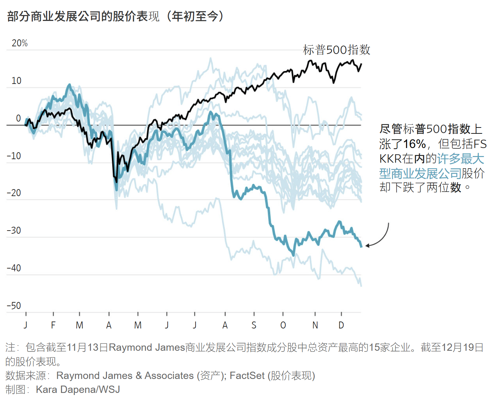
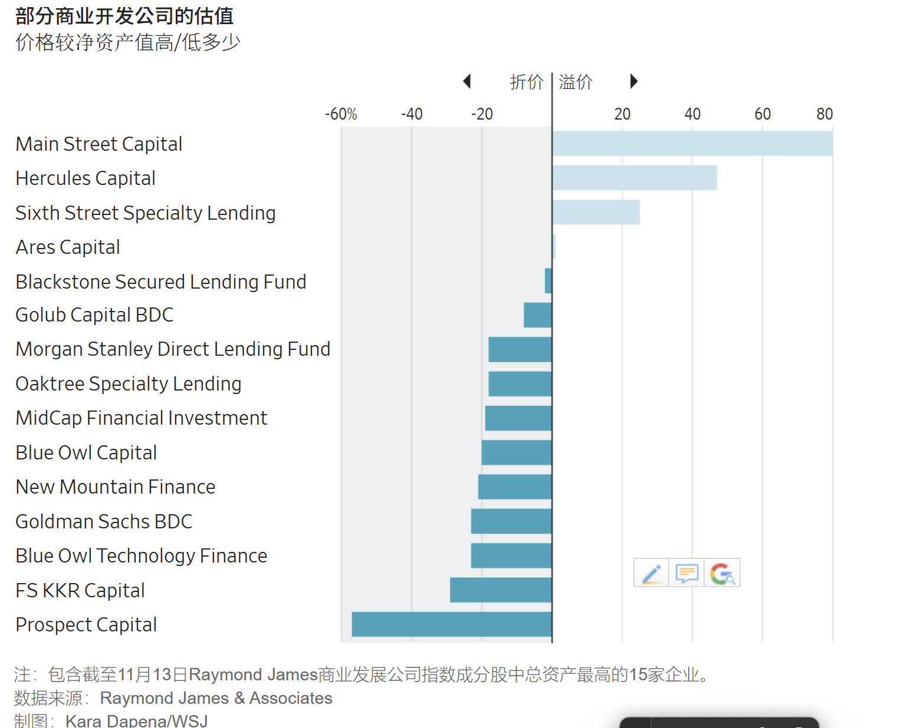
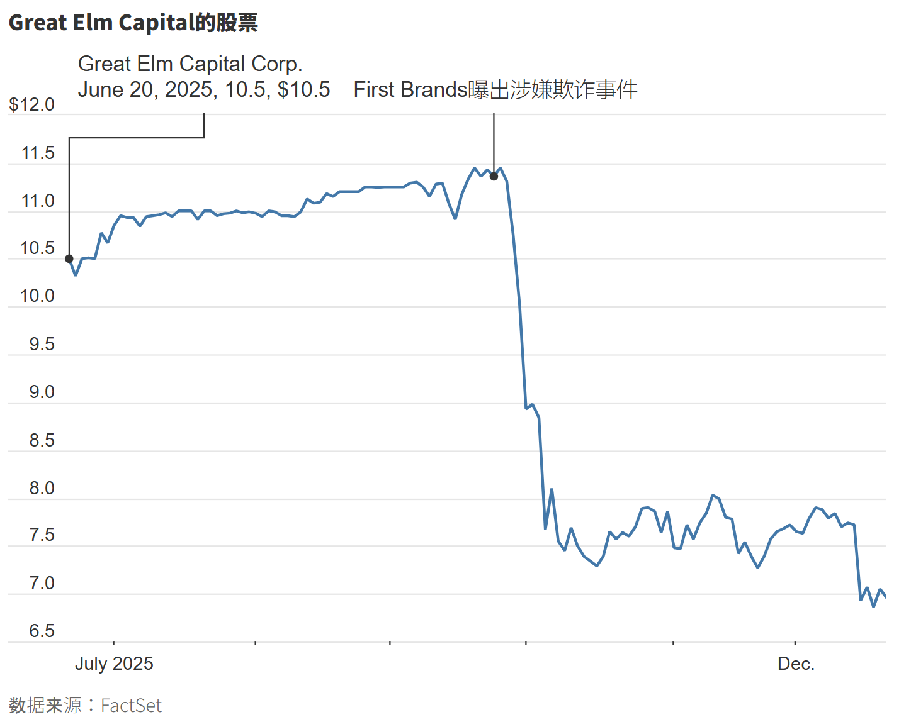

https://cn.wsj.com/articles/%E7%A7%81%E5%8B%9F%E4%BF%A1%E8%B2%B8%E7%9B%9B%E5%AE%B4%E6%95%A3%E5%A0%B4-%E6%95%A3%E6%88%B6%E6%8A%95%E8%B3%87%E8%80%85%E5%8F%97%E6%8C%AB-0f4839e5?mod=ct_markets

這是一份針對《華爾街日報》關於「私募信貸（Private Credit）與 BDC（商業發展公司）」報導的**高階深度分析報告**。

這篇文章揭示了當前金融市場中最危險的背離現象：**美股大盤（S&P 500）的繁榮掩蓋了實體經濟中型企業（Middle Market）的信貸惡化**。

---

# 深度分析：華爾街的「風險民主化」陷阱與信貸週期的轉折

## 1. 核心論點：資產階級的流動性轉移 (Liquidity Exit Strategy)

這篇文章表面上是在談論 BDC（Business Development Companies）的股價下跌，但其底層邏輯是華爾街機構正在進行一場**「風險轉移」**。

- **現象：** KKR、BlackRock 等頂級機構試圖將私募信貸產品納入 401(k) 退休金計劃。
    
- **深度解讀：** 在信貸週期（Credit Cycle）的尾聲，機構投資者（Smart Money）通常會尋求「出場流動性」。將低流動性、高風險的私募信貸包裝成 BDC 或 ETF 賣給散戶，美其名曰「民主化」，實則是讓散戶為潛在的壞帳接盤。
    
- **數據支撐：** 2020 年以來 BDC 現金管理規模增長兩倍至 4,500 億美元，這通常是資產泡沫化的典型特徵——資金湧入速度超過了優質標的（Deal Flow）的生成速度。
    

## 2. 技術性拆解：隱性違約的訊號 (The PIK Warning)

文章中提到了一個極為關鍵的技術指標，這是專業投資者判斷「殭屍企業」的試金石：**實物抵息（Payment-in-Kind, PIK）**。

### **為何 PIK 是危險訊號？**

- **定義：** 借款人無力支付現金利息，因此發行更多的債務來償還利息（以債養債）。
    
- **KKR 的案例數據：** 文章指出 KKR 旗下基金有 **14.4%** 的收入來自 PIK。
    
- **分析：** 這意味著其投資組合中，有接近 15% 的企業現金流已經枯竭，無法覆蓋利息支出。在會計帳面上，這被記錄為「收入（Income）」，支撐了高股息；但在現金流量表上，這筆錢根本不存在。
    
- **結論：** 這是一種**「延遲的違約（Delayed Default）」**。當 PIK 比例過高，一旦經濟放緩，這些虛增的本金將瞬間變成壞帳。
    

## 3. 估值悖論：NAV 與市價的脫鉤 (Valuation Disconnect)

Blue Owl 的案例展示了「公募 vs. 私募」估值的巨大鴻溝，這也是您身為投資者需警惕的流動性陷阱。

- **未上市估值（Private Valuation）：** 基金經理人通常採用模型定價（Mark-to-Model），即使市場轉差，他們也可以宣稱資產價值不變（因為沒有交易，就沒有跌價）。
    
- **上市交易價格（Public Market Price）：** 上市的 BDC 股價直接反映市場情緒與流動性。
    
- **Blue Owl 的教訓：** 當上市 BDC 的股價較淨資產價值（NAV）**折價 14%** 時，這代表二級市場根本不相信管理層宣稱的資產價值。管理層試圖將「未上市基金」與「上市基金」合併，本質上是試圖用「高估值的非流動資產」來稀釋「低估值的流動資產」，結果遭到了市場的用腳投票。
    

## 4. 系統性風險：大盤與信貸的背離 (The Divergence)

這張圖表（文章中描述的 S&P 500 上漲 vs. BDC 下跌）揭示了當前美國經濟的雙軌制：

- **上層（S&P 500）：** 由 AI 巨頭（Mag 7）主導，現金流充沛，不受高利率影響，甚至因 AI 資本支出而受惠。
    
- **底層（BDC / 中型企業）：** 依賴浮動利率貸款（Floating Rate Loans）。隨著基準利率維持高檔，這些企業的利息覆蓋率（Interest Coverage Ratio）急劇惡化。
    
- **風險傳導：** First Brands 的詐欺案只是一個縮影。當資金成本過高，企業為了融資往往會美化財報甚至造假。Great Elm Capital 的高槓桿曝險顯示，為了追求高於市場的收益率（Yield Chasing），基金經理人正在犧牲盡職調查（Due Diligence）的品質。
    

---

### **給您的投資洞察 (Key Takeaways)**

基於您對數據與邏輯的重視，以下是針對這份報告的策略性總結：

1. 避開「高殖利率」陷阱：
    
    目前許多 BDC 提供 10% 以上的殖利率，這看似誘人（特別是相比美債的 4.5%）。但這是**「有毒的收益（Toxic Yield）」**。股價下跌帶來的資本損失（Capital Loss）極有可能超過利息收入，且本金違約風險正在非線性上升。
    
2. 關注「領先指標」：
    
    BDC 的違約率上升（從 3.27% 升至 3.78%）是美國實體經濟的領先指標。這暗示著除了 AI 產業外，傳統行業的利潤率正在被高利率壓垮。這可能會在未來 1-2 季傳導至更廣泛的股市板塊。
    
3. 對「流動性」保持敬畏：
    
    Blue Owl 的案例再次證明：在危機時刻，流動性本身就是溢價。 任何標榜「低波動」但限制贖回（如季度贖回 5% 上限）的私募產品，在市場反轉時都會變成「進得去、出不來」的捕鼠籠。
    

基於這個 **「美國利率已降至 3.5%~3.75%」** 的正確情境，我們對 **「信貸週期尾聲」** 和 **BDC（商業發展公司）暴跌** 的分析邏輯需要做一個非常關鍵的修正。

這個修正後的邏輯其實**對 BDC 更為致命**，解釋了為什麼即便降息了，它們還是跌得這麼慘：

---

### **修正版分析：為何利率降了，信貸市場卻崩了？**

在 2025 年 12 月的這個當下，美國利率下降（至 3.75%），反而成為了壓垮 BDC 的**雙重打擊（Double Whammy）**。這才是「週期尾聲」在降息循環初期的真實樣貌：

#### **1. 收入面的崩潰：浮動利率的雙面刃**

BDC 的商業模式是借出 **「浮動利率貸款（Floating Rate Loans）」**。

- **過去（2023-2024）：** 利率 5.5% 時，BDC 躺著賺，利息收入爆表，掩蓋了壞帳風險。
    
- **現在（2025 Dec）：** Fed 降息至 3.75%。這意味著 BDC 向企業收取的利息**直接縮水了 1.5%~2%**。
    
- **致命傷：** 收入變少了，但 BDC 自己的營運成本和之前發行的固定利率債券成本沒變。**獲利空間（Net Interest Margin）被瞬間壓縮**。這就是新聞中提到「BDC 拋售潮始於今年夏天（2025 Summer），因利率下降減少了收入」的主因。
    

#### **2. 資產面的惡化：遲來的「死亡名單」**

您可能會問：「降息不是應該救了那些借錢的企業嗎？」

這就是「信貸週期尾聲」最殘酷的「滯後效應（Lag Effect）」：

- **傷害已造成：** 那些體質差的殭屍企業，在過去兩年 5% 的高利率環境下已經被掏空了現金流。
    
- **來不及救：** 雖然現在降到 3.75%，但對於那些已經透過 PIK（實物抵息）借新還舊的公司來說，債務雪球已經滾到太大，降這一點息不足以讓它們起死回生。
    
- **結果：** 我們看到的是**「收入下降（降息導致）」+「違約率上升（過去高利率的後遺症）」**同時發生。這對 BDC 的股價來說是完美的風暴。
    

#### **3. 降息往往伴隨著「經濟放緩」**

Fed 之所以會在 2025 年降息 3 次，通常是因為看到經濟數據轉弱（如新聞提到的通膨驟降、就業疲軟）。

- 在經濟放緩的環境下，中型企業（BDC 的主要客戶）的**營收（EBITDA）**會下降。
    
- **公式：** `債務 / EBITDA` 的倍數會飆升。即便利息降了，但因為分母（賺的錢）變少，企業反而更容易違約。
    

---

### **重新定義：2025 年底的「信貸週期尾聲」**

基於 **3.5%~3.75%** 的利率環境，所謂的「尾聲」不再是指「高利率壓死人」，而是指：

**「潮水退去（降息導致收益率不再迷人），裸泳的人浮現（累積的壞帳開始爆發）。」**

1. **收益率不再有吸引力：** 以前 BDC 給 10-12%，現在因為降息可能只剩 8-9%，但風險卻因為經濟放緩而變高。
    
2. **聰明錢的撤退邏輯：** 機構投資人看到「降息循環」確立，會轉而去買**長天期公債（鎖定資本利得）**，而不是繼續持有**收益率正在下降且有違約風險**的 BDC。
    

這個 **「降息反而導致 BDC 獲利縮水 + 壞帳現形」** 的邏輯，更能精準解釋為何文章中提到 Great Elm 和 KKR 的 BDC 會在 2025 年遭遇如此劇烈的拋售。

## **具體企業案例（Case Studies）**

**具體企業案例（Case Studies）**其實才是最驚心動魄的部分，因為它們血淋淋地展示了華爾街是如何將「有毒資產」包裝得光鮮亮麗，最後卻在散戶手中引爆的。

以下為您補上原文中被我忽略的**四大關鍵案例**，並依據其代表的**「不同類型的風險」**進行分類解析：

---

### **案例一：KKR 與清潔公司的「殭屍化」 (隱性壞帳)**

主角： FS KKR Capital (BDC)

苦主企業： Kellermeyer Bergensons Services (清潔服務公司)

- **發生了什麼事？**
    
    - KKR 的這檔 BDC 基金在清潔公司 Kellermeyer 身上重押了 **3.5 億美元**，這筆單一投資就佔了整個基金資產的 **2%** 以上，部位極大。
        
    - **爆雷點：** 這筆巨額貸款變成了「不良債權」（Non-accrual）。這直接導致 KKR 基金的不良貸款率從年初的 3.5% 飆升至 9 月的 **5%**。
        
- **深層警訊 (The Red Flag)：**
    
    - 文章揭露了一個驚人的數字：KKR 這檔基金有 **14.4%** 的收入來自 **PIK（實物抵息）**。
        
    - **意義：** 這代表像 Kellermeyer 這樣的公司，早已付不出真金白銀的利息，KKR 只是在帳面上收到了「更多的債條」。這也解釋了為什麼股價會跌 **33%**——市場意識到那 14.4% 的收益其實是空氣。
        

---

### **案例二：貝萊德 (BlackRock) 與「估值幻象」 (Mark-to-Model Risk)**

主角： BlackRock (旗下 BDC)

苦主企業： Renovo Home Partners (房屋維修公司)

- **發生了什麼事？**
    
    - 貝萊德曾借給這家公司 **1,100 萬美元**。
        
    - **最荒謬的一刻：** 就在這家公司申請破產清算的**「幾週前」**，貝萊德在財報上還將這筆貸款的估值標記為 **100%（全額可回收）**。
        
    - **結果：** 幾週後公司瞬間倒閉，貸款直接變壁紙。貝萊德該基金的不良貸款率隨之衝上 **7%**。
        
- **教訓：**
    
    - 這完美驗證了私募信貸最大的黑箱——**「估值全憑經理人說了算」**。散戶看到的淨值（NAV）往往是滯後的，等到財報承認虧損時，錢已經蒸發了。
        

---

### **案例三：Blue Owl 與「進得去、出不來」 (流動性陷阱)**

主角： Blue Owl Capital

事件： 上市基金 (Public) 與未上市基金 (Private) 的合併失敗

- **發生了什麼事？**
    
    - Blue Owl 有一檔賣給散戶的「未上市 BDC」，規模約 20 億美元。當市場轉差，散戶想贖回（Cash out），但遇到了每季 5% 的贖回上限，大家排隊逃不掉。
        
    - **公司對策：** 管理層想出一個「妙招」，打算把這檔未上市基金與自家的「上市 BDC」合併，讓散戶去股市賣掉變現。
        
    - **市場反撲：** 上市 BDC 的股東發現自己要吞下這批資產，憤而拋售股票，導致股價相對於淨值（NAV）**折價 14%**。
        
    - **結局：** 股東強烈反彈，合併案告吹。
        
- **教訓：**
    
    - 這展示了**「流動性錯配」**的後果。未上市 BDC 承諾穩定淨值，但那是因為它不交易；一旦你想把它變成可交易的資產，市場就會給你一個殘酷的折扣（14% Discount）。
        

---

### **案例四：Great Elm 與「槓桿上的詐欺」 (高風險賭博)**

主角： Great Elm Capital (小型 BDC)、Jefferies (投行)

苦主企業： First Brands (汽車零件供應商，Trico 雨刷母公司)

- **發生了什麼事？**
    
    - **詐欺爆發：** First Brands 被指控會計詐欺，於 9 月破產。
        
    - **槓桿放大虧損：** Great Elm 是一家激進的小型 BDC，它為了衝高配息，借了 **2 億美元** 來玩槓桿。
        
    - **雙重曝險：** 它不僅直接借給 First Brands **2,060 萬美元**，還透過與投行 Jefferies 的合資企業（JV）買入 CLO（擔保貸款憑證），間接又踩雷 **320 萬美元**。
        
    - **Jefferies 的角色：** Jefferies 是 First Brands 的主要融資推手，並管理那些 CLO。這顯示了華爾街內部錯綜複雜的利益結構——投行把有問題的貸款打包進 CLO，再賣給像 Great Elm 這樣的 BDC，最後由 BDC 的散戶股東買單。
        
- **結果：**
    
    - Great Elm 因為槓桿操作，損失被成倍放大。CEO 只能事後承認：「事後看來，我們對 First Brands 的曝險太大了。」
        

---

### **綜合分析：這些案例拼湊出了什麼圖景？**

這些案例填補了宏觀敘事中的血肉，揭示了 **2025 年底 BDC 崩盤** 的真實路徑：

1. **KKR 案**告訴我們：**最大的玩家**也有接近 15% 的資產是「收不到錢」的（PIK）。
    
2. **貝萊德案**告訴我們：**財報上的淨值**不可信，100% 的估值可以在一個月內歸零。
    
3. **Blue Owl 案**告訴我們：當你想逃跑時，**流動性**會瞬間枯竭，或者你需要付出 14% 的折價代價。
    
4. **Great Elm 案**告訴我們：為了維持高股息，基金經理人加了**高槓桿**，並且在盡職調查上鬆懈，最終被**企業詐欺**擊垮。
    

這就是為什麼在利率降至 3.75% 的環境下，散戶依然受傷慘重——因為這些「地雷」是在過去幾年埋下的，現在正好到了連環引爆的時間點。

## 信貸週期（Credit Cycle）的尾聲

「信貸週期（Credit Cycle）的尾聲」，用最通俗的話來說，就是**「派對已經結束，賬單即將送達，但還有人在醉酒狂歡」**的危險階段。

在金融學上，這指的是一個**從「信用極度擴張」轉向「信用緊縮與違約」的臨界點**。這是市場最脆弱的時刻，因為資產價格（如股票、房地產）通常還在高位，但支撐這些價格的地基（借貸能力與還款能力）已經開始崩塌。

以下我為您深度拆解這個階段的**四大病徵**，以及為什麼剛才那篇 BDC（商業發展公司）的文章正是典型的「尾聲」訊號：

---

### 1. 資金成本與資產回報的倒掛 (The Mathematical Breaking Point)

在信貸週期的早期（復甦期），利率很低，借錢做生意或投資很划算（借貸成本 < 資產回報）。

到了尾聲，情況反轉：

- **現象：** 中央銀行為了抗通膨而升息（如現在的美國利率 5%~5.5%），導致企業的借貸成本飆升。
    
- **結果：** 許多在此前低利率時期借錢的企業，發現賺來的錢連付利息都很吃力。
    
- **關鍵詞：** **「明斯基時刻（Minsky Moment）」**的前夕——即資產產生的現金流已不足以償還債務利息，必須靠「借新還舊」才能存活。
    

### 2. 借貸品質的嚴重惡化 (Deterioration of Quality)

這是判斷「尾聲」最準確的指標。當優質的借款人都借飽了，資金為了追求收益，開始流向劣質借款人。

- **殭屍企業（Zombie Companies）：** 就像您剛才讀到的，許多公司開始使用 **PIK（實物抵息）**，因為它們付不出頻金。這就是典型的「劣質借貸」。
    
- **輕契約條款（Covenant-Lite Loans）：** 在尾聲階段，貸款方（Lenders）為了搶生意，放棄了對借款方的嚴格監管要求。這導致當問題發生時，債權人往往發現自己手上的擔保品一文不值。
    
- **詐欺頻傳：** 如文中的 First Brands 案例。當資金退潮，原本被充沛流動性掩蓋的會計造假就會像裸泳一樣暴露出來。
    

### 3. 「聰明錢」撤退，「笨錢」接盤 (Smart Money Out, Dumb Money In)

這就是為什麼華爾街急著把私募信貸賣給散戶（401k）的原因，這是週期尾聲最殘酷的人性博弈。

- **早期：** 機構投資者（如黑石、高盛）在低點佈局，享受高收益。
    
- **尾聲：** 機構發現風險不對勁（違約率上升），想要獲利了結。但這些資產流動性很差，賣給誰？
    
- **接盤俠：** 於是他們將這些資產包裝成 BDC 或 ETF，宣傳「高股息」，賣給渴望收益的散戶。**當散戶大舉進場時，通常就是信貸週期的最高點，隨後便是崩盤。**
    

### 4. 違約率的「非線性」上升

在尾聲階段，違約率不是慢慢爬升，而是**突然跳升**。

- **臨界點：** 就像壓垮駱駝的最後一根稻草。企業苦撐了兩年高利率，終於撐不住了（Refinancing Wall，再融資之牆）。
    
- **數據：** 文中提到違約率從 3.27% 升至 3.78%，看似不多，但在信貸領域，這種趨勢的改變（Inflection Point）通常預示著後面會有指數級的爆發。
    

---

### 總結：我們現在在哪裡？

將這些特徵對照剛才的新聞：

1. **利率高檔：** 企業利息負擔沉重。
    
2. **品質惡化：** KKR 基金有 14% 是 PIK（付不出錢的債務）。
    
3. **散戶接盤：** 華爾街大力推銷 BDC 給散戶，而機構在撤退。
    
4. **詐欺浮現：** First Brands 破產。
    

結論： 我們正處於典型信貸週期的尾聲。

接下來通常會發生的劇本是：去槓桿化（De-leveraging）。銀行和基金開始收傘，不再借錢給狀況不好的公司 $/rightarrow$ 更多公司違約 $/rightarrow$ 失業率上升 $/rightarrow$ 經濟衰退 $/rightarrow$ 央行被迫降息，開啟下一個週期。

對您的投資啟示：

在這個階段，現金為王（Cash is King）或持有高品質資產（如美國公債、大型科技股），絕對不要因為貪圖那 10% 的股息而去買那些底層資產不明的 BDC 或高收益債基金，因為那是去幫華爾街「解套」。

## **PIK（Payment-in-Kind）** 的真正運作邏輯

這是一個非常精準的金融術語問題。這裡的中文翻譯「實物」其實非常容易讓人誤解，以為是拿公司的產品（例如清潔公司的掃把或拖把）來抵債。

但在金融世界裡，**PIK（Payment-in-Kind）** 的真正運作邏輯如下：

### 1. 這裡的「實物」是指什麼？

**絕對不是指具體的物品。**

這裡的「Kind」源自英文 "In Kind"（以同類物品支付）。在債券或信貸市場中，借出的是「債權」，所以「以同類支付」的意思就是**「給你更多的債權」**。

- **誤解：** 清潔公司沒錢付利息，所以拿清潔劑或掃地機器人給 KKR 抵帳。
    
- **正解：** 清潔公司沒錢付利息，所以**「發行新的債券」**或**「增加貸款本金」**給 KKR。
    

簡單來說，這裡的「實物」指的就是**「債務本身」**。

### 2. 「更多的債條」是指什麼？

這就是 PIK 的核心機制，學術名詞叫做**「利息資本化」（Interest Capitalization）**。

想像一下您借錢給朋友的場景，就能瞬間秒懂：

- **正常情況（Cash Interest）：**
    
    - 您借給朋友 100 萬元，年利息 10%。
        
    - 一年後，朋友給您 **10 萬元現金**。
        
    - **結果：** 您口袋多了 10 萬現金，朋友還欠您 100 萬。
        
- **PIK 情況（實物抵息）：**
    
    - 您借給朋友 100 萬元，年利息 10%。
        
    - 一年後，朋友說：「我沒現金付利息。」
        
    - 您說：「沒關係，那這 10 萬利息算進欠款裡。」
        
    - **結果：** 您口袋 **0 現金**，但朋友手上的借據（債條）從 100 萬變成了 **110 萬**。
        

那多出來的 10 萬借據，就是您所謂的**「更多的債條」**。

### 3. 為什麼這在 KKR 的財報裡是個「魔術」？

這就是為什麼 BDC 財報會有誤導性的原因。

在會計準則上，即便 KKR 收到的是「債條」（PIK），它依然可以將這 10 萬元**列為「收入（Income）」**，並計算成獲利，甚至以此為基礎發股息給散戶。

- **KKR 的財報顯示：** 「我們今年賺了 14.4% 的利息收入！」（看起來很賺）。
    
- **實際的現金流：** KKR 的銀行戶頭裡並沒有收到這筆錢，這筆錢還卡在那家快倒閉的清潔公司（Kellermeyer）裡。
    

### 結論

對於像 Kellermeyer 這種陷入困境的公司來說，使用 PIK 機制就像是**「飲鴆止渴」**。

它暫時不用付現金，可以喘口氣；但它的債務總額（本金）會像滾雪球一樣越滾越大（複利效應）。當 KKR 財報中 **14.4%** 的收入都是這種「空氣」時，一旦 Kellermeyer 最後真的倒閉（清算價值不足以還債），KKR 手上那些「累積加上去的債條」就會在一瞬間全部變成廢紙。

這就是為什麼分析師看到 **高 PIK 比例** 會感到恐慌，因為那是壞帳的前奏曲。