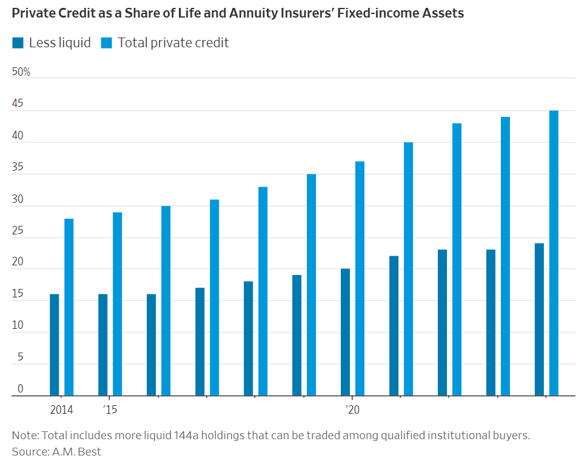

# 華倫·巴菲特和私募股權都鍾愛保險業。相似之處就止於此。

## 在華爾街投資保險費和在奧馬哈投資保險費是截然不同的兩回事。

[希瑟·吉勒斯](https://www.wsj.com/news/author/heather-gillers)

2025年12月25日 上午5:30 ET

[132](https://www.wsj.com/finance/investing/warren-buffett-and-private-equity-both-love-insurance-the-similarities-end-there-338f7429?mod=series_buffett#comments_sector)

伯克希爾·哈撒韋公司的華倫·巴菲特 （圖片來源：美聯社/納蒂·哈尼克）

### 

快速概要

- 私募股權公司目前控制著 20% 的年金儲備金，與 2011 年的 2% 相比大幅成長，改變了投資策略。
    

如今很多人都想投資保險金。但沒有人能像[華倫‧巴菲特](https://www.wsj.com/topics/person/warren-buffett)那樣把這事做得如此出色。

[巴菲特的伯克希爾·哈撒韋公司](https://www.wsj.com/market-data/quotes/BRK.B)[（BRK.B）](https://www.wsj.com/market-data/quotes/BRK.B)的種子資本  [-0.21 %減少；紅色向下三角形](https://www.wsj.com/market-data/quotes/BRK.B)巴菲特維持其龐大投資帝國的資金來源是保險費，這些資金往往會閒置數月甚至數年才用於支付理賠。這筆現金——或者用巴菲特的話來說就是「浮存金」——聽起來很像大型私募股權和私募信貸公司日益試圖控制的資金。阿波羅全球管理[公司](https://www.wsj.com/market-data/quotes/APO) [（ Apollo Global Management） -0.89 %減少；紅色向下三角形](https://www.wsj.com/market-data/quotes/APO)四年前，當公司與其保險子公司 Athene 合併時，執行長Marc Rowan提到了「波克夏·哈撒韋公司的某些元素」。

表面上看，阿波羅、[KKR](https://www.wsj.com/market-data/quotes/KKR)和其他公司都在效仿巴菲特[收購保險公司](https://www.wsj.com/articles/private-equity-taps-insurers-cash-to-speed-up-growth-11675128742?mod=article_inline)的做法。但這些以出售華爾街一些[最不透明](https://www.wsj.com/finance/investing/investors-clamor-for-a-peek-behind-the-private-markets-curtain-d8763e53?mod=article_inline)、流動性最差的資產而聞名的公司，實際上與「奧馬哈先知」巴菲特並沒有太多共同點。

私募市場基金經理人偏好普通的年金產品：這類長期保險保單因其能提供定期支付而深受退休人士歡迎。這種可預測性使得保險公司在投資保險儲備方面更具創造性，可以將資金鎖定在私募信貸領域。其投資組合日益複雜，也讓負責審查這些投資的監管機構忙得不可開交。

波克夏海瑟威公司在保險業務方面展現了其創造力。該公司[擁有39年保險業務主管經驗](https://www.wsj.com/finance/investing/berkshire-hathaway-succession-insurance-003dcf86?mod=article_inline)的阿吉特·賈恩（ Ajit Jain ）曾設計了一份保單，為百事可樂公司免除支付10億美元抽獎獎金的風險。巴菲特的商業帝國還包括汽車保險公司Geico以及遍佈全球的一系列其他保險和再保險業務。

Jain 在 5 月波克夏的股東大會上表示，過去幾年，該公司選擇縮減其原本就相對較小的壽險業務規模，而不是與願意承擔更多槓桿和信用風險的私募股權公司競爭。

“我們不喜歡這些情況帶來的風險回報，因此我們舉白旗投降，說‘我們現在無法在這個領域競爭’，” Jain 說。

保險業並非波克夏海瑟威如今唯一需要與私募股權公司共享的領域：它們都熱衷於收購前景看好的公司。[波克夏最新收購的](https://www.wsj.com/business/energy-oil/berkshire-hathaway-to-buy-occidentals-petrochemical-unit-for-9-7-billion-82e1bdba?mod=article_inline)OxyChem公司曾是阿波羅全球管理公司（Apollo Global Management）的收購目標，而KKR也擁有[一個內部投資部門，](https://www.wsj.com/articles/kkr-raises-its-direct-stakes-in-three-companies-31740981?mod=article_inline)一位高階主管將其形容為「迷你版的波克夏海瑟威」。

但保險業提供了一個特殊的視角，讓我們得以窺見一位擁有 95 年歷史的傳奇人物與一群渴望獲得資金的新興投資者兼保險公司之間截然不同的理念，而此時伯克希爾的未來仍充滿變數。 

波克夏海瑟威公司是一家規模龐大的企業集團，包括能源公司和BNSF鐵路公司。下個月，格雷格·阿貝爾將接任執行長一職，這將是該公司自20世紀60年代以來首次更換執行長。現年74歲的賈恩已超過退休年齡近十年。曾被培養為波克夏海瑟威投資組合負責人的前對沖基金經理人托德庫姆斯[剛剛離職](https://www.wsj.com/business/c-suite/berkshire-hathaway-shuffles-top-ranks-in-runup-to-warren-buffetts-retirement-6ab1eaeb?mod=article_inline)。曾經主導股市的企業集團如今已不再受青睞。

人壽保險業也在改變。 Athene如今已成為全球最大的年金銷售商。評級機構AM Best的數據顯示，私募股權公司控制約20%的年金儲備金（用於支付未來賠付的資金），而2011年這一比例僅為2%。無論是由私募股權基金管理人或傳統公司擁有，人壽和年金公司都在減少對普通債券的投資，轉而增加對收益更高的私募信貸的投資。

負責在市場低迷時期保護投保人利益的監管機構正在努力應對。根據惠譽評級今年稍早發布的報告引述的研究顯示，美國全國保險監督官協會發現，一些規模較小的評級機構對保險公司持有的私募信貸資產的評級比監管機構認為合適的評級高出多達六個等級。  

美國人壽保險協會表示，保險公司的投資，包括私人信貸，都是在「一個受到高度監管的、以州為基礎的體系中進行的，該體系在識別和應對風險方面有著悠久的歷史」。

Athene和KKR旗下的Global Atlantic都獲得了AM Best的強勁投資級評級。兩家公司都曾公開表示，其大部分固定收益資產都由大型評級機構評級——而非NAIC所指出的那些規模較小的機構——並且它們的資本充足率是監管機構要求的四倍以上。

Global Atlantic表示，他們「管理業務以應對極端不利情況」。 Apollo就Athene表示：“與Ajit Jain一樣，近年來我們一直公開表示，我們不會以不合理的價格為已終止的年金業務提供再保險。”

對於年金公司而言，擁有大量現金儲備的重要性遠不及像伯克希爾哈撒韋公司這樣的保險公司，後者會因車禍和自然災害等意外情況而收到巨額賬單。但巴菲特的公司擁有[3,580億美元的現金儲備](https://www.wsj.com/business/earnings/berkshire-hathaway-earnings-q3-2025-056aa89d?mod=article_inline)，即使對一家財產保險公司來說，其資本也相當充裕。根據瑞銀的研究，其投資相當於有形權益的1.1倍，而產業平均為2.8倍。 （對於人壽和年金保險公司而言，這一數字為8.5倍。）

根據 Semper Augustus Investments Group總裁兼首席投資長Christopher Bloomstran的計算，波克夏的再保險集團在 2024 年每 1 美元法定資本所賺取的保費為 9 至 10 美分，而整個再保險行業的保費為每 1 美元資本 87 美分。

 「與其他公司不同，你永遠不會聽到伯克希爾說他們已經用盡了資本所能允許的最大規模的業務，」自 2000 年以來一直投資伯克希爾的布魯姆斯特蘭在 2 月份寫道。 

2023年，在颶風和市場損失的雙重打擊下，其他財產保險公司和再保險公司舉步維艱，而巴菲特和賈恩憑藉著名的「按兵不動」策略，成功拓展了伯克希爾的保險業務。 2008年金融危機期間，再保險公司[瑞士再保險公司的](https://www.wsj.com/market-data/quotes/CH/XSWX/SREN)信用違約交換投資大幅縮水，[波克夏向該公司注資30億美元](https://www.wsj.com/articles/SB10001424052748703805704575593613089345740?mod=article_inline)，最終獲得了高達12%的回報。

賈恩在五月預測，在經濟狀況良好的時期，私募股權運營的人壽保險公司將「賺很多錢」。但他表示，“在某個時候，監管機構可能會感到不滿，並說，你們代表投保人承擔了太多風險。” 

“而那可能會以悲劇收場。”

# 深度分析：巴菲特 vs. PE —— 兩條截然不同的「保險」之路

這篇文章揭示了華爾街目前最大的**系統性風險**來源。

如果說 BDC 的崩盤是「前線小兵的陣亡」，那麼這篇文章探討的就是「幕後將軍（私募基金 PE）」如何將風險轉移到了**保險業**的資產負債表上。巴菲特（Warren Buffett）與阿吉特·賈恩（Ajit Jain）的警告，實質上是在預言下一場金融危機的劇本。

以下是針對這篇報導的**高階深度分析**：

---

# 深度分析：巴菲特 vs. PE —— 兩條截然不同的「保險」之路

## 1. 核心分歧：流動性的信仰 vs. 收益率的貪婪

雖然巴菲特（Berkshire Hathaway）和私募巨頭（Apollo, KKR, Blackstone）都愛保險業的「浮存金（Float）」（即保戶先繳的保費，後續才理賠），但他們對這筆錢的運用邏輯完全相反：

- **巴菲特模式（P&C / 產險主導）：**
    
    - **業務性質：** 車禍、颶風等災難無法預測。
        
    - **資產配置：** 必須保持極高的**流動性**。波克夏持有 **3,580 億美元** 的現金與短期國庫券。
        
    - **槓桿率：** 極低。投資資產僅為股東權益的 **1.1 倍**。
        
    - **哲學：** 「現金是氧氣」。在危機時，別人沒錢賠，我有錢，所以我能在此時併購或提供高利紓困（如 2008 年救助 Swiss Re）。
        
- **PE 模式（Annuity / 年金主導）：**
    
    - **業務性質：** 退休年金，支付時間固定且長遠。
        
    - **資產配置：** 追求**高收益、低流動性**。他們將保費大量投入自家的 **私募信貸（Private Credit）** 和 **結構化商品**。
        
    - **槓桿率：** 極高。人壽與年金保險業的平均槓桿是 **8.5 倍**。
        
    - **哲學：** 「流動性溢價」。既然保戶 10 年後才拿錢，我現在就把錢鎖在很難賣掉但利息很高的資產裡（如 BDC 裡的貸款）。
        

## 2. 系統性風險：監管套利 (Regulatory Arbitrage)

這篇文章最讓人背脊發涼的一段是關於**信用評級**的描述。

- **現象：** 保險公司持有資產需要計提資本準備金（Capital Reserve）。資產評級越高（AAA），需要準備的錢越少；評級越低（Junk），需要準備的錢越多。
    
- **手段：** 私募基金控制的保險公司，傾向使用**小型、非主流的評級機構**。
    
- **數據：** NAIC（美國保險監理官協會）發現，這些小信評機構給出的評級，比監管機構認為合理的評級**高出整整 6 個級距**。
    
- **後果：** 這意味著 PE 旗下的保險公司，**用極少的資本，持有著風險極高的資產**。這是一種隱形的槓桿放大。
    

## 3. 與前幾篇新聞的連動：完美的風暴路徑

將您今天讀到的所有新聞串連起來，災難路徑圖如下：

1. **信貸惡化（BDC 新聞）：** 利率變動導致底層企業（如清潔公司、汽車零件廠）違約率上升，PIK（以債養債）盛行。
    
2. **資產減值：** 這些爛帳被打包在私募信貸基金裡。
    
3. **傳導至保險（本篇新聞）：** 誰買了這些私募信貸？正是 **Apollo (Athene)** 或 **KKR (Global Atlantic)** 旗下的保險公司。
    
4. **流動性危機：** 當監管機構（NAIC）發現資產品質惡化，要求保險公司增資時，PE 發現手上的資產都是**「非流動性」**的（賣不掉）。
    
5. **結局（Ajit Jain 的預言）：** "End in tears"（以淚洗面）。屆時可能需要政府或巴菲特這種現金大戶來紓困。
    

## 4. 巴菲特的「白旗」訊號

Ajit Jain 提到波克夏退出了人壽保險市場，因為**「無法競爭」。

這不是因為波克夏能力不足，而是因為 PE 業者願意承擔「不合理的風險」**來搶市佔。

- 當市場上有人願意用「自殺式定價」來承接風險時，理性的玩家（巴菲特）會選擇離場觀望。這本身就是**市場過熱與泡沫化**的最強訊號。
    

---

### **給您的投資洞察 (Key Takeaways)**

基於這份宏觀拼圖，您的投資策略應包含以下防禦性思考：

1. 避開「影子銀行」類股：
    
    雖然 Apollo (APO) 或 KKR 股價表現強勢，但它們本質上是高槓桿的保險公司 + 高風險的放貸機構。在信貸週期尾聲（如前文所述），這類公司的資產負債表最脆弱。
    
2. 理解巴菲特囤積 3,580 億美元的邏輯：
    
    很多人批評巴菲特錯過科技股，但他其實是在做空「流動性」。他賭的是 PE 這種「以短支長、資產錯配」的模式最終會爆掉。屆時，現金將是世界上最昂貴的資產。
    
3. 對「高配息保單/年金」保持警惕：
    
    如果您或您的企業有在評估購買美元儲蓄保單或年金，請務必檢查背後的發行商。如果是 PE 體系的保險公司，其承諾的高利率背後，是對應著高風險的私募信貸資產。
    

總結：

這篇文章告訴我們，華爾街正在玩一場**「把垃圾債券塞進退休金帳戶」**的遊戲。巴菲特選擇不玩，並坐在場邊等著收屍。
