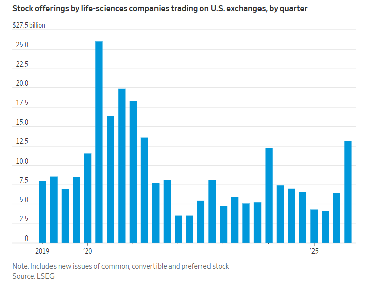

## 上市製藥公司第四季拋售股票超過130億美元，創四年多來新高。

[本·格里克曼](https://www.wsj.com/news/author/ben-glickman)

2026年1月12日 下午12:00 ET

在經歷了數年的低迷之後，投資者對生物科技公司持樂觀態度。 —— 《華爾街日報》記者 ARIANA DREHSLER

### 

快速概要

- - 美國藥物研發公司和生命科學公司在第四季度透過新股發行籌集了超過 130 億美元，這是自 2021 年第二季以來的最高水準。
    
- 生物技術公司 Apogee Therapeutics 和 Dyne Therapeutics 分別超額完成了融資目標，籌集了 3.45 億美元和超過 4 億美元。
    
- 受肥胖症藥物銷售熱潮、交易活動增加以及「害怕錯過」有利可圖的機會等因素的推動，投資者對生物技術的興趣日益濃厚。

華爾街再次敞開金庫，為高風險的藥物研發者提供資金。

近年來，許多小型生技公司融資舉步維艱。公開市場幾乎完全關閉。首次公開發行（IPO）大幅減少，已上市公司用於籌集更多資金的後續股票發行也寥寥無幾。一些生物技術公司甚至倒閉。

然而，從去年年底開始，投資者開始投入更多資金，為一些公司提供了急需的資金，以支付其昂貴的研發費用。

根據金融數據提供商倫敦證券交易所集團（LSEG）的數據，在美國交易所上市的藥物研發公司和其他生命科學公司在第四季度透過發行新股籌集了超過 130 億美元，這是自 2021 年第二季以來任何一個季度籌集到的最高金額。

[Apogee Therapeutics](https://www.wsj.com/market-data/quotes/APGE) [APGE -0.44 %減少；紅色向下三角形](https://www.wsj.com/market-data/quotes/APGE)該公司致力於開發免疫疾病的治療方法，10 月從投資者那裡籌集了約 3.45 億美元，超過了 3 億美元的目標。 

執行長邁克爾·亨德森表示，這家位於馬薩諸塞州沃爾瑟姆的公司在7月份公佈了可靠的試驗數據後，原本沒有計劃進行股票發行，但後來開始收到投資者的來信，他們表示如果公司改變主意，他們也會參與。

亨德森說：“這和之前的語氣截然不同。”

經歷了數年的低迷之後，生物科技公司——以及大型製藥公司——在華爾街[重新獲得了積極的關注。追蹤一系列生技產業股票](https://www.wsj.com/health/pharma/big-pharma-has-more-going-for-it-than-obesity-drugs-35ffd102?mod=article_inline)[的SPDR標普生物科技交易所交易基金（ETF）](https://www.wsj.com/market-data/quotes/etf/xbi)截至12月31日，較六個月前上漲了近50%。

這項改善部分原因是華爾街對肥胖症藥物銷售火熱和[交易量增加的](https://www.wsj.com/health/pharma/pfizer-and-metsera-reach-deal-worth-up-to-10-billion-be5def52?mod=article_inline)熱情，這表明投資者可以獲得豐厚的退出回報。 

此外，不專注於生命科學領域的綜合投資者也開始進行更多投資。

亨德森表示，過去與大型共同基金投資者進行的某些電話會議，通常只有一位專門研究生物技術的分析師參加，而現在則有近十位分析師和投資組合經理參加，其中包括一些幾乎沒有生命科學背景的人。

Apogee Therapeutics執行長邁克爾亨德森發現，更多投資者對該行業感興趣。 威廉·麥基

生物科技投資風險極高。大多數候選藥物都以失敗告終。業內人士和分析師表示，這些公司還面臨其他不利因素，包括美國政府削減撥款，這可能會削弱最終為企業帶來新藥的研究工作。

根據標普全球市場情報公司的數據，創投家和私募股權基金對生技的投資（通常流向早期階段的公司）仍遠低於 2021 年的峰值，且 2025 年比前一年略有下降。

業內人士表示，當金融家願意支持一家生物技術公司時，他們會進行選擇，並尋求投資於市場規模大或獲得監管部門批准途徑直接的藥物。

資金對新創企業至關重要。它們往往需要數年時間才能從正在研發的藥物中獲得任何好處。它們需要不定期地籌集資金，用於研究，如果候選藥物展現出足夠的潛力，則用於進行大型臨床試驗，最終實現藥物獲批和銷售。

新冠疫情期間，華爾街對生技的興趣激增，推動股價上漲，並帶來了充足的資金。但隨著利率上升，許多投資人開始縮減投資規模。資金提供者對投資標的更加挑剔，導致一些生技公司必須裁員或倒閉。

嚴峻[的市場環境](https://www.wsj.com/tech/biotech/ph-d-s-cant-find-work-as-bostons-biotech-engine-sputters-729f0036?mod=article_inline)一直持續到 2025 年，川普政府可能推出的監管政策變化帶來的不確定性打擊了生技股。

艾瑞克‧盧塞拉， [Dyne Therapeutics](https://www.wsj.com/market-data/quotes/DYN) [(DYN)](https://www.wsj.com/market-data/quotes/DYN)的財務官  [-1.49 %減少；紅色向下三角形](https://www.wsj.com/market-data/quotes/DYN)分析師和投資者回憶說，他們關注的是生物技術潛在投資的弊端，例如商業計劃可能會出現什麼問題，或者監管方面會遇到什麼障礙。

然而，從秋季開始，他們的問題更多地轉向了潛在療法的商業市場規模。盧塞拉說，他們似乎專注於不錯過任何可能帶來豐厚利潤的機會。

「你會開始產生 FOMO 情緒，」盧塞拉說道，他指的是生物技術領域一系列成功的商業發布和大型收購之後，人們害怕錯過機會的情緒。

同樣位於沃爾瑟姆的戴恩公司正在研發治療杜氏肌肉營養不良症和其他神經肌肉疾病的藥物。該公司在12月中旬的股票發行中從投資者那裡籌集了略高於4億美元的資金，也超過了目標金額。 

12月，[Structure Therapeutics](https://www.wsj.com/market-data/quotes/GPCR) [GPCR 1.09 %增加；綠色向上指向三角形](https://www.wsj.com/market-data/quotes/GPCR)該公司透過股票發行籌集了近7.5億美元，高於預期的6.5億美元。這家位於加州南舊金山的公司正在研發減肥藥，這是業界[最熱門的類別之一。](https://www.wsj.com/health/pharma/fda-approves-glp1-weight-loss-pill-6d6a6f2d?mod=article_inline)

執行長雷史蒂文斯表示：“我們很幸運，我們的商業模式非常契合我們目前所面臨的時代。”