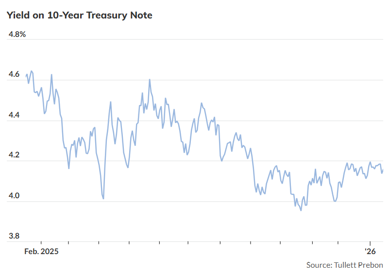

## 川普領導下的聯準會會採取措施應對5月的高通膨嗎？

[薇薇安·盧·陳](https://www.marketwatch.com/author/vivien-lou-chen?mod=MW_author_bio?mod=article_byline)

最後更新時間：2026年1月15日下午4:52（美國東部時間）  
首次發布：2026年1月15日下午4:13（美國東部時間）

通膨擔憂源於川普總統對聯準會主席鮑威爾繼任者的計畫存在不確定性、近期在海外的軍事行動以及金屬價格飆升。圖片： MarketWatch 圖片插圖/Getty Images，iStockphoto

重點

關於本摘要

- 金屬價格上漲、地緣政治風險以及聯準會獨立性受到威脅，加劇了人們對 2026 年通膨加速的擔憂。
    
- 繼 2025 年黃金和白銀價格分別上漲 64% 和 141% 之後，預計 2026 年黃金和白銀價格將分別上漲 6.7% 和 31%。
    
- 由於美國與伊朗之間的緊張局勢加劇，2026 年年度整體 CPI 比率可能接近 3%，高於 12 月的 2.7%。
    
金屬價格飆升、地緣政治風險以及聯準會獨立性受到威脅，開始引發擔憂，2026 年通膨增速可能會超過預期。

這對投資者來說至關重要，因為它可能會打破聯準會今年抑制物價上漲的預期。由於通膨率已經高於聯準會2%的年度目標，人們對物價走勢日益增長的擔憂可能會危及聯準會原定於2026年兩次降息（每次降息25個基點）的計畫。

雖然一些投資組合經理已經採取措施幫助保護他們的投資免受通貨膨脹的影響，但這些擔憂尚未完全反映在更廣泛的金融市場中。

例如，週四，備受關注的10年期美國公債殖利率出現波動。

儘管通膨交易員預計5月份年度整體CPI成長率將達到2.8%的峰值，但他們也認為，根據被稱為「定盤價」的衍生工具，該成長率將在年底前低於這一水平。此外，道瓊工業平均指數週四，受投資者對人工智慧的樂觀情緒以及銀行股反彈的影響，股市收盤價接近歷史最高點，幾乎沒有跡象表明投資者目前對通膨感到擔憂。

然而，今年通膨大幅上升的風險依然存在。

### 金屬價格飆升

「投資組合經理人都在私下討論這件事，試圖弄清楚如何在市場中定位自己，」紐約IFM Investors負責美國現金和固定收益投資組合的瑞安·韋爾登表示。鋼鐵等金屬價格上漲

正在「起到限制」汽車等熱門商品價格的作用，「這就是我們看到通貨膨脹有可能在美聯儲貨幣政策制定者心中佔據主導地位的地方」。

**MarketWatch Live：** [策略師稱，通膨擔憂是本週股市震蕩的核心原因。](https://www.marketwatch.com/livecoverage/stock-market-today-nasdaq-leads-sp500-dow-higher-taiwan-semi-record-ai-oil-silver-fall-iran-tension/card/inflation-worries-at-heart-of-back-and-forth-action-in-stocks-this-week-strategist-dOhMUcPhsMetHAIvhM3M?mod=article_inline)

金屬價格上漲日益引人注目，黃金價格也不例外。

繼 2025 年上漲 64% 和 141% 之後，2026 年至今貴金屬價格分別上漲了 6.7% 和 31%。貴金屬的快速上漲動能如今已蔓延至建築用工業金屬領域。

### 川普提名的聯準會主席人選

與此同時，市場參與者正等待川普總統提名人選接替鮑威爾——[鮑威爾是川普](https://www.marketwatch.com/story/trump-taps-powell-to-be-next-chairman-of-the-federal-reserve-2017-11-02?mod=article_inline)在其首個白宮任期第一年末任命的聯準會主席，當時川普表示[希望](https://www.marketwatch.com/story/trump-says-downside-to-picking-yellen-is-hed-like-to-make-his-own-mark-at-fed-2017-10-25?mod=article_inline)在聯準會留下自己的印記——鮑威爾的聯準會主席任期將於5月結束。他們擔憂新領導人的任命會對聯準會的獨立行動能力產生何種影響。芝加哥聯邦儲備銀行主[席奧斯坦古爾斯比](https://www.cnbc.com/2026/01/15/feds-goolsbee-says-inflation-could-come-roaring-back-if-central-bank-independence-goes-away.html)周四在接受CNBC採訪時指出：“如果你試圖剝奪央行的獨立性，通膨將會捲土重來。”

去年 12 月，川普在談到他[可能的聯準會人選](https://www.marketwatch.com/livecoverage/cpi-report-november-inflation-fed-economy-2026/card/trump-says-his-fed-pick-will-push-for-lower-interest-rates-by-a-lot-but-hikes-might-be-needed-next-year-hbpadYAKoatc4sThmHzs?mod=article_inline)時，將這個人描述為「相信大幅降低利率的人」。

**另見：**[聯準會「褐皮書」發現，美國各地企業正開始將關稅成本轉嫁給消費者](https://www.marketwatch.com/story/businesses-across-the-country-are-starting-to-pass-along-higher-costs-from-tariffs-feds-beige-book-finds-f5bfd0df?mod=article_inline)

### 伊朗和委內瑞拉關係緊張

據IFM Investors的韋爾登稱，考慮到美伊緊張局勢升級的風險，今年消費者物價指數（CPI）的年度總體通膨率和核心通膨率可能接近3%。這將高於週二公佈的[12月份年比整體通膨率2.7%和核心通膨率2.6%。](https://www.marketwatch.com/livecoverage/december-2025-cpi-report-today/card/cpi-rises-again-and-points-to-persistent-inflation-bjF29ooNBTLnaxY0CcW4?mod=article_inline)

身為貨幣市場證券的投資組合經理，韋爾登表示，他依靠浮動利率投資（其利息支付會定期自動調整）來幫助避免對聯準會未來六個月的行動做出預測。

韋爾登表示，交易員們預計聯準會在6月前降息的可能性為64%，但投資組合經理討論的焦點是「今年根本不可能降息」的風險。儘管聯準會主席可能即將換屆，而新任主席得到了川普的支持，預計他會力推降息，但聯準會今年或許很難實現降息。韋爾登指出，如果10年期公債殖利率「迅速」突破目前3.95%至4.2%的區間，並快速逼近4.3%，這將向更廣泛的金融市場發出「潛在問題」的訊號。

### 2026 年衝擊

投資者在新的一年開始對2026年通膨趨於穩定充滿信心，此前他們預期關稅將推高物價，但去年並未出現預期。週二公佈的12月消費者物價指數也提振了投資人信心，該指數顯示通膨並未進一步惡化。

但這些數據並未反映出此後出現的新因素，例如本月金屬價格的持續上漲，以及委內瑞拉領導人尼古拉斯馬杜羅被推翻後美國可能對伊朗採取軍事行動。此外，人工智慧的龐大需求預計將推高電費，這也加劇了電費上漲的趨勢。

總部位於芝加哥的Empower首席投資策略師瑪爾塔·諾頓指出，人工智慧的普及對通膨的影響不僅限於電力產業。截至9月份，Empower管理的資產規模達2兆美元。資料中心建設是銅價飆升的催化劑之一。

她在給MarketWatch的電子郵件中表示，這些價格最終會波及住宅建設。此外，黃金、白銀和錫等大宗商品的價格波動對工業生產成本的影響各不相同，“這意味著它們的價格仍然是整體經濟通膨的來源。”

諾頓表示，還有一個問題是，2026 年的財政和貨幣刺激措施，特別是聯準會最近的降息和川普的減稅舉措，「是否能使需求保持在足夠高的水平，從而對整個經濟帶來不大的價格緩解」。

位於德州普萊諾的Wisdom Fixed Income Management的投資組合經理Vincent Ahn表示，他仍然對2026年通膨上行風險感到擔憂，並補充說「我們還沒有完全脫離危險」。他表示，大宗商品「是宏觀經濟討論的一部分，但從整體上看，重要的並非某一次價格飆升，而是更高的投入成本是否會轉化為更頑固的價格、更高的工資和更穩定的通膨預期」。 “我的基本判斷是，金屬價格可能會帶來令人不安的意外上漲，但這更有可能只是星星之火，而不是熊熊烈火。”

任何日益加劇的通膨擔憂都可能首先在債券市場顯現，表現為國債拋售，從而推高收益率，並導致所謂的“收益率曲線陡峭化”，即短期和長期債券收益率之間的差距擴大。 「這就是為什麼我們竭力避免進行大額久期押注的原因，」安表示。

達拉斯 GuideStone Funds 的投資組合經理 Josh Chastant 負責監管該公司共同基金的所有股票和固定收益持倉，他表示，現在他看到了一個顯著的風險，即通膨率全年都將高於美聯儲 2% 的目標。

「我們確實擔心通膨可能會比人們預期的更難逆轉。今年大宗商品需求旺盛，尤其是隨著人工智慧的普及，銅的需求更是激增，」他說。但他接著表示，“我們總體上持倉較為中立，並未對2026年通膨預期高於預期進行任何大規模押注。”儘管如此，他補充道，“我們不會完全排除這種可能性。”

查斯坦特表示：“美聯儲的獨立性是我們必須認真考慮的問題。下一任美聯儲主席將會是一位更加寬鬆的美聯儲主席，更願意考慮降息，並將貨幣政策轉向更加刺激性的立場。”