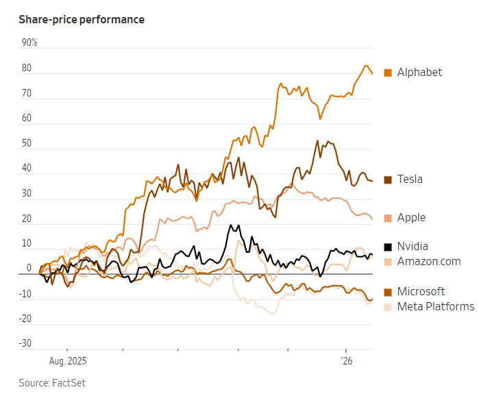

## 維繫該板塊股票的人工智慧交易正在瓦解，目前大多數股票的表現都落後於整體市場。

[漢娜·艾琳·朗](https://www.wsj.com/news/author/hannah-erin-lang)

2026年1月18日 晚上9:00 ET

埃米爾·倫多夫/華爾街日報

曾經的「七巨頭」如今變成了「五巨頭」。或者應該說是「四巨頭」？投資人對市場上的大型科技股的分類方式已經不再完全一樣了。

過去一年，華爾街曾經最青睞的幾家巨型公司的命運出現了分歧，專業投資者和普通投資者都對人工智慧領域的支出熱潮持更加謹慎的態度。 

2025年，只有[Alphabet](https://www.wsj.com/market-data/quotes/GOOGL)和[Nvidia的](https://www.wsj.com/market-data/quotes/NVDA)表現優於標普500指數。而今年迄今，七大巨頭（Mag Seven）中的五隻股票表現遜於大盤基準。基金經理人表示，這個頭銜——其他五家公司分別是[微軟](https://www.wsj.com/market-data/quotes/MSFT)、[Meta Platforms](https://www.wsj.com/market-data/quotes/META)、[蘋果](https://www.wsj.com/market-data/quotes/AAPL)、[亞馬遜](https://www.wsj.com/market-data/quotes/AMZN)和[特斯拉](https://www.wsj.com/market-data/quotes/TSLA)——不再是股市明星的代名詞。

“這種相關性已經消失了，”巴恩森集團首席投資官大衛·巴恩森表示，“它們的共同點是都是市值萬億美元的公司。”

這表明，自從牛市狂潮開始以來，人工智慧交易已經發生了變化，交易員現在比以往更加謹慎地進行投資。有些人預期人工智慧的益處[將擴展](https://www.wsj.com/finance/stocks/the-stock-market-rally-isnt-just-about-tech-anymore-d42267e2?mod=article_inline)到醫療保健等產業；有些人則加倍投資晶片製造商或能源公司，他們預計這些公司將為人工智慧的普及提供動力。

「你開始看到它的範圍越來越廣了，」美國銀行策略師麥可哈特內特說。他於2023年創造了「七俠」這個稱號，這個名字來自一部經典的西部電影，講述了七位英勇的槍手拯救一個小鎮的故事。 「下一個『七俠』將是那些能夠證明人工智慧正在改變其龐大業務的巨型公司，」他說。

“別忘了，在電影裡，只有少數人倖存下來。”

許多曾是Mag Seven忠實股東的個人投資者也開始將目光轉向市場的其他板塊。 Vanda Research的數據顯示，去年這些散戶投資人在這七隻股票的總交易量中所佔比例遠低於2023年或2024年。

特斯拉長期以來深受一般投資人青睞，但其零售交易量卻出現了最大幅度的下滑。預計到2025年，特斯拉的日均零售成交額將比兩年前投資者興趣達到高峰時下降43%。

哈特內特表示，他最初將這些股票歸為一類，是因為它們都是規模龐大、運作良好且在科技領域佔據主導地位的公司。但人工智慧領域的競爭已經讓這七家巨頭公司之間產生了裂痕，而這種裂痕已經持續了一段時間。

亞馬遜、Alphabet、微軟和Meta如今已成為“超大規模資料中心營運商”，它們斥資[數千億美元](https://www.wsj.com/tech/ai/big-tech-is-spending-more-than-ever-on-ai-and-its-still-not-enough-f2398cfe?mod=article_inline)用於訓練新的人工智慧模型、建立資料中心或擴展雲端運算能力。英偉達[仍然主導著](https://www.wsj.com/tech/ai/nvidia-ai-chips-competitors-amd-broadcom-google-amazon-6729c65a?mod=article_inline)驅動最先進人工智慧模型所需的晶片市場。

與此同時，其他公司則落後了。去年，蘋果股價表現遜於標普500指數，當時這家iPhone製造商因在人工智慧領域投入不足、落後於競爭對手而飽受批評。特斯拉的股票曾經是市場上的佼佼者，但由於其電動車銷量[放緩，](https://www.wsj.com/business/autos/tesla-sales-drop-for-second-year-in-a-row-958dec20?mod=article_inline)其表現遠遜於其他幾家「七大巨頭」 。 

「它們都處於不同的發展階段，」道富投資管理公司首席投資策略師麥可·阿羅內表示。 “水漲船高，所有船隻都受益，現在我們將看到贏家和輸家。” 

儘管這七家公司的發展方向可能各不相同，但它們對市場的影響力依然舉足輕重。根據道瓊市場數據顯示，它們合計約佔標普500指數市值的36%。

華爾街留下了一系列早已過時的 [綽號和縮寫。](https://www.wsj.com/finance/stocks/stock-market-trends-names-performance-ed204099?mod=article_inline)

在 1960 年代末，出現了「漂亮五十」（Nifty Fifty）——一組涵蓋多個行業的股票——並因此流行起來。之後又出現了「金磚四國」（BRIC）——將巴西、俄羅斯、印度和中國這四個新興市場股票歸為一類——以及「WATCH」——代表[沃爾瑪](https://www.wsj.com/market-data/quotes/WMT)、亞馬遜、[塔吉特](https://www.wsj.com/market-data/quotes/TGT)、[好市多](https://www.wsj.com/market-data/quotes/COST)和[家得寶](https://www.wsj.com/market-data/quotes/HD)等零售商。

更不用說 BAT（中國的[百度](https://www.wsj.com/market-data/quotes/BIDU)、[阿里巴巴集團](https://www.wsj.com/market-data/quotes/HK/XHKG/9988)和[騰訊）、FANG（Mag Seven 的前身，由 Facebook、亞馬遜、](https://www.wsj.com/market-data/quotes/HK/XHKG/700) [Netflix](https://www.wsj.com/market-data/quotes/NFLX)和谷歌母公司 Alphabet組成）、FAANG（同一集團，但加入了蘋果）以及 Granolas（由 11 家歐洲大型公司組成的集團，包括[葛蘭素史克](https://www.wsj.com/market-data/quotes/UK/XLON/GSK)、[羅氏](https://www.wsj.com/market-data/quotes/CH/XSWX/ROG)和[諾和諾德](https://www.wsj.com/market-data/quotes/DK/XCSE/NOVO.B)）。

「七巨頭」或許已經失去了投資者最初將它們聯繫起來的原因。但就目前而言，還沒有其他股票組合可以取代它們的地位。

 阿羅內說：“目前還沒有合適的替代人選，但我認為以後可能會有。”