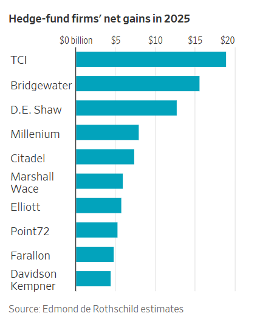

## 億萬富翁和其他選股者利用地緣政治不確定性和人工智慧熱潮獲利

[凱特琳·麥凱布](https://www.wsj.com/news/author/caitlin-mccabe)

霍恩（Chris Hohn），TCI 基金管理公司創辦人。 Naina Helén Jåma/彭博新聞

### 

快速概要

- 由克里斯·霍恩領導的 TCI 基金管理公司在 2025 年為客戶創造了 189 億美元的收益，創下了對沖基金公司有史以來最大的年度美元收益紀錄。
    
- TCI 的主基金實現了 27.8% 的收益，這主要得益於對 GE Aerospace、Safran 和 Airbus 等航空航太公司的大量投資。
    
- 2025 年，前 20 名的對沖基金回報率為 15.7%，超過了整個對沖基金產業 12.6% 的回報率。
    

本摘要由人工智慧工具依文章正文生成，並經編輯審核。[了解更多](https://www.wsj.com/news/author/wsj-artificialintelligencetools)關於我們如何在新聞報導中使用人工智慧的資訊。

2025年對選股者來說是豐收的一年。不信你可以問問對沖基金億萬富翁克里斯霍恩。 

英國投資者旗下的TCI基金管理公司去年為客戶創造了189億美元的收益，使其成為2025年最賺錢的對沖基金公司。這是瑞士投資公司埃德蒙·德·羅斯柴爾德（Edmond de Rothschild）最新估算的結果，該公司每年都會根據扣除費用後的美元收益編制一份全球頂級基金經理榜單。

報告稱，TCI的收益是埃德蒙·德·羅斯柴爾德記錄中對沖基金公司取得的最大年度美元收益，超過了[城堡投資集團在2022年創下的160億美元的紀錄。這也遠超過](https://www.wsj.com/livecoverage/stock-market-news-today-01-23-2023/card/citadel-breaks-hedge-fund-records-with-16-billion-haul-last-year-UmHSfyoLZTxv3AgwSNZU?mod=article_inline)[約翰·保爾森在2007年做空房地產市場所獲得](https://www.wsj.com/articles/SB120036645057290423?mod=article_inline)的150億美元收益。以上數據均未根據通貨膨脹進行調整。

地緣政治的不確定性使得去年成為股票投資者的天堂，貿易戰和真正的戰爭在全球各地爆發。人工智慧在去年大部分時間裡的蓬勃發展——以及隨後對泡沫的擔憂——也為押注股票的投資者提供了肥沃的土壤。

根據埃德蒙·德·羅斯柴爾德的估計，像史蒂夫·曼德爾的孤松資本和約翰·阿米蒂奇的埃格頓資本這樣的選股公司都受益於這種有利的經濟環境。扣除費用後，每家公司都為投資者賺了約40億美元。

對於TCI而言，長期以來對航空航太公司的大量投資獲得了豐厚的回報。知情人士透露，這家總部位於倫敦的公司持有美國噴射發動機製造商[GE Aerospace](https://www.wsj.com/market-data/quotes/GE)、法國航空航太供應商[賽峰集團](https://www.wsj.com/market-data/quotes/FR/XPAR/SAF)和歐洲飛機製造[商空中巴士](https://www.wsj.com/market-data/quotes/FR/XPAR/AIR)[的大量股份。去年，隨著投資人押注可望受惠於軍費支出成長的](https://www.wsj.com/finance/investing/europe-defense-stock-performance-aab0e211?mod=article_inline)股票，這三家公司的股價都出現上漲。

知情人士透露，TCI 的主基金年底收益率為 27.8%。

霍恩是牙買加一名汽車修理工的兒子，他在 2003 年創立了 TCI，並迅速贏得了對沖基金行業最具戰鬥力的激進投資者之一的美譽。 

TCI成立不到兩年，他就成功迫使[德意志交易所](https://www.wsj.com/market-data/quotes/XE/XETR/DB1)放棄收購[倫敦證券交易所](https://www.wsj.com/market-data/quotes/UK/XLON/LSEG)的計畫——這場鬥爭最終導致這家德國公司執行長離職。這位高層後來將他與對沖基金的鬥爭經歷寫成了一本書，名為《蝗蟲入侵》。

隨後幾年，TCI高調推動荷蘭銀行ABN Amro被分拆或出售，最終促成了2007年由[蘇格蘭皇家銀行牽頭的財團將其收購。 （這筆交易被普遍認為是導致這家英國銀行在金融危機期間需要政府救助的原因之一。）之後，在2008年，霍恩的公司成功發起了一場代理權爭奪戰，獲得了鐵路運營商](https://www.wsj.com/market-data/quotes/UK/XLON/NWG)[CSX](https://www.wsj.com/market-data/quotes/CSX)的董事會席位。

最近，在 2022 年，TCI 呼籲Google母公司[Alphabet 大幅削減成本](https://www.wsj.com/articles/activist-investor-calls-on-google-parent-alphabet-to-slash-costs-11668528859?mod=article_inline)和員工人數。

然而，霍恩也以依靠基本投資策略獲得豐厚回報而聞名：大量買入公司股票並讓其持續成長。去年底，他的投資組合中還包括[Visa](https://www.wsj.com/market-data/quotes/V)、[微軟](https://www.wsj.com/market-data/quotes/MSFT)、穆迪以及貨運鐵路公司加拿大太平洋堪薩斯市分公司。

TCI 2025 年的巨額收益部分歸功於其規模：根據 Edmond de Rothschild 的數據，截至去年年底，該公司管理的對沖基金資產規模達 771 億美元。這使得 TCI 在最新排名中位列第三大對沖基金管理公司，僅次於千禧管理公司 (Millennium Management) 和艾利歐特投資管理公司 (Elliott Investment Management)。

整體而言，2025年對大多數避險基金策略來說都是豐收的一年。押注經濟重大變革的宏觀對沖基金公司受益於各類資產的波動。押注併購和其他企業事件的事件驅動基金也獲得了豐厚的回報。

報告顯示，由雷·達裡奧創立的宏觀對沖基金公司橋水基金去年收益位居第二，淨收益達156億美元。總部位於紐約的量化巨頭德劭集團緊隨其後，為客戶創造了127億美元的收益。

「去年一切都很順利，基金經理人幾乎沒有遇到任何問題，」埃德蒙·德·羅斯柴爾德公司的高級顧問里克·索弗說，該公司本身也投資於對沖基金。

這份年度報告以公司為投資者創造的美元收益為標準來評估它們，而不是像通常那樣以私下分配給投資者的百分比收益。該調查重點關注自成立以來盈利最多的對沖基金，這意味著規模更大、歷史更悠久的公司通常會佔據前20名的大部分席位。

去年，前20名的對沖基金在傳統意義上也表現出色。埃德蒙·德·羅斯柴爾德的報告顯示，這些頂級基金經理人去年的回報率為15.7%。相較之下，根據研究公司HFR的數據，整個對沖基金產業的報酬率為12.6%。

索弗表示，推動一些最大基金績效的因素包括：高於平均的費用，這使他們能夠吸引和留住頂尖的投資組合經理，並擁有更複雜的風險管理系統。

報告顯示，自成立以來，城堡投資集團（Citadel）一直保持著最賺錢對沖基金公司的地位。根據埃德蒙·德·羅斯柴爾德估計，肯·格里芬領導的這家公司自1990年成立以來，在扣除費用後已為投資者賺取了904億美元。分析估計，城堡投資集團去年為投資者創造了74億美元的收益。