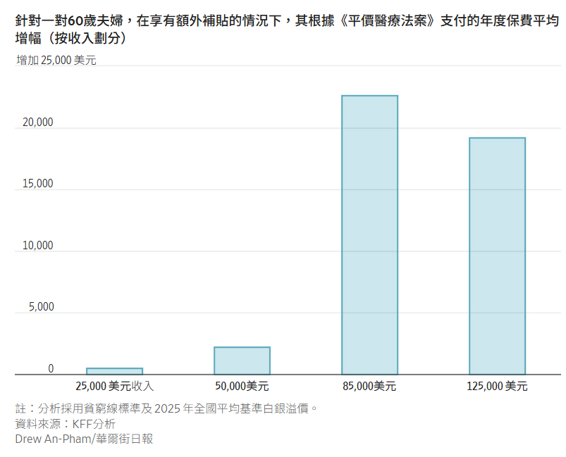

## 對於依賴歐巴馬醫改的中等收入者來說，每月醫療保險費用正在飆升。

[瑞秋路易斯恩賽恩](https://www.wsj.com/news/author/rachel-louise-ensign)

2026年1月26日 上午5:30 ET

[187](https://www.wsj.com/health/healthcare/aca-health-insurance-cost-subsidies-expire-37a595a9?mod=hp_lead_pos2#comments_sector)

預計許多人會選擇放棄醫療保險計劃，而不是支付更多費用。 勞倫佩特拉卡為《華爾街日報》撰稿

### 

快速概要

- 隨著《平價醫療法案》擴大補貼於 12 月 31 日到期，數百萬美國人面臨不斷上漲的醫療保險費用。
    
- 預計享有 ACA 補貼的普通受保人的保費帳單將增加 114%，從 2025 年的平均每年 888 美元增加到 2026 年的 1904 美元。
    
- 由於保費上漲幅度過大，許多人正在考慮取消保險。
數百萬美國人開始發現他們的每月醫療保險帳單上漲，這對於一個仍然對高昂的生活成本感到沮喪的國家來說，又是一個新的壓力點。

在面臨最大幅度美元漲幅的人群中，許多是中等收入的美國人，他們透過政府的《平價醫療法案》（又稱歐巴馬醫改）設立的市場購買醫療保險。

根據《平價醫療法案》（ACA）為參保人員提供的擴大補貼[已於12月31日到期——這是去年創紀錄的政府停擺的核心爭議點](https://www.wsj.com/politics/policy/government-shutdown-aca-subsidies-obamacare-762ed9a9?mod=article_inline)。停擺結束後，補貼問題仍未解決，立法者也未通過任何法案來恢復這些補貼。

現在，新計算出的保險帳單即將到期，美國人必須考慮如何支付，否則只能放棄保險。

47歲的倫尼和曼迪·威爾遜夫婦住在西維吉尼亞州查爾斯頓，去年他們每月支付255美元購買了一份低端的ACA醫療保險計劃。去年年底，他們得知自己的保費將漲到每月2,155美元，這筆費用幾乎是他們每月約760美元房貸的三倍。  

曼蒂和倫尼·威爾遜 黛博拉·霍克

威爾森夫婦在2025年底前各自擠出時間做了最後一次體檢，現在他們決定不再購買醫療保險。他們計劃把原本用來支付保費的錢存入應急基金。他們將放棄任何預防性醫療服務，並希望他們微薄的儲蓄能夠支付所有醫療費用。

他們的ACA保險「雖然不是最好的方案，但它確實給我們提供了一些保障，確保萬一發生什麼事我們不會破產，」倫尼·威爾遜說道，他與人合夥經營一家IT公司。他的妻子曼迪·威爾遜是一名陶藝家。 

沒有醫療保險的生活讓人感覺很不穩定。 「如果我們不小心從梯子上摔下來，去了急診室，或者因為任何原因需要在醫院過夜，幾乎會讓我們傾家蕩產，」倫尼說。

這對夫婦面臨如此大幅度的增幅，是因為他們年收入加起來約11萬美元，超過聯邦貧窮線的4倍。這個群體受補貼到期的影響最大。 

在疫情期間，國會[擴大了對《平價醫療法案》(ACA) 計劃的補貼](https://www.wsj.com/livecoverage/covid-2021-03-09/card/WTSZG4LTb5XntiMGBmcc?mod=article_inline)，使許多家庭的收入超過貧困線的 400%——2025 年美國本土 48 個州單身人士的貧困線為 62,600 美元，四口之家的貧困線為 128,600 美元。

那些缺乏良好工作場所醫療保險選擇的中等收入人群——例如提前退休人員、獨立承包商和小企業主——迅速註冊了《平價醫療法案》（ACA）。非營利組織凱撒家庭基金會（KFF）估計，到2025年，約有10%的ACA受保者（約250萬人）的年收入超過400%。

現在，隨著補貼的消失，他們的收入通常太高，不符合醫療補助計劃的資格，而且年齡太小，無法參加醫療保險計劃。 

[根據凱撒家庭基金會 (KFF) 預測，如果享受《平價醫療法案》(ACA) 補貼的](https://www.wsj.com/health/healthcare/affordable-care-act-subsidies-charts-3ec139fa?mod=article_inline)普通參保人繼續沿用之前的保險計劃，他們的保費預計將上漲 114%，從 2025 年的平均每年 888 美元上漲到 2026 年的 1904 美元。對於擁有此類保險的中等收入和中上收入家庭來說，保費的漲幅通常要高得多。

“有人哭了，有人大喊大叫，還有人說，‘我乾脆就不買保險了’，”猶他州米爾克里克市的健康保險經紀人麗貝卡·耶茨在談到客戶得知新費率後的反應時說道。

  

路易絲·諾里斯是 healthinsurance.org 的健康政策分析師，該網站隸屬於一家銷售 ACA 計劃的機構。她表示，收入略高於 400% 門檻，且年齡較大或居住在西維吉尼亞州等醫療保健成本較高的州的人們，正面臨最大的價格上漲。

有些漲幅非常驚人。假設一對居住在懷俄明州夏延市的63歲已婚夫婦，年收入8.5萬美元，剛好超過400%的漲幅門檻，根據諾里斯的分析，他們原本無需支付任何費用即可參加低端的《平價醫療法案》（ACA）計劃，但現在每月需要支付3417美元，這筆費用大約相當於他們前總收入的一半。

凱撒家庭基金會（KFF）《平價醫療法案》（ACA）計畫主任辛西婭·考克斯表示，許多人——通常是健康且年輕的人——預計會放棄醫保，而不是支付更多費用。國會預算辦公室去年預測，如果擴大後的補助到期，到2034年將新增420萬無健保人口。

民主黨人表示，讓這些補貼到期相當於對中產階級家庭增稅，而許多共和黨人則表示，保留這些補貼將用納稅人的錢來扶持保險公司的業務。

民主黨和共和黨的談判代表一直在努力就短期延長《平價醫療法案》（ACA）的補貼達成協議，但這項努力被認為希望渺茫。本月初，川普總統[提出了一項計劃](https://www.wsj.com/politics/policy/trump-releases-healthcare-framework-aimed-at-lowering-costs-2716844e?mod=article_inline)，他表示該計劃將降低ACA的保費，並直接向消費者提供醫療費用補貼。白宮發言人庫什·德賽表示：“川普總統的‘偉大醫改計劃’的每一項內容都真正為普通美國民眾帶來了可負擔的醫療保健。” 

醫療保健成本上漲之際，民眾普遍擔憂醫療費用負擔能力。儘管整體通膨有所降溫，但仍高於聯準會2%的目標水平，而且去年咖啡和牛肉等某些必需品的價格顯著上漲。消費者仍然對遠高於五年前的[物價感到不滿。](https://www.wsj.com/personal-finance/the-middle-class-is-buckling-under-almost-five-years-of-persistent-inflation-4d783aee?mod=article_inline)

艾米和史蒂芬·沃克夫婦經營幾家小型公司，為企業提供行銷和其他服務。這對夫婦住在喬治亞州，育有五個孩子。他們去年的收入約為12萬美元，但預計今年的收入會更高，達到去年的400%以上。他們一家的平價醫療法案（ACA）計畫也涵蓋了四個孩子，保費將從每月約300美元飆升至每月3,300美元，遠遠超過他們每月2,800美元的房貸。 

這家人透過旗下的一家公司購買了一份團體醫療保險，每月保費2,200美元。 50歲的史蒂芬沃克去年中風，雖然恢復良好，但仍需要大量的後續護理。 「對我們來說，沒有醫療保險真的別無選擇，」45歲的艾米沃克說。 

#### 分享你的想法

_如何才能最好地解決中產階級家庭面臨的高昂醫療費用問題？歡迎在下方參與討論。_

為了應對不斷上漲的生活成本，他們取消了串流平台的訂閱，更換了更便宜的汽車保險，並減少了亞馬遜上的購物。艾米每週工作60小時，她希望透過花更多時間向新客戶推銷產品來增加收入。她還希望將目前許多行政工作交給她正在訓練的人工智慧助理。

即使是幅度較小的成長也難以接受。收入低於貧窮線400%的家庭仍在獲得補貼，但補貼金額往往低於以往。 

卡梅倫‧施韋策是一位34歲的副教授，也是舊金山地區一所基督教神學院的校區主任。他透過工作單位獲得醫療保險，但必須為妻子和兩個年幼的孩子購買《平價醫療法案》（ACA）的保險。他們一家的收入低於400%的最低標準。儘管如此，他們的ACA月保費卻從去年的650美元漲到了今年的720美元，但保障範圍卻有所縮水。 

新年才過了不到一個月，這家人又增加了一筆醫療開支。他們的兒子同時得了結膜炎和流感，女兒發燒咳嗽不止。這些就醫帶來的高額保費和自付費用，將會蠶食施韋策每月努力存下的1,000美元。 

「我知道我的處境沒有其他人那麼糟糕，但我對不斷上漲的醫療費用感到沮喪，」他說。他正在考慮找一些兼職教書來增加收入，但收入增加可能只會推高他們的保險費用。

## AI

這篇新聞對於美國醫療保險公司（如 UnitedHealth, Humana, CVS/Aetna, Cigna, Centene, Elevance Health）來說，是一個**結構性的利空消息**，且影響層面複雜。

雖然直覺上「保費上漲 = 保險公司收入增加」，但事實上，這篇報導揭示了保險公司正面臨**「死亡螺旋 (Death Spiral)」**的初期徵兆。

以下是針對這篇新聞對保險公司財務與營運影響的深度分析：

### 1. 核心衝擊：逆向選擇 (Adverse Selection) 的惡夢

這是保險業最害怕的詞彙。

- **新聞現象：** 「許多人——通常是健康且年輕的人——預計會放棄醫保，而不是支付更多費用。」（如文中的 Wilson 夫婦放棄保險，改存應急基金）。
    
- **對保險公司的影響：**
    
    - **健康的羊跑了：** 那些繳保費但很少看病的年輕人、健康中產階級，因為補貼取消、保費暴漲而選擇「裸奔 (Uninsured)」。這群人原本是保險公司的利潤來源。
        
    - **生病的狼留下了：** 像文中 50 歲中風的 Walker 先生，因為有剛性醫療需求，不得不咬牙續保。
        
    - **結果：** 保險池 (Risk Pool) 變髒了。留下來的都是高風險、高理賠的人。這會導致保險公司的**賠付率 (Medical Loss Ratio, MLR)** 急劇飆升，嚴重侵蝕獲利。
        

### 2. 營收懸崖 (Revenue Cliff)：會員數流失

- **新聞數據：** 「國會預算辦公室預測...到 2034 年將新增 420 萬無健保人口。」且 KFF 估計約 250 萬 ACA 受保者年收入超過 400% 貧窮線，受傷最重。
    
- **對保險公司的影響：**
    
    - **Centene (CNC) 和 Elevance Health (ELV)：** 這兩家是 ACA 市場（歐巴馬醫改市場）的龍頭。補貼到期直接打擊他們的核心客群。
        
    - **會員流失 = 營收下降：** 失去數百萬付費會員，直接導致營收預測下修。更慘的是，流失的是原本由政府穩定買單（補貼）的優質營收。
        

### 3. 壞帳風險增加 (Bad Debt Exposure)

- **新聞現象：** 「新計算出的保險帳單即將到期... 威爾遜夫婦...決定不再購買醫療保險。」
    
- **對保險公司的影響：**
    
    - **欠費率上升：** 在補貼取消的過渡期，許多保戶可能會拖欠保費，或者在欠費寬限期內看病然後斷保。這會增加保險公司的行政成本和壞帳準備金。
        

### 4. 政治風險與監管壓力 (Regulatory Backlash)

- **新聞背景：** 「民主黨人表示...相當於增稅，共和黨人表示...扶持保險公司業務。」、「川普總統提出了一項計劃...降低 ACA 保費。」
    
- **對保險公司的影響：**
    
    - **兩面不是人：** 保費暴漲（雖然是因為政府補貼取消），但選民會把怒氣發洩在「貪婪的保險公司」身上。
        
    - **川普的「偉大醫改」：** 雖然細節不明，但如果川普為了平息民怨，強制要求保險公司推出「低價、低保障」的計畫（Skinny Plans），這會打亂保險公司的精算模型，且這類計畫利潤極低。
        

### 5. 對特定公司的差異化影響

- **最大受害者：Centene (CNC), Molina (MOH)**
    
    - 這兩家公司高度依賴政府補貼的市場（Medicaid 和 ACA Exchange）。ACA 補貼消失對它們是**重大利空**。它們的商業模式就是靠「量」來賺取政府合約，現在「量」要縮水了。
        
- **中度受害者：CVS Health (Aetna), Elevance Health (ELV)**
    
    - 它們有 ACA 業務，但也有龐大的企業團體保險（Employer-sponsored）業務。
        
    - **轉單效應：** 文中提到 Walker 一家透過自己的公司改買「團體保險」。這意味著部分 ACA 流失的客戶可能會轉向團體保險，這對 Aetna 或 UnitedHealth 的企業部門稍有緩解，但整體仍是負面的。
        
- **相對抗跌：UnitedHealth Group (UNH)**
    
    - 雖然它也有保險業務，但它旗下的 **Optum** 部門（提供醫療服務、數據分析、藥品福利管理）佔比很大。就算保戶變少，只要美國整體的醫療支出沒變（生病還是要看醫生），Optum 還是能賺錢。
        

### 投資總結

這篇新聞確認了美國醫療保險業進入了**「去補貼後的陣痛期」**。

- **短期 (2026年 Q1-Q2)：** 財報將非常難看。會員數 (Membership) 下降，賠付率 (MLR) 上升。股價會持續承壓。
    
- **長期隱憂：** 如果這種情況持續，保險公司為了生存，明年會**進一步調漲保費**，導致更多健康人退保，形成真正的「死亡螺旋」。
    

**建議：** 目前應**避開**高度依賴 ACA 市場的保險股（如 Centene）。除非國會突然通過新的補貼法案，否則這個板塊的基本面正在惡化。

## UNH 賣出?

先別急著恐慌拋售。雖然這篇新聞對保險業整體氛圍不利，但直接把 **UnitedHealth Group (UNH)** 賣掉可能是一個**「錯殺」**的決定。

為什麼？因為在這場醫療保險的風暴中，UNH 的體質和我們剛才提到的 Centene (CNC) 或 Molina (MOH) 有著**本質上的不同**。

以下是針對您手中 UNH 持股的深度評估，幫助您做決定：

### 1. UNH 對「ACA 補貼消失」的免疫力最強

這篇新聞的核心利空是 **「歐巴馬醫改 (ACA) 補貼到期」**。

- **Centene (CNC)：** 它是 ACA 市場的霸主，營收極度依賴這些拿補貼的客戶。補貼沒了，它的客戶就跑了。這對它是致命傷。
    
- **UnitedHealth (UNH)：** 它的主力戰場在 **「企業團體保險 (Commercial)」** 和 **「聯邦醫療保險優勢計畫 (Medicare Advantage, MA)」**。
    
    - UNH 雖然也有參與 ACA 市場，但佔比相對較小。
        
    - 文中提到像 Walker 一家因為 ACA 太貴而**轉向「公司團體保險」**，這反而可能讓 UNH 的企業保險部門受惠（因為 UNH 是團體保險的龍頭）。
        

**結論：** 這則新聞打擊的是 UNH 的競爭對手，對 UNH 本身的直接財務衝擊有限。

### 2. Optum：UNH 的最強護城河

請記住，UNH 不只是一家保險公司，它擁有一半的 **Optum (醫療服務與科技)** 業務。

- **邏輯：** 就算人們因為保費太貴而退保（如新聞所說），**他們生病了還是得看醫生、還是得買藥**。
    
- **Optum 的角色：**
    
    - **Optum Health：** 擁有數萬名醫生。
        
    - **Optum Rx：** 這是全美前三大的藥品福利管理商 (PBM)。
        
- **對沖效應：** 如果保險端因為賠付率上升而虧錢，Optum 端（收醫療費、賣藥）反而會因為醫療使用量增加而賺錢。這就是 UNH 股價通常比其他同業抗跌的原因——它是**「垂直整合」**的巨無霸。
    

### 3. UNH 真正的風險在哪裡？ (您該擔心的事)

雖然 ACA 新聞不是賣點，但 UNH 並非沒有風險。如果您要賣，應該是因為以下這兩個原因，而不是因為那篇新聞：

- **風險 A：醫療使用率 (Utilization Rate) 全面失控**
    
    - 如果美國人（不管是拿什麼保險）突然都跑去動手術（例如膝關節置換、心臟手術等積壓需求釋放），這會拉高整體的賠付率。這會影響 UNH 的利潤率。這是目前華爾街最盯著看的指標。
        
- **風險 B：Medicare Advantage (MA) 的費率砍價**
    
    - 這是 UNH 的核心命脈。美國政府 (CMS) 最近對 MA 計畫的撥款費率越來越摳門。如果 2026 年政府給的費率太低，UNH 的成長故事會受阻。
        

---

### 您的操作建議 (Action Plan)

根據您的投資屬性，建議如下：

#### **情境一：如果您是「長線投資者」 (存股/長期持有)**

- **建議：** **續抱 (Hold) 或 逢低加碼 (Buy on Dip)**。
    
- **理由：**
    
    - 這篇新聞會導致整個板塊（XLV 或 IHF ETF）被拋售，UNH 會被「錯殺」帶衰下跌。
        
    - 歷史經驗顯示，當政策性恐慌發生時，UNH 這種擁有強大現金流和多元業務的龍頭，最後都會創新高。
        
    - 它的 Optum 業務是醫療界的「基礎設施」，長期趨勢向上。
        

#### **情境二：如果您是「波段交易者」 (做價差)**

- **建議：** **觀察技術支撐，跌破止損**。
    
- **理由：**
    
    - 短期內，市場情緒極差 (Sentiment is Bearish)。資金會從醫療保險板塊撤出，轉向科技或能源（如我們討論的 VST/GEV）。
        
    - 這篇新聞雖然不傷 UNH 筋骨，但會讓它短期內缺乏上漲動能。您可以先獲利了結，把資金移到更有爆發力的 **電力基建股 (GEV, PWR)**，等 UNH 跌穩了再接回來。
        

### 總結

**不要因為「別人（Centene）家失火」就賣掉「自己家（UNH）的房子」。**

這篇新聞對 **Centene (CNC)** 是大利空，對 **UNH** 只是噪音。除非您發現 UNH 在即將公佈的財報中承認「醫療賠付率 (MLR) 失控」，否則目前 UNH 仍然是醫療板塊中最安全的避風港。