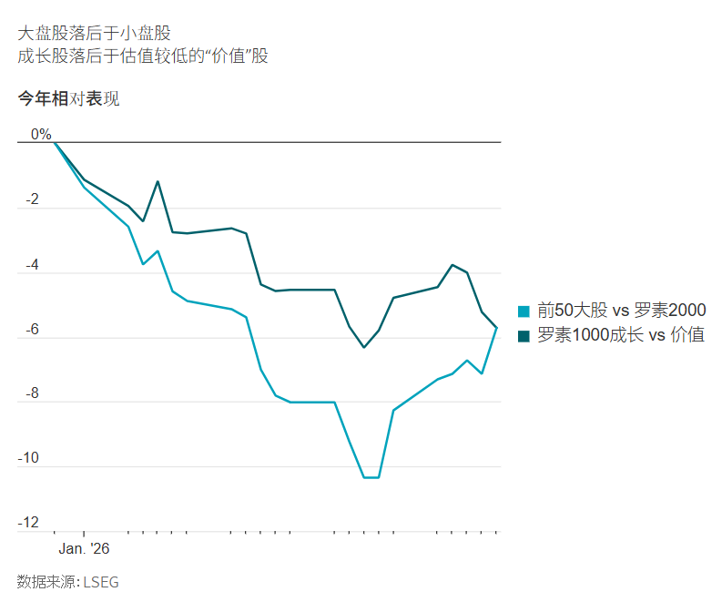

## 上周五貴金屬價格的暴跌表明，在一輪已遠遠脫離現實的漲勢中追高是十分危險的。

[James Mackintosh](https://www.wsj.com/news/author/james-mackintosh)

2026年2月2日 10:55 CST

如果[金銀價格的劇烈波動](https://cn.wsj.com/articles/%E9%87%91%E9%8A%80%E5%83%B9%E6%A0%BC%E6%9A%B4%E8%B7%8C-%E5%89%B5%E4%B8%8B1980%E5%B9%B4%E4%BB%A5%E4%BE%86%E6%9C%80%E5%A4%A7%E5%96%AE%E6%97%A5%E8%B7%8C%E5%B9%85-7b22f111)實際上在告訴我們一些什麼呢？請耐心聽我說。

金價上漲可能傳遞出三種合理解釋。我並不確信其中任何一種能完全解釋當前的情況。

但這些解釋都有一定道理，並告訴我們股票、債券和外匯投資者是如何在一個非常不確定的世界裡進行投資的。

### 1) 投資者希望將黃金作為美元的替代品

數年來，一些擔心觸犯西方制裁的國家一直在購買黃金而非美元作為其外匯儲備。但根據世界黃金協會(World Gold Council)的數據，去年隨著金價飆升，各國央行減少了黃金購買量。

取而代之的是，近期的購買主力是[私人投資者](https://cn.wsj.com/articles/%E6%95%A3%E6%88%B6%E6%90%AD%E4%B8%8A%E9%87%91%E9%8A%80%E9%A3%86%E5%8D%87%E5%BF%AB%E8%BB%8A-%E5%B0%88%E6%A5%AD%E6%8A%95%E8%B3%87%E8%80%85%E5%8D%BB%E9%8C%AF%E9%81%8E%E8%A1%8C%E6%83%85-e7dabcdc)，尤其是通過交易所交易基金(ETF)進行購買。他們可能只是在搶購黃金，期望憂心忡忡的各國央行會在價格更高時加大購買力度，但這充其量只是一種希望。

如果他們是對的，那麼隨著美元兌其他貨幣匯率下跌，黃金價格應該會上漲。事實上，在過去一年裡，黃金的每日走勢與美元脫鉤。儘管總體而言美元大幅下跌，黃金價格則一路瘋漲。

隨著資金流出美國，美國國債收益率也應相對於其他國家上升。但自去年年初以來，10年期美國國債收益率略有下跌，而日本、法國、德國和英國的國債收益率則均有上升，有些國家的升幅還很大。

### 2) 「貨幣貶值交易」

對於許多在上一輪通脹中受到創傷的人來說，一個很有吸引力的想法是，新一輪通脹正在路上，其原因在於大規模的政府刺激措施和蓄意的[美元貶值政策](https://cn.wsj.com/articles/%E5%B7%9D%E6%99%AE%E6%94%AF%E6%8C%81%E5%BC%B1%E5%8B%A2%E7%BE%8E%E5%85%83-%E9%80%99%E4%B8%80%E6%AC%A1%E5%8F%AF%E8%83%BD%E4%B8%8D%E5%8F%AA%E8%AA%AA%E8%AA%AA%E8%80%8C%E5%B7%B2-b02f4c5c)。弱勢美元從機制上利好黃金，因為黃金以美元計價，同時黃金常被宣傳為可以安然度過通脹時期的安全資產。瑞士法郎作為最接近避險貨幣的幣種，在過去幾周也表現良好，同樣表現不俗的還有低負債、受石油影響的挪威克朗。

上周五金價大幅跳水，銀價更是全線崩盤，這印證了投資者先前擔心貨幣貶值的觀點。此次大跌正值美國總統川普(Trump)[選擇凱文·華許(Kevin Warsh)](https://cn.wsj.com/articles/%E5%B7%9D%E6%99%AE%E5%B0%87%E6%96%BC%E4%B8%8B%E5%91%A8%E5%AE%A3%E5%B8%83%E7%BE%8E%E8%81%AF%E6%BA%96%E6%9C%83%E4%B8%BB%E5%B8%AD%E4%BA%BA%E9%81%B8-8732549e)出任美聯準會主席。外界認為，與另一位候選人凱文·哈塞特(Kevin Hassett)相比，華許大幅降息的可能性更小。

當日價格走勢基本符合人們對川普選擇一位緊縮鷹派人物（而不是一位寬鬆鴿派人物）的預期：股票、黃金和白銀下跌；美元和長期美國國債收益率上漲。例外之處在於微妙的細節：華許希望出售美聯準會持有的美國國債，但在利率問題上已轉向偏寬鬆立場，因此2年期美國國債收益率略有下降。

今年，川普減稅政策帶來的刺激規模應會達數百億美元，這可能會提振消費者支出，支撐經濟，並使通脹水平略高於不減稅情況下的通脹率。

問題在於，對通脹的擔憂本應在債券市場有所體現，但事實並非如此。

以五年後起算的5年期損益平衡通脹率來衡量，長期通脹預期今年實際上有所下降，並且低於去年年初的水平。

為什麼對貨幣貶值的擔憂只體現在貴金屬上？實際上，在兩周前日本宣布提前舉行選舉之前，瑞士法郎兌美元的走勢還與歐元完全一致，這表明在那之前，投資者並未明顯湧向那些被認為具有「抗貶值」屬性的貨幣。

對未來美元大幅走弱的擔憂也應有助於美國股市。雖然股票很難成為通脹避風港，但由於有海外盈利以及銷售額應會隨消費者物價上漲，股票理應提供一些保護。然而，無論是在今年還是去年，美國股市的表現都遠遠落後於海外股市。

### 3) 全球繁榮點燃通脹

對全球經濟增長日益增強的信心，已導致市場表現與2008-2009年金融危機前的幾年非常相似。

從2001年到2007年，投資者青睞外國股票而非美國股票，青睞小公司而非大公司，並且更喜歡估值偏低的價值股，而不是成長股。強勁的經濟提振了銅需求，銅價隨之飆升。

黃金也表現繁榮，金價從2001年初的每盎司273美元漲至2007年初的每盎司634美元，當時危機尚未初露端倪。

過去幾個月出現了同樣的情況，投資者不再青睞大型科技公司在人工智慧(AI)領域的巨額支出計劃。然後今年，小盤股表現遠超大盤股，白銀在私人買盤的推動下乘勢上漲，黃金在今年的頭21個交易日裡上漲了21.8%，創下自1999年底以來同期最大漲幅。得益於數據中心建設，銅價本已勢頭正盛，但自去年11月以來又飆升了20%，之後在上周五創下自去年4月川普加徵關稅以來的最差單日表現。

考慮到日本承諾的減稅政策、德國龐大的軍費開支、中國至少會出台一些刺激措施的希望，以及烏克蘭實現和平的可能性，認為全球增長走強是有道理的。

但這並不能真正解釋為什麼今年美元兌日圓的跌幅與兌歐元和英鎊的跌幅完全相同，要知道，日圓的驅動力是新的刺激措施，而對歐元的刺激因素已在去年反映在匯價中，英鎊方面則什麼都沒變。這當然也無法解釋白銀價格在12個月內上漲兩倍的合理性。

在所有這些說法中，黃金都扮演著一定的角色，但其波動的規模，再加上白銀的暴漲暴跌，顯示出市場存在大量泡沫。

正如孕育珍珠的沙礫，在價格劇烈波動的虛華表象之下，也存在一個堅實的事實核心。但上周五貴金屬價格的暴跌表明，在一輪已遠遠脫離該真理的漲勢中追高是十分危險的。