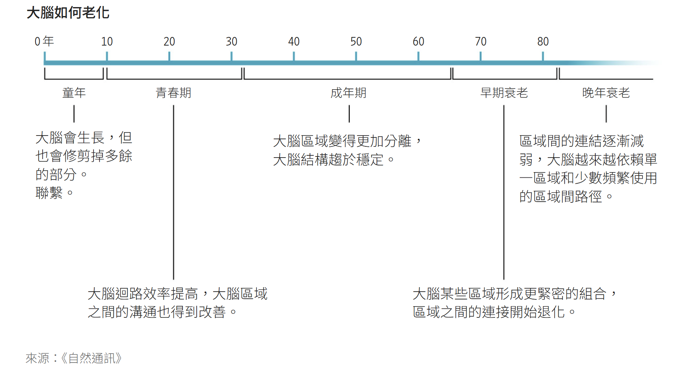

## 一項研究揭示了我們大腦發育在9歲、32歲、66歲和83歲時的變化。

一位科學家正在查看患者的腦部核磁共振成像圖。 圖片來源：Tek Image/Science Photo Library／Getty Images

經過

[艾琳·伍德沃德](https://www.wsj.com/news/author/aylin-woodward)

跟隨

2025年12月23日凌晨5:30（美國東部時間）

一項新研究表明，大腦從出生到死亡會經歷五個不同的階段。 

科學家們確定了大腦內部連結模式變化的平均年齡——9歲、32歲、66歲和83歲。他們發現，大腦的青春期持續到32歲，之後進入一段穩定期，直到66歲左右開始出現早期老化跡象。

這項研究或許有助於解釋為什麼某些與大腦相關的疾病會在特定年齡層出現，並能為理解健康老化提供更好的路線圖。

「也許大腦結構中正在發生一些變化或優化，這使得我們更容易受到這些特定事物的影響，」劍橋大學神經資訊學教授、該研究的合著者鄧肯·阿斯托爾說。該研究[於 11 月發表](https://dx.doi.org/10.1038/s41467-025-65974-8)在《自然通訊》雜誌上。

研究的作者分析了來自美國和英國約4000人的腦部掃描結果，受試者年齡涵蓋新生兒到九旬老人。這些掃描結果有助於顯示白質，即包裹連接大腦區域的神經纖維的脂肪物質。研究人員能夠觀察到這些物理連接，並建構出隨時間變化的神經通路圖。

阿斯托爾說，他們為每個人的年齡創建了一個「平均大腦」模型。然後，他們研究了十幾個特徵，並利用機器學習演算法來幫助確定資料中發生重大變化的時刻。

科學家們確定，大腦的兒童發育期從出生持續到 9 歲。在此期間，大腦體積會增大，但由於我們出生時有很多多餘的神經連接，我們的大腦會修剪掉那些不使用或效率較低的連接。愛丁堡大學發現腦科學中心主任兼教授塔拉·斯派爾斯-瓊斯（她並未參與這項研究）表示。

9歲時，我們的大腦進入青春期，研究作者表示，青春期會持續到32歲。

“每當有人問神經科學家‘那麼，大腦什麼時候才算成熟？大腦什麼時候才算成年？’時，他們總是很反感。”阿斯托爾說，“這項分析真正巧妙之處在於，它能給出答案。”

大腦會生長，但也會修剪掉多餘的部分。

聯繫。

大腦區域變得更加分離，大腦結構趨於穩定。

區域間的連結逐漸減弱，大腦越來越依賴單一區域和少數頻繁使用的區域間路徑。

大腦迴路效率提高，大腦區域之間的溝通也得到改善。

大腦某些區域形成更緊密的組合，區域之間的連接開始退化。

  

在這個階段，大腦的神經連結變得更加高效，各個區域之間以及區域內部的溝通也更加緊密、迅速。  

32歲時，我們的大腦進入“成年期”，這是一個持續到66歲的穩定時期。研究人員表示，這段時間與我們的智力和個性達到平台期相吻合，大腦的各個區域也變得更加分離。

下一個轉折點之後，大腦開始出現早期老化。在66歲到83歲之間，有些腦區會形成更緊密的模組群，但它們與其他模組的連結性降低。白質開始退化。

「過了 65 歲左右，大腦就會萎縮，白質的完整性也會下降，這與我們許多人（雖然不是所有人）認知功能的某些方面略有下降相對應，」斯派爾斯-瓊斯說。

劍橋大學神經科學家、研究的主要作者 Alexa Mousley 表示，83 歲以後，進入老化晚期，大腦各區域之間的連接會逐漸退化，我們的大腦越來越依賴少數幾個高度常用的區域間通路。

她很想知道，由於這種重新連接，大腦是否更容易受到某些心理健康或神經系統問題的困擾，因為這五個階段與常見疾病之間存在某種模式。

#### 分享你的想法

_關於大腦老化以及如何應對這些變化，你有什麼疑問？歡迎在下方參與討論。_

例如，據美國疾病管制與預防中心稱，大多數自閉症病例都是在幼兒時期確診的。據美國藥物濫用和精神健康服務管理局稱，高達75%的精神健康問題在20歲出頭時就已經出現。[阿茲海默症](https://www.wsj.com/health/wellness/dementia-prevention-middle-age-brain-14d713a3?mod=article_inline)通常在研究人員所說的早期老化階段顯現。

阿斯托爾表示，心血管健康、社會連結和運動都與[積極的認知健康結果](https://www.wsj.com/health/wellness/brain-age-health-lifestyle-012262b3?mod=article_inline)有關——而且它們也可能在晚年發生的神經重塑中發揮作用。

倫敦國王學院認知神經科學教授卡蒂亞·魯比亞（Katya Rubia）表示，這些變化發生的時間可能仍然存在很大的個體差異。她並未參與這項研究。 「但這並不意味著我們一到生日，突然發現自己83歲了，就應該開始擔心，」她說。