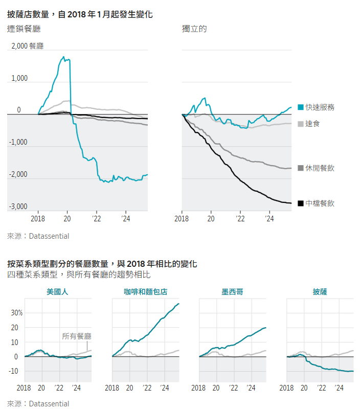

# 美國人正在失去對披薩的熱愛

## 隨著外送業務銷售放緩，連鎖餐廳正在探索策略調整。

[希瑟·哈頓](https://www.wsj.com/news/author/heather-haddon)

2026年1月4日 晚上8:00 ET

凱爾西·麥克萊倫為《華爾街日報》撰稿

### 

快速概要

- 如今，披薩餐廳的數量已經超過了咖啡店和墨西哥風味餐廳，其銷售成長也落後於美國整體快餐市場。
    
    看更多
    

餐飲業正在努力弄清楚美國披薩市場是否已經達到頂峰。

披薩店曾是美國第二大常見餐飲類型，但根據行業數據，如今其數量已被咖啡店和墨西哥餐廳超越。多年來，披薩店的銷售成長一直落後於整體速食市場，未來前景也不樂觀。

「披薩產業現在正面臨變革，」棒約翰國際財務長兼北美總裁拉維·塔納瓦拉在接受採訪時表示。 “這是消費者告訴我們的。”

Pieology Pizzeria連鎖店的母公司於12月申請破產保護。在此之前，包括Anthony's Coal Fired Pizza & Wings和Bertucci's Brick Oven Pizza & Pasta的母公司在內的其他公司也已申請破產。

披薩曾經是美國大城市以外地區的新鮮事物，這為獨立披薩店的發展提供了空間，也催生了像必勝客這樣擁有紅色屋頂的連鎖餐廳。專門設計的紙盒和龐大的[外帶車隊，](https://www.wsj.com/story/pizzerias-race-to-recruit-drivers-a048a863?mod=article_inline)使得披薩成為人們尋求便捷用餐方式時的首選外帶食品。

如今，披薩店之間以及與其他速食店之間都展開了價格戰。外送應用程式讓美國人可以輕鬆獲得[更多種類的美食](https://www.wsj.com/lifestyle/parenting-food-diet-kids-sushi-8ff64063?mod=article_inline)和選擇。相較之下，一家人花20美元買一個披薩，[5美元的快餐套餐](https://www.wsj.com/business/hospitality/fast-food-giants-go-to-battle-over-value-meals-f0f11429?mod=article_inline)、冷凍披薩或在家做飯，就顯得貴多了。

各大披薩連鎖品牌正在重新審視其業務模式。必勝客、棒約翰以及棒墨菲的母公司都在考慮潛在的出售或其他戰略舉措。包括Blaze Pizza和Mod Pizza在內的[中型連鎖店](https://www.wsj.com/articles/build-your-own-pizza-restaurant-mod-taps-advisers-to-explore-bankruptcy-8c466618?mod=article_inline)在過去兩年中關閉了一些門市，以期扭轉品牌頹勢。

棒約翰正尋求徹底改變其從特許經營策略到披薩製作方式的一切。 奧德拉·梅爾頓為《華爾街日報》報道

據知情人士透露，加州比薩廚房（California Pizza Kitchen）於去年12月以不到3億美元的價格出售給投資集團。這低於該連鎖餐廳2011年[私有化時](https://www.wsj.com/articles/SB10001424052702304520804576345001168940300?mod=article_inline)的4.7億美元售價。

### 一塊派

美國人仍然[很愛吃披薩](https://www.wsj.com/arts-culture/food-cooking/chefs-pizza-slice-shop-good-business-for-diners-its-a-deal-468ec42b?mod=article_inline)。市場研究公司Technomic表示，到2024年，披薩連鎖店的銷售額預計將達到310億美元左右。根據美國農業部統計，每天大約有十分之一的美國人會吃披薩。年輕人是披薩消費的主要族群。

然而，披薩在美國餐飲業的主導地位正在下降。 Technomic公司表示，在2024年美國連鎖餐廳的銷售排名中，披薩在各類菜系中排名第六，低於上世紀90年代的第二名。 

市場研究公司Datassential的數據顯示，美國披薩餐廳的數量在2019年達到歷史最高水平，此後有所下降。

奧斯汀羅蘭在疫情封鎖期間吃了很多披薩，但他表示現在很少點披薩外送了，因為他看到了更多更好的選擇。這位26歲的理財規劃師如果點披薩，只會選擇達美樂披薩App上的優惠活動。

「即使我負擔得起，在其他地方多花 50% 到 100% 的錢，我也會覺得很傻，」住在喬治亞州的羅蘭說。

隨著披薩銷售成長停滯，餐廳之間的競爭日益激烈。達美樂披薩的銷售量則有所成長，這得益於該連鎖店[推出的優惠活動，](https://www.wsj.com/business/earnings/dominos-sales-rise-as-stuffed-crust-pizza-boosts-u-s-orders-5a248a73?mod=article_inline)例如9.99美元即可購買一份大加料披薩。

必勝客在美國開業至少一年的門市銷售額已連續八個季度下滑。此外，該公司擁有數百家堂食門店，這些門市佔地更大，營運成本更高，而且在人們享用披薩的場所中所佔份額正在不斷縮小。

### 連鎖店尋求“改頭換面”

棒約翰[已表示有意](https://www.wsj.com/livecoverage/stock-market-today-dow-sp-500-nasdaq-11-06-2025/card/papa-john-s-touts-turnaround-plan-but-stays-open-minded--cM17SU9E0PHza2LGfxKB?mod=article_inline)出售公司，但高層表示，他們目前專注於全面的扭虧為盈策略。過去一年，該連鎖店一直在評估其業務，高層希望從特許經營策略到披薩製作方式等各個方面進行改革。

消費者越來越挑剔，棒約翰財務長塔納瓦拉表示，棒約翰必須提升菜單種類和性價比。這意味著要以優惠的價格提供更多配菜，包括自家烤箱烘焙的食品。

塔納瓦拉表示，棒約翰發現其加盟商在烘烤披薩時使用的溫度各不相同，導致披薩品質不穩定。該公司正與餐廳老闆合作，重新校準烤箱，並透過改進披薩的製作流程來提升最終產品的品質。

該連鎖餐廳正在關閉部分北美餐廳，以便專注於提升公司認為具有成長潛力的地區的銷售額。塔納瓦拉表示，其他一些餐廳只需要翻新一下。

「這是一個需要好好打磨的品牌，」他說。 

加州披薩廚房的新東家押注人們會繼續吃披薩。但收購這家披薩連鎖店的Consortium Brand Partners公司管理合夥人科里貝克表示，成功意味著要提供比快餐連鎖店常見的那些基本披薩更豐富的選擇。

加州披薩廚房旨在重點推廣其豐富多樣的堂食菜單，其中包括雪松木板烤鮭魚和配寬麵條的燉牛肋骨。該公司還希望擴大其在雜貨店銷售的產品的規模。 

「生活中有些事情是可以確定的，死亡​​、稅收和披薩就是其中之一，」貝克說。