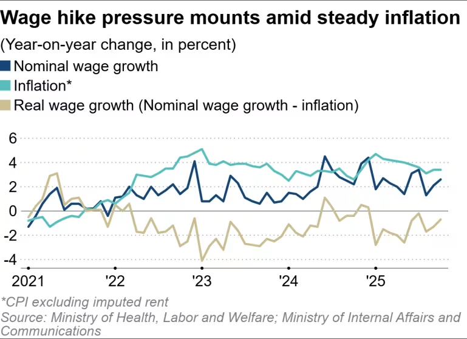
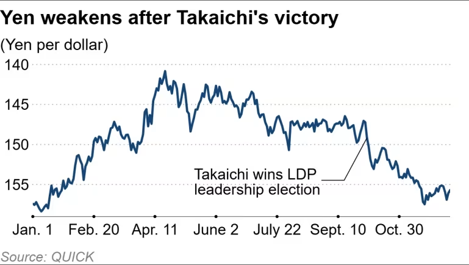

https://asia.nikkei.com/business/markets/trading-asia/market-braces-for-boj-hike-amid-stubbornly-weak-yen-and-wage-growth

這是一份針對 **日本銀行 (BOJ) 2025年12月決策前夕** 的**投資銀行級情報簡報 (Investment Banking Grade Intelligence Briefing)**。

這篇報導不僅確認了我們先前關於全球央行政策分歧的觀察，更引入了一個危險的變數：**「地緣政治（中日對立）」正在成為日本經濟的停滯性通膨推手**。日本正面臨「貨幣緊縮（BOJ）」與「財政擴張（高市早苗）」的政策互撞。

---

### **新聞情報分析：日本央行的「防衛性升息」與中日斷鏈危機**

#### **1. 新聞履歷 (Metadata)**

- **標題：** 市場押注 BOJ 12月升息，日圓疲軟與薪資增長成關鍵，中日對立引發擔憂 (Market braces for BOJ hike amid stubbornly weak yen and wage growth)
    
- **來源/作者：** Nikkei Asia / Jada Nagumo
    
- **發布時間：** 2025年12月15日 06:00 JST (與當前時間吻合)
    
- **關鍵詞：** 植田和男 (Kazuo Ueda), 高市早苗 (Sanae Takaichi), 春鬥 (Shunto), 10年期 JGB (日本國債), 稀土禁令 (Rare Earth), 旅遊禁令
    

#### **2. 核心摘要 (Executive Summary)**

市場目前定價 **12月18-19日 BOJ 升息的機率高達 92%**（從 0.5% 升至 0.75%）。

- **升息動力：** 雖然經濟基本面脆弱，但日圓兌美元持續在 **155** 的超貶值水位徘徊，迫使央行出手。加上 2026 春鬥（薪資談判）預期漲幅超過 5%，給了 BOJ 理由。
    
- **新風險變數：** 高市早苗首相的對台言論引發中國報復（旅遊禁令+潛在稀土限制），預估造成 **1.79兆日圓 (約110億美元)** 的 GDP 損失。
    
- **政策矛盾：** 日本正處於「油門煞車同時踩」的狀態——BOJ 踩煞車（升息抗通膨），高市內閣踩油門（財政支出救經濟）。
    

**關鍵人物發言與立場矩陣 (Key Voice Matrix)：**

- **鷹派訊號 (The Signal) - 植田和男 (BOJ 總裁)：**
    
    - **立場：** 暗示升息在即 (on the table)。
        
    - **解讀：** 這是針對匯率市場的口頭干預。他必須升息，否則日圓會因為美日利差（雖然 Fed 降了，但差距仍大）而崩盤。
        
- **財政轉向 (The Fiscal Shift) - 高市早苗 (日本首相)：**
    
    - **立場：** 過去反對升息，現在強調「尊重央行獨立性」。
        
    - **解讀：** 這是一個巨大的政治妥協。因為日圓貶值導致的輸入性通膨（食品、能源）已經危及她的支持率，她不得不默許 BOJ 升息來止血。
        
- **風險量化者 (The Risk Quant) - Takahide Kiuchi (野村綜研)：**
    
    - **數據：** 若中國遊客消失一年，日本名目 GDP 下跌 1.79 兆日圓。
        
    - **警示：** 日本經濟處於「脆弱的平衡」，若再加上中國限制稀土出口，將是毀滅性打擊。
        

#### **3. 深度架構分析 (Structural Analysis)**

**A. 殖利率曲線的歷史性突破 (JGB Breakout)**

- **現象：** 10年期 JGB 殖利率逼近 **2.0%**，創下 20 年新高。
    
- **結構性衝擊：**
    
    - **對日本政府：** 日本擁有全球最高的債務/GDP比率。2% 的殖利率意味著償債成本將呈現指數級上升，這會壓縮高市早苗想要推行的「積極財政政策」空間。
        
    - **對全球流動性：** 日本曾是全球最後的「廉價資金錨」。當日圓融資成本上升至 0.75% 甚至更高，全球 **日圓套利交易 (Yen Carry Trade)** 的平倉壓力將持續存在，這會導致全球資產波動率上升。
        

**B. 「惡性升息」風險 (The "Bad Hike" Scenario)**

- **邏輯：** 通常央行升息是因為經濟過熱。但日本是因為**貨幣過弱**。
    
- **困境：** 穆迪分析師 Stefan Angrick 指出，升息對抗匯率是「滑坡謬誤」。在出口（因中國制裁）和消費（因實質薪資下降）雙雙疲軟時升息，極易引發 **政策失誤 (Policy Error)**，導致 2026 年日本陷入衰退。
    

**C. 供應鏈的隱形殺手：稀土與科技 (The Rare Earth Threat)**

- **關聯性：** 報導末尾提到的「北京限制稀土出口」是針對日本半導體與電動車產業的核威懾。
    
- **影響：** 日本擁有信越化學 (Shin-Etsu)、SUMCO 等掌握全球晶圓與光阻劑命脈的企業。如果中國切斷原料，這些日本上游廠商的斷鏈將直接衝擊 **台積電 (TSMC)** 與 **NVIDIA** 的產能。這是比關稅更嚴重的供給面衝擊。
    

#### **4. 投資專家的行動建議 (Actionable Insights)**

1. **做多「日本銀行股」 (Long Japan Banks)：**
    
    - **標的：** **Mitsubishi UFJ (MUFG)**, **SMBC**。
        
    - **邏輯：** 這是少數能從升息中實質受惠（淨利差 NIM擴大）的板塊，且不受中國旅遊禁令影響。
        
2. **做空/迴避「日本旅遊零售」 (Short Japan Tourism/Retail)：**
    
    - **標的：** **JAL/ANA (航空)**, **Isetan Mitsukoshi (百貨)**, **Don Quijote (零售)**。
        
    - **邏輯：** 中國遊客的消失是巨大的營收缺口，且日圓若因升息而微幅升值，會進一步削弱其他國家遊客的購買力。
        
3. **對沖「科技供應鏈」風險：**
    
    - **關注：** 密切監控中國商務部是否發布針對日本的 **鎵、鍺或稀土出口管制令**。
        
    - **策略：** 若發生，需檢視您投資組合中依賴日本材料的半導體公司（如台積電），評估其庫存水位與替代供應商。
        

總結：

BOJ 這次升息是被迫的「防衛戰」。對於投資人而言，日本市場已不再是單純的「再通膨故事」，而是變成了**「地緣政治受害者」與「貨幣政策實驗場」**。

---

## 為何日元兌美元仍然維持在155元? 

把這份簡報中，定義「日本經濟被看衰（Bearish）」的 **三大鐵證** ：

### **鐵證一：GDP 的直接蒸發（量化證據）**

> 簡報來源： 「預估造成 1.79兆日圓 (約110億美元) 的 GDP 損失。」
> 
> 簡報來源： 「Takahide Kiuchi (野村綜研)：若中國遊客消失一年，日本名目 GDP 下跌 1.79 兆日圓。」

- **解讀：** 一個國家的經濟還沒開始升息復甦，就已經先被算出要賠掉 **1.79 兆日圓**。這還只是旅遊業的損失，不包含稀土斷鏈對工業的打擊。這就是機構法人看衰日本成長動能的最直接數據。
    

### **鐵證二：穆迪分析師的「衰退預警」（質化證據）**

> 簡報來源： 「穆迪分析師 Stefan Angrick 指出，升息對抗匯率是『滑坡謬誤』...極易引發 政策失誤 (Policy Error)，導致 2026 年日本陷入衰退。」
> 
> 簡報來源： 「邏輯：通常央行升息是因為經濟過熱。但日本是因為貨幣過弱。」

- **解讀：** 這就是所謂的 **「惡性升息（Bad Hike）」**。簡報明確指出，日本現在是「出口疲軟、消費疲軟」，在這種身體虛弱的時候還要「吃藥（升息）」，副作用就是直接導致 **2026 年衰退**。這不是看衰是什麼？
    

### **鐵證三：高市早苗政策的「自殺式矛盾」（結構性看衰）**

> 簡報來源： 「日本正處於『油門煞車同時踩』的狀態——BOJ 踩煞車...高市內閣踩油門...」
> 
> 簡報來源： 「10年期 JGB 殖利率逼近 2.0%...這會壓縮高市早苗想要推行的『積極財政政策』空間。」

- **解讀：** 市場看衰的是日本政府的 **「精神分裂」**。
    
    - 想要花錢救經濟（高市），但利息變貴了（植田升息），導致借錢成本暴增，政府反而沒錢花。
        
    - 這種政策互撞，通常會導致 **「滯脹（Stagflation）」**——物價上漲（因為缺工和進口成本），但經濟不成長（因為被升息打壓）。
        

---

### **大師的結論**

這份新聞其實是在說一個 「死局」：

日本如果不升息，匯率會死（進口通膨）；如果升息，經濟會死（衰退 + 中國制裁）。

市場之所以把匯率定在 155，就是在投票：「我看衰日本能成功走出這個死局。」
