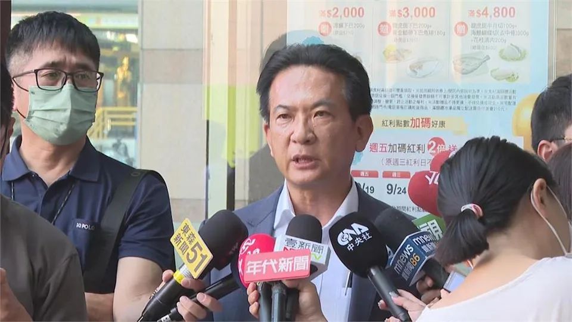

# 

民視新聞網

2025年12月15日 週一 上午10:42

即時中心／黃于庭報導

朝野各黨派持續布局2026大選，其中民進黨於台南長期握有執政優勢，因此也被視為關鍵一戰，綠委陳亭妃、林俊憲均表態有意爭取市長大位，屆時當透過黨內初選決定誰能出線。對此，台南市長黃偉哲昨（14）日現身[林俊憲](https://tw.news.yahoo.com/tag/%E6%9E%97%E4%BF%8A%E6%86%B2)後援會成立大會，稱讚林在國會的表現有目共睹，並公開力挺對方延續總統賴清德理念。

林俊憲昨日舉辦「善化、安定後援會成立大會」，現場湧入超過3000名支持者，黃偉哲同樣現身力挺。他指出，林俊憲長期為台南爭取經費，於國會的表現有目共睹，近年多項重大建設，皆是立院與地方密切合作之下推動。

黃偉哲也表示，施政需要延續性及穩定性，林俊憲熟悉地方、了解市政運作，有能力延續賴清德的理念，並呼籲各位鄉親，在民進黨台南市長初選民調期間，全力支持林俊憲。

針對善化區未來發展藍圖，林俊憲說明，此處位於台南正中心，是台南最關鍵的戰略腹地之一，未來將以「中台南副都心」為目標，全方位推動交通、產業與生活建設。

接著，林俊憲進一步指出，善化不僅擁有嘉南平原的土地優勢，更承接南科科技廊的產業動能，從農業重鎮一路走來，具有深厚人文底蘊，是台南最有潛力的未來城市。

如今，善化面臨展業轉型關鍵時間點，林俊憲強調，他與綠委郭國文共同爭取3600萬經費，用以改善車站通勤需求，同時也追加15億推動站體擴建，規劃「鐵路立體化」，未來將持續爭取資源，讓善化邁向宜居、宜業、宜學、宜老的理想城市。