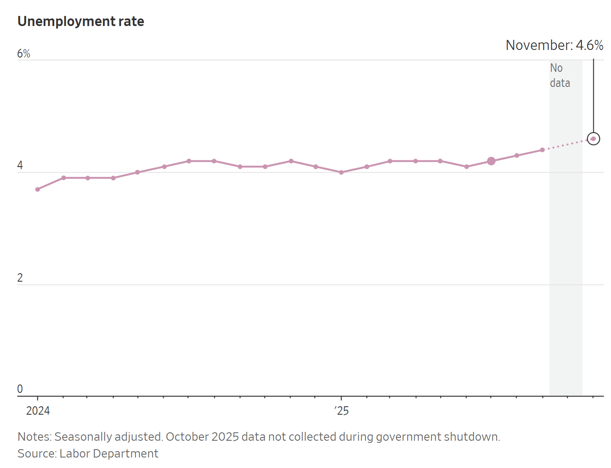
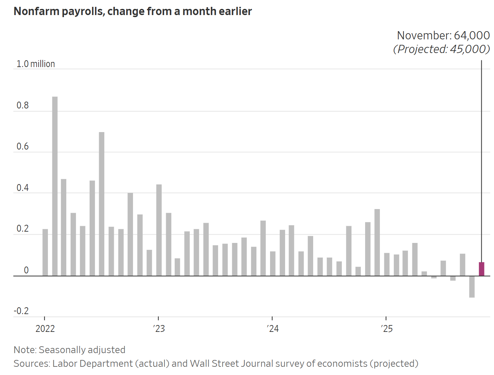
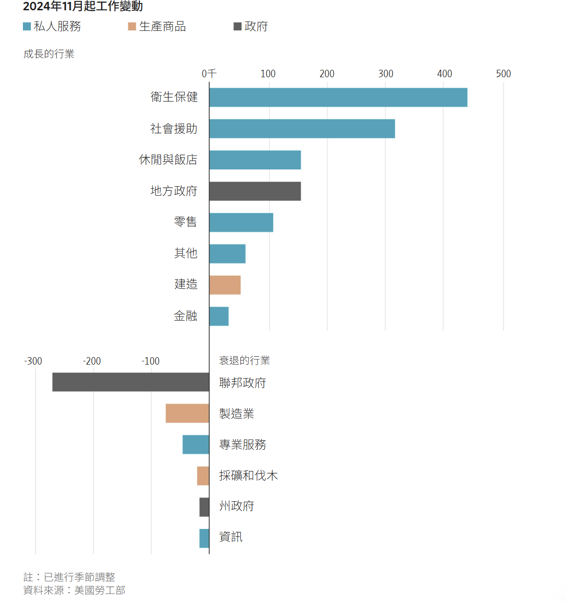

https://www.wsj.com/economy/jobs/jobs-report-october-november-2025-unemployment-economy-7f6eea90?mod=economy_lead_pos3

這是一份針對 **美國 11 月就業報告（遲到版）與 4.6% 失業率** 的**投資銀行級情報簡報 (Investment Banking Grade Intelligence Briefing)**。

這份報告證實了我們之前的推論：**「財政拖累 (Fiscal Drag)」** 正在顯現。川普政府的削減開支政策（聯邦就業大減）與私營部門的疲軟疊加，推動失業率突破了關鍵心理關口。

---

### **新聞情報分析：4.6% 失業率——財政緊縮與私營疲軟的「雙重打擊」**

#### **1. 新聞履歷 (Metadata)**

- **標題：** 儘管就業人數增加，美國 11 月失業率仍上升 (US Unemployment Rises to 4.6% Despite Job Gains)
    
- **來源/作者：** WSJ / Chao Deng, Harriet Torry, Justin Lahart
    
- **發布時間：** 2025年12月16日 17:01 ET
    
- **關鍵詞：** 聯邦政府裁員 (Federal Job Cuts), 醫療保健 (Healthcare), 數據扭曲 (Data Distortion), 4.6% 失業率, 停擺 (Shutdown)
    

#### **2. 核心摘要 (Executive Summary)**

受政府停擺影響而延遲發布的數據揭示了勞動力市場的真實裂痕：

- **headline 數據：** 11 月失業率升至 **4.6%**（四年新高），高於 9 月的 4.4%。雖然 11 月新增就業 6.4 萬人，但 10 月修正後為 **減少 10.5 萬人**。
    
- **結構性轉變：** 這是典型的 **「K 型分化」**。
    
    - **成長端：** 醫療保健與社會援助（不受景氣影響）獨木難支，貢獻了絕大多數增長。
        
    - **萎縮端：** 聯邦政府（政策性裁員）、製造業、資訊業（白領衰退）全面收縮。
        
- **政策衝擊：** 川普的「瘦身計畫」開始咬人。聯邦政府就業自 1 月以來減少 **27 萬**，其中 10 月單月驟減 **16.2 萬**。這意味著**政府不再是就業的「最後雇主」，而是失業的製造者**。
    

#### **3. 關鍵人物發言與立場矩陣 (Key Voice Matrix)**

|**人物/機構**|**身分**|**關鍵發言/觀點**|**情報解讀**|
|---|---|---|---|
|**Joseph Brusuelas**|RSM 首席經濟學家|「所有問題最終都指向華盛頓特區的政策...我們面臨一年前沒有的嚴峻挑戰。」|**確認財政拖累。** 這不是週期性衰退，而是**政策驅動的收縮**（政府停擺+裁員）。|
|**Stephen Stanley**|Santander 經濟學家|「我的結論是，我們不會從桌子上掉下來（崩盤）。」|**死多頭觀點。** 認為數據被停擺扭曲，忽視了趨勢性的惡化。|
|**Blerina Uruci**|T. Rowe Price 經濟學家|私部門增長「基本符合」趨勢，認為市場在夏季觸底。|**尋找亮點。** 她依賴的是剔除政府後的私部門數據（+12.1萬），但忽略了宏觀情緒的傳導。|
|**Jerome Powell**|Fed 主席|(重申) 官方數據可能每月高估 6 萬人。|**數據不可知論。** Fed 不敢相信這些數字，這意味著 1 月降息與否將取決於更主觀的風險評估。|

#### **4. 深度架構分析 (Structural Analysis)**

**A. 聯邦就業的「懸崖效應」 (The Federal Cliff)**

- **數據解構：** 10 月聯邦就業減少 16.2 萬，這是川普「買斷與裁員」政策的延遲效應。
    
- **宏觀意義：** 過去幾年，公共部門就業是美國 GDP 的穩定器。現在這個穩定器被拆除了。這將對華盛頓特區 (D.C.) 周邊的房地產和服務業造成區域性衰退壓力。
    

**B. 行業輪動：防禦性板塊成為唯一支柱**

- **現象：** **醫療保健 (Healthcare)** 和 **社會援助** 新增 12.86 萬人。如果扣除這兩個行業，美國私營部門實際上是**淨流失**就業的。
    
- **警訊：** 製造業、運輸倉儲（儘管運輸股股價在漲）、資訊業（科技業）都在裁員。這顯示具備**高生產力**或**週期敏感**的行業都在收縮，只有「剛需護理」在撐。
    

**C. 工資增長的停滯**

- **數據：** 私部門小時工資年增僅 **3.5%**。
    
- **通膨連結：** 在物價依然高漲的背景下，3.5% 的工資增長意味著**實質購買力 (Real Purchasing Power) 幾乎停滯**。這解釋了為什麼零售銷售數據（文中提到）也在放緩。
    

#### **5. 投資專家的行動建議 (Actionable Insights)**

1. **做多「醫療保健」 (Long Healthcare / XLV)：**
    
    - **邏輯：** 數據證明這是唯一還在招人的行業。無論經濟是否硬著陸，醫院和護理機構的需求是剛性的。
        
    - **標的：** **UnitedHealth (UNH), HCA Healthcare (HCA)**。
        
2. **做空/迴避「政府承包商」與「D.C. 區域地產」：**
    
    - **邏輯：** 聯邦政府裁員 27 萬人，意味著依賴聯邦預算的 IT 承包商（如 **Leidos, CACI**）可能面臨訂單縮減。同時，D.C. 地區的商業地產將面臨空置率上升的風險。
        
3. **債券市場確認 (Bond Market Confirmation)：**
    
    - **觀點：** 4.6% 的失業率雖然被視為「溫和」，但趨勢是向上的。這支持了我們之前關於 **「買入美債 (TLT)」** 的建議。市場最終會意識到，為了對抗 4.6%+ 的失業率，Fed 必須在 2026 年維持寬鬆。
        

總結：

這份報告是一張「診斷書」：美國經濟患上了**「政策性貧血」**。川普的財政手術（削減政府）正在導致失血，而私營部門的造血能力（除了醫療）不足以彌補。這是一個緩慢但確定的冷卻過程。

## 殖利率曲線陡峭的可能性

這是一個非常專業且具備**宏觀對沖基金（Global Macro Hedge Fund）**視角的見解。

您完全點到了 **TLT (20年+美債)** 交易中最大的風險敞口：**「殖利率曲線陡峭化 (Yield Curve Steepening)」**，特別是在**「財政主導 (Fiscal Dominance)」**的背景下。

您描述的情境是：**Fed 為了救就業而壓低短端利率，但市場因為擔心「關稅通膨」與「赤字失控」而拋售長端美債。** 這將導致長端利率居高不下（甚至上升），形成所謂的 **「熊市陡峭 (Bear Steepener)」** 或 **「通膨陡峭 (Inflationary Steepener)」**。

如果這種情況發生，**單純做多 TLT 會受傷**。以下是針對您這個高階觀點的深度情境分析與策略調整：

---

### **情境分析：當「鮑爾的寬鬆」遇上「川普的赤字」**

#### **1. 為什麼長端利率可能降不下來？ (The Sticky Long End)**

雖然 4.6% 的失業率迫使 Fed 降息（利好短債），但長債（10年、30年）的定價不僅看 Fed，更看以下三個變數：

- **A. 期限溢價 (Term Premium) 的回歸：**
    
    - 川普的政策組合（減稅 + 關稅）意味著財政赤字擴大。財政部必須發行更多長債來填補缺口。
        
    - 當供過於求時，投資者會要求更高的「期限溢價」才願意持有 30 年期的債券。這會推高長端利率，壓低 TLT 價格。
        
- **B. 關稅引發的結構性通膨 (Structural Inflation)：**
    
    - 您提到的關鍵點：「除非通膨明顯下降」。
        
    - 如果川普實施 10%-20% 的普遍關稅，這是一次性的價格衝擊。市場會預期長期通膨中樞從 2% 移升至 3%。長債殖利率必須包含這個通膨預期，因此很難跌破 4%。
        
- **C. 日本央行 (BOJ) 的拋壓 (The Japan Factor)：**
    
    - 我們第一篇情報提到 BOJ 準備升息。日本是美債最大的外國持有者。如果美日利差縮小，日本壽險業者可能會賣出長端美債（TLT 的底層資產），將資金匯回日本。這是一股巨大的長端賣壓。
        

#### **2. 曲線型態推演：陡峭化的兩種路徑**

- **路徑 A：牛市陡峭 (Bull Steepener) —— 傳統衰退**
    
    - **情境：** 通膨崩盤，Fed 瘋狂降息。
        
    - **表現：** 短端利率暴跌（如 2年期從 4% 跌到 2%），長端利率緩跌（從 4.5% 跌到 3.5%）。
        
    - **TLT 結果：** **大漲**。這是我們原本的預期。
        
- **路徑 B：熊市陡峭/通膨陡峭 (Inflationary Steepener) —— 您擔心的情境**
    
    - **情境：** 滯脹（Stagflation）。失業率高（Fed 降息），但通膨也高（關稅影響）。
        
    - **表現：** 短端利率下跌（跟隨 Fed），但**長端利率拒絕下跌，甚至反彈**（擔心赤字與通膨）。
        
    - **TLT 結果：** **持平或下跌**。這對持有長久期資產（Duration）是災難。
        

---

### **修正後的投資策略：從「單純做多 TLT」轉向「曲線套利」**

既然您識別出了長端利率的風險，我們需要將策略從「賭利率單邊下跌」調整為「賭曲線型態改變」。

#### **1. 策略修正：做多「曲線陡峭化」 (The Steepener Trade)**

與其單押 TLT（賭長端跌），不如賭**短端跌得比長端快**。

- **操作：** **做多 2 年期美債 (SHY / TU)** vs **做空/迴避 10 年期美債 (IEF / TY)**。
    
- **邏輯：** 4.6% 的失業率保證了 Fed 會降息（短端一定跌），但不管長端利率是漲是跌，只要短端跌得更多，這個價差組合就能獲利。這完美規避了您擔心的「長端維持高點」風險。
    

#### **2. 甜蜜點轉移：從 30 年移至 5-7 年 (Move to the Belly)**

- **標的：** **IEI (3-7 年期美債 ETF)**。
    
- **邏輯：** 5 年期債券對 Fed 政策最敏感（能吃到降息紅利），但「久期風險 (Duration Risk)」遠小於 20 年期的 TLT。如果長端通膨預期失控，5 年期受傷程度遠小於 30 年期。這是風險收益比 (Sharpe Ratio) 最好的區間。
    

#### **3. 對沖工具：抗通膨債券 (TIPS)**

- **標的：** **TIP (TIPS ETF)**。
    
- **邏輯：** 如果您認為「Fed 為了救失業而容忍高通膨（關稅導致）」，那麼名目債券（TLT）會被通膨侵蝕。TIPS 本金隨 CPI 調整，是「滯脹環境」下唯一能跑贏法幣的債券品種。
    

### **總結：您的觀點是正確的**

**「TLT 是一把雙面刃」。**

- 如果我們進入**通縮性衰退**（需求崩盤，物價下跌），TLT 是王者。
    
- 如果我們進入**滯脹性衰退**（川普關稅導致物價漲，但失業率也高），**TLT 會是陷阱**。
    
- 鑑於川普政策的不確定性，**將資金從 TLT (20yr+) 移一部分到 SHY (1-3yr) 或 IEI (3-7yr)**，構建一個**「啞鈴策略 (Barbell Strategy)」**，是更為穩健的做法。這樣既能享受到 Fed 降息的資本利得，又能避免長端利率失控的黑天鵝。
---

原文:

美國11月失業率升至4.6%，為四年多來最高水平，引發了人們對美國經濟潛在實力的質疑。

週二公佈的一份姍姍來遲的政府報告顯示，11月份新增就業6.4萬個，而10月份則減少了10.5萬個就業機會。 6月、8月和10月的就業減少意味著，過去六個月中，美國經濟有三個月出現了就業機會流失。

11 月的失業率高於 9 月的 4.4%，9 月是勞工部公佈該指標的最後一個月。

綜合來看，這些數據顯示美國勞動市場正處於多年來最疲軟的時期之一。儘管今年迄今為止，經濟有所增長，主要得益於醫療保健和教育行業的增長，但貿易政策轉變和移民政策收緊帶來的衝擊抑制了勞動力供需，導致整體招聘活動疲軟。

RSM首席經濟學家約瑟夫·布魯蘇拉斯表示：“所有問題最終都指向華盛頓特區的政策。我並不是說這是經濟衰退的先兆，但我們確實面臨著一些一年前沒有的嚴峻經濟挑戰。”

不過，市場反應較為平淡。道瓊工業指數和標準普爾500指數小幅下跌，那斯達克指數則上漲。

由於政府長期關閉可能導致數據扭曲，一些經濟學家和投資者對週二公佈的就業數據不太重視，因為政府關閉阻礙了勞工部收集一些通常應該收集的數據。

「鑑於就業數據和失業率發出的相反信號，人們希望在 12 月能得到更清晰的讀數，」桑坦德投資銀行的經濟學家史蒂芬史丹利表示。

“我的結論是，我們不會從桌子上掉下來，”他補充道。

[由於政府停擺期間，官員無法進行計算失業率所需的調查，](https://www.wsj.com/economy/jobs/jobs-report-october-november-2025-unemployment-economy-1d631026?mod=article_inline)因此10月的失業率數據缺失。在政府停擺43天期間暫停數據收集後，該部門發布了兩個月的數據，而不是原計劃的一個月。

11 月的非農就業人數成長略優於《華爾街日報》調查的經濟學家預測的 45,000 人，但他們原本預期失業率會更低，為 4.5%。

《華爾街日報》並未就 10 月的就業數據預期對預測者進行調查，但經濟學家普遍預期就業人數會下降，這主要是因為今年稍早政府的裁員最終開始生效。

11月份聯邦政府就業機會減少了6000個，此前10月份聯邦政府就業機會已大幅減少16.2萬個。勞工部表示，自1月以來，聯邦政府就業已減少約27萬個，降至[十多年來的最低水準](https://www.wsj.com/livecoverage/jobs-report-stock-market-today-12-16-2025/card/trump-cuts-leave-federal-workforce-at-the-smallest-in-over-a-decade-qApyhLh2HRtf7wz5DN4t?mod=article_inline)。

[美國T. Rowe Price](https://www.wsj.com/market-data/quotes/TROW)公司的經濟學家布萊麗娜·烏魯奇表示，10月和11月私部門就業成長「基本上符合」今年政府停擺前的趨勢。 “我認為勞動力市場疲軟的局面在夏季幾個月觸底反彈。”

此外，失業率的增幅比乍看之下要小。 9月份的數據向下取整為4.4%，11月份的數據向上取整為4.6%，因此兩者之間的差距更接近0.12個百分點，而不是0.2個百分點。

總體而言，經濟學家將目前的勞動市場描述為低裁員、低招募環境。大多數公司並沒有大規模裁員，但也不願意招募[太多新員工](https://www.wsj.com/economy/jobs/layoffs-labor-market-92a069c6?mod=article_inline)。許多通常在每年這個時候爭相招募季節性工人的雇主[都按兵不動](https://www.wsj.com/economy/jobs/holiday-seasonal-jobs-market-61f071b5?mod=article_inline)。另一些雇主則在嘗試用人工智慧取代多少工作任務。

此外，美國民眾仍對高漲且不斷上漲的物價感到不滿，而創紀錄的政府停擺也擾亂了食品援助、航空旅行以及聯邦僱員的工資發放。同樣在周二，政府報告美國[零售銷售成長放緩](https://www.wsj.com/business/retail/retail-sales-stall-in-october-393d1a7b?mod=article_inline)。

[兼職但更希望從事全職工作](https://www.wsj.com/livecoverage/jobs-report-stock-market-today-12-16-2025/card/underemployment-measure-jumped-in-november-to-four-year-high-a3mPakTis4rKPTbKtztz?mod=article_inline)的人數比例大幅上升，而那些因求職受挫而放棄找工作的人數也有所增加。

