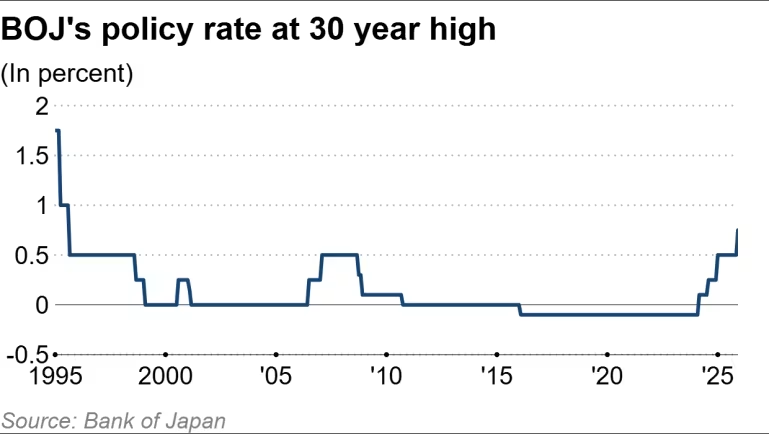
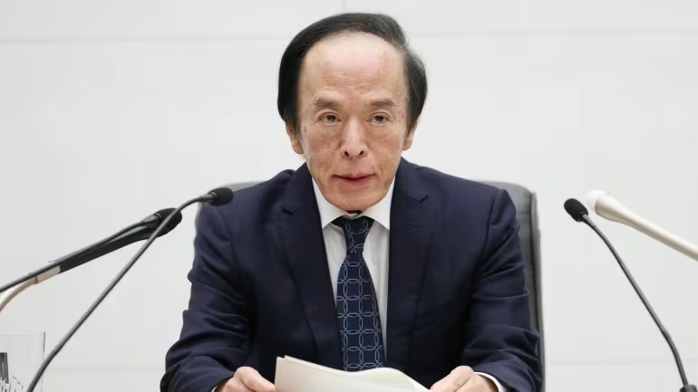

https://asia.nikkei.com/economy/bank-of-japan/boj-raises-rates-gov.-ueda-avoids-future-policy-hints

這份來自《日經亞洲》（Nikkei Asia）的深度報導提供了比前一篇更詳細的政策背景與分析。結合兩篇報導，我為您重新整理並修正了這次日本央行（BOJ）決策的完整解讀。

這份分析重點在於**植田和男（Kazuo Ueda）如何透過「模糊策略」管理市場預期**，以及為何升息後日圓反而走弱。

---

### **深度解析：日本央行升息與植田的「模糊」藝術**

核心決策：

日本央行一致決議將無擔保隔夜拆款利率（Uncollateralized Overnight Call Rate）上調 25 個基點（bps），從 0.5% 升至 0.75%。這是 30 年來的最高水平，也是自 2024 年 3 月解除負利率以來的第四次升息。

#### **1. 為何升息？（The Rationale）**

這次升息背後的支撐理由相當明確：

- **薪資成長動能：** 春鬥（Shunto）談判在即，大型工會準備要求加薪，央行確認「薪資-通膨」螺旋上升機制正在運作。
    
- **日圓疲軟的通膨壓力：** 弱勢日圓推高進口成本，部分委員會成員擔憂這將影響潛在通膨。
    
- **關稅風險緩解：** 儘管美國總統川普曾威脅關稅，但東京與華盛頓已達成協議，消除了部分政策不確定性。
    
- 

12月19日，植田和男告訴記者，一些董事會成員擔心「近期日圓貶值可能會對物價造成上行壓力，並影響潛在通膨」。 （照片由石井理惠拍攝）
#### **2. 植田和男的關鍵談話：模糊的中性利率**

市場最關注的是植田對於未來的指引，但他選擇了極度謹慎的路線：

- **拒絕給出時間表：** 強調未來的調整將完全取決於「經濟與物價的發展」，拒絕承諾下一次升息的時機。
    
- **「中性利率」的模糊化：**
    
    - BOJ 估計中性利率（Neutral Rate，既不刺激也不抑制經濟的利率水平）約在 **1% 至 2.5%** 之間。
        
    - 目前的 0.75% 仍低於此區間下限，意味著貨幣政策仍具寬鬆性質。
        
    - **策略分析：** 岡三證券（Okasan Securities）分析師指出，植田刻意不評論中性利率的下限，是為了**避免被市場鎖定未來的升息路徑**。他試圖在「不讓日圓崩盤」與「不讓市場恐慌」之間取得平衡。
        

#### **3. 市場反應與解讀**

- **日圓走貶（Sell the Fact）：** 由於升息已被市場 97% 預期，且植田未展現強烈鷹派（Hawkish）立場，導致交易員獲利了結，日圓不升反貶。
    
- **債市反應：** 10 年期日本公債（JGB）殖利率突破 **2%**，創下近 20 年新高。這顯示債券市場正在定價長期利率上升的趨勢。
    
- **下次升息預測：**
    
    - **野村綜研：** 預計 2026 上半年**不會**再升息。
        
    - **Ebury 分析師：** 央行將「稍作喘息」（Pause for breath），直到明年春季薪資談判結果出爐前，不太可能有動作。
        

---

### **對您投資組合的潛在影響 (Based on Insight)**

針對您在金融與科技領域的背景，以下幾點值得特別留意：

1. **半導體與出口產業：**
    
    - **利多：** 日圓持續疲軟（在 157 附近徘徊）對日本大型出口商（如半導體設備廠、汽車業）的財報有利，這解釋了為何大型製造業信心指數（Tankan survey）上升。
        
    - **觀察點：** 若您持有相關日股或 ETF，短期內匯率因素仍是順風。
        
2. **債券市場警訊：**
    
    - JGB 殖利率突破 2% 是一個重要心理關卡。這意味著日本國內資金流向海外美債的動力可能會稍微減弱（因為國內無風險利率終於有吸引力了），長期來看可能影響美債的邊際買盤。
        
3. **干預風險與匯率底線：**
    
    - 報導提到部分官員對日圓貶值感到緊張。隨著匯率突破 **155** 並向 **160** 靠近，日本財務省（MOF）進場干預的風險急劇升高。聖誕假期流動性低，若發生干預，匯率波動將會非常劇烈。
        

