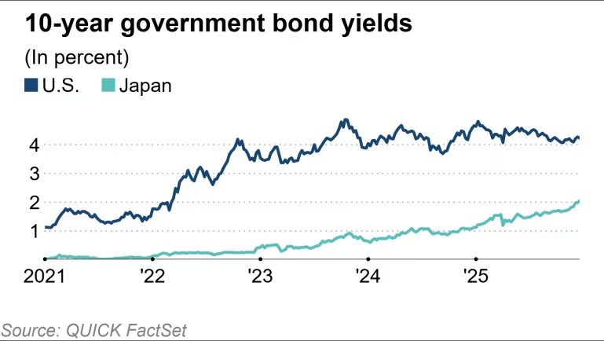

https://asia.nikkei.com/editor-s-picks/interview/japan-s-takaichi-talks-tough-on-debt-as-bond-yields-spike

這是一篇極具戰略意義的獨家專訪。如果說之前的文章讓我們看到了「市場的混亂（外資買股但怕債、BDC 崩盤）」，那麼這篇專訪則揭示了**日本政府頂層設計的矛盾與困境**。

高市早苗（Sanae Takaichi）首相試圖在「財政紀律」與「巨額支出」之間走鋼索，而市場正在用 **2.1% 的公債殖利率**（27 年新高）對她的政策進行重新定價。

以下是針對這篇專訪的深度解析：

---

# 深度分析：高市早苗的「財政走鋼索」與日本經濟的滯停風險

## 1. 核心矛盾：口頭的鷹派，行動的鴿派 (The Fiscal Contradiction)

高市首相當著《日經》總編輯的面，做出了一個看似強硬但實則充滿破綻的承諾。

- **口頭承諾（Talk）：** 她宣稱拒絕「不負責任的發債或減稅」，並強調國債水平（GDP 的 235%）過高，必須在「中期」內改善。
    
- **實際行動（Walk）：** 她剛剛通過了 **18.3 兆日圓** 的補充預算（Supplementary Budget），並準備提出創紀錄的 **122 兆日圓** 年度預算。
    
- **深度解讀：** 這就是所謂的**「鱷魚嘴（Alligator Jaws）」**現象——稅收與支出的缺口正在擴大。高市將這些支出美化為「對經濟安全的頭期款（Down Payment）」，這在本質上是**「高市版的新安倍經濟學」**：透過政府舉債來投資特定戰略產業（能源、國防、AI）。
    
- **市場反應：** 債券市場並不買單她的「財政紀律」說辭。這解釋了為什麼 10 年期 JGB 殖利率會飆升至 **2.1%**。投資人看得很清楚：**債券供給量（Issuance）即將大增，所以要求更高的風險溢價。**
    

## 2. 經濟現實：從「通膨」滑向「停滯性通膨」 (Stagflation Risk)

這篇報導揭露了幾個令人不安的硬數據，顯示日本經濟並不如股市表現得那麼健康：

- **GDP 萎縮：** 第三季（7-9月）GDP 年化季減 **2.3%**。
    
- **通膨侵蝕：** 消費者物價指數（CPI）達 **3%**，吃掉了薪資漲幅。
    
- **關稅重擊：** 川普關稅導致汽車產業在半年內損失 **1.5 兆日圓**。
    
- **分析：** 這是一個危險的訊號。GDP 在縮水，但物價在漲（3%），且利率也在升（BOJ 升至 0.75%）。這就是典型的**停滯性通膨（Stagflation）**前兆。高市的大撒幣政策（財政刺激）是為了對抗衰退，但副作用是會進一步推高通膨，讓日本央行（BOJ）的處境更加艱難。
    

## 3. 戰略板塊：您的投資機會與風險

高市在專訪中明確點出了她的「花錢清單」，這對您的投資佈局至關重要：

- **關鍵詞：** **「經濟安全（Economic Security）」**、**「能源安全」**、**「稀土供應」**、**「網路安全」**。
    
- **機會點：**
    
    - **能源與電網：** 為了支撐 AI 資料中心與國家安全，日本政府將不計成本升級電網與能源設施。這與您關注的資料中心電力成本息息相關——**政府可能會補貼基礎建設，但電價本身因進口成本（弱勢日圓）仍將居高不下。**
        
    - **國防與資安：** 這是預算的一大塊，相關日企將直接受惠。
        
- **風險點（汽車業）：** 報導明確指出汽車業是川普關稅的最大受害者。如果您的投資組合中有 Toyota 或 Honda，需留意其獲利修正的風險。
    

## 4. 央行與政府的角力 (The Policy Tug-of-War)

這是最微妙的政治語言藝術。

- **高市說法：** 「期待 BOJ 與政府緊密合作」、「通膨目標需要由薪資驅動」。
    
- **潛台詞：** 高市其實在**暗示 BOJ 不要升息升得太快**。因為政府要發行創紀錄的國債，如果 BOJ 利率拉太高，政府的利息支出（Debt Service Cost）會爆炸，進一步擠壓預算。
    
- **現狀：** BOJ 已經升息到 0.75%，JGB 殖利率破 2%。這意味著日本政府每年要多付數兆日圓的利息。**「財政主導（Fiscal Dominance）」**的陰影正在逼近——即央行為了不讓政府破產，被迫壓低利率，從而犧牲匯率（導致日圓暴跌）。
    

## 5. 外交與供應鏈的脫鉤 (The China Factor)

- **現狀：** 與中國關係緊張，但保持對話；稀土供應鏈重組。
    
- **影響：** 這意味著日本企業的**生產成本將結構性上升**。過去依賴中國廉價供應鏈的日子結束了，轉向「經濟安全」意味著要花更多錢去建立備份供應鏈。這將長期支撐日本國內的通膨壓力。
    

---

### **綜合結論：高市的賭局**

高市早苗正在進行一場豪賭：她試圖用**「政府支出的油門」**來抵銷**「央行升息的煞車」**以及**「川普關稅的阻力」**。

- 對日圓的影響：
    
    這篇專訪確認了日圓易貶難升的結構。因為高市的財政擴張是通膨的，且會導致貿易赤字擴大（進口能源與軍備）。即便 BOJ 升息，只要政府繼續大撒幣，日圓的基本面依然疲軟（目前在 156，甚至可能測試 161）。
    
- 對您的下一步建議：
    
    既然高市明確將**「能源安全」列為頭期款項目，您在評估 AI 資料中心投資時，可以關注日本政府是否有針對「高效能運算（HPC）基礎設施」或「綠能儲電系統」**的具體補貼計畫（Subsidy Program）。這可能是抵銷電費上漲的唯一政策紅利。