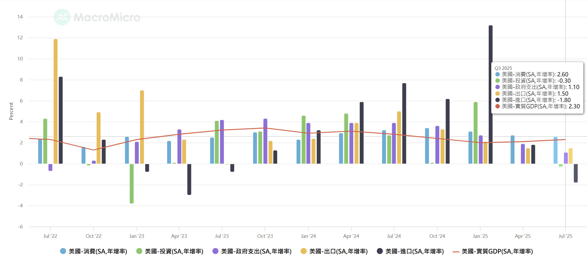
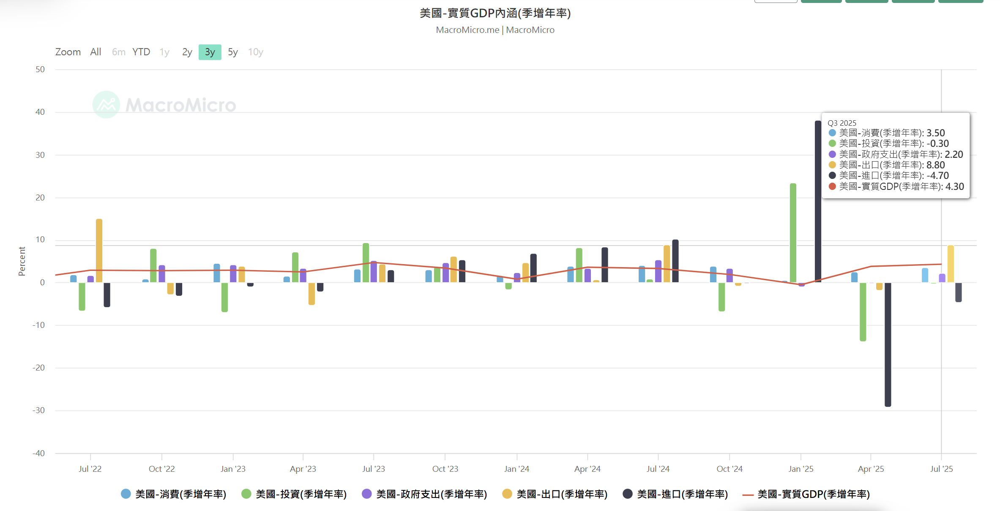

https://www.wsj.com/economy/us-gdp-q3-2025-2026-6cbd079e?mod=WTRN_pos1

這是一篇極具欺騙性的宏觀經濟報告。

如果單看標題「GDP 成長 4.3%」，你會以為美國經濟好得不得了，這與前一篇 BDC（商業發展公司）市場崩盤的慘狀似乎完全矛盾。

但如果我們像剝洋蔥一樣，把這份報告拆解開來，並結合您之前提供的「BDC 崩盤」與「利率已降至 3.75%」的背景，我們會發現：**這 4.3% 的成長並非來自健康的有機擴張，而是由「關稅扭曲」與「貧富差距」堆砌出來的數據幻象。**

這份報告恰恰解釋了為什麼美股（S&P 500）還在高位，但底層信貸（Private Credit）卻在崩潰。

---

# 深度分析：GDP 數據背後的「海市蜃樓」與 K 型裂痕

## 1. 數學魔術：進口崩跌帶來的「虛假成長」 (The Net Export Illusion)

这是整份报告最需要警惕的数据陷阱。GDP 的計算公式如下：

$$GDP = C (消費) + I (投資) + G (政府支出) + (X - M) (淨出口)$$

- **關鍵數據：** 報告指出，貿易（Trade）為 GDP 貢獻了 **1.59 個百分點**，原因是「出口增加，進口持續下降」。
    
- **機制解析：**
    
    - 在 GDP 公式中，**進口 (M)** 是減項。
        
    - 當川普實施高關稅，導致美國企業減少進口時，**$M$ 變小了，數學上 GDP 就變大了**。
        
- **經濟意涵：** 這不是因為美國人生產了更多東西（健康的成長），而是因為美國人買不起或買不到外國貨了（進口萎縮）。這是一種**「衰退式的成長數據」**。這解釋了為什麼雖然 GDP 數字漂亮，但底層製造業和零售商（BDC 的借款人）卻在裁員和違約。
    

## 2. 消費的 K 型分裂：BDC 借款人的噩夢 (The K-Shaped Divergence)

報告中關於消費細項的描述，完美解釋了為何 BDC 會違約。

- **服務業 (Services) $/uparrow$：** 成長 3.7%。主要驅動力是**醫療健保、法律服務、國際旅遊**。
    
    - _受惠者：_ 高收入階層（還有錢出國玩）、專業服務機構。這些行業通常不需要借高利貸，現金流穩定。
        
- **耐用品 (Durable Goods) $/downarrow$：** 成長放緩至 1.6%，且報告明確指出「人們不再汰換老舊設備（washing machines, dishwashers）」。
    
    - _受害者：_ **中型製造商、消費品生產商**。這些正是 BDC 的主要客戶群。
        
- **結論：** 美國經濟呈現嚴重的 **K 型走勢**。上層靠股市和服務業狂歡，下層（耐用品、製造業）因為高物價和高利率而縮手。BDC 投資的是「下層」，而 GDP 反映的是「上層」。
    

## 3. 企業投資的警訊：AI 支出的邊際效益遞減 (CapEx Saturation)

這是對科技股投資者（如您關注的 NVIDIA、Advantest）的一個重大警訊。

- **數據：** AI 相關投資對 GDP 的貢獻度從上半年的 **1.0%** 腰斬至 **0.4%**。
    
- **整體投資：** 企業投資成長率從上一季的 7.3% 暴跌至 **2.8%**。
    
- **深度解讀：** 這意味著企業的「硬體軍備競賽」正在冷卻。資料中心（Data Centers）蓋得差不多了，或者企業開始審視 AI 的 ROI（投資回報率）。
    
- **連鎖反應：** 如果企業 CapEx 放緩，接下來就會影響到上游半導體設備商的訂單。這可能是半導體週期見頂的領先指標。
    

## 4. 聯準會的兩難：停滯性通膨的陰影 (Stagflation Risk)

這份報告讓聯準會（Fed）的處境極其尷尬，也解釋了為什麼利率卡在 3.75% 下不去，或者降息效果不彰。

- **矛盾點：**
    
    - GDP 4.3%（超強） + 通膨 2.9%（回升）。照理說，這時候應該**升息**。
        
    - 但 Fed 卻已經**降息**至 3.75%。
        
- **真相：** 聯準會看到了 GDP 數據背後的虛弱（住宅投資 -5.1%、商業建築萎縮）。他們知道這個 4.3% 是靠關稅和服務業硬撐的。
    
- **風險：** 在通膨反彈（2.9%）的情況下硬要降息救經濟，極有可能引發 1970 年代的**停滯性通膨（Stagflation）**。這對於債券市場和 BDC 都是最壞的結果（成本降不下來，收入又長不出來）。
    

---

### **綜合圖景：2025 年底的真實美國 (The Big Picture)**

將這篇 GDP 報告與上一篇 BDC 報告疊加，我們可以拼湊出完整的真相：

1. **宏觀面（GDP）：** 看起來很美（4.3%），主要是因為**關稅導致進口大減**（數學遊戲）以及**富人消費**（服務業）支撐。
    
2. **微觀面（BDC）：** 實體經濟（耐用品、商業建築、中型企業）已經進入衰退。企業不投資了（2.8% 成長率），老百姓不買家電了。
    
3. **時間差（Lag）：** 請注意，這份報告是被政府關門延誤的 **Q3 數據（7-9月）**。現在是 12 月。BDC 的違約潮反映的是 **當下（Q4）** 更惡化的情況。GDP 數據是「後照鏡」，而 BDC 違約率是「擋風玻璃」。
    

**給您的投資洞察 (Key Takeaways)：**

1. **不要被 Headline GDP 騙了：** 4.3% 的成長不代表股市會繼續漲。相反，**AI 投資減半（1.0% $/rightarrow$ 0.4%）** 是一個非常危險的訊號，建議您重新檢視手上 AI 硬體股的倉位。
    
2. **避開「週期性消費品」：** 耐用品消費放緩，這類公司的財報下一季會很難看。
    
3. **確認「防禦性」配置：** 只有醫療健保（Healthcare）這類服務業在報告中顯示出剛性需求。如果必須留在市場，資金應從科技/循環股轉向防禦型類股。
    

##  **2026 年雲端巨頭（Hyperscalers）資本支出（CapEx）** 的深度預測分析。

一句話總結：**2026 年將是「硬體消化期（Digestion Year）」與「ROI 審判日」。**

過去三年（2023-2025）那種「不計代價搶購 GPU」的盲目擴張階段已經結束。2026 年的 CapEx 將從**「指數級增長」**轉為**「平原期（Plateau）」**甚至**「結構性調整」**。

---

### **1. 宏觀定調：從「軍備競賽」到「庫存消化」**

根據剛才 GDP 報告中 **AI 投資貢獻度從 1.0% 降至 0.4%** 的警訊，我們可以看到雲端巨頭的行為模式正在改變。

- **2023-2024 (狂熱期)：** 怕落後 (FOMO)，有多少卡買多少卡。
    
- **2025 (頂峰/轉折期)：** 基礎設施建成，但應用層（App）的營收還沒跟上。
    
- **2026 (消化期)：** 巨頭們面臨股東壓力，必須證明這些昂貴的 GPU 能賺錢。
    
    - **預測：** 四大巨頭（Microsoft, Google, Amazon, Meta）的總 CapEx **年增率（YoY）將大幅放緩**，可能從過去的 50%+ 降至 10% 甚至持平。
        

---

### **2. 四大巨頭的 2026 戰略預測**

#### **Microsoft (Azure / OpenAI)**

- **現狀：** 擁有最大的 AI 算力集群，但 OpenAI 的虧損仍在擴大。
    
- **2026 預測：** **「軟體變現壓力最大」**。
    
    - Satya Nadella 不會無限制地批准硬體預算。2026 的重點會轉向 Copilot 的企業採用率。
        
    - **對供應鏈影響：** 可能會削減對標準版 NVIDIA GPU 的採購，轉而優化現有產能，並推動自研晶片（Maia）以降低成本。
        

#### **Google (Alphabet)**

- **現狀：** 擁有最強的自研晶片（TPU）架構。
    
- **2026 預測：** **「效率優先，去 NVIDIA 化」**。
    
    - Google 最有能力擺脫 NVIDIA 的定價鉗制。2026 年 Google 的 CapEx 會更多流向自家的 **TPU v6/v7**，而不是外部採購。
        
    - **目的：** 為了在搜尋引擎中導入 AI（SGE）時，將推理成本（Inference Cost）壓到最低。
        

#### **Amazon (AWS)**

- **現狀：** 態度最務實，不隨波逐流。
    
- **2026 預測：** **「針對性擴張」**。
    
    - AWS 會專注於自家晶片 **Trainium** 和 **Inferentia** 的部署。
        
    - 這對台積電（代工）是利多，但對 NVIDIA 是利空。他們會把錢花在資料中心的「電力」與「冷卻」基礎設施上，而非單純堆疊 GPU。
        

#### **Meta (Facebook)**

- **現狀：** Zuckerberg 歷史上曾有過度投資後又大幅裁員（Year of Efficiency）的紀錄。
    
- **2026 預測：** **「最大的變數」**。
    
    - 如果 2025 年底 Llama 模型的變現能力（廣告優化）不如預期，Meta 是最有可能在 2026 年**突然砍單**的巨頭。
        
    - **風險提示：** 它是開源模型的主力，如果它縮手，整個開源 AI 生態系會降溫。
        

---

### **3. 2026 年的結構性轉變：這對您的投資意味著什麼？**

這場 CapEx 的本質變化，將導致供應鏈的獲利模式發生劇烈板塊移動。

#### **趨勢 A：從「訓練 (Training)」轉向「推理 (Inference)」**

- **邏輯：** 模型已經訓練好了（GPT-5, Llama 4），2026 年是讓用戶「使用」這些模型。
    
- **硬體影響：**
    
    - **訓練：** 需要超高端 GPU（如 NVIDIA B200）並聯。 $/rightarrow$ **需求下降**。
        
    - **推理：** 需要低延遲、低功耗的晶片（甚至是邊緣運算 Edge AI）。 $/rightarrow$ **ASIC（客製化晶片）需求上升**。
        
    - **贏家：** 專門做 ASIC 設計服務的公司（如 Broadcom, Marvell, 聯發科, 創意電子）。
        
    - **輸家：** 依賴通用 GPU 高毛利的 NVIDIA（毛利會被壓縮）。
        

#### **趨勢 B：從「晶片短缺」轉向「電力短缺」**

- **邏輯：** 2026 年，巨頭們買到了足夠的晶片，但發現**沒有足夠的電**讓它們跑起來。
    
- **CapEx 流向：** 資金將從「買電子產品」流向「買土地、買電廠、買散熱設備」。
    
- **贏家：** 散熱解決方案（液冷）、重電設備（變壓器）、綠能開發商。
    

#### **趨勢 C：自研晶片 (ASIC) 的黃金交叉**

- **邏輯：** 為了降低 TCO（總擁有成本），巨頭們會加速導入自研晶片來取代昂貴的 NVIDIA 卡。
    
- **關鍵圖表：** 預計在 2026 年，客製化 ASIC 在雲端資料中心的佔比將突破臨界點。
    

---

### **4. 結論：半導體週期的「修正」不可避免**

結合 Q3 GDP 的「投資降溫」與 BDC 的「信貸緊縮」，2026 年的劇本如下：

1. **NVIDIA 危險了：** 作為過去幾年的最大受益者，當客戶（巨頭）開始「消化庫存」並轉向「自研晶片」時，NVIDIA 難以維持過去那種恐怖的成長率。股價可能會經歷顯著的估值修正（Valuation Reset）。
    
2. **台積電 (TSMC) 相對安全：** 因為無論是 NVIDIA 的 GPU，還是 Google/Amazon 的自研晶片，**全部都要找台積電代工**。只要 AI 總量還在（即使轉向 ASIC），台積電就是最穩的軍火商。
    
3. **設備商的寒冬：** 正如 GDP 報告指出「AI 投資貢獻減半」，半導體設備商（Advantest, Applied Materials）可能會在 2026 年面臨訂單年減的風險。
    

