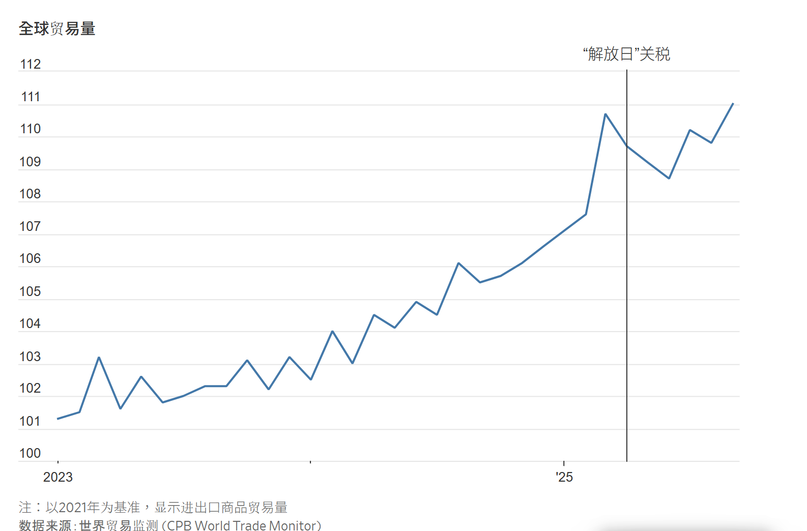
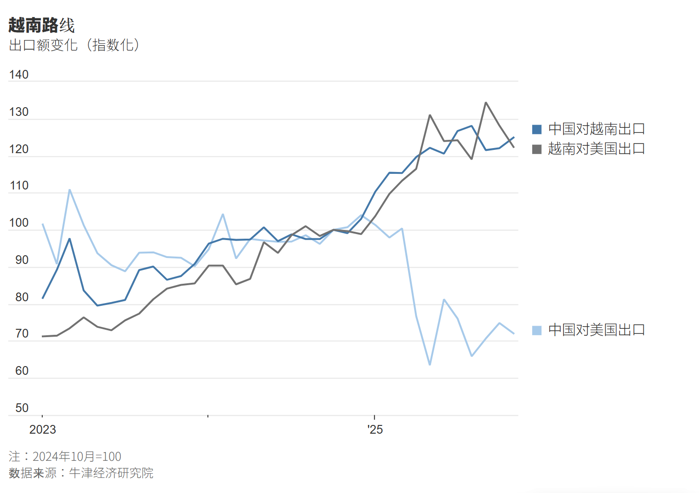
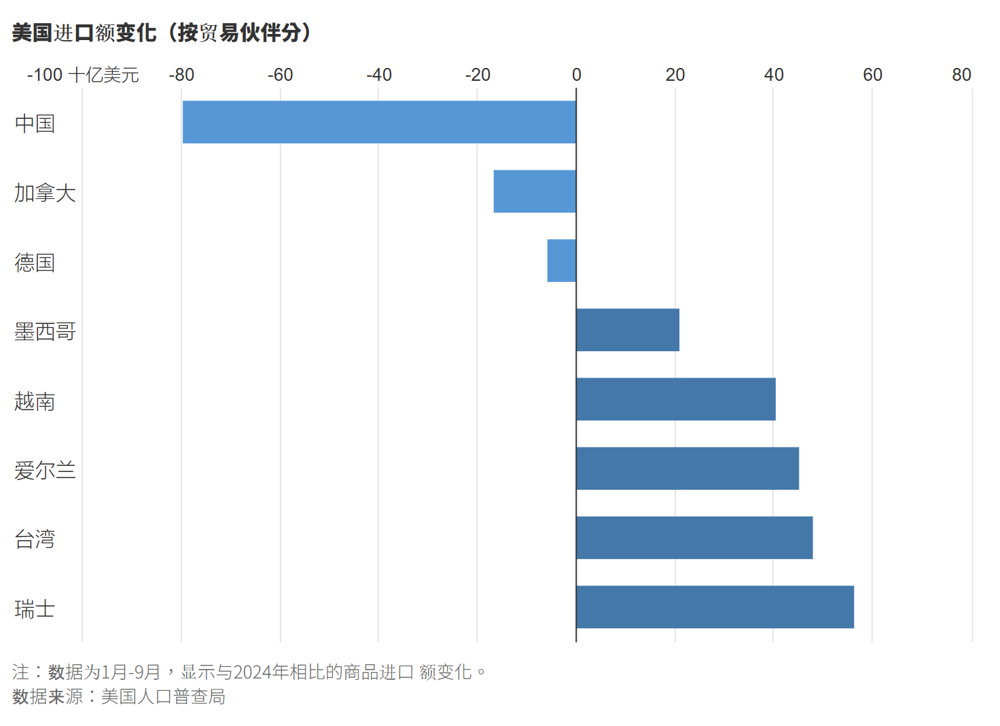

# 從捕蝦農、車企到律師：全球如何應對川普貿易戰？

## 本文的六則真實案例講述了全球貿易規則大洗牌時，身處其中的企業與個人如何迅速調整。

圖片來源：RACHEL MENDELSON/WSJ; BLOOMBERG, ISTOCK

[Chelsey Dulaney](https://www.wsj.com/news/author/chelsey-dulaney)  /  [Chao Deng](https://www.wsj.com/news/author/chao-deng)   / [Jon Emont](https://www.wsj.com/news/author/jon-emont)  / [Stephen Wilmot](https://www.wsj.com/news/author/stephen-wilmot)  /[Shan Li](https://www.wsj.com/news/author/shan-li)

2026年1月2日 11:42 CST

2025年春天，美國總統川普(Trump)站在玫瑰園裡，在兩側美國國旗的映襯下，向自由貿易宣戰。

近九個月後，全球貿易體系非但沒有在美國近一個世紀以來最高的關稅下崩潰，反而沿著新的脈絡重塑。

美國從中國直接採購的商品減少了，但從中國企業設在越南等關稅較低地區的工廠採購的商品增多了。中國對幾乎所有其他國家和地區的出口都在增加，尤其是向歐洲出口的廉價商品。中國對稀土礦產的牢牢掌控，迫使各國採取新的措施，期望自主生產這種對汽車和電子產品至關重要的原材料。

[墨西哥出人意料地成為關稅贏家](https://cn.wsj.com/articles/WP-WSJT-0003217857)。

美國消費者則承受了更高的牛肉、香蕉和咖啡價格。製藥關稅的威脅催生了新的藥品價格協議。由於加拿大抵制美國酒類，加州的葡萄酒行業陷入困境。

儘管如此，根據世界貿易組織(World Trade Organization, 簡稱WTO)的數據，全球商品貿易額在經歷了起初的波動後，預計2025年全年仍將增長2.4%。

「貿易總會找到出路，就像流水一樣，」物流巨頭DHL的高管邁克·帕拉(Mike Parra)說。「某個國家或許試圖改變貿易運作方式，但貿易活動會繞過它繼續進行。」

以下六則真實案例講述了全球貿易規則大洗牌時，身處其中的企業與個人如何迅速調整。

### 將生產轉移到美國的汽車製造商

對於日產汽車(Nissan)這樣一家在五大洲都設有工廠的典型全球化車企來說，應對關稅的辦法是向美國傾斜。

日產汽車提高了其田納西州工廠Rogue SUV的產量，而不是從日本工廠進口該車型。該公司還在積極推廣其他在美國生產的車型，如尺寸更大的Pathfinder SUV和Frontier皮卡，以減少從墨西哥進口的車輛。

「我們有一個非常周密的計劃，把營銷資金投放在美國生產的汽車上，」該公司首席財務長熱雷米·帕潘(Jérémie Papin)在最近接受採訪時說。

帕潘說，日產汽車可能會在美國而不是墨西哥組裝其在墨西哥生產的英菲尼迪(Infiniti) SUV的換代車型。日產汽車還在與日本同行三菱汽車(Mitsubishi)和本田汽車(Honda)商談，以共享其在美國的閒置組裝產能。豐田汽車(Toyota)和現代汽車(Hyundai)等競爭對手品牌也已宣布在美國投資建廠，以減少其關稅風險。

汽車行業是受關稅衝擊最嚴重的行業之一，2025年早些時候，幾家最大的汽車公司總共報告了近120億美元的額外關稅成本。

田納西州斯邁納市日產工廠生產線上正在組裝的車輛。圖片來源：Luke Sharrett/Bloomberg News

到目前為止，日產汽車等汽車製造商一直沒有提價，而是通過降低利潤來消化衝擊。根據Cox Automotive的數據，2025年11月份新車的平均成交價略低於50,000美元，同比上漲1.3%。

### 受中美夾擊的家具製造商

對於家具公司Gautier來說，美國的關稅是個壞消息，影響了其從法國出口到美國的時尚歐式家具的銷售。

但對該公司來說，更糟糕的是白宮與中國貿易戰的連鎖反應：在美國對一些中國家具徵收的關稅達到70%後，中國工廠將大量廉價商品傾銷至Gautier所在的歐洲本土市場。

「中國產品現在正湧入我們的市場，」Gautier的首席執行官戴維·蘇拉爾(David Soulard)說。Gautier由他的叔叔和嬸嬸於1960年創立。Gautier最初生產看起來像汽車和火箭飛船的兒童床，如今銷售沙發、書櫃和書桌等產品，售價約為2,500美元。

蘇拉爾說，幾個月前他參加了上海的一個家具展，現場美國買家寥寥無幾，中國出口商則向歐洲買家極力推銷低價產品。

「我們明顯注意到了這一點。在定價方面，他們採取了攻勢，」蘇拉爾說。

Shein、Temu等電商平台在歐洲的崛起加劇了競爭，歐洲消費者直接從中國賣家那裡購買廉價的沙發和床。

「他們正在人們心目中創造一個新的價位，」他說。

	Gautier的所有家具都在法國生產，人工和能源成本更高，監管標準更嚴格。因此，Gautier轉而專注於更高價值的項目，比如為辦公室和酒店供應家具。出口方面，Gautier正將目標對 準沙烏地阿拉伯、杜拜和非洲。

### 美式蝦仁雞尾酒更「美國」了，也更貴了

從墨西哥灣沿岸到南大西洋，美國蝦農都在為川普的關稅歡呼。而在印度，這場貿易戰則是一場災難。

開市客(Costco)、沃爾瑪(Walmart)等美國零售商過去佔到印度南部安得拉邦蝦農T·瓦爾薩拉傑(T. Valsaraj)等從業者90%的銷售額。川普政府對印度徵收50%的關稅，突然之間讓他的海鮮產品對美國人來說昂貴了很多。

瓦爾薩拉傑現有的美國客戶同意承擔一部分未交貨訂單的額外成本，因為貨架需要為假日季備貨。

但他正準備應對客戶很快轉向厄瓜多爾等關稅較低的產蝦國以及美國國內蝦源的情況。他的產量可能不得不減少五分之一，這會危及他的三家加工廠和1,500名員工。

詹姆斯·布蘭查德(James Blanchard)和他的妻子謝裡(Cheri)是受益者之一。他們住在路易斯安那州腹地霍馬，從2024年開始，他們的捕撈品價格上漲了。

他們現在1磅蝦的售價為1.25美元，高於2023年的87美分。布蘭查德2025年出海捕魚14次，多於2024年的9次。在同一時期，他們的銷售額飆升了50%以上。

「簡直是天壤之別，」負責公司會計工作的謝裡說。「我們一聽到關稅，耳朵就豎起來了。」

### 越南成為貿易戰的贏家

當川普在2025年4月將對華關稅提高到145%時，保羅·諾里斯(Paul Norriss)的電話被打爆了。諾里斯在越南胡志明市外經營一家服裝廠，每年為Stussy等知名潮牌生產數以百萬計的T恤和毛衣。

新品牌找上門來，請求他代工服裝，希望能利用美國對越南進口商品的關稅低於美國對華關稅的優勢。諾里斯的現有客戶（主要是美國公司）也紛紛要求增加訂單。

中國以外制造業需求的增長在越南引發了一場貿易繁榮。

根據美國人口普查局(U.S. Census Bureau)的數據，從2025年4月到9月，越南對美國的出口額同比增長了42%。越南政府表示，該國2025年全年全球出口額將比上年高出16%。

對於像諾里斯這樣的越南工廠主來說，滿足客戶變得棘手。他的700名工人能縫製的T恤數量有限。諾里斯必須決定，是在客戶需要的時候支持他們，還是接納那些他可以收取更高費用、但可能不會長期合作的新客戶。

從理論上講，這是一個「幸福的煩惱」。但在實際操作中充滿了壓力和混亂，尤其是在美國對越南的關稅也在上調的情況下，提前規劃和增加招聘都變得更加困難。

最後，諾里斯主要還是堅持與他的老客戶合作，但也增加了一家英國-澳洲服裝公司作為新客戶，以減少對美國客戶的依賴。

儘管存在種種不確定性，他2025年的服裝產量還是增加了。「這是一段有趣的經歷，」他說。

### 不起眼的馬口鐵罐變得昂貴許多

Independent Can Co.生產用於盛放節日餅乾、巧克力和Burt’s Bees產品的馬口鐵罐，公司第三代所有者裡克·休瑟(Rick Huether)通過將所有關稅成本轉嫁給客戶，挺過了2025年50%的鋼鐵關稅。他擔心這一策略已難以為繼。

越南胡志明市的一個工廠裡的工人正在為全球品牌縫製街頭服飾。圖片來源：Thanh Hue for WSJ

2025年秋天，在他位於馬里蘭州貝爾坎普的公司第二次提價後，一個客戶取消了大約15,000美元的生意。這是一家弗吉尼亞州的花生製造商，30年來一直購買他的罐子。這位客戶告訴他：「我們現在承受不起你們的做法了。」

在美國，用於罐頭的特種鍍錫鋼板產量不足，近80%依賴進口。行業組織罐頭製造商協會(Can Manufacturers Institute)表示，自2025年關稅大幅上調以來，鍍錫板的生產並未出現實質性的迴流。啤酒和汽水罐製造商在進口鋁板方面也面臨類似的關稅壓力。

休瑟曾多次嘗試從美國為數不多的幾家國內供應商之一美國鋼鐵公司(U.S. Steel)購買更多鍍錫板。他說，該公司無法滿足他的規格和生產時間要求。

美國鋼鐵公司的一位發言人表示，該公司「有充足的馬口鐵廠產能來供應國內需求」，並「致力於為客戶供應在美國開採、熔煉和製造的馬口鐵廠產品」。

休瑟只能從德國、台灣、韓國和土耳其購買鍍錫板。他估計，他的企業2025年已產生1,200萬美元的額外關稅成本。隨著他轉嫁這部分成本，一些客戶正從馬口鐵罐轉向紙質和塑膠容器。休瑟不確定自己能否再次提價。

「我們為2026年感到擔憂，」他說。

### 一位律師找到了關稅變通辦法

一年前，西雅圖律師丹·哈里斯(Dan Harris)對關稅法還知之甚少。而如今，他已對其中錯綜複雜的細節了如指掌。

哈里斯的客戶中有許多是美國進口商，他們找到他的律所，希望找到減輕關稅賬單的方法。有些人提出了一些可能非法的想法——比如，當海外業務夥伴低報貨物價值時，採取睜一隻眼閉一隻眼的態度。哈里斯和他的同事們則設計了一套合規的「節稅方案」。

一個技巧是降低出口到美國的貨物的申報價值。

以注塑模具費為例。玩具、醫療設備和其他商品的買家通常會向中國工廠支付一筆使用其模具的費用。這筆費用會提高進口產品的價值，從而增加必須支付的關稅。

裡克·休瑟在馬里蘭州貝爾坎普市的公司工廠內。圖片來源：ryan collerd/Agence France-Presse/Getty Images

哈里斯說，一個更好的解決辦法是從中國合作夥伴那裡購買模具。這筆一次性開支可以降低產品的申報價值，從而減少應繳關稅。其他方法包括扣除運輸費，以及剔除某些研發成本。「我們可以幫你從這些細微處節省關稅費用，」哈里斯說。「這會積少成多。」

-