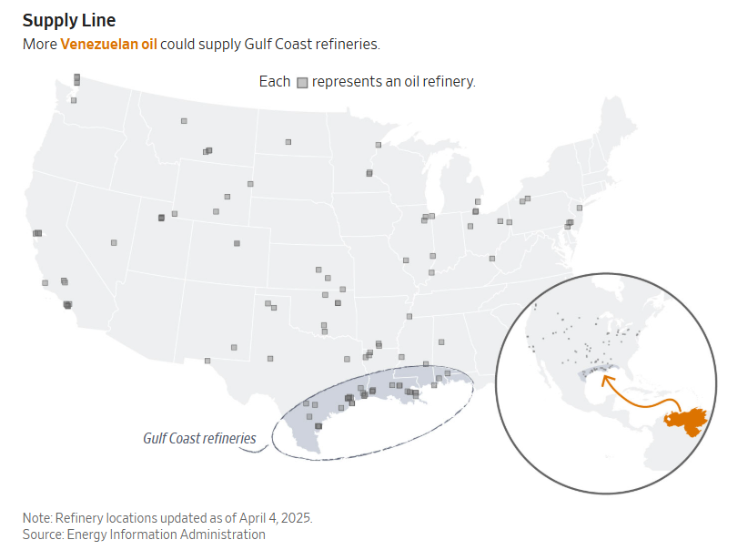
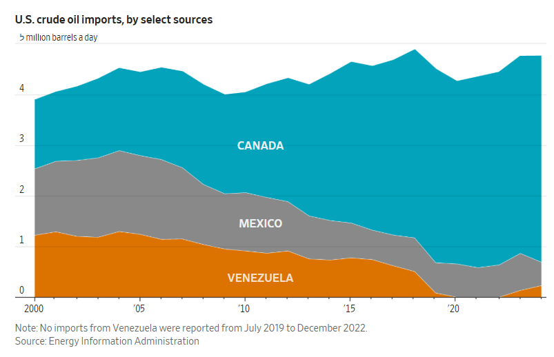
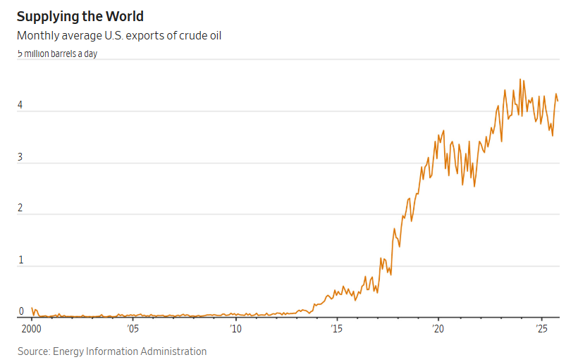

[瑞安·德澤姆伯](https://www.wsj.com/news/author/ryan-dezember)
和
[德魯·安·範](https://www.wsj.com/news/author/drew-an-pham)

https://www.wsj.com/business/energy-oil/us-venezuela-crude-oil-refining-df3854d1?mod=author_content_page_1_pos_1

**根據行業組織『美國燃料與石化製造商協會』（AFPM）的說法，約 70% 的美國煉油產能，在處理重質原油時的運行效率最高。」這些煉油廠集中在墨西哥灣沿岸，美國十大煉油廠中有九家位於該地區。近年來，委內瑞拉的石油產量大幅下降，其少量產量也多轉售給古巴和中國等國。**

2026年1月7日晚上8:00（美國東部時間）

美國石油產量比其他國家都多，那麼為什麼川普總統和包括國務卿[馬可·盧比奧](https://www.wsj.com/topics/person/marco-rubio)在內的官員認為美國煉油廠需要委內瑞拉原油呢？

雖然頁岩油開採熱潮從西德克薩斯州和北達科他州等地釋放大量石油，但這往往不是美國煉油商需要的原油類型。

從普吉特海灣到德州海岸的煉油廠，幾十年前的設計目的就是為了加工美國從加拿大、墨西哥和委內瑞拉等國進口的較重、含硫量較高的原油。 

「我們在墨西哥灣沿岸的煉油廠在提煉這種重質原油方面是世界上最好的，而且世界各地都出現了重質原油短缺，所以我認為，如果給予足夠的空間，私營企業將會有巨大的需求和興趣，」魯比奧週日在ABC的「本週」節目中說道。

  
根據行業組織『美國燃料與石化製造商協會』（AFPM）的說法，約 70% 的美國煉油產能，在處理重質原油時的運行效率最高。」這些煉油廠集中在墨西哥灣沿岸，美國十大煉油廠中有九家位於該地區。近年來，委內瑞拉的石油產量大幅下降，其少量產量也多轉售給古巴和中國等國。

  

隨著墨西哥和委內瑞拉對美國的石油出口下降，煉油商轉而從加拿大進口石油。加拿大已大幅提高了其油砂重質原油的產量。如今，加拿大向美國煉油廠出口的石油量超過了所有其他國際供應商的總和。

資料來源：美國能源資訊署

總的來說，美國煉油廠使用的石油約有40%是進口的，目的是為了獲得合適的原油比例，從而生產從汽油、柴油到航空煤油和瀝青等各種產品。自十年前原油出口[禁令](https://www.wsj.com/articles/u-s-exports-first-freely-traded-oil-in-40-years-1452643962?mod=article_inline)解除以來，美國過剩的石油被運往海外。此後，美國已成為世界上最大的石油出口國之一，向印度、中國、韓國和歐洲各地運送原油。

## 美國需要重油

美國煉油廠（特別是墨西哥灣沿岸的複雜煉油廠）之所以高度依賴委內瑞拉重油，是因為它們在設計之初就投入了巨資進行『定制化』建設。
1. 不是「只能」，而是「非它不可」的經濟性

這些煉油廠並非無法處理輕質原油（頁岩油），而是**如果不吃重油，它們會「虧本」或「效能低落」**：

- **設備適配：** 墨西哥灣的煉油廠擁有昂貴的「轉化裝置」（如焦化器、加氫裂化器）。這些設備是為了處理重油中巨大的分子鏈而設計的。如果只輸入輕質原油，這些造價數十億美元的設備就會處於閒置狀態，這對企業來說是巨大的資產浪費 。
- **產出平衡：** 重油雖然「髒」，但它含有豐富的重碳分子。透過這些設備，煉油廠能以**極低的原料成本**，提煉出利潤極高的**柴油**和**航空燃油**。目前 2026 年全球對柴油的需求依然旺盛，這使得重油成為煉油廠眼中的「低成本高回報」寶藏。

2. 工業副產品的「唯一來源」

輕質原油產出的主要是汽油和石腦油，對於某些工業基礎材料，重油是不可替代的：

- **高品質瀝青：** 輕質油幾乎產不出瀝青。美國修築公路所需的大量高品質瀝青，高度依賴委內瑞拉這種重質原油的殘渣。
- **石墨電極與石油焦：** 煉焦裝置產出的「石油焦」是煉鋼和煉鋁工業必不可少的原料，這也是輕質原油無法提供的。
- **特殊潤滑油：** 某些高黏度的工業潤滑油和油脂，也需要從重油的重分子結構中提煉 [3]。

總結

美國煉油廠拿委內瑞拉重油，主要是為了**「榨取高價柴油」**並**「獲取工業副產品」**，同時利用其**「低廉的進口價格」**來最大化利潤。

## 為什麼柴油和航空燃油需要用重油來提煉

這是一個非常專業且關鍵的問題。直覺上我們可能認為「高品質的油（如柴油、航煤）應該用高品質的原油（輕質油）來做」，但實際上，**煉油是一個「分子切割與重組」的過程**，重油在生產柴油方面具有獨特的結構優勢：

1. 分子結構的適配性（碳鏈長度）

原油是由不同長度的「碳鏈」組成的。

- **輕質原油（頁岩油）：** 含有大量較短的碳鏈，最適合生產**汽油**（碳原子數約 5-12）。
- **重質原油（委內瑞拉重油）：** 含有大量長鏈分子和環狀結構，這與**柴油**（碳原子數約 12-20）及**航空燃油**（碳原子數約 10-16）的分子量區間更接近。
- **「切割」比「拼接」容易：** 透過美國煉油廠先進的**加氫裂化裝置 (Hydrocrackers)**，將重油中巨大的分子「切割」成柴油分子，比將輕質油中過短的分子「拼接」起來更為高效且經濟。

2. 高效能的「加氫」過程

航空燃油和柴油對**能量密度**和**潤滑性**有很高要求。

- 重油雖然雜質多，但它提供了豐富的重碳骨架。
- 複雜煉油廠在處理重油時會加入大量的**氫氣**（加氫處理）。這個過程不僅去除了重油中的硫，還能把原本「黑糊糊」的殘渣轉化為清潔、高能量密度的中質餾分油（即柴油和航煤）。

3. 產出比例（煉油收率）

這是一個經濟帳：

- 如果煉製**輕質原油**，產出的主要會是汽油。在目前 2026 年全球電動車普及、汽油需求相對放緩，但物流（柴油）與航空（航煤）需求依然強勁的背景下，產出過多汽油並不划算。
- 如果煉製**重質原油**，透過焦化裝置（Coker）和裂化技術，煉油廠可以刻意調高產出比例，獲得更多的**柴油**。這就是為什麼美國煉油廠說重油能讓他們「運行最高效」。

4. 特殊的化學特性（芳香烴與環烷烴）

航空燃油對燃燒穩定性和低溫流動性有極嚴格的要求。重質原油通常含有較高比例的**環烷烴**，這類成分經過提煉後，能使航空燃油在極低溫的高空環境下仍保持良好的流動性，且具有更高的體積能量密度。

總結

簡單來說：

1. **輕質油**像細沙，適合做**汽油**。
2. **重質油**像大石頭，適合敲碎成**柴油和航煤**。
3. 美國墨西哥灣的煉油廠就是專門為了「敲碎大石頭」而設計的**高科技採石場**，處理重油能讓它們產出利潤最高的產品組合。