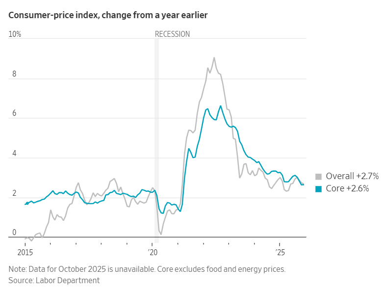
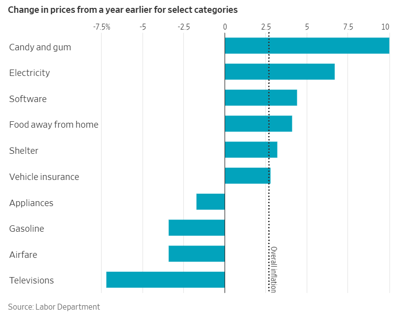

## 食品雜貨和餐廳餐點價格本月大幅上漲，而汽油價格和二手車價格則有所下降。

[哈麗特·托里](https://www.wsj.com/news/author/harriet-torry)

更新2026年1月13日上午9:24 ET

### 

快速概要

- 12月份消費者物價上漲2.7%，符合經濟學家的預期，與上月持平。
    
- 剔除食品和能源價格後的核心消費者物價指數年增2.6%，與11月的數據持平。
    
- 12 月份，食品雜貨、外食、住房、交通和醫療保健等主要家庭開支價格均上漲。
    

本摘要由人工智慧工具依文章正文生成，並經編輯審核。[了解更多](https://www.wsj.com/news/author/wsj-artificialintelligencetools)關於我們如何在新聞報導中使用人工智慧的資訊。

12月份商品和服務價格上漲2.7%，與上月持平，符合經濟學家的預期。 

消費者物價指數報告顯示，關稅的影響仍然相對溫和。這在一定程度上緩解了上個月降息的聯準會官員的壓力。

剔除波動較大的食品和能源價格後，核心消費者物價指數較去年同期上漲2.6%，與11月持平。

《華爾街日報》調查的經濟學家先前預計，12 月消費者物價指數年增 2.7%，核心物價指數較去年同期上漲 2.8%。

經季節性調整後，12 月物價月增 0.3%，符合經濟學家的預期。

12月核心物價較上月上漲0.2%，經濟學家先前預期漲幅為0.3%。

勞工部表示，12月份多項主要家庭生活必需品價格大幅上漲，例如食品雜貨和餐飲。住房成本、交通服務和醫療保健價格也加速上漲。另一方面，汽油價格以及二手車和卡車價格有所下降。

美國股指期貨盤前交易走勢平穩。

聯準會官員對於通膨風險還是就業市場風險更值得擔憂一直存在分歧，他們將密切關注週二的報告，以評估企業將多少與關稅相關的成本增加轉嫁給了客戶。 

聯準會在2025年底前連續三次降息，以緩解疲軟的勞動市場。但[聯準會12月政策會議紀錄](https://www.wsj.com/economy/central-banking/fed-minutes-suggest-caution-about-further-cuts-early-next-year-f36148c7?mod=article_inline)顯示，部分官員不願在近期內支持進一步寬鬆政策。聯準會下次會議將於兩週後舉行。

在川普第二任期內，聯準會和勞工部面臨前所未有的政治壓力。 8月份，川普總統解雇了勞工部部長，並毫無證據地聲稱就業數據被篡改以抹黑他，勞工部因此被捲入政治漩渦。週日，聯準會主席鮑威爾[指責川普政府](https://www.wsj.com/economy/central-banking/for-years-powell-avoided-fighting-trump-thats-over-27451d32?mod=article_inline)以刑事訴訟相威脅，迫使聯準會降息。  

週二發布的這份報告是數月以來首次全面展現通膨趨勢。由於秋季政府停擺，勞工部無法實地收集價格數據，因此不得不採用技術手段來彌補上一份通膨報告中缺少的數據。 

經濟學家表示，因此，一個月前公佈的[11月通膨數據可能被人為低估。經濟學家警告稱，週二公佈的12月份數據可能對11月低估的數據有所修正。 （美國勞工統計局表示，他們](https://www.wsj.com/economy/consumers/consumer-price-index-inflation-november-2025-b0440253?mod=article_inline)[已](https://www.wsj.com/economy/bls-defends-housing-calculations-in-november-inflation-report-d45de065?mod=article_inline)盡力處理價格數據中的缺口。）

高物價和勞動市場降溫仍然是許多美國人最為關注的問題。儘管通貨膨脹率與幾年前相比有所放緩，但食品雜貨、保險和其他必需品的價格仍然遠高於以往。 

12月的CPI報告為這一年畫上了句號，這一年的[通膨比許多人在川普政府於2025年初首次宣布對進口商品徵收高額關稅時所預測的要溫和得多](https://www.wsj.com/economy/why-everyone-got-trumps-tariffs-wrong-d16a4598?mod=article_inline)。通膨在夏季確實有所回升，但並不明顯。 

不過，經濟學家們仍然很想看看1月和2月的通膨情況如何，因為許多企業會在年初調整價格。  

經濟學家普遍認為，今年通膨率可能會繼續緩慢下降，儘管過程中可能會出現一些波動。 

RSM首席經濟學家 Joseph Brusuelas表示， [《一項美好大法案》](https://www.wsj.com/economy/consumers/the-winners-and-losers-from-2026s-mix-of-tax-and-benefit-cuts-3d93efcd?mod=article_inline)中的減稅措施可能在2026年加劇通貨膨脹。

他表示，減稅「只會進一步增強高收入家庭的消費能力，他們顯然有能力在體驗式和服務類消費方面投入更多資金」。他也指出，持續強勁的商業投資，尤其是在人工智慧領域的投資，也可能推高今年的通膨。 

美國政策制定者多年來一直試圖將通貨膨脹率從新冠疫情後的高點回落。整體而言，消費者通膨率已從2022年9%的近期高峰顯著回落。然而，實現這一目標的「最後階段」仍充滿挑戰，通膨率目前仍高於聯準會2%的年比目標。

然而，當前美國經濟呈現出一種兩極化的局面。儘管[經濟成長依然穩健](https://www.wsj.com/economy/us-gdp-q3-2025-2026-6cbd079e?mod=article_inline)，但勞動市場卻已降溫，導緻聯準會的關注點從物價壓力轉向就業。除最近兩次經濟衰退外，2025年美國[平均每月就業成長率](https://www.wsj.com/economy/jobs/jobs-report-december-2025-unemployment-16e90dea?mod=article_inline)將創下2003年以來的最低水準。