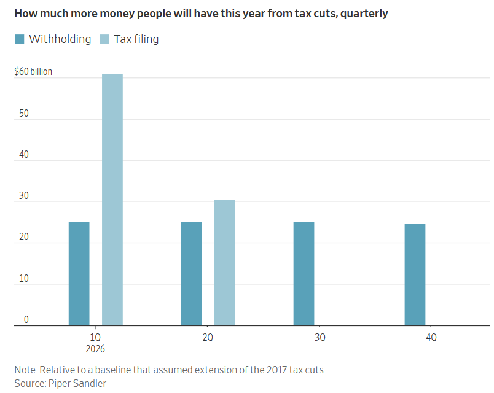

## 加大刺激力道固然有風險，但這些風險在未來是不存在的。

[格雷格·伊普](https://www.wsj.com/news/author/greg-ip)

2026年1月14日 上午5:30 ET

本週，位於華盛頓特區的聯準會總部大樓的翻修工程仍在繼續。 （圖片來源： Nathan Howard/路透社）

大多數年份，總統對經濟的影響不大；經濟規模太大，情況太複雜。

今年與往年不同。川普總統正在採取前所未有的措施來刺激經濟，而且他極有可能成功。

華盛頓有三大槓桿影響經濟成長：財政政策（稅收和支出）、貨幣政策（利率）和信貸政策（借貸便利程度）。歷史上，這三者之間缺乏協調：財政政策受國會週期影響，貨幣政策由獨立的聯準會制定，而信貸政策則往往反映監管機構的隨機決策。

今年，這三項政策都著重於刺激經濟，反映出川普和國會共和黨人一心只想加速經濟成長。他們希望這能幫助他們在11月的中期選舉中獲勝。

在這個過程中，他們犧牲了其他目標：控制債務、聯準會的獨立性和長期財務穩定。其後果將在以後顯現。

### 財政翻轉

看好2026年的第一個原因是，2025年表現非常出色（即便[許多美國人並不認同](https://www.realclearpolling.com/polls/approval/donald-trump/issues/economy)）。經通膨調整後的國內生產毛額可能成長了約2.5%，與前兩年的穩健成長率持平。主要驅動力是人工智慧和資料中心領域的投資，以及強勁的股市提振了消費支出。但這並非透過消耗閒置產能來實現的；事實上，失業率略有上升。

因此，2026年的成長基準應該遠高於2%。需要注意的是，去年的經濟表現是在財政政策緊縮的情況下實現的。川普的關稅政策增加了[約2000億美元的](https://bipartisanpolicy.org/explainer/tariff-tracker/)收入，其中大部分由美國企業和家庭承擔。

今年平均關稅不會上漲，如果最高法院裁定某些關稅的徵收是非法的，平均關稅甚至可能會下降。

與此同時，川普在 7 月簽署生效的稅收和支出法案帶來了新的或擴大的稅收減免，特別是針對州和地方稅、加班費、小費和老年人。

儘管這些減稅措施追溯至2025年初，但預扣稅表僅在今年年初進行了調整。這將產生雙重刺激作用。許多工人本月不僅會收到更高的實際收入，而且在提交納稅申報表時還能獲得去年稅款的退稅。 

Piper Sandler的政策分析師唐納德·施耐德認為，這項法案將為經濟注入近2,000億美元，足以將上半年年化成長率提高0.5個百分點。他還認為，該法案允許企業全額註銷資本支出的條款將促進更多投資。

### 信用提升

投資很大程度受風險偏好驅動，這種偏好既有心理因素也有理性因素。然而，政府可以抑製或刺激這種風險偏好。 

監管不力使得次級房貸在2000年代初助長了房地產泡沫。危機過後，新規要求銀行持有更多資本以應對貸款損失和資金外流，這限制了它們的放款活動。

自川普上任以來，監管機構已著手取消這些限制。去年，其中一項規則有所放寬，允許大型銀行持有更多國債。資本要求也即將降低。[銀行合併](https://www.wsj.com/finance/banking/fifth-third-to-acquire-comerica-in-10-9-billion-stock-deal-46d29205?mod=article_inline)的障礙正在降低，消費者金融法律的執行力道[也有所放鬆](https://www.wsj.com/finance/regulation/inside-the-federal-consumer-watchdog-trump-is-trying-to-dismantle-352e6cb2?mod=article_inline)。所有這些都將刺激信貸成長。

二十年前，擔保數兆美元房屋抵押貸款的房利美和房地美大量購入高風險的抵押貸款支持證券，結果在房地產泡沫破裂時遭受巨額損失。它們幾乎破產，迫使財政部在2008年實際接管這兩家準私人公司。川普剛下令房利美和房地美[購買2,000億美元的抵押貸款債券](https://www.wsj.com/finance/regulation/trump-calls-on-fannie-and-freddie-to-buy-200-billion-in-mortgage-bonds-79312e1c?mod=article_inline)，據瑞銀集團稱，這可能會使抵押貸款利率下降0.1至0.25個百分點，從而提振購房市場。

### 費德把潘趣酒碗裝滿了

聯準會前主席威廉·麥克切斯尼·馬丁曾說過一句名言：聯準會的職責就是在派對剛開始的時候把酒碗拿走。當經濟成長火熱、金融投機猖獗時，聯準會會提高利率來抑制通膨。

川普對此深惡痛絕。他認為聯準會主席應該支持他的其他經濟政策，而不是與之對抗。 「我希望有人能在市場行情好的時候，讓利率下降，因為我們的國家會因此變得更加強大，」他週二在底特律說道。

因此，他不遺餘力地試圖控制聯準會，試圖以涉嫌抵押貸款虛假陳述為由解僱一名理事，現在又允許司法部對聯準會主席鮑威爾就聯準會總部翻新費用[進行刑事調查。](https://www.wsj.com/economy/central-banking/jerome-powell-justice-department-investigation-e9e3f84d?mod=article_inline)

鮑威爾似乎決心繼續擔任聯準會主席直到5月任期結束。聯準會官員目前預計，今年利率將從目前的3.5%至3.75%區間下調0.25個百分點，這將使利率大致處於「中性」水平，既不會抑制也不會刺激經濟成長。 

Watch: Fed Chair Jerome Powell on the U.S. Investigation Targeting HimPlay video: Watch: Fed Chair Jerome Powell on the U.S. Investigation Targeting Him

聯準會主席鮑威爾在一段影片聲明中表示，針對他先前就聯準會大樓翻新計畫作證的調查，是川普總統持續施壓聯準會降息行動的一部分。圖：美國聯邦儲備委員會/路透社

川普不想要中性政策，他想要刺激經濟的政策，[堅決要求下一任聯準會主席](https://www.wsj.com/economy/central-banking/trump-says-he-is-leaning-toward-warsh-or-hassett-to-lead-the-fed-34a200e5?mod=article_inline)大幅降息。他的兩位主要候選人，顧問凱文·哈塞特和前聯準會理事凱文·沃什都同意這一觀點。他們或許不會像川普希望的那樣將利率降至1%，但預計兩人都會傾向鴿派立場。

他們今年可能會以利好的通膨消息作為理由。關稅的影響正在消退，油價正在下跌，租賃市場供過於求也抑制了房屋通膨。由於[就業成長疲軟](https://www.wsj.com/economy/jobs/jobs-employment-2025-df2fa311?mod=article_inline)，薪資成長速度也不盡人意。經生產力調整後，截至第三季末的一年中，勞動成本僅上漲了1.2%。

### 結果

放鬆財政、貨幣和信貸限制的短期影響很容易預測：經濟快速成長。但如果刺激經濟如此有利，為什麼更多的總統和國會不這麼做呢？

因為長遠來看，川普雖然沒有讓債務飆升至GDP的100%以上，但他並沒有減緩債務成長的速度。不斷攀升的債務會讓子孫後代更加貧困，並可能引發債務危機。在估值已經過高的情況下放鬆信貸和監管，最終可能導致市場崩盤。但隨著聯準會的寬鬆政策，不要指望債券市場的「義警」會懲罰預算赤字，也不要期待市場會因此崩盤。

至於央行[屈從](https://www.wsj.com/economy/central-banking/trump-federal-reserve-fiscal-dominance-1b74cd09?mod=article_inline)於總統其他目標的做法：通常也會導致糟糕的結局。只是別指望今年就會發生這種事。

### **華爾街日報分析：川普力推「經濟過熱」策略 (2026 年展望)**

這篇文章由《華爾街日報》資深經濟評論員 Greg Ip 撰寫，分析了川普政府在 2026 年（期中選舉年）採取的一系列激進經濟刺激措施。核心觀點是：川普正在打破常規，同步使用**財政、貨幣、信貸**三大槓桿來全力衝刺經濟成長，且極有可能成功，但代價是長期的金融穩定與債務問題。

以下是針對該文的重點摘要與分析，特別標註了與您關注的「流動性」與「AI 產業」相關的細節：

#### **1. 三大政策槓桿同步轉向「刺激」 (The Three Levers)**

過去這三大政策通常是獨立運作甚至相互制衡，但在 2026 年它們將罕見地同步指向「寬鬆與增長」。

- **財政政策 (Fiscal Policy) - 雙重注資：**
    
    - **稅改紅利爆發：** 雖然減稅法案是在 2025 年 7 月簽署並追溯至 2025 年初，但稅務預扣表 (Withholding tables) 直到 2026 年初才調整。
        
    - **雙重效應：** 民眾在 2026 年初會同時感受到「退稅增加」（因為 2025 年多繳了）以及「每月實拿薪資增加」（預扣減少）。
        
    - **規模：** 分析師預估這將向經濟注入約 **2,000 億美元**，可能推動上半年 GDP 增長 0.5 個百分點。
        
    - **企業投資：** 允許企業完全核銷資本支出 (Full expensing)，這對重資本的 **AI 資料中心**與硬體投資是一大利多。
        
- **信貸政策 (Credit Policy) - 解除監管：**
    
    - **銀行鬆綁：** 放寬資本適足率要求，降低銀行併購門檻，這將釋放更多放貸能力。
        
    - **房市強心針：** 川普下令 Fannie Mae 和 Freddie Mac (房利美與房地美) 購買 **2,000 億美元** 的抵押貸款債券。
        
    - **影響：** 這項舉措預計能將房貸利率壓低 **0.1% ~ 0.25%**，直接刺激房市需求。
        
- **貨幣政策 (Monetary Policy) - 施壓聯準會：**
    
    - **挑戰獨立性：** 川普對現任主席鮑爾 (Jerome Powell) 發起前所未有的施壓，甚至透過司法部調查聯準會總部裝修費用案。
        
    - **降息預期：** 雖然鮑爾堅持留任至 5 月任期結束，且目前利率在 3.5%~3.75% (中性水位)，但川普明確要求下一任主席大幅降息 (目標甚至低至 1%)。
        
    - **潛在人選：** Kevin Hassett 或 Kevin Warsh，預計立場將偏向鴿派。
        

#### **2. 經濟基本面與通膨前景**

- **2025 回顧：** 儘管有關稅壓力，2025 年 GDP 成長仍達 2.5%。文章特別指出，主要驅動力來自 **「人工智慧 (AI) 與資料中心的投資」** 以及股市上漲帶來的財富效應。
    
- **2026 通膨預期：** 雖然經濟過熱通常伴隨通膨，但目前預期通膨壓力可控，原因包括：
    
    - 關稅的一次性衝擊消退。
        
    - 油價走跌。
        
    - 租屋市場供應過剩導致居住成本下降。
        
    - 生產力提升（AI 帶動）使單位勞動力成本增長溫和。
        

#### **3. 長期風險 (The Consequences)**

文章警告，這種人為的「繁榮」是有代價的，但風險主要在未來：

- **債務危機：** 美國債務佔 GDP 比率將持續突破 100%。
    
- **資產泡沫：** 在估值已高的情況下放寬信貸，可能導致市場泡沫破裂。
    
- **機構信任：** 聯準會若失去獨立性，長期將動搖美元信用與債市穩定。
    
- **結論：** 這些風險不太可能在 2026 年引爆，因此短期內市場將享受「派對」。
    

---

### **給您的洞察 (Key Takeaways for You)**

1. **流動性監控重點：** 2026 年初會有大量財政資金釋放 (退稅+減稅)，加上房利美/房地美的購債計畫，市場流動性將非常充裕。這對股市（特別是成長股）是有利的環境。
    
2. **AI 投資延續：** 文章證實了 AI 與資料中心建設是支撐美國 2025 年經濟的主力，且新的稅務抵免（資本支出核銷）將繼續支持 2026 年的硬體投資。
    
3. **債市訊號：** 川普對聯準會的干預可能會讓長債殖利率出現波動（市場擔心長期通膨失控），這與您關注的「信用利差」密切相關。如果 Fed 被迫過度降息，殖利率曲線可能會更加陡峭 (Steepening)。
    

