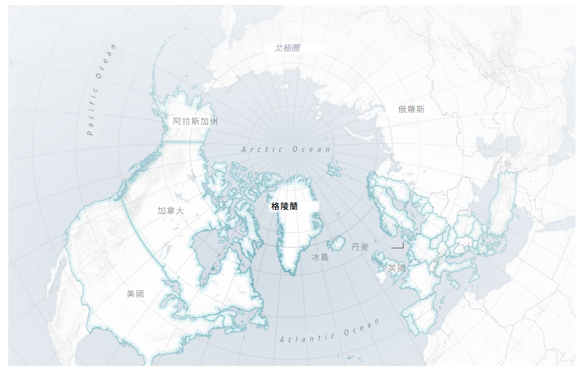
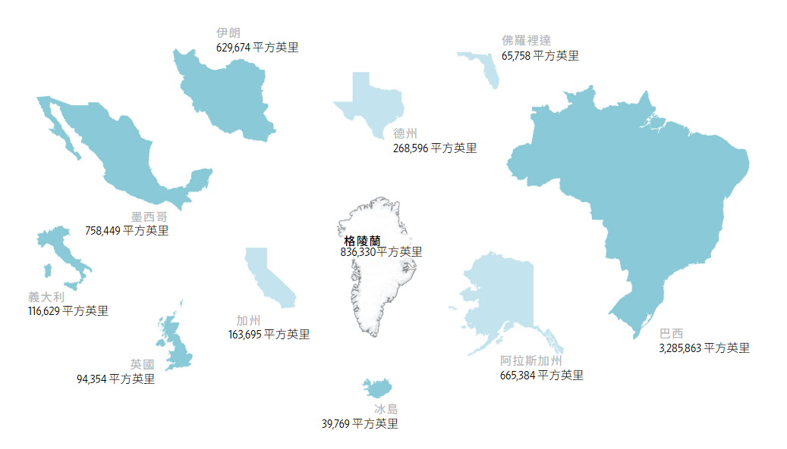
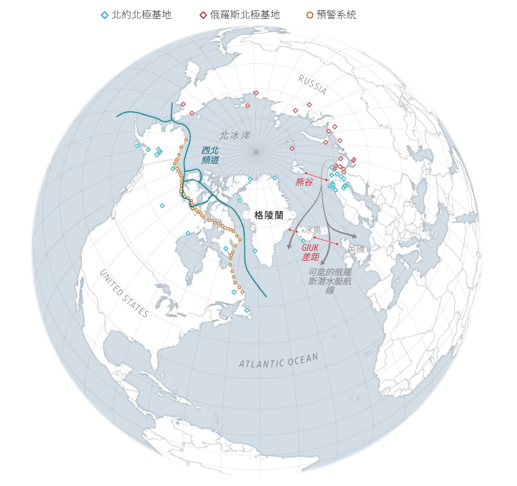
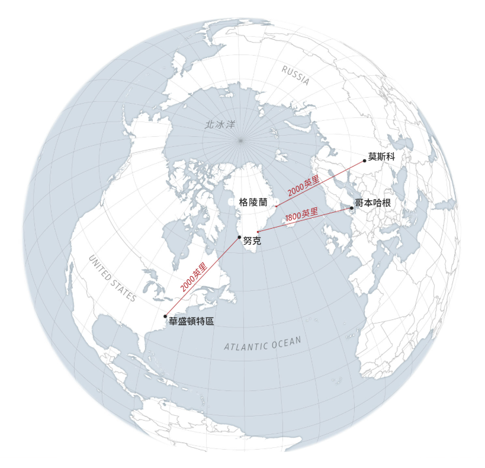
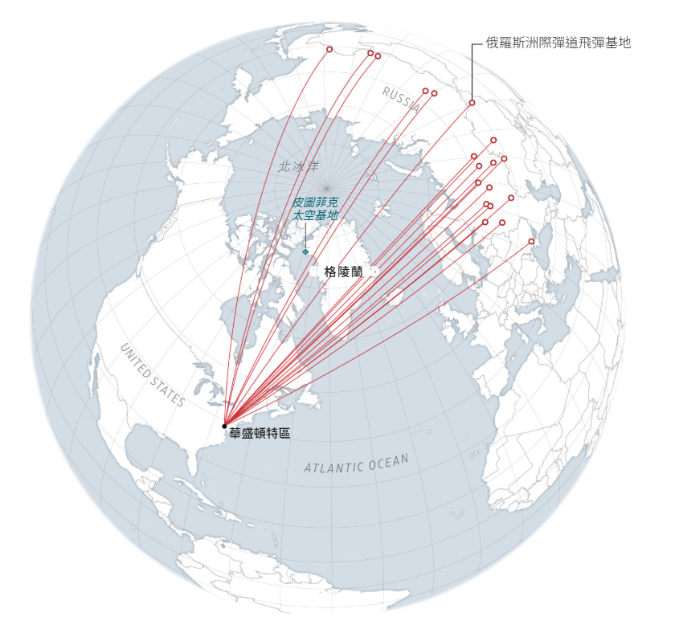
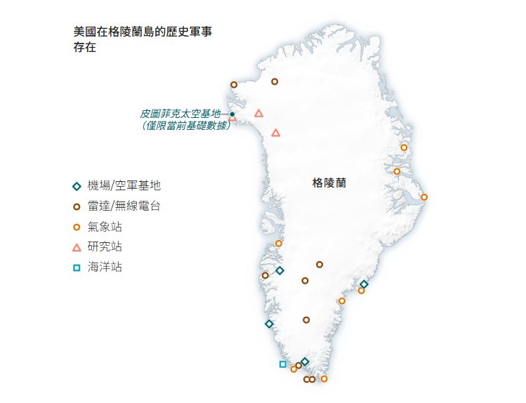

在大多數地圖上，格陵蘭島顯得遙遠而遼闊。這部分是由於在平面地圖上觀察球形地球所造成的。如果按照準確的尺寸來看，格陵蘭島會略微縮小，並且明顯靠近北美洲——位於**北大西洋公約組織領土的**中心。

即便如此，格陵蘭島面積仍然很大。它比加州和墨西哥都大，幾乎是德克薩斯州的四倍。

格陵蘭島的地理位置也極為重要：它位於北約北美和歐洲地區之間，北約和俄羅斯之間，並且位於北極圈東端。正因如此，一個多世紀以來，美國一直試圖買下這座島嶼。

格陵蘭島位於大西洋與北冰洋的交會處。俄羅斯艦艇和潛水艇從北極地區週邊基地向南航行時，會經過格陵蘭島、冰島、英國和挪威之間的海域。這些地區均為北約領土，因此是北約至關重要的防禦要塞。自2022年俄羅斯入侵烏克蘭以來，北約加強了對被稱為「格陵蘭-冰島-英國海峽」（GIUK Gap）和「熊灣海峽」（Bear Gap）的海域的空中和海上巡邏。

格陵蘭島對北約的防空體係也至關重要。在莫斯科和華盛頓特區之間的最短飛行路線（即大圓航線）上，格陵蘭島位於中點。它是北約在北極大部分地區的防線。

如果俄羅斯或中國向美國發射洲際彈道飛彈，很可能許多飛彈會飛越格陵蘭。正因如此，美國在格陵蘭島設立了太空部隊基地，負責監視空域，並防範潛在的攻擊。美國和北約正在考慮在格陵蘭島及其周邊地區增設飛彈探測設備。
冷戰期間，美國及其盟國在格陵蘭島設有軍事基地。駐紮在那裡的部隊負責監視蘇聯的船和潛艇，並隨時準備保衛該島免受入侵或攻擊。如今，美國在格陵蘭島僅駐紮約150名士兵，遠低於鼎盛時期的約15,000人。

_圖表來源：聯合國（國家）；美國人口普查局（州/地區）；美國安全計畫（俄羅斯軍事基地）；波弗特環流勘探計畫、美國海岸防衛隊太平洋區、巴克利太空部隊基地、MilitaryINSTALLATIONS（美國軍事基地）；加拿大政府（加拿大軍事基地）；北極研究所、挪威國防地產局（挪威軍事基地）；芬蘭武裝部隊（芬蘭軍事基地）；瑞典武裝部隊（瑞典軍事基地）；《斯堪的納維亞軍事研究雜誌》、INTERACT（格陵蘭軍事基地）；NorthwestPassage.info、北美北極研究所（預警系統）；挪威官方報告（俄羅斯潛艇航線）；美國科學家聯盟（俄羅斯洲際彈道飛彈基地）；格陵蘭國家博物館（俄羅斯軍事存在）博物館（美國軍事存在）。_