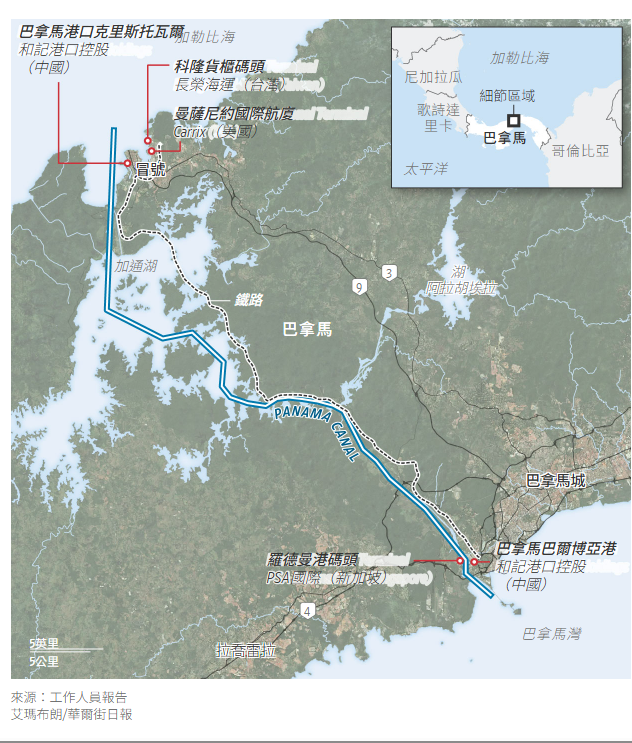

## 最高法院裁定長江和記實業的合約違反憲法，這對中國來說是一個打擊。

[聖地亞哥·佩雷斯](https://www.wsj.com/news/author/santiago-perez)

更新2026年1月30日上午7:30 ET

巴爾博亞港是巴拿馬運河沿岸兩個港口之一，由香港長江和記實業有限公司營運。圖片 由弗雷德·拉莫斯為《華爾街日報》拍攝。

### 

快速概要

-  巴拿馬最高法院裁定，長江和記實業有限公司營運巴拿馬運河兩個港口的條款違憲，有助於美國實現其安全目標。
    
- 繼美國抓獲中國在拉丁美洲戰略的關鍵盟友尼古拉斯馬杜羅之後，這項裁決對中國而言是外交挫敗。
    
- 巴拿馬計劃在和記黃埔的許可證被吊銷後，聘請一家新公司來管理港口，並可能透過競標程序來確定新的條款。

巴拿馬最高法院宣布，一家香港公司運營巴拿馬運河兩端兩個港口的合約無效，這標誌著川普總統在西半球的[安全野心](https://www.wsj.com/world/americas/china-panama-canal-development-what-it-means-7c5dc870?mod=article_inline)取得了一場勝利，並削弱了中國在該地區的影響力。

高等法院表示，[長江和記實業有限公司經營太平洋沿岸巴爾博亞港和大西洋沿岸克里斯托瓦爾港](https://www.wsj.com/market-data/quotes/HK/XHKG/1)的條款違憲，為該公司撤出港口設施鋪平了道路。

對巴拿馬最高法院法官來說，政治壓力很大，因為港口運作使巴拿馬成為美國和中國競爭的中心。

這項裁決出台一年前，川普將目光投向了巴拿馬。他聲稱，過去三十年來中國在運河周圍建設的基礎設施對美國構成安全威脅。 

「巴拿馬運河由中國運營，而我們並沒有把它交給中國，」川普在去年的就職演說中說道。

和記黃埔不能對最高法院的裁決提出上訴，但可以請求澄清，這可能會推遲其經營許可證的終止。

巴拿馬親美總統何塞·勞爾·穆利諾表示，一旦許可證被撤銷，政府將聘請航運公司[馬士基](https://www.wsj.com/market-data/quotes/DK/XCSE/MAERSK.B)旗下的APM碼頭公司來管理港口設施，以確保港口運營的連續性，直到政府啟動新的許可證條款招標程序，並可能將兩個港口分開。

穆利諾在周五早些時候向全國發表講話時說：“我們的港口是國民經濟的戰略支柱之一，也是國際貿易的關鍵環節。”

負責營運巴拿馬港口的和記黃埔子公司譴責了這項裁決，稱其損害了巴拿馬作為可靠營商之地的聲譽。該公司表示，其合約是透過透明招標獲得的，而該裁決與先前類似合約的裁決「截然相反」。

週五香港交易時段，長江和記實業股價下跌4.75%。

中國外交部發言人引述和記黃埔的聲明稱，北京將採取一切必要措施維護中國企業的權益。

最高法院的裁決對中國來說是一次外交挫敗，而就在幾週前，美國軍方抓獲了委內瑞拉強人尼古拉斯·馬杜羅，馬杜羅是中國在拉丁美洲尋求戰略立足點的盟友。

「這對中國來說是一次外交挫折，但不是經濟挫折，」曾於2015年至2018年擔任美國駐巴拿馬大使的約翰費利表示。他說，作為運河主要用戶之一的中國貨主仍將能夠使用該水道，因為該裁決不會影響運河的運作。

私人律師和巴拿馬審計長向最高法院提起訴訟，控告和記黃埔的合約損害了政府和納稅人的利益。政府審計顯示，自和記黃埔上世紀90年代末期進入巴拿馬以來，政府損失的稅收高達13億美元。

---

去年，和記黃埔同意以近230億美元的價格，將其在巴拿馬的兩個貨櫃碼頭以及全球數十個其他港口的業務出售給由[貝萊德](https://www.wsj.com/market-data/quotes/BLK)和地中海航運公司牽頭的財團。中國政府反對這項出售，要求中國國有航運公司中遠集團在管理這些全球港口資產的公司中[擁有多數股權](https://www.wsj.com/business/logistics/panama-ports-deal-hits-impasse-as-china-makes-new-demands-for-its-approval-ff741523?mod=article_inline)和否決權。

最高法院裁決後，和記黃埔旗下公司表示，保留提起國際法律訴訟以保護其投資的權利，暗示有可能將此案提交國際仲裁。

巴拿馬財政部長費利佩·查普曼在裁決公佈前接受采訪時表示： “巴拿馬在仲裁方面勝算很大。這是經商的一部分，也是法治的關鍵所在。”

中國已在拉丁美洲投資近3,000億美元用於基礎建設，包括地鐵、橋樑、水力發電廠、發電廠和體育場館。其中一個旗艦計畫是[秘魯的昌凱深水港](https://www.wsj.com/world/chancay-peru-port-china-south-america-trade-ffc75d32?mod=article_inline)，該計畫由中國國家主席習近平於2024年11月揭幕，總投資35億美元，由中遠集團開發。

儘管中國投資已在中美洲和南美洲大部分地區取代了美國投資，但美國仍然是巴拿馬最大的投資國和貿易夥伴。這個中美洲小國[很容易受到川普的壓力，](https://www.wsj.com/world/americas/panama-canal-us-american-history-e79a34f0?mod=article_inline)因為它使用美元作為本國貨幣，而且沒有中央銀行或軍隊。 1989年，美軍入侵巴拿馬，推翻了當時的獨裁者曼努埃爾·諾列加。

1999年底，美國將運河控制權移交給巴拿馬政府前兩個月，和記黃埔贏得了運河兩港的競標，擊敗了包括貝克特爾在內的美國競爭對手。雷根時代的國防部長卡斯帕·溫伯格當時表示，和記黃埔的中標報價與次高報價之間的「巨大差距」表明，該公司對巴拿馬的興趣並非純粹出於商業目的。他暗示，中國可能因此獲得一個「極為重要的情報平台」。五角大廈在運河移交前負責監管運河的運營，但對此類擔憂不以為然。和記黃埔的高層則稱這種擔憂「完全荒謬」。

穆利諾擁有杜蘭大學海事法碩士學位，他在 2024 年上任後曾對和記黃埔的交易[條款表示不滿。](https://www.wsj.com/world/americas/the-pro-american-panama-leader-standing-between-trump-and-the-canal-54b33fd6?mod=article_inline)

穆利諾[曾與美國](https://www.wsj.com/world/americas/trump-immigration-policy-panama-darien-gap-05c2861e?mod=article_inline)在移民和安全問題上合作，他[駁斥了川普威脅](https://www.wsj.com/world/americas/trumps-panama-canal-threat-stirs-a-nationalist-outcry-yankees-go-home-9f81ab15?mod=article_inline)接管運河的行為，認為這是對巴拿馬主權的侵犯。但他去年退出了習近平提出的標誌性「一帶一路」倡議。

官員表示，川普的抱怨加劇了和記黃埔與巴拿馬政府之間長久以來的爭端，主要原因是這家香港公司此前[曾從巴拿馬歷屆政府那裡爭取到更優厚的許可證條款，](https://www.wsj.com/business/logistics/panama-canal-port-china-ck-hutchinson-9b0c5a6b?mod=article_inline)而巴拿馬也逐漸成為全球貨櫃貨物轉運中心。目前，全球約有5%的貿易量經由巴拿馬運河運輸。

卡洛斯·魯伊斯-埃爾南德斯曾在穆利諾政府執政初期擔任外交部副部長，他表示，在前幾屆政府時期，中國在巴拿馬都獲得了一定的影響力。雖然中國人並未實際經營運河，也沒有構成安全威脅，但這種影響力具有像徵意義。

魯伊斯-埃爾南德斯說：“美國人誤以為中國人比他們更靠近運河。”