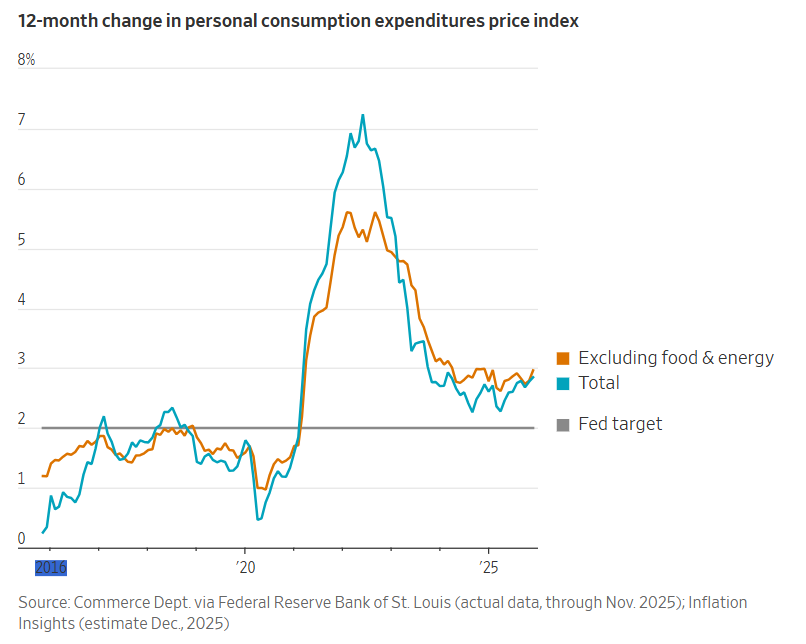
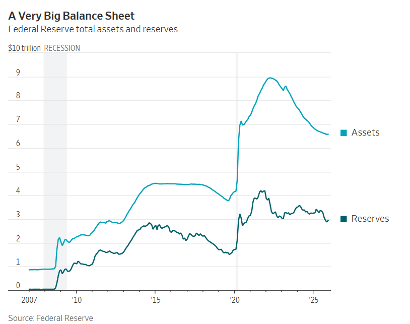

## 如果獲得確認，川普提名的聯準會主席人選將面臨多項棘手的平衡挑戰。

[
[格雷格·伊普](https://www.wsj.com/news/author/greg-ip)

2026年1月31日 上午5:30 ET

[18](https://www.wsj.com/economy/central-banking/kevin-warshs-three-tasks-shrink-the-fed-tame-inflation-manage-the-president-2640eace?mod=hp_lead_pos3#comments_sector)

Kevin Warsh Daniel Acker/彭博社

[在過去的 15 年裡，凱文沃什](https://www.wsj.com/topics/person/kevin-warsh)一直批評聯準會規模過大、通膨管理不善以及獨立性受到損害。

作為川普總統提名的聯準會主席接替傑羅姆·鮑威爾的人選，他將如何應對？他面臨三大關鍵挑戰。首先，在不擾亂市場的前提下大幅縮減聯準會的資產負債表。其次，將通膨率降至2%並維持在該水準。第三，在不受到川普幹預、損害聯準會獨立性的前提下完成這些目標。所有這些都將比看起來更困難。

### 縮減中央銀行規模

沃什於2006年至2011年擔任聯準會理事，與時任主席本·伯南克共同應對全球金融危機。他因不滿伯南克使用「量化寬鬆」政策而辭職。量化寬鬆政策是指聯準會透過向銀行發行儲備金（電子貨幣）的方式購買數兆美元的債券。 2008年至2022年間，聯準會的資產從9,000億美元成長至9兆美元，此後回落至6.6兆美元。

量化寬鬆政策旨在金融危機後（以及後來的新冠疫情爆發後）抑制長期利率，並確保銀行擁有足夠的儲備金以維持自身運作和市場正常運作。然而，沃什認為聯準會的債券購買計畫鼓勵聯邦政府出現巨額赤字，抑制了市場訊號，最終引發了通膨。

「聯準會每次採取行動，其規模和範圍就越擴大，」他[去年四月](https://www.hoover.org/sites/default/files/research/docs/Commanding%20Heights%20April%2025%202025%20DC.pdf)表示。 “債務累積得更多……資本錯配更多……制度底線被突破得更多。”

他認為，聯準會需要縮小在經濟中的影響力。負責遴選聯準會主席的財政部長史考特‧貝森特對此表示贊同。去年，他曾指責聯準會儲存在「職能蔓延」和「機構臃腫」的問題。

2010年，時任聯準會理事的凱文沃許站在聯準會主席本伯南克（左）和另一位聯準會理事唐科恩之間。 里德·薩克森/美聯社

貝森特和沃什都曾為著名投資者史丹利·德魯肯米勒工作過，他們最終可能會重新調整財政部和聯準會的職責，使財政部在管理長期利率方面發揮更積極的作用。

這項計劃存在兩個問題。銀行目前依靠充足的儲備金來維持營運。縮減資產負債表會減少儲備金，從而可能擾亂市場。這就是聯準[會去年底](https://www.wsj.com/economy/central-banking/fed-to-resume-net-asset-purchases-with-40-billion-in-securities-this-month-bdf55af0?mod=article_inline)停止縮減資產負債表的原因。

其次，隨著聯準會減持債券，債券殖利率可能會上升，進而推高抵押貸款利率。這將激怒川普。

### 通貨膨脹理論

沃什獲得提名之際，核心通膨率接近3%，高於聯準會2%的目標。他現在必須闡明一個切實可行的降息方案，並說服由12名成員組成的聯邦公開市場委員會同意該方案。

沃什的專業背景是法律和金融，而非經濟學。鮑威爾也是如此，但他很快就接受了聯準會專業人員的經濟框架。該框架認為，通貨膨脹主要取決於經濟閒置——即需求與經濟供給之間的差距——這可以透過失業率等指標以及公眾的通膨預期來反映，而公眾的通膨預期有時會自我實現。

沃什經常貶低這類模型以及發展這些模型的「經濟學家群體」。他對通貨膨脹的解釋包羅萬象，有時會借鏡商品和股票價格、貨幣供應量、生產力和聯邦支出等因素。

有人擔心沃什對主流宏觀經濟學的蔑視可能導緻聯準會內部動盪，使他與聯準會的專業人員和其他聯邦公開市場委員會（FOMC）成員產生衝突。沃什本人也暗示過這一點。他[去年7月](https://www.google.com/search?q=kevin+warsh+regime+change+fox&sca_esv=95c4599e20cb2333&rlz=1C5GCCM_en&sxsrf=ANbL-n41qg6cZ8VJamWrbQSoDB4WYElBnw%3A1769788510757&source=lnt&tbs=cdr%3A1%2Ccd_min%3A7%2F1%2F2025%2Ccd_max%3A7%2F31%2F2025&tbm=#fpstate=ive&vld=cid:8288f3a8,vid:bLpvGokLHek,st:0)表示：“我們需要美聯儲進行體制改革，這不僅僅關乎主席，而是關乎一系列人員。這需要一些強硬措施。”

曾與沃什在伯南克領導下共事、現任布魯金斯學會研究員的前聯準會副主席唐·科恩表示，他不同意沃什的一些批評意見，也同意另一些批評意見，但他不同意沃什「尖刻的語氣」。

另一些人則認為，他實際上會比他言語中表現出來的更開放和包容。 「他不會被動地接受訊息，但他意識到聯準會工作人員中確實擁有他可以藉鑑的專業知識和經驗，」內莉·樑說。梁曾在金融危機期間擔任聯準會經濟學家，與沃什密切合作，現在就職於布魯金斯學會。她表示，沃什不會忽視工作人員的模型，“但他不會受其束縛。”

沃什精於處理內部政治，善於識人。埃米爾·亨利曾在小布希總統時期與沃什共事，現任私募股權公司老虎基礎設施合夥公司（Tiger Infrastructure Partners）負責人。他表示，要實現聯準會治理的“革命”，需要具備出色的人際交往能力來引導聯邦公開市場委員會（FOMC）的行動。 「沃什為聯準會帶來了極高的智商和情商，」亨利說。

沃什很幸運，關稅和房屋市場的壓力逐漸減弱，今年的通膨應該會下降，鮑威爾領導的聯邦公開市場委員會已經計劃再降息一次。

但好運可能不會持續太久。在某個時刻，推動通膨走低的壓力將會改變方向。沃什需要一套令人信服的通膨理論來應對這種壓力——一套能夠經得起市場和同業認可的理論。

### 誰能拒絕川普？

華爾街許多人支持沃什，認為他會比第二名的白宮顧問凱文·哈塞特更加獨立。

然而，任命他的總統卻不相信聯準會的獨立性。川普將大幅降息作為其聯準會主席提名人的條件。沃什接受了這一條件，並在10月份宣稱“我們可以大幅降低利率，從而讓30年期固定利率抵押貸款變得負擔得起。”

就連川普也承認，如果通膨上升，利率也必須上升。貨幣政策的困難在於預測通膨走向並據此調整利率。如果數據顯示聯準會不應降息，沃什會否違背川普的意願？

華爾街許多人懷疑沃什說這些話只是為了得到這份工作，等他上任一段時間後，就會變成自己的人。川普似乎也擔心這一點，10天前在達沃斯論壇上他宣稱：“人們一旦當上官，變化之大令人驚嘆。”

川普總統曾公開批評聯準會主席鮑威爾，主要批評點在於利率決策。圖片來源： andrew caballero-reynolds/AFP／Getty Images

沃什的政治手腕幫助他獲得了這份工作，或許也能幫助他應付這位反覆無常的總統。但如果沃什讓他失望，川普不太可能袖手旁觀，看看他對待鮑威爾的態度就知道了。鮑威爾是川普在2018年任命的。川普不滿鮑威爾降息不夠，不僅允許對聯準會主席展開刑事調查，還試圖解僱另一位聯準會理事。

獨立性也可能來自內部。如果沃什將自己視為川普團隊的一員，他可能會調整自己的決定以支持川普的整體議程。

當然，聯準會的獨立性仍然受到一些限制。最高法院[似乎準備](https://www.wsj.com/livecoverage/supreme-court-lisa-cook-hearing?mod=article_inline)限制川普罷免聯準會理事（包括主席）的權力。

但川普仍然可以透過公開攻擊沃什和任命更順從的州長來讓他的日子不好過。正如鮑威爾所發現的那樣，在華盛頓，與川普對抗是一條孤立無援的道路。

去年我主持的一個小組討論會上，沃什承認了獨立性的重要性。然後他補充說：“我氣喘吁籲地在報紙上看到這些政客對央行有多刻薄。拜託，成熟點吧。強硬一點。央行獨立的秘訣是什麼？就是實現目標，做好本職工作。”