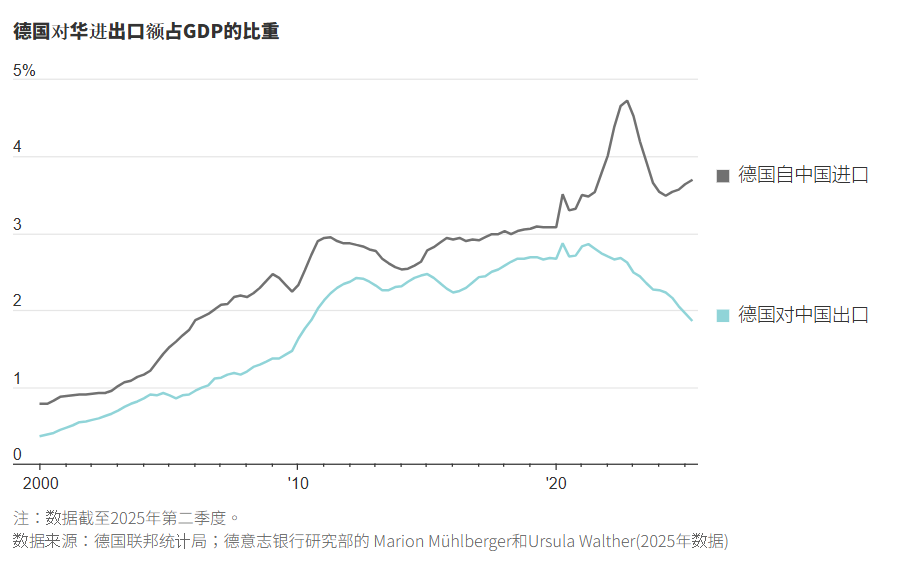
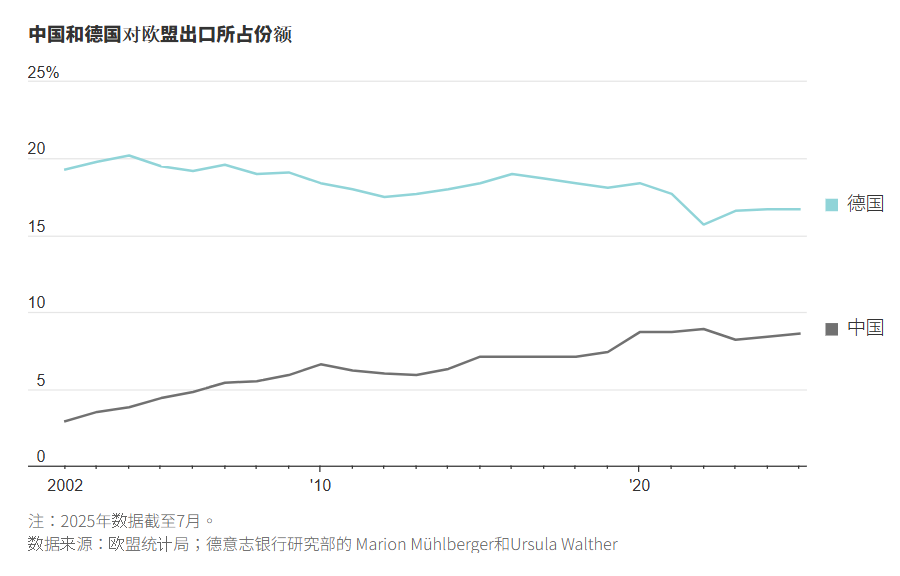
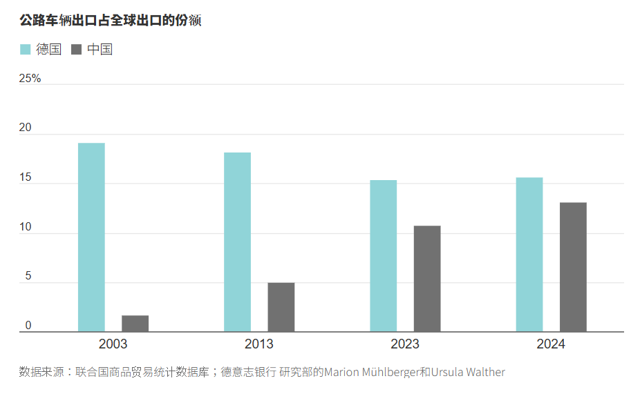
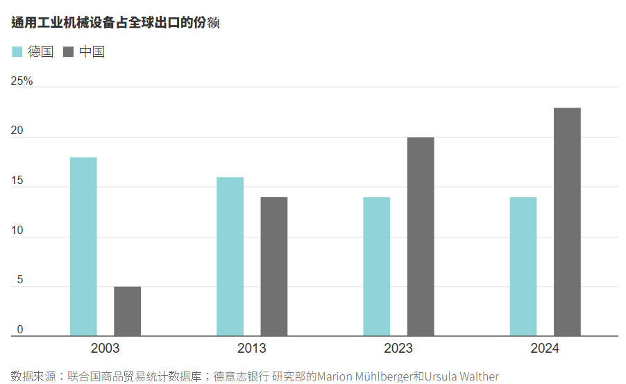

https://cn.wsj.com/articles/%E5%BE%B7%E5%9C%8B%E7%82%BA%E4%BD%95%E6%83%B3%E8%88%87%E4%B8%AD%E5%9C%8B-%E5%88%86%E9%81%93%E6%8F%9A%E9%91%A3-bc921b75?mod=ct_hp_lead_pos8

這是一份針對 **德國對華戰略轉向（German Strategic Pivot on China）** 的**投資銀行級情報簡報 (Investment Banking Grade Intelligence Briefing)**。

這篇報導標誌著歐洲地緣經濟的**「分水嶺時刻 (Watershed Moment)」**。德國，這個曾經是西方世界中與中國經濟綁定最深、最擁護自由貿易的國家，正在由新任總理 **弗裡德里希·默茨 (Friedrich Merz)** 帶領，轉向**保護主義**與**去風險化 (De-risking)**。這對全球供應鏈的重組具有深遠影響。

---

### **新聞情報分析：德國工業巨人的覺醒——從「互利共生」到「防衛性脫鉤」**

#### **1. 新聞履歷 (Metadata)**

- **標題：** 德國為何想與中國「分道揚鑣」：工業基礎被侵蝕的恐懼 (Why Germany wants to break up with China: The fear of industrial erosion)
    
- **來源/作者：** WSJ / Tom Fairless, Bertrand Benoit
    
- **發布時間：** 2025年12月16日 12:20 CST
    
- **關鍵詞：** 弗裡德里希·默茨 (Friedrich Merz), VDMA (德國機械設備製造業聯合會), 化工產業集群 (Chemical Cluster), 產能過剩 (Overcapacity), 貿易逆差 (Trade Deficit)
    

#### **2. 核心摘要 (Executive Summary)**

德國與中國維持了 20 年的「天作之合」（德國出機器，中國出消費品）已經崩潰。取而代之的是德國對中國**「不公平競爭」**與**「產能傾銷」**的恐懼。

- **角色互換：** 中國已從客戶變成了致命的競爭對手。2024 年，德國從中國進口的資本貨物（Capital Goods）首次超過了對華出口。
    
- **政策轉向：** 德國總理 **默茨 (Merz)** 上任後態度強硬，成立國家安全委員會審查關鍵礦產風險，支持「購買歐洲貨 (Buy European)」條款，並收緊 5G 華為禁令。
    
- **導火線：** **美國川普關稅的溢出效應**。由於美國市場對中國關閉，過剩的中國廉價商品（特別是化工品與汽車零件）轉而湧入歐洲，迫使德國企業（如 BASF, Dow）關廠裁員。
    
- **經濟代價：** 德國對華貿易逆差預計達 **880 億歐元**。德國製造業產出較 2017 年峰值下降 **14%**。
    

**

**關鍵人物發言與立場矩陣 (Key Voice Matrix)：**

- **政治決策者 - 弗裡德里希·默茨 (德國總理)：**
    
    - **立場：** **保護主義轉向。**
        
    - **行動：** 強調保護國內鋼鐵業，並透過國家安全委員會制定多元化措施。這顯示「經濟安全」已凌駕於「商業利潤」之上。
        
- **工業界遊說團體 - VDMA (德國機械設備製造業聯合會)：**
    
    - **立場：** **從「自由貿易」轉向「制裁」。**
        
    - **原話：** 「如果中國不公平競爭，我們必須迫使他們公平競爭。」
        
    - **情報價值：** VDMA 過去是親華派（因為賣機器給中國），現在他們的倒戈意味著**德國工業界已經達成「反華共識」**。
        
- **受害企業代表 - Vedran Kujundzic (道默化學 DOMO Chemicals)：**
    
    - **數據：** 中國化工品以 **20% 的折扣** 傾銷，市佔率一年內從 5% 暴增至 20%。
        
    - **現狀：** 歐洲化工廠面臨生存危機，這是「去工業化」的現在進行式。
        

#### **3. 深度架構分析 (Structural Analysis)**

**A. 經濟互補性的終結 (The End of Complementarity)**

- **舊模式：** 德國（高端技術/設備） -> 中國（低端製造/組裝）。
    
- **新模式：** 中國（高端製造/電動車/精密機械） -> 德國（市場）。
    
- **數據證據：**
    
    - **汽車業：** 德國車企在中國市佔率兩年內從 50% 崩跌至 **33%**。
        
    - **機械業：** 2019-2024 年間，德國在發電設備與機械的全球領導地位被中國奪走。
        
    - **海瑞克 (Herrenknecht) 案例：** 曾經壟斷中國隧道掘進機市場的德國隱形冠軍，現在反被中國收購的競爭對手在全球市場圍剿。
        

**B. 「川普衝擊」的二階效應 (Second-Order Effects of Trump Tariffs)**

- **傳導機制：** 美國築牆 -> 中國商品無法進入美國 -> **轉道歐洲 (Trade Diversion)**。
    
- **結果：** 歐洲成為了中國過剩產能的洩洪區。這解釋了為何化工品（Polyamide 6）會在短時間內淹沒歐洲市場。
    
- **德國的兩難：** 默茨政府若不設防，德國製造業會被淹沒；若設防（關稅），則可能招致中國對德國汽車（在華仍有巨大利益）的報復。
    

**C. 「上海綜合症」的治癒與戒斷反應 (Curing the "Shanghai Syndrome")**

- **定義：** 為了短期利潤安撫中國，忽視長期技術被竊與替代的風險。
    
- **現狀：** 德國正在經歷痛苦的戒斷期。BASF 等巨頭在德國裁員，卻在中國擴產，這種**「資本外逃」**加劇了德國國內的就業危機（工業就業減少 5%）。
    
- **戰略轉移：** 德國被迫尋找新市場（如文中提到的印度），並試圖建立自主供應鏈（如 AMG Lithium 的鋰精煉廠），但面臨成本過高（客戶嫌貴）的困境。
    

#### **4. 投資專家的行動建議 (Actionable Insights)**

1. **做空/迴避「歐洲基礎化工」 (Short European Basic Chemicals)：**
    
    - **標的：** **BASF (巴斯夫), Lanxess, Covestro**。
        
    - **邏輯：** 它們面臨「能源成本高（失去俄羅斯天然氣）」與「中國傾銷（20% 折扣）」的雙重夾擊。除非歐盟實施極端關稅，否則其通用化學品業務將持續失血。
        
2. **關注「歐洲防衛性資產」與「貿易壁壘受益者」：**
    
    - **標的：** **Rheinmetall (國防), Siemens Energy (能源轉型)**。
        
    - **邏輯：** 隨著默茨政府推動「購買歐洲貨」和加強經濟安全，政府採購將優先流向這些戰略資產。
        
3. **地緣政治對沖：**
    
    - **觀察點：** 默茨政府明年發布的「經濟安全戰略」。
        
    - **風險：** 如果德國跟隨美國對中國實施嚴厲制裁，中國可能會報復德國車企（BMW, Mercedes, VW）。這對高度依賴中國利潤的德國車企是巨大的 **尾部風險 (Tail Risk)**。
        

總結：

這篇文章宣告了**「中德蜜月期」的正式結束**。德國不再將中國視為搖錢樹，而是視為生存威脅。這將導致全球貿易體系進一步碎片化，而歐洲將成為美中貿易戰的下一個主要戰場。

---

下一步：

文中提到了 AMG Lithium 正在德國建設鋰精煉廠但面臨價格競爭。這直接關聯到歐盟的 《關鍵原材料法案 (CRMA)》。您是否希望我分析：在中國主導鋰供應鏈的情況下，歐洲本土電池材料公司（如 Umicore, Northvolt） 是否具備投資價值，還是會像歐洲太陽能產業一樣被中國殲滅？