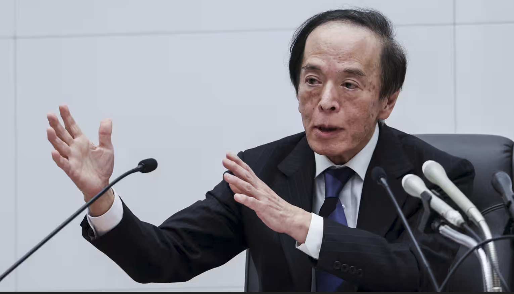

https://asia.nikkei.com/economy/bank-of-japan/boj-chief-ueda-says-higher-wages-will-underpin-inflation

### 新聞分析：植田和男暗示通膨韌性，12 月升息機率大增

#### 1. 新聞履歷 (Metadata)

- **標題：** 日本央行總裁植田表示，薪資上漲將支撐通貨膨脹 (BOJ Gov. Ueda says wage hikes will underpin inflation)
    
- **來源/作者：** Nikkei Asia / Jada Nagumo (東京)
    
- **發布時間：** 2025年12月9日 20:26 JST
    
- **關鍵詞：** 植田和男 (Kazuo Ueda)、薪資-物價螺旋 (Wage-Price Spiral)、12月18-19日會議、AI 生產力、食品通膨

#### 2. 核心摘要 (Executive Summary)

本報導紀錄了日本央行總裁**植田和男**在《金融時報》活動上的關鍵發言，釋放出對日本擺脫通縮的強烈信心，並暗示了貨幣政策正常化的路徑。

- 薪資與通膨的良性循環：
    
    植田明確表示，日本國內的**「價格-工資動態 (Price-wage dynamics)」**已具備足夠強勁的勢頭。即便全球 AI 支出放緩（外部衝擊），國內勞動力市場的緊張將持續推升薪資，進而支撐物價，防止日本重回通縮。這番話被市場解讀為對抗通縮的勝利宣言。
    
- 貨幣政策暗示（12月升息）：
    
    植田重申會「緩慢調整寬鬆程度」，因為預期基本通膨率將趨向 2%。市場目前強烈預期 BOJ 將在 12 月 18-19 日 的會議上升息，導致長期國債殖利率攀升。
    
- **對抗短期雜訊：**
    
    - **食品價格：** 植田認為目前的食品通膨是「暫時的」，預計明年上半年會下降，不認為總需求會過熱。
        
    - **匯率風險：** 雖然日圓疲軟，但他指出如果匯率疲軟持續時間「比預想長」，政策可能會改變（暗示若日圓續貶，升息速度會加快）。
        
    - **川普關稅：** 他觀察到企業（美企和日系車廠）目前傾向於**「自行吸收」**關稅成本，而非轉嫁給消費者，這在短期內抑制了通膨失控的風險。
        
- 長期增長關鍵：
    
    面對人口減少，植田將日本經濟的未來押注在 AI 應用與外籍勞工政策上，認為這是提高生產力以彌補勞動力短缺的唯二解方。
    

---

#### 3. 深度架構分析：央行溝通術解碼 (Structural Analysis: Central Bank Communication Decoding)

植田的發言展現了極高超的**「預期管理 (Forward Guidance)」**技巧：

**A. 定義「好通膨」與「壞通膨」**

- **壞通膨（暫時的）：** 食品價格上漲。植田說這會「大幅下降」，意在安撫民眾不滿，並告訴市場：央行不會因為洋蔥變貴就亂升息。
    
- **好通膨（持久的）：** 薪資驅動的服務業通膨。植田強調「勞動力市場緊張」，這是央行最想看到的。因為只有薪資漲，消費才能漲，通膨才能從「成本推動 (Cost-push)」轉為「需求拉動 (Demand-pull)」。
    
- **結論：** 植田在告訴市場，現在的通膨結構正在改善，因此升息是為了**「確認復甦」**而非**「打壓經濟」**。
    

**B. 12 月會議的博弈 (The December Gamble)**

- 市場已經定價 (Price-in) 了 12 月升息。如果植田不升，日圓會瞬間崩跌（因失望性賣壓），進口通膨會失控。
    
- **植田的訊號：** 他提到「如果匯率疲軟比預想長，情況會改變」。這是對外匯市場的隱晦警告——**「別逼我動手，我會升息來護盤」**。
    

**C. AI 作為貨幣政策變數**

- 央行總裁談 AI 比較少見。植田將 AI 視為**供給面 (Supply Side)** 的解方。
    
- **邏輯：** 如果 AI 能提高生產力，那麼即使人口減少，GDP 也能維持。這意味著長期**自然利率 (R*)** 可能會上升。如果 R* 上升，央行的基準利率也必須跟著上升，否則貨幣政策會變得太寬鬆。這為長期的升息循環提供了理論基礎。
    

---

#### 4. 潛在調查方向 (Areas for Further Investigation)

1. **「春鬥 (Shunto)」薪資談判的先行指標：**
    
    - 雖然春鬥結果要明年 3 月才揭曉，但 12 月通常會有工會（Rengo）和資方（Keidanren）的初步叫價。關注這些早期信號，如果資方態度軟化，12 月升息將毫無懸念。
        
2. **日本國債 (JGB) 的做空部位：**
    
    - 隨著升息預期確立，避險基金是否正在加大做空 JGB 期貨？如果 12 月真的升息，JGB 殖利率是否會突破 2%（如前篇新聞所述），引發債市動盪？
        
3. **日圓匯率的技術關卡：**
    
    - 目前日圓對美元疲軟。如果 12 月升息後，日圓不升反貶（Buy the rumor, sell the fact），BOJ 是否會進行外匯干預？關注 **155** 或 **160** 的關鍵價位。
        
4. **企業吸收成本的極限：**
    
    - 植田說企業在吸收關稅成本。調查豐田、本田的財報毛利率。如果毛利率開始顯著壓縮，企業最終將被迫漲價，這會引發第二波通膨，屆時央行的「暫時性通膨」論點將被打臉。