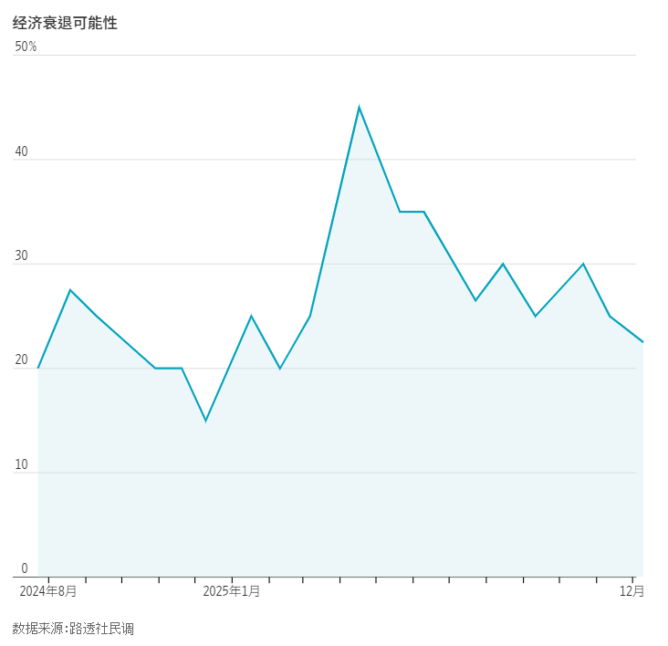
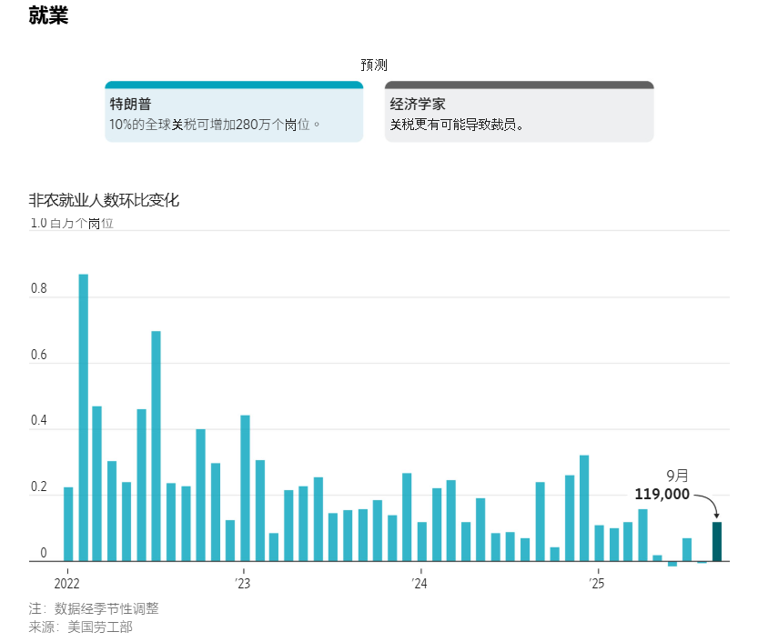
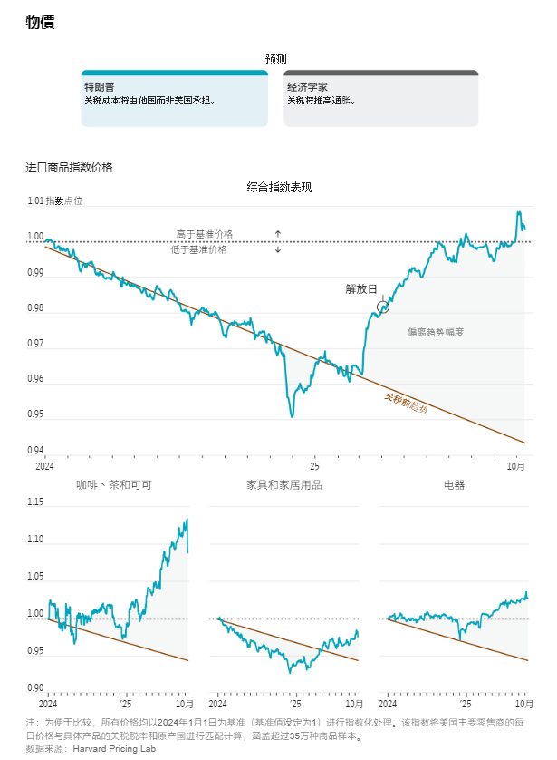
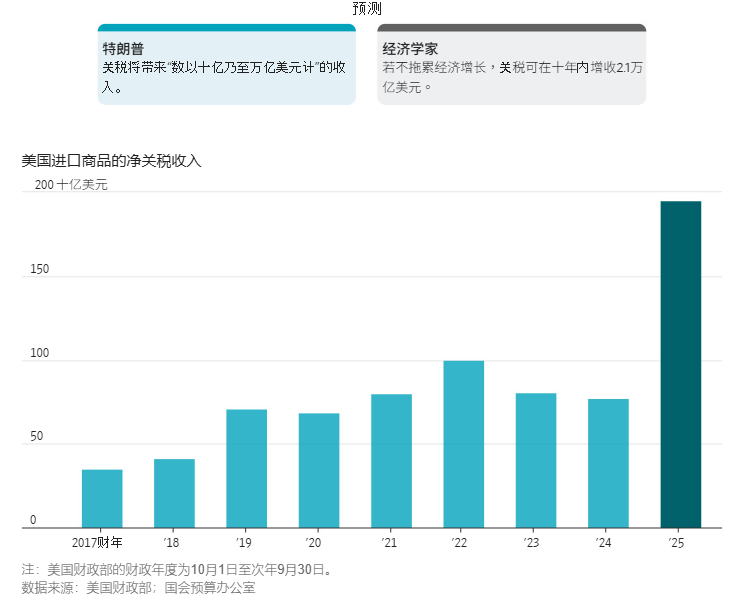
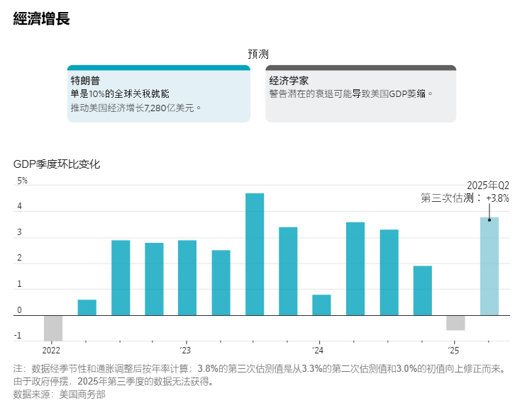
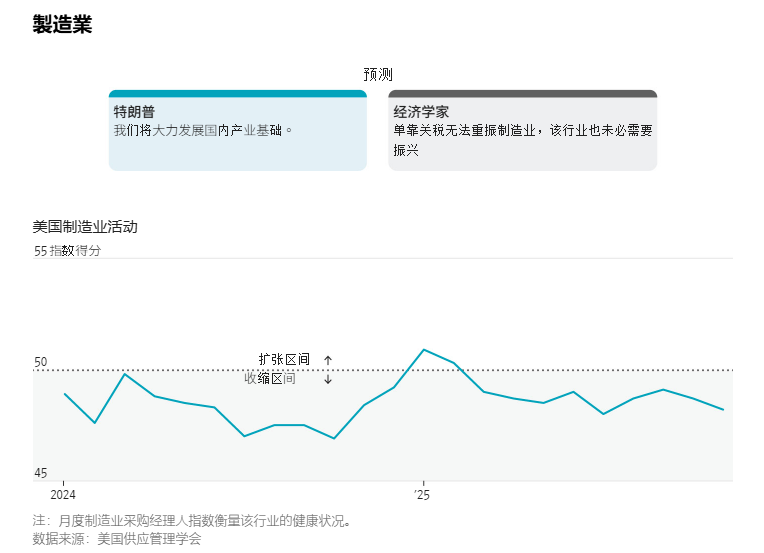
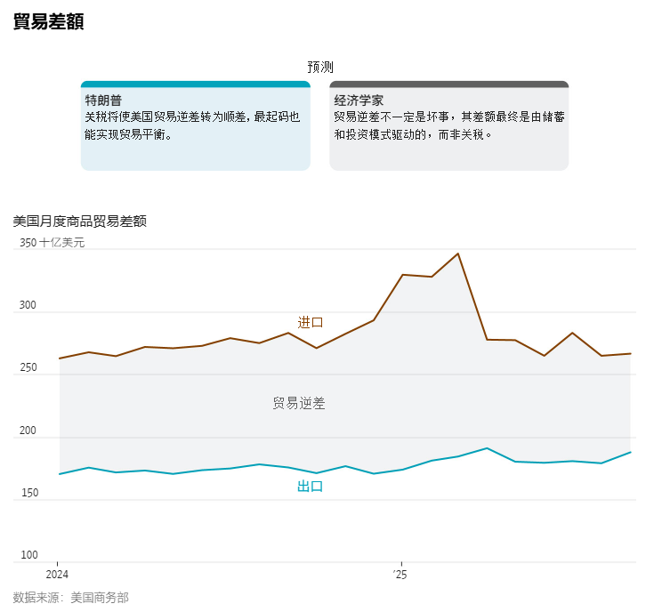

https://cn.wsj.com/articles/%E5%9C%96%E8%A7%A3%E5%B7%9D%E6%99%AE%E9%97%9C%E7%A8%85%E7%9A%84%E7%B6%93%E6%BF%9F%E7%9C%9F%E7%9B%B8-b8300660?mod=trending_now_news_4

### **新聞情報分析：全盤誤判——川普關稅的經濟真相與細節還原**

#### **1. 新聞履歷 (Metadata)**

- **標題：** 為何人人都誤判了川普關稅 (Why Everyone Misjudged Trump's Tariffs)
    
- **來源/作者：** WSJ / Chao Deng, Drew An-Pham
    
- **發布時間：** 2025年12月15日 15:20 CST
    
- **關鍵詞：** 勞倫斯·芬克 (Larry Fink), 傑羅姆·鮑爾 (Jerome Powell), 阿諾德·卡姆勒 (Kent International), AI 資本支出, 4.4% 失業率, 1950億關稅收入
    

#### **2. 核心摘要 (Executive Summary)**

川普關稅實施八個月後，美國經濟既沒有如川普預言的「再次偉大」，也沒有如華爾街預言的「全面崩潰」。

- **預測光譜：**
    
    - **川普 (4/3 發言)：** 「市場將蓬勃發展，股市將蓬勃發展，國家將蓬勃發展。」
        
    - **華爾街悲觀派 (Larry Fink, BlackRock CEO)：** 「與我交談的大多數 CEO 都會說，我們恐怕正走在衰退的道路上。」
        
    - **摩根大通 (JPMorgan)：** 曾預測可能出現「全球性衰退」。
        
- **現實落點：** 經濟撐住了（衰退機率降至 25% 以下），但代價是**通膨固化在 3%** 且**製造業並未回流**。最大的變數在於 **AI 投資熱潮** 意外抵消了關稅的拖累。
    

#### **3. 深度證據矩陣：六大戰場的預言與真相 (Deep Dive Evidence Matrix)**

這部分嚴格保留了您要求的**人物原話**與**具體數據**，以還原產業現場。

**A. 就業與製造業：承諾跳票與具體犧牲者**

- **川普承諾：** 10% 全球關稅將增加 **280 萬個工作崗位**。
    
- **殘酷真相：**
    
    - 製造業自川普上任以來反而**削減了 54,000 個工作崗位**。
        
    - 失業率攀升至 **4.4%**（四年新高）。
        
    - 9 月新增就業 11.9 萬雖超預期，但更像是異常值。
        
- **關鍵證人 (Key Witness) - 阿諾德·卡姆勒 (Arnold Kamler), Kent International 所有者：**
    
    - **背景：** 自行車進口商與製造商。
        
    - **原話：** **「這很有挑戰性。4 月份的對等關稅出台後，我們就撐不下去了。」**
        
    - **後果：** 由於中國產零部件（車架等）關稅過高，導致他在美國南卡羅來納州組裝自行車變得「不可行」。**結果是關閉工廠，64 人失業**。這直接打臉了「關稅促進美國製造」的論點——反而因為零件變貴而殺死了美國製造。
        

**B. 物價與通膨：零售商的轉嫁速度**

- **川普預言：** 關稅成本由他國承擔。
    
- **華爾街預警：** **約翰·戴維·雷尼 (John David Rainey), Walmart CFO：**
    
    - **原話：** **「這些價格上漲的幅度與速度，在歷史上可以說是前所未有的。」**
        
- **現實數據：**
    
    - 通膨率徘徊在 **3%** 左右（高於 Fed 2% 目標）。
        
    - Macy's 和 Best Buy 等零售商迅速提價。
        
- **官方困境 - 傑羅姆·鮑爾 (Jerome Powell), 聯準會主席：**
    
    - 關於關稅傳導的滯後性（估計需 9 個月），他承認模型的失靈。
        
    - **原話：** **「我們一直無法對此進行精確預測。誰也做不到。」**
        

**C. 關稅收入：數學上的不可能**

- **川普預言：** 關稅將帶來「數以兆計」收入，並告訴 Fox Noticias：**「它可能會取代所得稅。」**
    
- **數據打臉：**
    
    - **關稅總收：** 2025 財年約 **1,950 億美元**（月均 $250億，確實翻倍）。
        
    - **所得稅總收：** 2024 財年為 **2.4 兆美元**。
        
    - **差距：** 關稅收入連所得稅的 **1/10 都不到**，根本無法取代。且若最高法院裁定引用《國際緊急經濟權力法》無效，還需**退還 1,000 億美元**，這是一個巨大的財政懸崖風險。
        

**D. 經濟增長：意料之外的救世主 (AI)**

- **經濟學家預測：** GDP 萎縮。
    
- **現實數據：** 2025 Q2 GDP 增長 **3.8%**，Q3 為 **3.5%**。
    
- **關鍵變數 (Barclays 數據)：** **AI 相關支出** 使上半年 GDP 年化增長了 **0.8 個百分點**。
    
    - **分析：** 這意味著如果沒有 AI 投資狂潮，美國經濟增長可能只剩 2% 多，關稅的拖累效應就會非常明顯。是 NVIDIA、Microsoft 的資本支出救了川普的經濟成績單。
        

**E. 貿易差額：短期波動與長期邏輯**

- **現象：** 4 月份關稅生效前，企業搶運庫存導致逆差擴大；生效後逆差急劇下降。9 月逆差收窄至 **790 億美元**（五年新低），主要由黃金短期交易推動。
    
- **經濟學家反駁：** 貿易逆差縮小未必是好事，往往發生在衰退期（進口需求下降時）。
    

#### **4. 投資專家的行動建議 (Actionable Insights)**

1. **關注「零部件依賴型」製造業的做空機會：**
    
    - 從 **Arnold Kamler (Kent International)** 的案例可知，依賴進口零組件在美組裝的企業（如自行車、家電組裝、部分汽車零件）是關稅的最大受害者。檢查投資組合中是否有這類 **「假美國製造，真全球供應鏈」** 的公司，它們利潤率將被壓縮。
        
2. **AI 資本支出的重要性被低估：**
    
    - 數據顯示 AI 貢獻了 0.8% 的 GDP 增長。這意味著 **AI 基礎設施板塊（Data Center, Power, Chips）** 不僅是科技故事，更是美國宏觀經濟的「支柱」。如果 AI 投資放緩，美國經濟將直接暴露在關稅的寒風中。
        
3. **最高法院判決的黑天鵝風險：**
    
    - 文中提到若最高法院裁定關稅無效，需退還 **1,000 億美元**。這對零售商（如 Walmart, Target）是潛在的巨大**一次性利多（退稅收入）**，但對財政部是災難。需密切監控該訴訟進度。
        

總結：

這篇文章揭示了數據背後的殘酷細節——川普的關稅沒有帶來製造業榮景（工廠反而倒閉），也沒有帶來財政奇蹟（無法取代所得稅）。美國經濟之所以看起來還不錯，完全是因為 AI 投資的爆發 掩蓋了關稅造成的 製造業失血 與 物價痛感。

---

