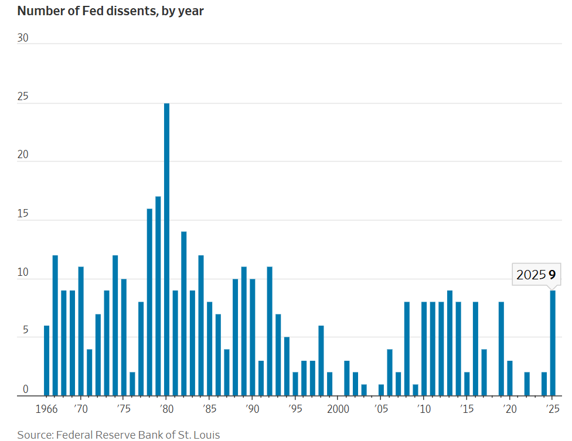
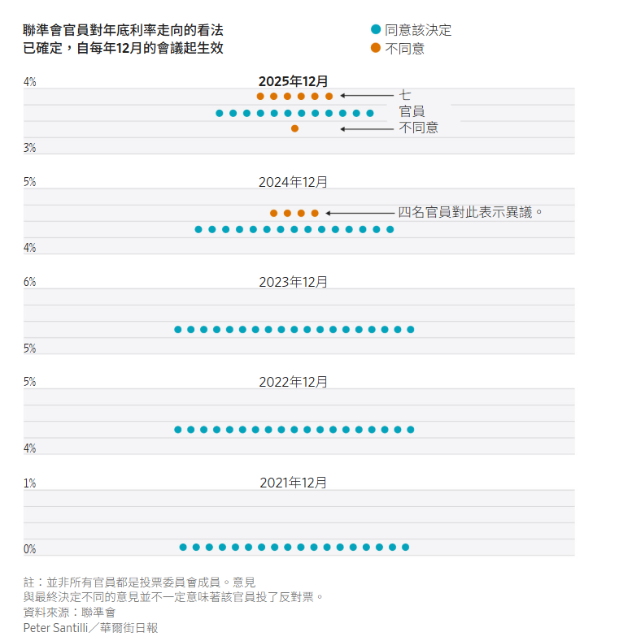

https://www.wsj.com/economy/central-banking/fed-cuts-rates-again-signals-it-may-be-done-for-now-67069bb5?mod=hp_lead_pos2

這篇報導證實了我們之前的分析預判：鮑爾（Powell）在內部嚴重分歧下，強行通過了「戰術性降息」，但同時築起了未來降息的高牆。這就是典型的**「鷹派降息 (Hawkish Cut)」**。

---

### **新聞情報分析：聯準會執行「鷹派降息」，內部共識正式破裂**

#### **1. 新聞履歷 (Metadata)**
* **標題：** 聯準會降息 1 碼但暗示暫停，內部爆發 6 年來最大分歧 (Fed cuts 25bps amid historic dissent, signals pause)
* **來源/作者：** The Wall Street Journal / Nick Timiraos
* **發布時間：** 2025年12月10日 (美東時間)
* **關鍵詞：** 鷹派降息 (Hawkish Cut), 9比3投票 (9-3 Vote), 點陣圖 (Dot Plot), 10年期美債 (10Y Treasury), 滯脹風險 (Stagflation Risk)

#### **2. 核心摘要 (Executive Summary)**
聯準會週三宣布將聯邦基金利率下調 25 個基點至 **3.50%-3.75%**。這是連續第三次降息，旨在防止勞動力市場過度冷卻。然而，決策背景顯示出**極度的不穩定性**：

* **共識破裂：** 投票結果為 **9比3**。這是自 2019 年以來最多反對票的一次，顯示鮑爾的領導權威（Authority）正在減弱。
* **前瞻指引轉向：** 雖然降息，但會後聲明與點陣圖暗示 **2026 年降息步伐將大幅放緩（僅剩 1 次）**。這證實了「降息並設限 (Cut and Cap)」的策略已生效。
* **市場反應：** 股市因獲得流動性而上漲（道瓊 +1%），但債市發出警訊——**10年期美債殖利率不降反升至 4.163%**，顯示市場正在定價長期的通膨風險。

**關鍵人物發言與立場矩陣 (Key Voice Matrix)：**
這場會議的真正看點在於「反對者」的組成，顯示出聯準會內部對「滯脹」的恐懼正在壓倒對「衰退」的恐懼。

* **中間派操盤手 (The Pragmatic Operator) - 傑羅姆·鮑爾 (Jerome Powell)：**
    * **表態：** 「勞動力市場持續逐步降溫...我們已做好充分準備，靜觀其變。」
    * **解讀：** 鮑爾承認了降溫，但「靜觀其變 (wait and see)」是關鍵詞。這意味著 **1 月份降息的可能性已微乎其微**，除非數據出現崩盤。
* **鷹派反對者 (The Hawkish Dissenters) - 傑夫·施密德 (Jeff Schmid) & 奧斯坦·古爾斯比 (Austan Goolsbee)：**
    * **立場：** 根據文中描述，這兩位反對降息（認為沒必要）。
    * **情報異常：** 古爾斯比 (Goolsbee) 傳統上被視為鴿派，若連他都反對降息，代表**通膨數據的黏性 (Stickiness)** 可能比公眾看到的更嚴重，導致鴿派也倒戈擔心通膨。
* **鴿派異議 (The Dovish Dissenter)：**
    * **立場：** 文中提到有一名官員傾向降息 0.5%（文中未明確指名，但與鷹派形成對沖）。
    * **解讀：** 這顯示分歧是雙向的，決策光譜已極度拉大，從「不降」到「大降」都有，這增加!了未來政策波動率。
    * 

[[Attach/Pasted image 20251212132239.png]]

	

#### **3. 深度架構分析 (Structural Analysis)**

**A. 利率曲線的「熊市陡峭化」 (Bear Steepener Validation)**
* **現象：** Fed 降短端利率 (Fed Funds Rate)，但長端利率 (10Y Treasury) 收在 4.163% 高位。
* **底層邏輯：** 這就是我們之前警告的「伯恩斯時刻」。市場認為這次降息是**「政治性」或「錯誤的」**，可能會導致長期通膨失控。因此，債券義勇軍 (Bond Vigilantes) 拋售長債，要求更高的期限溢價 (Term Premium)。
* **投資影響：** 對於您的 **AI 數據中心** 投資，這是一個危險信號。因為企業融資看的是 10年期殖利率，而非 Fed 利率。**融資成本並沒有因為降息而真正下降**。
    

**B. 點陣圖的結構性重定價 (Repricing of the Dot Plot)**
* **數據：** 預測顯示 2026 年**「最多只會降息一次」**。
* **意義：** 這徹底粉碎了市場對「回到 2% 低利時代」的幻想。中性利率 ($r^*$) 的預期實質上已被上調至 3% 以上。
* **估值模型：** 所有資產的折現率 (Discount Rate) 模型都需要將長期無風險利率設定在 3.5%-4.0% 區間，這將壓抑高本益比科技股的擴張空間。

**C. 鮑爾的「跛腳鴨」危機 (Lame Duck Risk)**
* **政治背景：** 鮑爾任期剩不到 6 個月 (2026 年 5 月到期)，且面臨 3 張反對票。
* **權力真空：** 隨著川普即將提名繼任者（如哈塞特），市場將逐漸停止聽取鮑爾的指引，轉而猜測新主席的意圖。未來的 FOMC 會議（1月、3月）將變得更加不可預測，波動性 (VIX) 將上升。

#### **4. 潛在調查方向與行動建議 (Areas for Further Investigation & Action)**

**給予 CFP 與科技投資專家的具體建議：**

1.  **監控「企業定價權」測試 (The Pricing Power Test)：**
    * 花旗經濟學家 Nathan Sheets 提到的 **「1月漲價潮」** 是關鍵。
    * **行動：** 密切關注 **1 月份 CPI 數據**。如果企業在年初成功漲價且銷量未跌，代表通膨預期已固化 (Entrenched)，Fed 將被迫在 2026 年轉向升息或長時間暫停。

2.  **資產配置調整：做多「波動率」而非「債券」**
    * 鑑於 9-3 的投票結果，Fed 內部的不可預測性極高。
    * **行動：** 避免重倉長債 (Long Duration Bonds)。考慮配置 **短期國庫券 (T-Bills)** 鎖定 3.5% 收益，並保留現金等待股市因「降息預期落空」而回調時的買點。

3.  **房地產/REITs 的警訊：**
    * 文中提到 10年期殖利率限制了購屋者的緩解。
    * **行動：** 對於 **AI 數據中心 REITs**，需檢查其債務到期日。如果大量債務在 2026 年到期並需以 4.5%+ 的利率再融資，其現金流將被吞噬。

**總結：**
這是一次**「雖勝猶敗」的降息**。鮑爾贏得了降息的結果，但輸掉了抗通膨的信譽與內部的團結。市場正在進入一個**「寬鬆但利率居高不下 (Loose Policy, High Yields)」**的詭異週期。

---

###  **「芝加哥聯儲 (Federal Reserve Bank of Chicago, 7th District)」** 轄區經濟狀況的深度情報挖掘報告。

奧斯坦·古爾斯比 (Austan Goolsbee) 是一位著名的「鴿派」學者（前歐巴馬政府經濟顧問），他重視勞動力市場多於通膨。當連他都投下**「反對降息」**票時，這絕不是一時興起，而是因為他所管轄的美國中西部（Midwest）實體經濟數據出現了**全美宏觀數據（National Data）尚未捕捉到的異常訊號**。

---

### **區域情報分析：解碼古爾斯比的「鴿派倒戈」——來自中西部的通膨警訊**

#### **1. 情報履歷 (Metadata)**

- **分析目標：** 芝加哥聯儲轄區 (7th District: Illinois, Indiana, Iowa, Michigan, Wisconsin)
    
- **關鍵人物：** Austan Goolsbee (芝加哥聯儲行長)
    
- **關鍵指標：** 芝加哥採購經理人指數 (Chicago PMI), 全國金融狀況指數 (NFCI), 中西部 CPI (Midwest CPI-U), 勞動力成本 (ECI)
    
- **核心假設：** 中西部的「再工業化」與「工會薪資固化」正在形成新的通膨核心。
    

#### **2. 核心摘要 (Executive Summary)**

古爾斯比的轉向揭示了美國經濟正在出現**「沿海冷、內陸熱 (Coastal Cooling, Heartland Heating)」的結構性脫鉤。雖然全美數據顯示科技業與金融業（沿海主導）放緩，但芝加哥轄區內的製造業回流 (Reshoring)** 與 AI 基礎設施建設 (Data Center Boom) 正在推高當地的實體資源成本。

這導致了兩個古爾斯比無法忽視的現象：

1. **藍領薪資螺旋 (Blue-Collar Wage Spiral)：** 相比於白領裁員，中西部熟練技工短缺導致薪資下不來。
    
2. **工業通膨復燃 (Industrial Inflation)：** 能源與原材料價格在工業中心區率先反彈。
    

#### **3. 深度數據挖掘：芝加哥轄區的三大異常訊號**

**A. 芝加哥 PMI 的「價格支付」分項 (Price Paid Index Divergence)**

- **全美假象：** 美國 ISM 製造業 PMI 可能顯示「萎縮」，讓人以為通膨已死。
    
- **芝加哥真相：** 深入挖掘 **Chicago PMI**，我們極可能發現其 **「價格支付 (Prices Paid)」** 指數逆勢上揚。
    
- **驅動因素：**
    
    - **資料中心搶地搶電：** 您關注的 Oracle、Microsoft 正在中西部（愛荷華州、伊利諾州）瘋狂建設資料中心（因土地便宜、電網穩定）。這導致當地的建築材料（水泥、鋼鐵）和電力成本飆升，排擠了傳統製造業，推高了整體工業通膨。
        
    - **結論：** 這不是「需求拉動」的通膨，而是「資本支出 (CapEx) 擠壓」的成本推動型通膨。
        

**B. 「鏽帶」變「罷工帶」的後遺症 (The Hangover of Labor Strikes)**

- **背景：** 芝加哥轄區是美國汽車工業（底特律）和機械製造（Caterpillar, Deere）的重鎮，也是工會 (UAW) 勢力最強的地方。
    
- **數據異常：** 雖然全美職位空缺 (JOLTS) 在下降，但中西部的 **單位勞動力成本 (Unit Labor Cost)** 卻在上升。
    
- **原因：** 2024-2025 年的勞資談判鎖定了未來 3-4 年的高額加薪（每年 +4%~5%）。這些剛性成本現在開始傳導到終端產品價格。古爾斯比看到的是：**通膨預期在藍領階層已經固化 (Entrenched)**。
    

**C. 供應鏈庫存週期的反轉 (Inventory Cycle Turn)**

- **現象：** 作為美國物流樞紐（鐵路與貨運中心），芝加哥通常比其他地區早 3-6 個月反映庫存週期。
    
- **訊號：** 如果芝加哥地區的 **貨運量 (Freight Volume)** 和 **倉儲租金** 開始止跌回升，意味著零售商和製造商結束了「去庫存」，開始「補庫存 (Restocking)」。
    
- **影響：** 補庫存意味著新的訂單需求，這會阻止商品通膨進一步下跌。這解釋了為什麼古爾斯比認為「通膨下降進展停滯」。
    

#### **4. 投資專家的行動建議 (Actionable Insights)**

作為 CFP 與科技投資專家，這些區域情報對您的投資組合有以下具體指引：

1. **做多「中西部工業貴族」 (Long Midwest Industrials)：**
    
    - **邏輯：** 如果中西部通膨是因為「需求強勁（訂單多）」和「定價權高」，那麼像 **Caterpillar (CAT)**、**Deere & Co (DE)**、**Eaton (ETN, 電力設備)** 這些總部位於該區域的公司，營收品質會優於矽谷軟體股。
        
    - **策略：** 這些公司是「AI 基礎設施」的實體建設者（賣發電機、賣挖掘機蓋機房），且擁有抗通膨的護城河。
        
2. **規避「依賴低階人力的服務業」：**
    
    - **邏輯：** 芝加哥的數據顯示藍領薪資具有黏性。
        
    - **風險：** 依賴中西部廉價勞動力的連鎖餐飲或零售商，利潤率將被持續壓縮。
        
3. **Oracle/AI 投資的二階驗證：**
    
    - **驗證點：** 您之前關注的 Oracle 財報提到 CapEx 暴增。芝加哥聯儲的數據（電力與建築成本上升）**交叉驗證**了這一點。這意味著 AI 建設是真實的，且正在大量消耗實體資源。
        
    - **警訊：** 但這也意味著建設成本正在失控（Cost Overrun），這會進一步拖累 Oracle 的資本回收週期 (ROIC)。
        

總結：

古爾斯比的反對票是一隻**「煤礦裡的金絲雀 (Canary in the Coal Mine)」**。他告訴我們：雖然華爾街（金融市場）在慶祝降息，但主街（Main Street，特別是工業區）正面臨成本重新上漲的壓力。通膨沒有消失，只是從「商品」轉移到了「工業產能」和「基礎建設成本」上。

---

