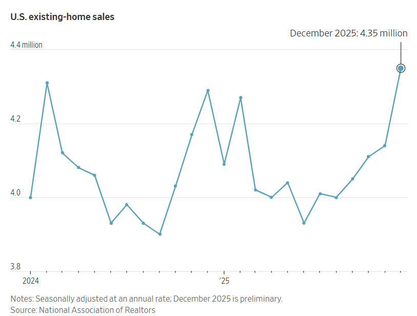
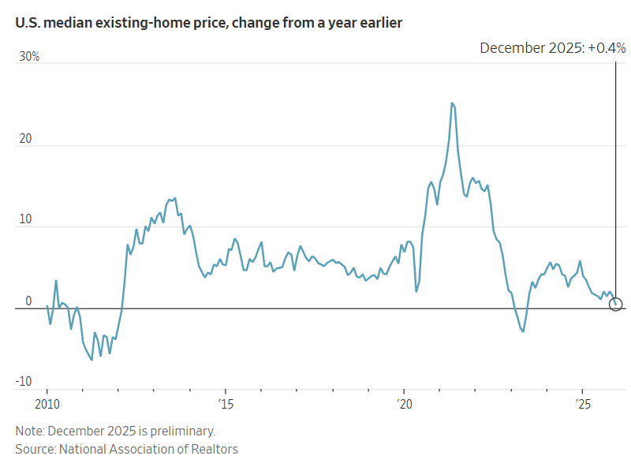
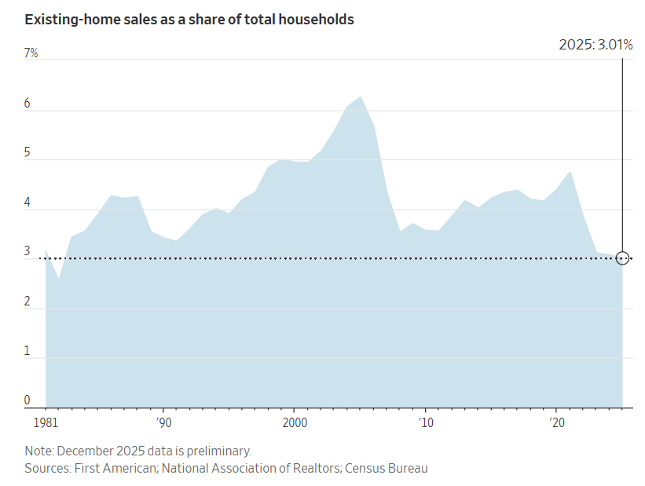

## 抵押貸款利率下調和房價成長放緩推動房屋銷售達到2023年2月以來的最高水準。

[妮可·弗里德曼](https://www.wsj.com/news/author/nicole-friedman)

更新2026年1月14日下午1:18 ET

2025年房屋銷售以出人意料的強勁勢頭收官，12月份增長5.1%，創下近兩年來最大增幅。但即便加上上個月的成長，全年房屋銷售下滑幅度仍名列數十年來最嚴重的年份之一。

銷售額的成長幅度是《華爾街日報》調查的經濟學家預期值的兩倍多，反映出抵押貸款利率的下降和房價成長的放緩。

美國全國房地產經紀人協會週三表示，按月計算，二手房銷售增幅為2024年2月以來最大，也是連續第四個月增長。這連續四個月的成長是自2020年以來最長的連漲紀錄。

12 月的銷售額是自 2023 年 2 月以來最高的。

美國房地產經紀人協會（NAR）首席經濟學家勞倫斯·雲表示：“在我看來，銷售額的增長主要受低利率環境的推動。市場存在被壓抑的需求。這種需求何時才能釋放？只有當抵押貸款利率開始波動時才會釋放。”

近幾週來，30 年期固定抵押貸款的平均利率一直徘徊在 6.2% 左右，低於去年年初接近 7% 的利率。

房價增速也在放緩。美國房地產經紀人協會（NAR）表示，12月份全美現有房屋價格中位數為405,400美元，比2024年12月上漲0.4%。

如果抵押貸款利率持續下降，在經歷了長期的銷售低迷之後，今年可能會吸引更多購房者進入房地產市場。川普總統上週表示，房利美和[房地美](https://www.wsj.com/market-data/quotes/FMCC)將購買[2,000億美元的抵押貸款債券，](https://www.wsj.com/finance/regulation/trump-calls-on-fannie-and-freddie-to-buy-200-billion-in-mortgage-bonds-79312e1c?mod=article_inline)以降低利率並刺激購屋。

儘管 12 月市場活動有所回升，但 2025 年標誌著連續第三年銷售慘淡，跌至某種程度，以某種標準衡量，這是四十多年來住房市場最嚴重的低迷時期。

美國房地產經紀人協會（NAR）表示，去年二手房銷售量為406萬套，為1995年以來的最低水準。

但美國人口現在比 30 年前增加了 7,000 多萬，如果以家庭總數的比例來衡量，去年的銷售速度看起來更糟。

去年，美國每100戶家庭中約有3戶進行了房產交易。根據產權保險和房地產服務公司First American Financial的分析，這是自1982年以來的最低比例。 1982年，美國經濟深陷衰退，抵押貸款利率約16%。

如今，三年來高房價導致數百萬美國人推遲或放棄了擁有住房的夢想。

自 2019 年以來，房價上漲了 50% 以上。抵押貸款利率仍比 2021 年高出一倍多，而 2021 年正值房地產繁榮時期，當時[售出了 600 多萬套房屋。](https://www.wsj.com/economy/housing/u-s-existing-home-sales-reached-a-15-year-high-of-6-1-million-last-year-11642691655?mod=article_inline)

房屋銷售量處於歷史低位，這令想要擁有房屋的租屋者感到沮喪，也令想要搬遷、升級或縮小住房面積但認為這樣做在經濟上不划算的房主感到沮喪。

數百萬房主享有低抵押貸款利率，他們[不願放棄](https://www.wsj.com/economy/housing/mortgage-rates-homeowners-08a609eb?mod=article_inline)這種利率。

就業市場的不確定性也讓潛在買家[對進行大宗購買感到緊張](https://www.wsj.com/economy/jobs/jobs-employment-2025-df2fa311?mod=article_inline)。

「買家現在非常挑剔，」加州柏克萊的一位房地產經紀人梅根·米科說。 “買家會說，’如果我失業了，我們需要能夠靠一份工資來支付這套房子的費用。’”

高昂的房價已成為政客關注的焦點，民眾對生活成本的普遍擔憂也[助力民主黨在近期的選舉中獲勝](https://www.wsj.com/politics/elections/economic-anger-once-again-punishes-the-party-in-power-71d14d18?mod=article_inline)。川普總統上週表示，他希望禁止大型投資者購買獨棟住宅，並補充說，他將在本月稍後提出更多住房政策。

但房屋市場最大的問題——租屋者和購屋者能夠負擔得起[的房源短缺](https://www.wsj.com/finance/how-severe-is-the-housing-shortage-it-depends-on-how-you-define-shortage-89cdbee7?mod=article_inline)——可能需要數年時間才能解決。經濟學家表示，目前購屋負擔能力危機最有可能的解決方式是隨著購屋者收入的成長、房價成長放緩以及抵押貸款利率從當前水準略有下降，逐步而穩定地改善。

「對於許多潛在的首次購屋者來說，這很艱難，」第一美國銀行副首席經濟學家奧德塔·庫什表示。 “人們現在感受到的是多年通貨膨脹的累積影響。”

經濟學家預測，隨著購屋能力的提高，以及一些買家和賣家決定不再等待，今年的房屋銷售量將會增加。[待售房屋庫存](https://www.wsj.com/economy/housing/housing-market-new-supply-prices-210b14f2?mod=article_inline)一直在增加，為買家提供了更多選擇。

達西和吉拉德·馬提亞胡。 丹尼亞當斯巴里攝影

吉拉德和達西·馬蒂特亞胡在 2022 年搬到達拉斯時租了一套房子，因為他們認為當地的住房市場競爭太激烈，房價太高。

到去年年底，市場行情放緩。馬蒂亞胡夫婦找到了一間心儀的房子，看了幾次房後就出價了。他們在12月以低於掛牌價約4%的價格買下了這棟房子，賣家也承擔了部分過戶費用。

「我認為我們在市場走勢上很幸運，」吉拉德·馬蒂特亞胡說。 “我們等這一刻很久了。”

庫什表示，明年房地產市場活動大幅成長的可能性不大，因為許多美國人仍買不起房，就業市場前景不明朗。此外，購屋者在許多情況下[還面臨更高的](https://www.wsj.com/economy/housing/housing-affordability-taxes-insurance-costs-rise-bca64df1?mod=article_inline)房屋保險、房產稅和業主協會會費等成本。

近幾個月來，隨著抵押貸款利率下滑至 6.2% 左右，房價漲幅維持在較低水平，購屋負擔能力有所改善。

根據房地產經紀公司 Redfin 的數據顯示，截至 1 月 4 日的四周內，購買中價位房屋並支付 20% 首付的買家，其典型的月供為 2365 美元，這是自 2024 年初以來的最低水平。

丹佛地區的房地產經紀人勞倫鄧普西表示，去年「房價達到頂峰，市場陷入停滯」。但她也表示，一些當時持觀望態度的購房者現在又回來了：“市場確實開始回暖了。”

《華爾街日報》的所有者新聞集團經美國房地產經紀人協會 (NAR) 授權經營 Realtor.com 網站。