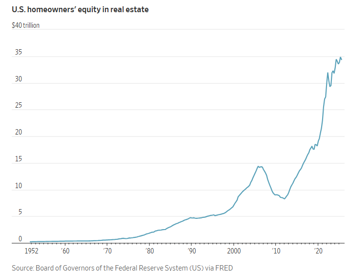

## 美國年輕人希望房價下跌。現有房主不想遭受損失。

[卡羅爾·瑞安](https://www.wsj.com/news/author/carol-ryan)

 2026年1月20日 上午5:30 ET

住房問題似乎沒有快速解決的方法。 扎克貝內特/彭博社

被困在租屋市場的租屋者希望房價下跌，以便最終能夠買房置業。而數百萬現有房主則希望房價維持在高位。這些以及其他相互衝突的利益，使得政策制定者難以在殘酷的房屋市場中幫助美國年輕人。

在中期選舉前夕，川普總統注意到民眾對住房負擔能力的憤怒情緒，其政府一直在逐步透露解決這個問題的想法。

一項旨在降低借貸成本的50年期抵押貸款方案以及一項要求房利美和[房地美](https://www.wsj.com/market-data/quotes/FMCC)[購買數十億美元抵押貸款債券的提案已被提出。本月初，川普曾建議禁止華爾街投資人購買更多獨棟住宅](https://www.wsj.com/economy/housing/trump-housing-large-investor-single-family-home-ban-13e06f61?mod=article_inline)。預計他還將在達沃斯論壇上宣布一項計劃，允許美國人[動用其401(k)退休帳戶支付首付](https://www.wsj.com/personal-finance/retirement/trump-plan-would-let-americans-use-401-k-s-for-down-payments-on-homes-official-says-64eb4375?mod=article_inline)。

賦予購屋者額外購買力的政策，例如[50 年抵押貸款](https://www.wsj.com/personal-finance/mortgages/will-a-50-year-mortgage-make-homes-more-affordable-heres-how-it-would-work-9f9a1b2e?mod=article_inline)和更低的利率，對解決根本的房屋短缺問題毫無幫助，甚至可能推高房價。

根據美國企業研究所住房中心的一項分析，如果抵押貸款利率降至 4.5% 左右，而新房供應量沒有增加，那麼未來三年房價將上漲十分之一。

將機構房東逐出房屋市場也無濟於事。根據約翰·伯恩斯研究諮詢公司的數據，華爾街投資者僅擁有美國1%的家庭住宅，儘管在亞特蘭大和田納西州納什維爾等地區，他們的份額更高。 

要讓住房再次變得負擔得起，所需的現實情況十分嚴峻，這也說明了為什麼住房市場沒有簡單的解決方案。

根據房地產網站Realtor.com的分析，要使住房可負擔性恢復到2019年的水平，需要滿足以下三個條件之一。該網站將住房可負擔性定義為：收入處於家庭中位數的購屋者，每月用於支付中等價位房屋本金和利息的支出約為其月收入的20%。

如果房價和抵押貸款利率維持在目前的水平，那麼家庭收入中位數需要增加56%，達到13.2萬美元，才能使住房負擔能力恢復到六年前的水平。雖然薪資成長速度快於房價，但收入要達到這個水準仍然需要大約十年時間。 

或者說，抵押貸款利率必須降至2.65%，才能使購屋者擁有與2019年相同的購買力，但這除非發生嚴重的經濟衰退，否則幾乎不可能實現。此外，除非住房供應相應增加，否則降低利率也可能適得其反，因為更低的借貸成本最終會反映在更高的房價上。 

根據 Realtor.com 的分析，恢復到 2019 年房價可負擔水準的第三種方法是房價下降 35%。

然而，政策制定者對於採取可能損害房價的措施來應對住房危機，例如補貼大量新增住房供應，仍會猶豫不決。對於已經擁有房產的8,800萬美國家庭來說，房屋市場無疑是一個巨大的成功。聯準會的最新數據顯示，截至2025年第三季度，這些家庭的房屋淨值接近歷史最高水平，達到34.4兆美元，比疫情爆發前增加了近90%。

川普在去年12月承認了這種緊張局勢。 “你突然建造了大量住房，這會導致房價下跌。所以我希望照顧到那些房屋價值超出他們預期的人。” 

建商也不願大量增加新房供應，以免影響房價和利潤。[萊納集團](https://www.wsj.com/market-data/quotes/LEN)董事長在公司最近一次財報電話會議上表示，“供應短缺不能簡單地通過增加供應來解決”，因為這種做法會損害已經購房的美國人的利益。  

政府無法抑制房價上漲的另一個原因是，這可能會對整體經濟產生影響。支撐消費支出的財富效應主要由股市繁榮推動，但高房價也可能起到推波助瀾的作用。 

越來越多的房主開始動用房屋淨值，這可能會讓美國經濟在一段時間內保持強勁成長。穆迪分析公司首席經濟學家 馬克‧贊迪表示，房屋淨值貸款是消費信貸中成長最快的類別，儘管其基數較低。

無論如何，制定一項全國性的政策來增加住房供應並非易事：土地用途限制和分區法規由全國超過33000個不同的地方機構制定。在住房供應尤其緊張的地區，情況開始有所改善。上週，紐約州[放寬了環境法規](https://www.wsj.com/real-estate/new-york-housing-enviornmental-laws-60288922?mod=article_inline)，試圖加速房屋建設。 

川普政府在住房問題上試圖謹慎行事。必須以一種既能安撫未能買房的年輕美國人的沮喪情緒，又不至於損害已經膨脹的住房淨值的方式進行。

目前，白宮的提案旨在博取眼球，以期贏得選民的青睞。但這些提案並不能改變住房問題仍是零和博弈的現實。