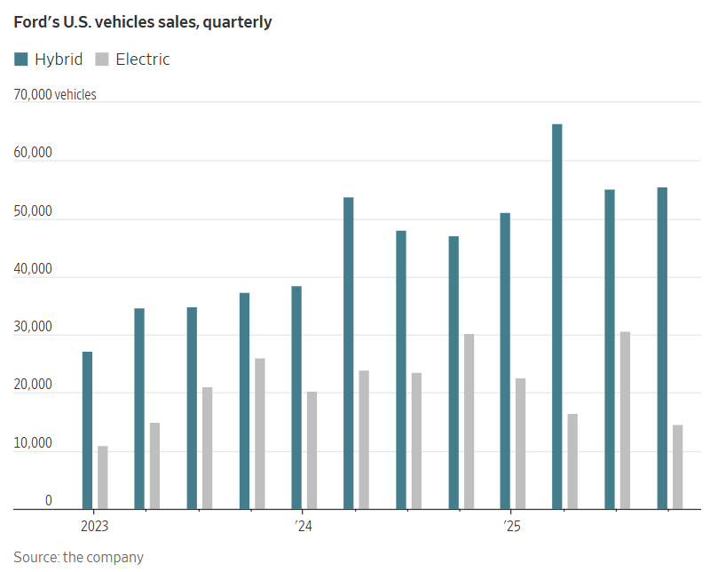

## 如果交易達成，福特可能會從比亞迪購買電池，用於其在美國境外的工廠。

[瑞安費爾頓](https://www.wsj.com/news/author/ryan-felton)
[黃拉斐爾](https://www.wsj.com/news/author/raffaele-huang)

更新2026年1月15日下午3:12 ET

一輛比亞迪汽車運輸船停靠在中國蘇州太倉港。 圖片來源：Cfoto/Zuma Press

### 

快速概要

- 知情人士透露，福特汽車公司正在與比亞迪洽談，計劃為其部分混合動力車型採購電池，並可能將這些電池進口到福特位於美國境外的工廠。
    
- 福特在縮減電動車產量後，正加大對混合動力車的投入。
    
- 比亞迪去年的電池出貨量成長了 47%，達到 286 吉瓦；福特第四季的混合動力車銷量比去年同期成長了 18%。
[福特](https://www.wsj.com/market-data/quotes/F) [汽車 -0.22 %減少；紅色向下三角形](https://www.wsj.com/market-data/quotes/F)和[BYD](https://www.wsj.com/market-data/quotes/CN/XSHE/002594) [002594 0.20 %增加；綠色向上指向三角形](https://www.wsj.com/market-data/quotes/CN/XSHE/002594)知情人士透露，雙方正在商討合作事宜，根據合作協議，這家美國汽車製造商將從這家中國汽車公司購買電池，用於福特的部分混合動力車型。

兩家公司仍在商討合作的具體細節。知情人士透露，其中一個方案是福特從比亞迪進口電池，運往位於美國以外的工廠。他們也表示，  
  
談判仍在進行中，最終達成協議的可能性不大。  
  
如果合作成功，福特將與中國最大的汽車公司比亞迪結盟。比亞迪憑藉其生產價格親民且搭載尖端技術的車型的能力，令美國汽車業[頗感擔憂](https://www.wsj.com/business/autos/tesla-sales-drop-for-second-year-in-a-row-958dec20?mod=article_inline)  
  
。對福特而言，這解決了一個難題。隨著福特逐步退出電動車市場，並加大混合動力車型的投入，它需要電池供應商，而比亞迪則能夠生產高品質的汽車電池。

福特發言人表示：「我們與很多公司就很多事情進行過洽談。」比亞迪發言人拒絕置評。 

在成為全球最大的汽車製造商之一之前，比亞迪已發展出[強大的電池製造業務](https://www.wsj.com/business/autos/how-chinas-byd-became-teslas-biggest-threat-5edfd080?mod=article_inline)，包括混合動力車型電池。目前，比亞迪的大部分電池生產都在中國，但隨著在東南亞、歐洲和巴西等市場的擴張，該公司正在提升海外工廠的產能。伯恩斯坦研究公司估計，比亞迪去年的電池出貨量成長了47%，達到286吉瓦。

中國鄭州比亞迪工廠的電動車組裝線。 （圖片來源：Qilai Shen/彭博新聞社）

在《華爾街日報》刊登了有關潛在交易的報導後，川普總統的貿易顧問彼得·納瓦羅在X網站上批評了這個想法。 

“所以福特公司一方面想扶持中國競爭對手的供應鏈，另一方面又想讓它更容易受到供應鏈勒索？”他說道，“這能出什麼問題呢？”

上個月，福特汽車表示，由於需求低迷，公司將逐步[停止生產電動車](https://www.wsj.com/business/autos/ford-takes-19-5-billion-charge-to-write-down-ev-investments-333a9bc4?mod=article_inline)，預計提列195億美元的費用，主要與電動車業務相關。該公司表示，目標是到2030年，全球銷售量的一半左右將由混合動力車、增程型插電式混合動力車和純電動車組成。

同時，福特計劃加強其燃油車型陣容，並擴大混合動力車型的選擇範圍。為此，福特需要更多適用於混合動力車型的電池。

比亞迪在加州的巴士製造廠生產一些商用車電池，但尚未在美國生產乘用車電池。

多家美國汽車製造商與外國電池製造商建立了合作關係。通用汽車和福特汽車都與韓國公司成立了合資企業。

福特汽車正在密西根州馬歇爾市建設一座電池工廠，並計劃使用中國電池製造商[寧德時代](https://www.wsj.com/market-data/quotes/CN/XSHE/300750)（CATL）的技術生產成本更低的電池。

該工廠遭到[共和黨議員的批評](https://www.wsj.com/business/autos/ford-pauses-construction-on-politically-divisive-battery-plant-549a7795?mod=article_inline)，他們對這筆交易和項目展開了調查。

福特預計密西根州工廠將於今年開始運營，為其即將推出的售價[3 萬美元的全電動皮卡](https://www.wsj.com/business/autos/ford-compact-ev-pickup-f33ba2de?mod=article_inline)生產電池。

[美國汽車業的高層](https://www.wsj.com/business/autos/ford-china-ev-competition-farley-ceo-50ded461?mod=article_inline)毫不掩飾他們對比亞迪等中國新興汽車製造商及其對美國汽車產業構成威脅的擔憂。福特曾表示，其計劃推出的新款電動皮卡將是對中國品牌在全球範圍內[不斷搶佔市場份額的回應。](https://www.wsj.com/business/autos/chinas-byd-logs-another-month-of-strong-sales-growth-in-europe-8c478f27?mod=article_inline)

由於白宮徵收高額關稅以及即將對新車部分軟體實施禁令，中國汽車製造商實際上被拒之門外，無法進入美國市場。但種種跡象表明，他們有意進軍美國市場。上週，中國汽車製造商吉利表示，正在考慮未來幾年[拓展美國市場。](https://www.wsj.com/business/autos/china-geely-auto-us-market-6d2d67ca?mod=article_inline)

儘管如此，福特和比亞迪仍然是老搭檔。 2020年，福特開始在中國使用比亞迪電池，用於與長安汽車合資生產的汽車。幾年後，比亞迪主動聯繫福特，希望為其在其他市場銷售的汽車提供電池。  

由於電動車市場萎縮，福特及其競爭對手的高層認為，混合動力車更有可能在美國購車者中獲得青睞。福特已開始在這個蓬勃發展的領域取得進展。去年第四季度，福特[混合動力車的銷量年增18%，達到約5.5萬輛。](https://www.wsj.com/business/autos/ford-4q-sales-rise-boosted-by-lower-priced-trucks-447da9d2?mod=article_inline)

本週在底特律車展上，福特執行長吉姆法利表示，該公司憑藉 F-150 混合動力車型取得了成功，現在希望將業務擴展到其他一系列混合動力車型和增程型車型。 

“我認為我們的訊息非常簡單，”他說，“那就是給美國人選擇的權利。”