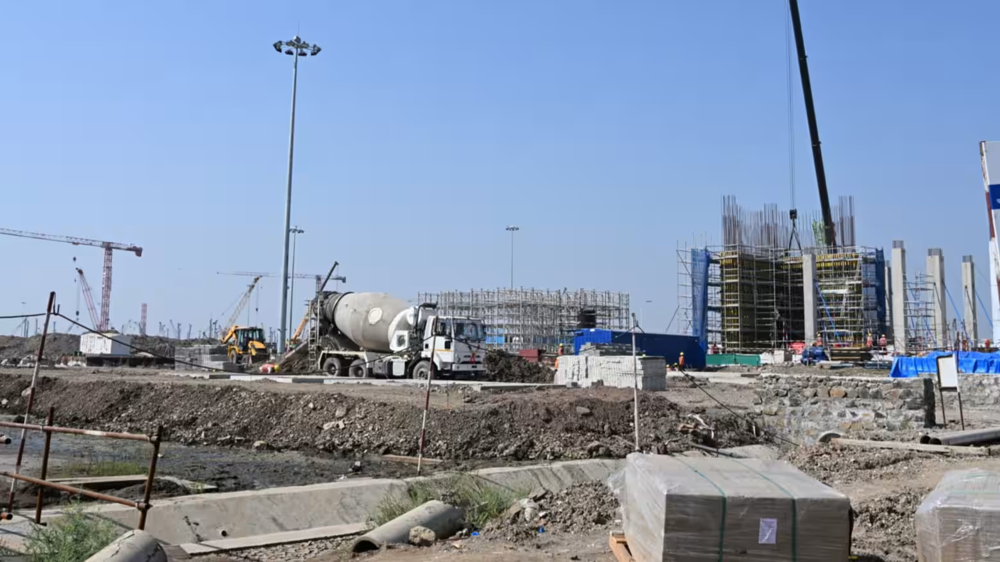
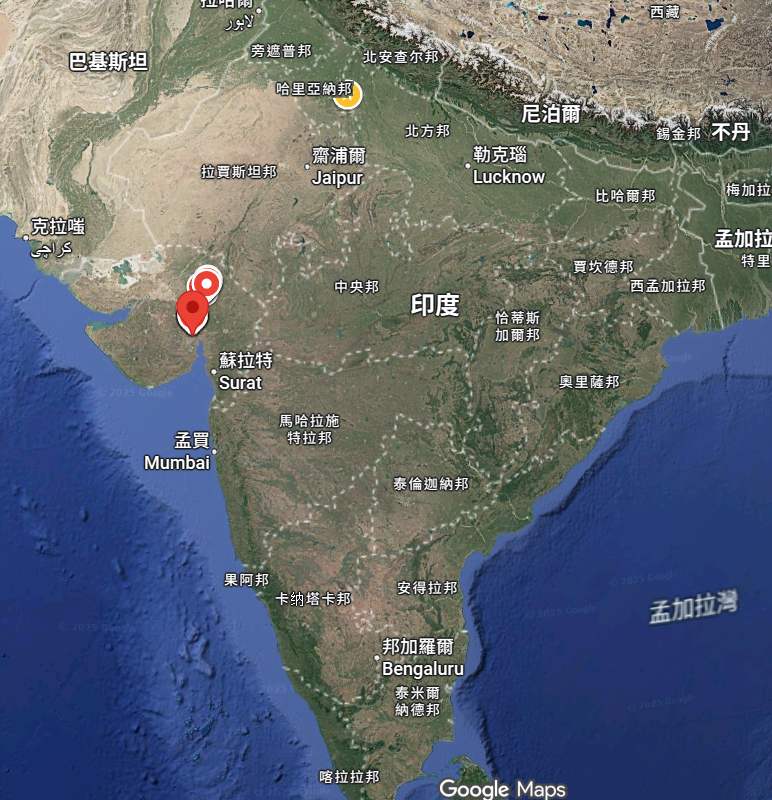

https://asia.nikkei.com/business/tech/semiconductors/india-builds-semicon-city-as-heart-of-chipmaking-sector

這則新聞描繪了印度在半導體領域的「大躍進」野心，試圖將一片荒地打造成比新加坡還大的「半導體城」，並吸引了塔塔集團（Tata）與台灣力積電（PSMC）的技術合作。

以下是針對這篇 Nikkei Asia 報導的新聞分析：

### 新聞分析：印度打造「多萊拉半導體城」，挑戰全球晶片供應鏈

#### 1. 新聞履歷 (Metadata)

- **標題：** 印度打造“半導體城”，使其成為晶片製造業的中心 (India builds 'Semiconductor City' to become hub for chipmaking)
    
- **來源/作者：** Nikkei Asia / 岡部剛典 (Takanori Okabe)
    
- **發布時間：** 2025年12月4日 06:16 JST
    
- **關鍵詞：** 多萊拉特別投資區 (Dholera SIR)、塔塔電子 (Tata Electronics)、力積電 (PSMC)、前端晶圓廠 (Front-end Fab)、東京電子 (TEL)、富士膠片 (Fujifilm)
    

---

#### 2. 核心摘要 (Executive Summary)

本報導詳述了印度古吉拉特邦（Gujarat）正在建設的一座巨型新城——**多萊拉特別投資區 (Dholera SIR)**，其核心目標是成為印度的「半導體城」。

- **宏大願景與基礎設施：**
    
    - 多萊拉規劃總面積達 **920 平方公里**（大於新加坡），預計容納 **200 萬居民**。
        
    - 2016 年啟動的第一階段（22.5 平方公里）已完成部分道路、水電建設，未來將包含住宅、商業、醫療與學校等完整機能。
        
- **核心項目：塔塔-力積電晶圓廠：**
    
    - **塔塔電子 (Tata Electronics)** 是該城的定海神針，將投資 **9,100 億盧比（約 100 億美元）** 建設印度首座**前端晶圓廠**。
        
    - **技術來源：** 合作夥伴為台灣的 **力積電 (PSMC)**，提供關鍵的生產技術支援。
        
    - **規模：** 目標月產能 **5 萬片晶圓**，創造 2 萬個就業機會，預計 **2-3 年內** 投產。
        
- 供應鏈群聚效應：
    
    印度政府已批准全國新建 10 家晶片工廠，總投資達 1.6 兆盧比，多萊拉是核心樞紐。
    
    - **日本企業進駐：** **東京電子 (Tokyo Electron)** 將設立支援中心協助設備安裝與培訓；**富士膠片 (Fujifilm)** 投資數十億日圓建廠生產半導體化學品（去除雜質用）。
        
    - **生活配套：** AJU 集團已開設日式餐廳並計劃建酒店，服務日益增多的日本僑民。
        

#### 3. 深度架構分析：產業可行性解碼 (Structural Analysis: Feasibility Decoding)

這篇文章展示了印度「莫迪經濟學 (Modinomics)」的典型特徵：**國家意志驅動的基建 + 本土財閥 (Tata) + 引進外國技術 (PSMC/Japan)**。但我們需要用半導體產業的邏輯來檢視其可行性：

**A. 「力積電模式」的技術定位 (Technology Positioning of PSMC Model)**

- 塔塔選擇力積電而非台積電，是一個非常務實但有局限的選擇。
    
- **技術層級：** 力積電擅長的是 **成熟製程 (Mature Nodes)**，如 28nm, 40nm, 55nm。這意味著多萊拉生產的晶片將主要用於**汽車、家電、電源管理 (PMIC)**，而非先進的 AI 或手機晶片。
    
- **戰略意義：** 這符合印度的需求。印度是汽車和家電大國，先求「有」再求「好」。這座晶圓廠的成功率比之前富士康-Vedanta 試圖直接切入 28nm 的計畫要高得多，因為有 PSMC 的具體技術轉移。
    

**B. 基礎設施的終極考驗 (Infrastructure Stress Test)**

- **水電供應：** 半導體廠是水電怪獸。多萊拉位於古吉拉特邦（莫迪的家鄉），雖然政治支持度高，但該地區氣候乾燥。
    
- **隱憂：** 文中提到「供水設施已建成」，但晶圓廠需要的是**極度穩定的超純水 (Ultrapure Water)** 和**絕不斷電**的工業用電。印度電網的穩定性是惡名昭彰的。如果電壓閃爍（Dip），整批晶圓就會報廢。這是多萊拉能否成為真正科技城的最大物理瓶頸。
    

**C. 人才的「軟基建」**

- 硬體可以花錢買（TEL 的設備），但操作設備的人才難買。
    
- **東京電子的角色：** TEL 在當地設培訓中心至關重要。這顯示日本供應商看到了長期的服務商機。然而，要培養出一批能維持高良率的製程工程師 (Process Engineers)，通常需要 5-10 年的經驗累積。印度初期可能需要大量依賴台灣和日本的「外籍傭兵」。
    

---

#### 4. 潛在調查方向 (Areas for Further Investigation)

1. **力積電的具體獲利模式：**
    
    - 力積電是單純的**IP 授權 (Fab IP)** 還是有**股權投資**？黃崇仁（力積電董座）曾表示是「Fab IP」模式，即幫印度蓋廠、轉移技術收權利金，但不承擔營運虧損。這對力積電是低風險高回報，但對塔塔來說，意味著必須獨自扛起良率爬坡的巨額虧損。
        
2. **用水來源的具體方案：**
    
    - 調查多萊拉的供水是來自海水淡化還是長距離輸水？古吉拉特邦近年有乾旱紀錄。如果有海水淡化廠的標案，這對水處理公司（如栗田工業、Veolia）是商機。
        
3. **目標客戶 (Off-takers) 是誰？**
    
    - 這座廠生產的 5 萬片晶圓賣給誰？是塔塔自家的 Tata Motors（汽車晶片）？還是印度政府會強制要求手機組裝廠（如 Apple, Samsung）採購部分「印度製造」的晶片？如果沒有明確的出海口，產能利用率將成問題。
        
4. **美光 (Micron) ATMP 廠的進度對比：**
    
    - 美光也在古吉拉特邦建封測廠 (ATMP)。封測廠的技術門檻較低，通常是前哨站。觀察美光廠的招工和運營情況，可以作為塔塔晶圓廠能否順利投產的**先行指標**。
    - 