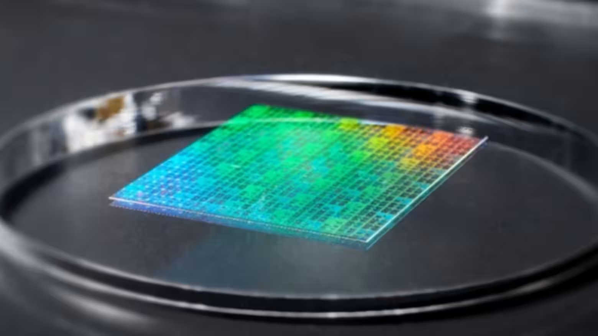

https://asia.nikkei.com/business/tech/semiconductors/new-japan-tech-said-to-slash-power-use-in-making-next-gen-1.4-nm-chips

這則新聞揭示了日本半導體產業試圖繞過 ASML 的 EUV 壟斷，通過**「奈米壓印 (Nanoimprint Lithography, NIL)」**技術實現彎道超車的野心。如果成功，這將是晶片製造史上的一次重大典範轉移。

以下是針對這篇 Nikkei Asia 報導的新聞分析：

### 新聞分析：日本 DNP 與佳能聯手，以奈米壓印技術挑戰 1.4 奈米製程

#### 1. 新聞履歷 (Metadata)

- **標題：** 據稱，日本一家新科技公司將大幅降低下一代1.4奈米晶片的能耗 (Japan tech said to slash power use for next-gen 1.4nm chips)
    
- **來源/作者：** Nikkei Asia / 向野亮、山田平、鈴木卓郎
    
- **發布時間：** 2025年12月10日 01:57 JST
    
- **關鍵詞：** 大日本印刷 (DNP)、佳能 (Canon)、奈米壓印 (Nanoimprint)、1.4奈米、ASML EUV、能耗降低 90%
    

---

#### 2. 核心摘要 (Executive Summary)

本報導披露了日本 **大日本印刷 (DNP)** 取得的重大技術突破：開發出適用於 **1.4 奈米** 晶片製造的奈米壓印模板（Master Template）。這項技術將與 **佳能 (Canon)** 的奈米壓印設備結合，試圖打破 ASML 在先進製程的壟斷。

- **技術優勢與成本革命：**
    
    - **能耗劇減：** 相比 ASML 的 EUV 光刻機（需多次曝光且極度耗電），奈米壓印技術預計能將製造過程的能耗**降低 90%**。
        
    - **設備成本低廉：** 佳能的奈米壓印設備單價約數十億日圓（數千萬美元），遠低於 EUV 光刻機動輒數億美元的天價。這能大幅減輕晶片廠的資本支出 (CAPEX) 負擔。光刻製程目前佔晶片總成本的 30%-50%，此技術若量產將大幅降低 AI 晶片成本。
        
- **關鍵突破與量產時程：**
    
    - DNP 計畫於 **2027 年** 開始批量生產這種 1.4 奈米用的模板材料。
        
    - 過去業界認為奈米壓印無法應用於 2 奈米以下製程，DNP 的新模板打破了這一認知限制。
        
- **挑戰與市場現狀：**
    
    - **技術缺陷：** 奈米壓印是「物理接觸式」技術（像蓋章一樣），模板與晶圓直接接觸極易因雜質產生缺陷（Defects），且生產速度（Throughput）也是挑戰。
        
    - **生態系障礙：** 台積電與三星計畫於 2027-2028 年量產 1.4 奈米，但它們的工廠均是圍繞「光刻 (Lithography)」製程設計的。要轉向「壓印」製程，面臨極高的轉換成本與風險。目前僅有 **Kioxia (鎧俠)** 等記憶體廠引入測試，尚未有邏輯晶片廠用於大規模量產。
        
    - **市場動態：** 佳能已於 2024 年向德州電子研究所（含英特爾）交付首台設備，顯示美國也在關注此技術路徑。

#### 3. 深度架構分析：技術路徑解碼 (Structural Analysis: Technology Pathway Decoding)

這篇文章的核心在於 **"Optical (光學)" vs "Mechanical (機械)"** 的路線之爭。

**A. 奈米壓印 (NIL) 的運作機制與死穴**

- **機制：** 想像你在做月餅。光刻機是用雷射雕刻模具；奈米壓印則是直接拿模具（模板）壓在麵團（晶圓上的光阻劑）上，印出電路圖案。
    
- **優勢：** 不需要昂貴的光源（如 EUV 的高功率雷射）、不需要複雜的鏡頭系統。這就是為什麼它能省電 90%、設備便宜 90% 的原因。
    
- **死穴（Defectivity & Alignment）：**
    
    1. **缺陷率：** 只要模具上有一顆灰塵，壓下去後，接下來的每一片晶圓都會有同樣的缺陷。這對良率要求極高的邏輯晶片（CPU/GPU）是致命傷。記憶體（NAND Flash）因為有冗餘電路設計，對缺陷容忍度較高，所以 Kioxia 敢先試用。
        
    2. **套刻精度 (Overlay)：** 在 1.4 奈米製程，電路層數多達數十層，每一層「蓋章」的位置必須精準對齊，誤差不能超過幾埃（Angstrom）。這在物理接觸過程中極難控制（因為晶圓受壓會變形）。
        

**B. 日本半導體復興的「不對稱戰略」**

- 日本失去了光刻機市場（Nikon/Canon 輸給 ASML），現在試圖通過 NIL 這種**「非主流技術」**重返榮耀。
    
- **戰略聯盟：** DNP（材料/模板）+ Canon（設備）。這顯示日本依然掌握著極強的**材料科學**與**精密機械**優勢。如果這條路走通了，ASML 的護城河將被繞過。
    

**C. 1.4 奈米的現實檢驗 (Reality Check)**

- 台積電和三星的 1.4 奈米（A14）量產時間表是 2027/2028。DNP 說 2027 量產模板，時間上剛好卡位。
    
- **合理推測：** 初期的 1.4 奈米 NIL 不會用於核心的邏輯層（Logic Layer），而是可能先用於**後段製程 (BEOL)** 的金屬連線層，或者用於對缺陷較不敏感的周邊電路，採用 **"Hybrid Lithography" (光刻+壓印混合)** 的模式逐步滲透。
    

---

#### 4. 潛在調查方向 (Areas for Further Investigation)

1. **DNP 模板的「自修復」或「防沾黏」技術：**
    
    - 既然是接觸式，DNP 是否開發出了特殊的塗層材料，能防止光阻劑沾黏在模板上？或者有快速檢測並清洗模板的技術？這是解決缺陷率的關鍵黑科技。
        
2. **台積電的態度轉變：**
    
    - 雖然文中說「工廠設計障礙高」，但台積電一直在尋求降低成本。調查台積電是否在竹科或南科的 R&D 產線中，已經部署了佳能的 NIL 設備進行祕密測試？特別是在 CoWoS 封裝等對線寬要求相對寬鬆的領域。
        
3. **美國 TIE (Texas Institute for Electronics) 的測試數據：**
    
    - 佳能已交機給 TIE。追蹤 TIE 發布的測試報告，看 NIL 在實際運作中的良率 (Yield) 和產出量 (WPH - Wafers Per Hour) 數據。這比 DNP 的宣傳更具公信力。
        
4. **Kioxia 與 Western Digital 的量產進度：**
    
    - 記憶體是 NIL 的灘頭堡。如果 Kioxia 能在 2026 年成功用 NIL 量產 3D NAND，那將證明此技術已成熟，屆時邏輯晶片廠才會真正跟進。