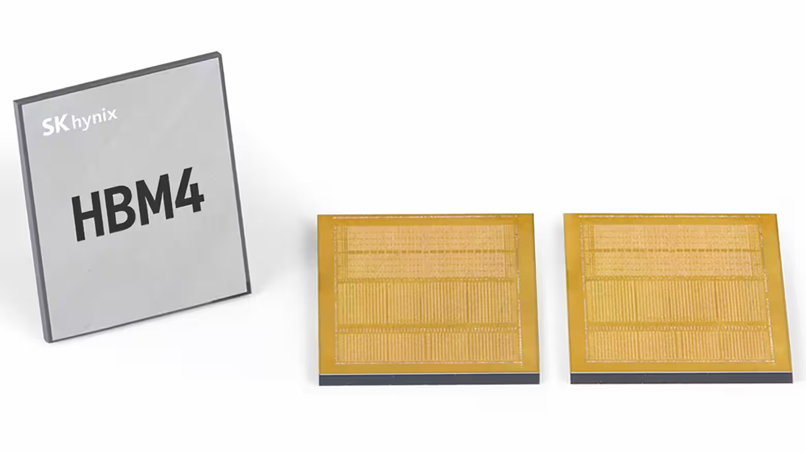

https://asia.nikkei.com/business/tech/semiconductors/sk-hynix-eyes-us-listing-as-ai-chips-demand-more-investment2

這則新聞揭示了韓國晶片巨頭 SK 海力士試圖破解**「韓國折價 (Korea Discount)」**並為 HBM 擴產籌集美元軍火的重大金融戰略。這不僅是上市新聞，更是一場精密的**跨境資本運作**。

以下是針對這篇 Nikkei Asia 報導的新聞分析：

### 新聞分析：SK 海力士擬赴美上市，劍指 HBM 霸權與估值修復

#### 1. 新聞履歷 (Metadata)

- **標題：** 隨著人工智慧晶片需求增加，SK海力士考慮在美國上市 (SK Hynix eyes US listing as AI chip demand grows)
    
- **來源/作者：** Nikkei Asia / Kim Jaewon (首爾)
    
- **發布時間：** 2025年12月10日 13:20 JST
    
- **關鍵詞：** SK 海力士 (SK Hynix)、ADR (美國存託憑證)、庫存股 (Treasury Shares)、HBM (高頻寬記憶體)、本益比 (P/E Ratio)、韓國折價
    

---

#### 2. 核心摘要 (Executive Summary)

本報導證實了市場傳言，SK 海力士正式在監管文件中表示，正在審查包括**利用庫存股在美國上市**在內的各種提升公司價值的方案，以應對 AI 時代巨大的資本支出需求。

- 財務動機（估值修復）：
    
    儘管 SK 海力士是 Nvidia HBM 的核心供應商，股價今年上漲超過 200%（遠超三星的 100%），但其估值仍被嚴重低估。摩根大通資產管理指出，SK 海力士的預期本益比 (P/E) 僅為 10.59 倍，而美國同業 美光科技 (Micron) 高達 32.87 倍。赴美上市（預計發行 ADR）有望吸引那些只投資美股的全球資金，縮小這巨大的估值鴻溝。
    
- 戰略動機（擴產軍火）：
    
    麥格理分析師指出，AI 代幣 (Token) 生成量的爆炸性增長需要海量的 HBM 和 DRAM，而新建晶圓廠至少需要三年。SK 海力士正加大在韓國和美國（印第安納州）的建廠投資。赴美上市能直接籌集美元，匹配其在美國的資本支出需求。
    
- 市場反應與操作手法：
    
    受此消息激勵，股價週三上漲 4.8%，韓國證券交易所甚至發布了「投資警示」以遏制投機。值得注意的是，公司計畫使用的是**「庫存股 (Treasury Shares)」**而非單純發行新股，這意味著能在不稀釋現有股東權益的前提下，將資產負債表上的閒置資產變現。

---

#### 3. 深度架構分析：金融工學解碼 (Structural Analysis: Financial Engineering Decoding)

這則新聞的核心在於 SK 海力士如何利用**「ADR」**和**「庫存股」**這兩個工具，來解決**「韓國折價」**與**「資本飢渴」**的雙重難題。

**A. ADR 的估值套利機制 (The Valuation Arbitrage Mechanism)**

- **現狀：** 韓國股市因地緣政治風險、財閥治理問題，長期存在「韓國折價」。這導致 SK 海力士賺得比美光多，市值卻比美光低。
    
- **解法：** **美國存託憑證 (ADR, American Depositary Receipt)** 是外國公司在美國股市交易的憑證。
    
    - _流動性溢價：_ 美國市場擁有全球最深的資金池。發行 ADR 可以讓那些受限於法規無法直接買韓股的美國退休基金、ETF 直接買入 SK 海力士。
        
    - _定價重錨：_ 一旦在美股交易，投資人會自然將其與美光、Nvidia 進行對標 (Benchmarking)，從而將 P/E 從 10 倍拉升至接近美股半導體平均的 20-30 倍。
        

**B. 「庫存股」的妙用 (The Treasury Share Strategy)**

- **一般做法：** 企業缺錢通常會「增資 (Capital Increase)」，發行新股。缺點是會稀釋現有股東的 EPS (每股盈餘)，導致股價下跌。
    
- **SK 的高招：** 他們計畫出售**「庫存股」**（公司過去回購並持有的股票）。
    
    - _好處 1：_ **不稀釋股權。** 這些股票原本就存在，只是從公司帳戶轉移到市場投資人手中。
        
    - _好處 2：_ **資產變現。** 相當於把帳上的「死錢」變成了「活錢（現金）」，直接用於擴建美國工廠。這是在股價歷史高點（今年漲 2 倍）進行的完美套現操作。
        

**C. HBM 的資本戰爭 (The Capital Intensive Nature of HBM)**

- HBM 不只是記憶體，它是**3D 堆疊封裝 (TSV)**。這意味著它的設備投資 (Capex) 遠高於傳統 DRAM。
    
- 為了維持對三星和美光的技術領先，SK 海力士必須持續購買昂貴的設備（如 ASML 的 EUV、Besi 的混合鍵合機）。在美上市能確保它擁有與美光同等級的融資能力，避免在軍備競賽中因「銀彈不足」而掉隊。
    

---

#### 4. 潛在調查方向 (Areas for Further Investigation)

1. **庫存股的具體規模：**
    
    - 調查 SK 海力士目前持有多少庫存股？這決定了它能籌集多少資金。如果規模高達數十億美元，這將是今年美股最大的半導體 IPO/Listing 之一。
        
2. **與美國《晶片法案》補貼的掛鉤：**
    
    - SK 海力士已宣佈在印第安納州建廠。調查此次赴美上市是否為美國商務部發放補貼的**「隱性條件」**？（美方希望外國晶片廠更深地融入美國資本市場）。
        
3. **主要股東 SK Square 的態度：**
    
    - SK 海力士的母公司 SK Square 是否也會趁機減持部分股份來變現？這會影響市場籌碼面。
        
4. **三星電子的跟進壓力：**
    
    - 如果 SK 海力士成功利用美股高估值融資，三星電子（目前深受外資賣超之苦）是否會被迫考慮類似的 ADR 計畫？這將引發韓國股市的結構性變革。